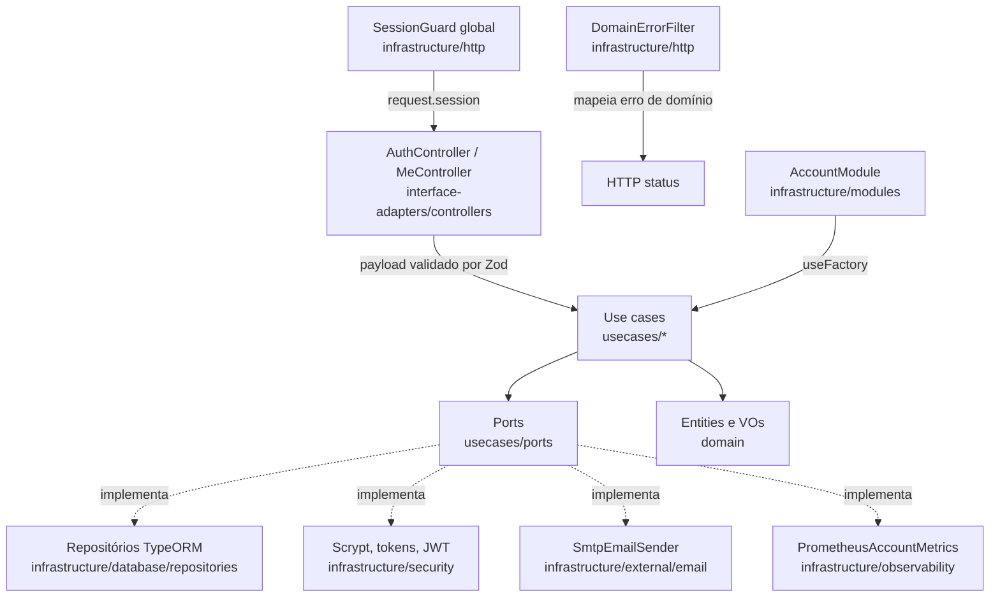

# US-01 Design

**Spec**: `.specs/features/us-01-cadastro-e-acesso-do-dono/spec.md`
**Context**: `.specs/features/us-01-cadastro-e-acesso-do-dono/context.md`
**Status**: Approved

---

## Architecture Overview

API-only. Cinco use cases puros, cada um em seu diretório, falando com o mundo por ports. Controllers validam o payload com Zod na borda, chamam o use case e passam o resultado por um presenter. Um guard global exige sessão em toda rota, exceto as marcadas com `@Public()`. O tenant da requisição sai só do JWT.



### Fluxos

- **Cadastro:** `POST /auth/signup` → `RegisterBarbershopUseCase`: normaliza e-mail/telefone, gera hash da senha, cria `Barbershop.startTrial(now)` e `User.createOwner(...)`, grava os dois numa transação (`BarbershopRepository.createWithOwner`), incrementa `barbershop_signups_total` e emite o token. E-mail duplicado, inclusive na corrida, cai no índice único e vira `EmailAlreadyRegisteredError` (409), com rollback da barbearia.
- **Login:** `POST /auth/login` → `AuthenticateUserUseCase`: `findByEmail` + `PasswordHasher.verify`. Qualquer falha vira `InvalidCredentialsError` (401, mesma mensagem).
- **Sessão:** `GET /me` → `SessionGuard` valida o Bearer JWT e grava `{ userId, barbershopId, role }` em `request.session`. `GetMyAccountUseCase` lê usuário e barbearia filtrando pelo `barbershopId` da sessão. Header, query e corpo nunca são lidos para tenant.
- **Esqueci a senha:** `POST /auth/password/forgot` → `RequestPasswordResetUseCase`: se o usuário existe, gera token (32 bytes), grava só o SHA-256 com validade de 1 h substituindo os tokens anteriores do usuário, e envia o e-mail com o link. Falha no envio é engolida (o adaptador loga sem PII). Resposta sempre 202, corpo fixo.
- **Redefinir:** `POST /auth/password/reset` → a senha nova é validada primeiro (Zod, 400 sem tocar no token). `ResetPasswordUseCase` busca o token pelo hash, confere se pode ser usado e chama `PasswordResetRepository.redeem`, que marca o token como usado (`UPDATE ... WHERE used_at IS NULL`) e troca o hash da senha na mesma transação. Falha em qualquer passo vira `InvalidPasswordResetTokenError` (400).

---

## Code Reuse Analysis

### Existing Components to Leverage

| Component | Location | How to Use |
| --------- | -------- | ---------- |
| `envSchema` / `validateEnv` | `src/infrastructure/config/env.schema.ts` | Estender com as variáveis de JWT, SMTP e `APP_WEB_URL` |
| `buildTypeOrmOptions` | `src/infrastructure/database/typeorm.options.ts` | Já carrega `entities/*.entity.ts` e `migrations/*`; nada a mudar |
| `data-source.ts` | `src/infrastructure/database/data-source.ts` | Reusado no `globalSetup` do e2e para rodar as migrations |
| `METRICS_REGISTRY` | `src/infrastructure/observability/metrics.registry.ts` | Registrar o contador `barbershop_signups_total` |
| `buildLoggerOptions().redact` | `src/infrastructure/observability/logger.options.ts` | Ampliar com `email`, `token`, `accessToken`, `newPassword` |
| Padrão do e2e | `test/app.e2e-spec.ts` | Mesmo bootstrap com `AppModule`; o `EMAIL_SENDER` é trocado por fake via `overrideProvider` |

### Integration Points

| System | Integration Method |
| ------ | ------------------ |
| PostgreSQL | Nova migration com `barbershops`, `users`, `password_reset_tokens` |
| SMTP | `nodemailer@10` (build CJS, tipos próprios); Mailpit no compose para dev |
| JWT | `@nestjs/jwt@11` (peer Nest 11, CJS). A v12 é só ESM e fica proibida |
| `/metrics` | Contador novo no registry existente |

---

## Components

### Domain (`src/domain/`)

- **`errors/domain.error.ts`** — `abstract class DomainError extends Error { abstract readonly code: string; readonly rule?: string }`.
- **`errors/invalid-value.error.ts`** — VO recebeu valor inválido.
- **`errors/email-already-registered.error.ts`**, **`invalid-credentials.error.ts`**, **`invalid-password-reset-token.error.ts`** — mensagens pt-BR fixas da spec.
- **`value-objects/email.ts`** — `Email.create(raw): Email` (trim + minúsculas, formato `local@dominio.tld`, até 254 caracteres); `Email.isValid(raw): boolean`. O Zod da borda chama `isValid` para responder 400; `create` lança `InvalidValueError` se receber valor inválido, o que só acontece por erro de programação.
- **`value-objects/phone-number.ts`** — `PhoneNumber.create(raw)` aceita máscara e `+55`, exige DDD válido (11–99) e 10 ou 11 dígitos nacionais (celular com 9 inicial), expõe `.value` em E.164 `+55DDNNNNNNNN(N)`; `PhoneNumber.isValid(raw)`. Mesma divisão do `Email`.
- **`entities/barbershop.ts`** — `Barbershop.startTrial({ id, name, now })` → `subscriptionStatus: 'trialing'`, `trialEndsAt = now + 14 × 24 h`, `timezone: 'America/Sao_Paulo'`. `TRIAL_DURATION_DAYS = 14` (RN-24). `Barbershop.restore(props)` para os repositórios.
- **`entities/user.ts`** — `User.createOwner({ id, barbershopId, name, email, phone, passwordHash, now })` → `role: 'owner'`. `User.restore(props)`.
- **`entities/password-reset-token.ts`** — `PasswordResetToken.issue({ id, userId, barbershopId, tokenHash, now })` → `expiresAt = now + 1 h`; `isRedeemable(now)` = não usado e `now < expiresAt`.

### Ports (`src/usecases/ports/`)

Cada arquivo exporta a interface e um `Symbol` de injeção.

| Port | Métodos |
| ---- | ------- |
| `BarbershopRepository` | `createWithOwner(barbershop, owner): Promise<void>` (atômico; lança `EmailAlreadyRegisteredError`) · `findById(barbershopId)` |
| `UserRepository` | `findById(barbershopId, userId)` · `findByEmail(email)` *(lookup de identidade, sem tenant; devolve o `barbershopId`)* |
| `PasswordResetRepository` | `replaceForUser(token)` · `findByTokenHash(hash)` *(lookup de identidade)* · `redeem({ barbershopId, userId, tokenId, passwordHash, usedAt }): Promise<boolean>` |
| `PasswordHasher` | `hash(plain)` · `verify(plain, hash)` |
| `AccessTokenIssuer` | `issue({ userId, barbershopId, role }): Promise<IssuedAccessToken>` (`{ accessToken, expiresIn }`) |
| `ResetTokenGenerator` | `generate(): { token, tokenHash }` · `hashOf(token): string` |
| `EmailSender` | `send({ to, subject, text }): Promise<void>` |
| `Clock` | `now(): Date` |
| `IdGenerator` | `next(): string` (UUID) |
| `AccountMetrics` | `signupCompleted(): void` |

### Use cases (`src/usecases/<nome>/<nome>.use-case.ts`)

| Use case | Entrada | Saída | Erros |
| -------- | ------- | ----- | ----- |
| `register-barbershop` | `{ barbershopName, ownerName, email, phone, password }` | `IssuedAccessToken` | `EmailAlreadyRegisteredError` |
| `authenticate-user` | `{ email, password }` | `IssuedAccessToken` | `InvalidCredentialsError` |
| `get-my-account` | `{ barbershopId, userId }` | `{ user, barbershop }` | `InvalidCredentialsError` se o usuário sumiu (token órfão) |
| `request-password-reset` | `{ email }` | `void` | nunca lança por usuário inexistente ou falha de envio |
| `reset-password` | `{ token, newPassword }` | `void` | `InvalidPasswordResetTokenError` |

Use cases são classes sem decorator; `AccountModule` monta cada um com `useFactory`. O `request-password-reset` recebe `appWebUrl` no construtor e monta a mensagem pt-BR.

### Interface adapters (`src/interface-adapters/`)

- **`controllers/auth.controller.ts`** — `POST /auth/signup` (201), `POST /auth/login` (200), `POST /auth/password/forgot` (202), `POST /auth/password/reset` (204). Todas `@Public()`.
- **`controllers/me.controller.ts`** — `GET /me` com `@CurrentSession()`.
- **`controllers/schemas/*.schema.ts`** — um schema Zod por payload (`signup`, `login`, `forgot-password`, `reset-password`). Campos extras são descartados (`z.object` padrão faz strip).
- **`controllers/zod-validation.pipe.ts`** — `ZodValidationPipe(schema)` lança `BadRequestException({ message: 'Dados inválidos.', errors: [{ field, message }] })`.
- **`controllers/public.decorator.ts`**, **`current-session.decorator.ts`**, **`authenticated-session.ts`** — metadado `IS_PUBLIC_KEY`, param decorator e o tipo da sessão.
- **`presenters/session.presenter.ts`** — `{ accessToken, tokenType: 'Bearer', expiresIn }`.
- **`presenters/my-account.presenter.ts`** — `{ user: { id, name, email, phone, role }, barbershop: { id, name, timezone, subscriptionStatus, trialEndsAt } }` (datas em ISO UTC).

### Infrastructure (`src/infrastructure/`)

- **`database/entities/*.entity.ts`** — `BarbershopEntity`, `UserEntity`, `PasswordResetTokenEntity`.
- **`database/migrations/<ts>-CreateAccountTables.ts`** — tabelas e índices (ver Data Models).
- **`database/repositories/typeorm-*.repository.ts`** — um por port de dados. Mapeiam entidade ORM ↔ entidade de domínio. `createWithOwner` e `redeem` usam `dataSource.transaction`. Violação `23505` no índice de e-mail vira `EmailAlreadyRegisteredError`.
- **`security/scrypt-password-hasher.ts`** — `node:crypto.scrypt`, salt de 16 bytes, formato `scrypt$N$r$p$salt$hash` (base64), `timingSafeEqual`.
- **`security/crypto-reset-token-generator.ts`** — `randomBytes(32)` em base64url; hash SHA-256 hex.
- **`security/jwt-access-token-issuer.ts`** — `JwtService.signAsync({ sub, barbershopId, role })`, HS256, `expiresIn = AUTH_SESSION_TTL_SECONDS`.
- **`security/system-clock.ts`**, **`security/uuid-id-generator.ts`**.
- **`http/session.guard.ts`** — global (`APP_GUARD`). Pula rotas `@Public()`; senão exige `Authorization: Bearer`, verifica com `JwtService.verifyAsync` (algoritmo fixo HS256), valida o payload com Zod e grava `request.session`. Qualquer falha → 401.
- **`http/domain-error.filter.ts`** — global. `EmailAlreadyRegisteredError`→409, `InvalidCredentialsError`→401, `InvalidPasswordResetTokenError`→400. Corpo `{ message }`.
- **`external/email/smtp-email-sender.ts`** — `nodemailer.createTransport` com a config SMTP. Em erro: loga `{ err: { name, code } }` sem destinatário nem corpo e relança.
- **`observability/prometheus-account-metrics.ts`** — `Counter barbershop_signups_total` no `METRICS_REGISTRY`, sem labels.
- **`modules/account.module.ts`** — importa `JwtModule.registerAsync`, `ObservabilityModule`; declara controllers, ports e use cases; registra `SessionGuard` e `DomainErrorFilter` como globais.

---

## Data Models

```sql
CREATE TABLE barbershops (
  id                  uuid PRIMARY KEY,
  name                varchar(100) NOT NULL,
  timezone            varchar(64)  NOT NULL DEFAULT 'America/Sao_Paulo',
  subscription_status varchar(20)  NOT NULL,
  trial_ends_at       timestamptz  NOT NULL,
  created_at          timestamptz  NOT NULL
);

CREATE TABLE users (
  id            uuid PRIMARY KEY,
  barbershop_id uuid NOT NULL REFERENCES barbershops(id),
  name          varchar(100) NOT NULL,
  email         varchar(254) NOT NULL,
  phone         varchar(16)  NOT NULL,
  password_hash text         NOT NULL,
  role          varchar(20)  NOT NULL,
  created_at    timestamptz  NOT NULL
);
CREATE UNIQUE INDEX users_email_unique ON users (email);   -- e-mail já normalizado
CREATE INDEX users_barbershop_id_idx ON users (barbershop_id);

CREATE TABLE password_reset_tokens (
  id            uuid PRIMARY KEY,
  user_id       uuid NOT NULL REFERENCES users(id) ON DELETE CASCADE,
  barbershop_id uuid NOT NULL REFERENCES barbershops(id),
  token_hash    char(64)    NOT NULL,
  expires_at    timestamptz NOT NULL,
  used_at       timestamptz NULL,
  created_at    timestamptz NOT NULL
);
CREATE UNIQUE INDEX password_reset_tokens_hash_unique ON password_reset_tokens (token_hash);
CREATE INDEX password_reset_tokens_user_id_idx ON password_reset_tokens (user_id);
```

A migration não cria extensão: os UUIDs vêm do `IdGenerator`. `replaceForUser` apaga os tokens não usados do usuário antes de inserir o novo, o que cumpre "um pedido novo invalida os anteriores".

---

## Error Handling Strategy

| Error Scenario | Handling | User Impact |
| -------------- | -------- | ----------- |
| Payload inválido | `ZodValidationPipe` → 400 | `{ message: 'Dados inválidos.', errors: [{ field, message }] }` |
| E-mail já cadastrado (inclusive corrida) | Índice único → `EmailAlreadyRegisteredError` → 409, transação desfeita | `{ message: 'Este e-mail já está cadastrado.' }` |
| E-mail inexistente ou senha errada | `InvalidCredentialsError` → 401 | `{ message: 'E-mail ou senha inválidos.' }` |
| Sem token, token inválido ou expirado | `SessionGuard` → 401 | `{ message: 'Sessão inválida ou expirada.' }` |
| Token de redefinição inválido/usado/expirado/substituído | `InvalidPasswordResetTokenError` → 400 | `{ message: 'Link de redefinição inválido ou expirado.' }` |
| Falha no SMTP | Adaptador loga sem PII e relança; use case engole | 202 igual ao sucesso |
| Erro inesperado | Filtro padrão do Nest → 500 | Mensagem genérica |

---

## Risks & Concerns

| Concern | Location (file:line) | Impact | Mitigation |
| ------- | -------------------- | ------ | ---------- |
| Conflito de camadas: `CLAUDE.md` põe gateways em `interface-adapters/`, mas o `boundaries` proíbe IA → infrastructure, onde ficam as entidades ORM | `eslint.config.mjs:98` | Gateway em IA não compila no lint | Repositórios TypeORM vão para `infrastructure/database/repositories/` (AD-002) |
| Controllers não podem importar o guard de `infrastructure/` | `eslint.config.mjs:98` | `@UseGuards` direto quebraria o lint | Guard global + `@Public()` em IA (AD-003) |
| e2e hoje não roda migrations; as tabelas novas não existiriam | `test/jest-e2e.json:1` | e2e falha | `globalSetup` roda `migration:run` pelo `data-source.ts`; cada suite trunca as tabelas |
| Redact do logger não cobre e-mail nem token | `src/infrastructure/observability/logger.options.ts:36` | Vazamento de PII (LGPD) | Ampliar paths no T12 |
| Enumeração de e-mail por tempo de resposta no login (hash só roda se o usuário existe) | `authenticate-user` | Risco baixo de enumeração | Fora de RF/RN/CA; registrado em Deferred Ideas do context.md |
| `.env` local não tem as variáveis novas | `.env` | App e e2e não sobem | T12 atualiza `.env.example`; o `.env` local recebe as mesmas chaves (não versionado) |

---

## Tech Decisions (only non-obvious ones)

| Decision | Choice | Rationale |
| -------- | ------ | --------- |
| Validade da sessão por env | `AUTH_SESSION_TTL_SECONDS`, padrão 604800 | Número evita o tipo `StringValue` do `jsonwebtoken` |
| Senha nova validada antes do token | Zod na borda | CA-01.5: senha inválida não consome o token |
| Consumo do token | `UPDATE ... WHERE used_at IS NULL` + troca de senha na mesma transação | Dois resets simultâneos com o mesmo token: só um vence |
| E-mail normalizado gravado | `lower(trim(email))` na coluna, índice único simples | Evita índice funcional e garante uma forma só |
| E-mails de teste no e2e | `overrideProvider(EMAIL_SENDER)` com fake | CLAUDE.md: e2e não depende de serviço externo |
| Mensagem do e-mail | Texto puro pt-BR, assunto "Redefinição de senha" | Sem HTML até existir identidade visual |
