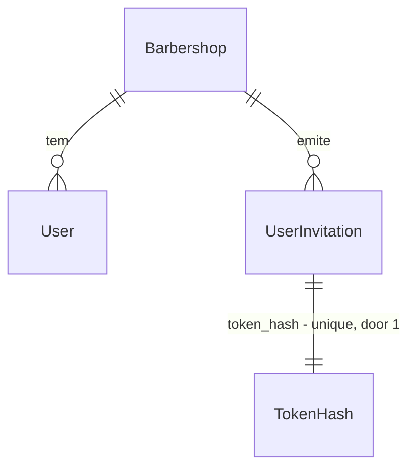

# US-02: Convite de barbeiros e permissões

## Problem

Hoje só o Dono entra no painel. Um barbeiro que queira ver a própria agenda ou bloquear um
horário depende do Dono, que é exatamente a dor da persona Barbeiro no PRD §4 ("depende do dono
para saber quem vem"). O Dono também não tem como dar acesso a alguém sem entregar a própria
senha, que abre tudo: configurações, preços, relatórios e assinatura.

A sessão atual não sabe revogar: o JWT vale 7 dias e o guard não consulta o banco (trade-off
registrado no AD-004). Então, mesmo que existisse um jeito de remover alguém, essa pessoa
continuaria entrando até o token expirar.

O PRD não traz números de evidência para esta história.

Quando isto estiver pronto, o Dono convida um barbeiro por e-mail, o barbeiro cria a senha pelo
link e entra com perfil Barbeiro, as rotas de Dono respondem 403 para ele, e o Dono pode
remover esse acesso com efeito na requisição seguinte.

## Flow

Reusa o `EmailSender`, o `ResetTokenGenerator` (token aleatório + SHA-256), o padrão de resgate
atômico do `PasswordResetRepository.redeem`, o `AccessTokenIssuer` e o `SessionGuard` global,
em vez de criar um segundo mecanismo de token, de sessão ou de guard.

**Convite**

1. `POST /users/invitations` -> `SessionGuard` (exists) - sessão válida, usuário ainda existe, perfil `owner` (door 2, door 3)
2. `ZodValidationPipe` (exists) - `email`, `name`
3. `InviteBarberUseCase` (new, no door - placement per conventions) - recusa e-mail já cadastrado, lê o nome da barbearia no `BarbershopRepository` (exists) para o texto do e-mail, gera o token pelo `ResetTokenGenerator` (exists), persiste `UserInvitation` (door 1) substituindo convites pendentes do mesmo e-mail na barbearia
4. `EmailSender` (exists) - envia `${APP_WEB_URL}/aceitar-convite?token=<token>`
5. out: `201` com o convite, sem o token

**Aceite**

1. `POST /auth/invitations/accept` (`@Public()`) -> `ZodValidationPipe` (exists) - `token`, `password`
2. `AcceptInvitationUseCase` (new, no door - placement per conventions) - acha o convite pelo hash, confere validade, cria `User` com perfil `barber` (door 4) e marca o convite como aceito na mesma transação (door 1)
3. `AccessTokenIssuer` (exists) - emite a sessão com `role: 'barber'`
4. out: `201` com a sessão, no mesmo formato do cadastro

**Remoção e listagem**

1. `GET /users` e `DELETE /users/:id` -> `SessionGuard` (exists) - perfil `owner`
2. `ListUsersUseCase` / `RemoveBarberUseCase` (new, no door - placement per conventions) - leem e apagam só dentro do `barbershopId` da sessão; só usuários `barber` são removíveis
3. `UserRepository` (exists) - ganha listagem e remoção por tenant
4. out: `200` com a lista / `204`; na requisição seguinte do removido, o `SessionGuard` (exists) não acha o usuário e responde `401` (door 3)

## Impact

| Front | What changes |
| --- | --- |
| domain | existing term: `UserRole` era só `'owner'`, passa a ser `'owner' \| 'barber'` - quem ramifica nele hoje: `sessionPayloadSchema` no `SessionGuard` (aceita só `z.literal('owner')`), `AuthenticatedSession`, o `toDomain` do `TypeOrmUserRepository` (cast `as UserRole`) e o `MyAccountPresenter` |
| domain | new term: `UserInvitation` - convite de uso único, com validade, para um e-mail entrar numa barbearia com perfil Barbeiro; vive em `domain/entities` |
| domain | existing term: "sessão válida" significava "JWT assinado e não expirado"; passa a significar isso **e** "o usuário do `sub` ainda existe naquela barbearia" - todo endpoint autenticado passa a custar uma leitura por chave primária |
| authorization | toda rota autenticada que já existe (`GET /me`) passa a exigir perfil explícito; sem anotação, a rota vira só-Dono (door 2). `GET /me` precisa ser aberto a `barber` no mesmo commit, senão o barbeiro não consegue ver a própria conta |
| stored data | `users.phone` deixa de ser obrigatório (door 4). Nada a migrar: as linhas existentes já têm telefone e continuam válidas |
| stored data | tabela nova `user_invitations`, vazia; nada a migrar |
| decisions | o trade-off do AD-004 ("não dá para revogar um token antes de expirar") deixa de valer; entra AD-007 no STATE.md. A regra de tenant do AD-004 fica como está |

## Relations

One-way constraints: `user_invitations.token_hash` unique (door 1); `users.role` aceita `barber`
(door 4); `users.phone` passa a aceitar nulo (door 4); `users.email` continua único na
plataforma inteira (existente, US-01), então um e-mail só pertence a uma barbearia. O convite
não referencia o usuário criado: o vínculo é só o e-mail. No columns and no types here.

## Surface

Only routes this adds or whose signature changes.

| Route | In | Out | Status |
| --- | --- | --- | --- |
| `POST /users/invitations` | `email`, `name` | `id` · `email` · `name` · `expiresAt` | `201`, `400`, `401`, `403`, `409`, `502` |
| `POST /auth/invitations/accept` | `token`, `password` | `accessToken` · `tokenType` · `expiresIn` | `201`, `400`, `409` |
| `GET /users` | - | `users[]` com `id` · `name` · `email` · `role` | `200`, `401`, `403` |
| `DELETE /users/:id` | `id` (uuid na rota) | - | `204`, `400`, `401`, `403`, `404` |
| `GET /me` | - | `user.role` passa a aceitar `barber`; `user.phone` pode ser `null` | `200`, `401` |

## Landing

| One-way door | Literal shape | Alternative rejected |
| --- | --- | --- |
| 1. entidade nova `UserInvitation` | tabela `user_invitations` (`id`, `barbershop_id` FK, `email`, `name`, `token_hash char(64)`, `expires_at`, `accepted_at` nulo, `created_at`); `CREATE UNIQUE INDEX user_invitations_token_hash_unique ON user_invitations (token_hash)`; aceite por `UPDATE ... SET accepted_at = $now WHERE id = $id AND accepted_at IS NULL` na mesma transação do `INSERT` do usuário | criar o usuário já no convite, com senha vazia, e reusar `password_reset_tokens` - o login e o reset passariam a precisar distinguir "usuário sem senha", e o e-mail ficaria preso ao tenant antes do aceite |
| 2. autorização por perfil, negada por padrão | decorator `@Roles('owner', 'barber')` em `interface-adapters/controllers/`; o `SessionGuard` responde `403 { "message": "Acesso negado." }` quando o perfil não está na lista; **rota autenticada sem `@Roles` aceita só `owner`** | liberar tudo por padrão e marcar as rotas de Dono com `@OwnerOnly()` - toda rota nova das histórias US-03 a US-26 nasceria aberta ao barbeiro até alguém lembrar de fechar, o oposto do AD-003 |
| 3. sessão conferida no banco a cada requisição | o `SessionGuard`, depois de validar o JWT, busca o usuário por `(barbershopId, sub)` e usa o `role` **do banco**; usuário ausente -> `401 { "message": "Sessão inválida ou expirada." }` | lista de tokens revogados ou `token_version` no usuário - estado a mais para manter, e ainda deixaria o `role` do token valendo depois de uma troca de perfil |
| 4. remoção apaga a linha do usuário | `DELETE FROM users WHERE id = $id AND barbershop_id = $tenant AND role = 'barber'`; os tokens de redefinição caem pelo `ON DELETE CASCADE` existente; o e-mail fica livre para um convite novo | soft delete com `removed_at` - obriga todo lookup (login, reset, guard, listagem) a filtrar removidos e transforma o índice único de e-mail em parcial; o agendamento não referencia o usuário (a agenda é do barbeiro, US-05), então nada precisa da linha antiga |
| 4. `users.role` e `users.phone` | `role` recebe o valor `barber` (varchar existente, sem CHECK); `ALTER TABLE users ALTER COLUMN phone DROP NOT NULL` | exigir telefone no convite ou no aceite - nenhum RF/RN/CA pede telefone do barbeiro, e o Dono teria que inventar um |
| contrato do link de convite | `${APP_WEB_URL}/aceitar-convite?token=<token>`, token de 32 bytes em base64url | reusar a rota `/redefinir-senha` - o frontend não saberia se mostra "crie sua senha" ou "redefina sua senha" |

- Nothing else in this change is hard to reverse

## Criteria

### S1: O barbeiro entra pelo convite (P1)

O Dono convida por e-mail, o barbeiro cria a senha pelo link e sai autenticado com perfil Barbeiro. (CA-02.1 · RF-37 · RN-26)

**Acceptance Criteria**

1. WHEN o Dono envia `POST /users/invitations` com `email` e `name` válidos THEN o sistema SHALL responder `201` com `id`, `email` normalizado, `name` e `expiresAt` igual ao instante do convite + 7 dias, sem o token no corpo
2. WHEN um convite é criado THEN o sistema SHALL enviar um e-mail para o endereço convidado cujo texto contém `${APP_WEB_URL}/aceitar-convite?token=<token>`
3. WHEN o barbeiro envia `POST /auth/invitations/accept` com um `token` de convite pendente e uma `password` de 8 a 72 caracteres THEN o sistema SHALL responder `201` com `{ accessToken, tokenType: 'Bearer', expiresIn }`
4. WHEN o barbeiro usa o `accessToken` recebido no aceite em `GET /me` THEN o sistema SHALL responder `200` com `user.role = 'barber'`, `user.email` e `user.name` do convite, `user.phone = null` e `barbershop.id` da barbearia que convidou
5. WHEN o barbeiro que aceitou o convite faz `POST /auth/login` com o e-mail convidado e a senha escolhida THEN o sistema SHALL responder `200` com uma sessão
6. IF o e-mail convidado já pertence a um usuário de qualquer barbearia THEN o sistema SHALL responder `409` com `{ message: 'Este e-mail já está cadastrado.' }` e não gravar convite
7. IF o `token` do aceite não existe, já foi aceito, expirou ou foi substituído THEN o sistema SHALL responder `400` com `{ message: 'Convite inválido ou expirado.' }` e não criar usuário
8. IF o e-mail do convite passou a pertencer a outro usuário entre o convite e o aceite THEN o sistema SHALL responder `409` com `{ message: 'Este e-mail já está cadastrado.' }` e manter o convite pendente
9. WHEN o Dono convida de novo um e-mail que já tem convite pendente na mesma barbearia THEN o sistema SHALL invalidar o token anterior, de modo que o aceite com ele responda `400`
10. WHEN duas requisições aceitam o mesmo token ao mesmo tempo THEN o sistema SHALL criar exatamente um usuário e responder `400` ou `409` à outra
11. IF o envio do e-mail de convite falha THEN o sistema SHALL responder `502` com `{ message: 'Não foi possível enviar o convite. Tente novamente.' }`
12. IF o payload do convite ou do aceite é inválido (e-mail mal formado, `name` fora de 2 a 100 caracteres após trim, senha fora de 8 a 72) THEN o sistema SHALL responder `400` com `{ message: 'Dados inválidos.', errors: [{ field, message }] }` sem gravar nada

**Independent test:** o Dono cria a conta, convida `joao@exemplo.com`, o teste lê o token do fake de e-mail, aceita com uma senha e chama `GET /me` com a sessão devolvida: `role` é `barber` e a barbearia é a do Dono.

### S2: O Barbeiro só alcança o que é dele (P1)

Rotas de Dono respondem 403 ao Barbeiro, pela API, e toda rota nova nasce fechada para ele. (CA-02.2 · Seção 5 · RN-26)

**Acceptance Criteria**

13. WHILE a sessão é de um usuário `barber` o sistema SHALL responder `403` com `{ message: 'Acesso negado.' }` a `POST /users/invitations`, `GET /users` e `DELETE /users/:id`
14. The system SHALL tratar toda rota autenticada sem `@Roles(...)` como acessível apenas a `owner`, respondendo `403` a uma sessão `barber`
15. WHILE a sessão é de um usuário `barber` o sistema SHALL responder `200` a `GET /me` com os dados do próprio usuário
16. The system SHALL decidir o perfil pelo `role` gravado no banco para o usuário da sessão, e não pelo `role` do JWT
17. IF o JWT traz um `role` fora de `owner` e `barber` THEN o sistema SHALL responder `401` com `{ message: 'Sessão inválida ou expirada.' }`

**Independent test:** com a sessão do barbeiro da S1, `GET /users` responde `403` e `GET /me` responde `200`; uma rota de teste sem `@Roles` responde `403` ao barbeiro e `200` ao Dono.

### S3: O Dono remove o acesso na hora (P1)

O Dono lista os usuários e remove um barbeiro; a sessão dele para de valer na requisição seguinte. (CA-02.3 · RF-37 · RN-26)

**Acceptance Criteria**

18. WHEN o Dono faz `GET /users` THEN o sistema SHALL responder `200` com `users[]` contendo `id`, `name`, `email` e `role` de todos os usuários da própria barbearia, e de nenhuma outra
19. WHEN o Dono faz `DELETE /users/:id` com o id de um `barber` da própria barbearia THEN o sistema SHALL responder `204`
20. WHEN um barbeiro removido usa um `accessToken` emitido antes da remoção THEN o sistema SHALL responder `401` com `{ message: 'Sessão inválida ou expirada.' }` já na requisição seguinte
21. WHEN um barbeiro removido tenta `POST /auth/login` com a senha que tinha THEN o sistema SHALL responder `401` com `{ message: 'E-mail ou senha inválidos.' }`
22. IF o `:id` de `DELETE /users/:id` é de um usuário de outra barbearia, é de um `owner` ou não existe THEN o sistema SHALL responder `404` com `{ message: 'Usuário não encontrado.' }` e não apagar nada
23. IF o `:id` de `DELETE /users/:id` não é um uuid THEN o sistema SHALL responder `400` com `{ message: 'Dados inválidos.', errors: [{ field, message }] }`
24. WHEN um barbeiro é removido THEN o sistema SHALL manter a barbearia, o Dono e os demais usuários dela inalterados

**Independent test:** o Dono remove o barbeiro da S1; o `GET /me` com o token antigo do barbeiro responde `401`, e o login dele também.

## Out of scope

| Excluded | Why |
| --- | --- |
| Telas do painel (usuários, aceite de convite) | Mesma decisão da US-01: API só; a stack de frontend é uma história própria. O item "telas em 360 px" da DoD segue pendente |
| Negar a agenda de outro barbeiro | A agenda não existe até a US-08, e o vínculo usuário ↔ barbeiro só nasce na US-05 (CA-05.2). Aqui entra o mecanismo (door 2) que essas histórias usam; o teste de "agenda de outro barbeiro" do CA-02.2 fica com a US-08 |
| Negar configurações, relatórios e assinatura por rota específica | Essas rotas nascem nas US-03, US-06, US-20 e US-26; pela door 2 elas nascem só-Dono sem anotação. Aqui o CA-02.2 é provado nas rotas de Dono que existem (as de usuários) e numa rota sem `@Roles` |
| Listar e cancelar convites pendentes | RF-37 fala em convidar e remover usuários; convidar de novo já substitui o convite |
| Convidar ou promover a perfil Dono, mais de um Dono | Seção 5 e RF-37 só falam em perfil Barbeiro |
| Editar nome ou e-mail de um usuário | Não está em RF/RN/CA |
| Rate limiting de convite e de aceite | Mesma pendência já registrada na US-01 (Deferred Ideas) |

## Assumptions

| Assumption | Chosen default | Rationale | Confirmed? |
| --- | --- | --- | --- |
| O que o Dono informa no convite | `email` e `name`; o barbeiro informa só a senha no aceite | O Dono sabe o nome de quem convida; o CA-02.1 só pede que o barbeiro "crie a senha" | y |
| Validade do convite | 7 dias, constante de domínio | Não é valor do PRD; 1 h (a do reset) é curta para quem abre o e-mail no fim do expediente | y |
| O que "remover" faz com o registro | Apaga a linha do usuário (door 4) | O agendamento vai referenciar o barbeiro da US-05, não o usuário; soft delete espalharia filtro em todo lookup | y |
| Falha no envio do e-mail de convite | `502` e o convite fica gravado; convidar de novo substitui | O Dono está logado e precisa saber que o barbeiro não recebeu nada; diferente do reset, aqui não há enumeração a esconder | y |
| Um e-mail com convite pendente em duas barbearias | Permitido; o primeiro aceite ganha e o outro recebe `409` no aceite | O índice único de `users.email` já decide; bloquear no convite vazaria que o e-mail está em outra barbearia | y |
| Remover um barbeiro com agendamentos | Sem efeito em agendamentos: não existem até a US-08 | A parte "os agendamentos existentes dele continuam na agenda" do CA-02.3 é garantida pela door 4 (usuário não é referenciado pela agenda) e testada quando a agenda existir | y |
| Métrica de negócio | Nenhuma métrica nova | O PRD §13 não lista convites; logs do adaptador SMTP já cobrem a falha sem PII | y |

**Open questions:** none - all resolved or logged above.

## Observable

| Surface | Decision | Landing |
| --- | --- | --- |
| API `POST /users/invitations` | response shape | AC 1 |
| API `POST /users/invitations` | error shape and codes | AC 6, AC 11, AC 12, AC 13 |
| API `POST /users/invitations` | who may call it | AC 13 |
| API `POST /auth/invitations/accept` | response shape | AC 3 |
| API `POST /auth/invitations/accept` | error shape and codes | AC 7, AC 8, AC 12 |
| API `POST /auth/invitations/accept` | who may call it | existing - `@Public()`, a posse do token é a credencial |
| API `GET /users` | response shape | AC 18 |
| API `GET /users` | who may call it | AC 13 |
| API `DELETE /users/:id` | response shape and codes | AC 19, AC 22, AC 23 |
| API `DELETE /users/:id` | who may call it | AC 13 |
| API `GET /me` | response shape for `barber` | AC 4, AC 15 |
| all authenticated routes | error shape for a forbidden profile | AC 14 |
| all new `/users*` and `/auth/invitations*` | versioning | n/a - a API não tem versionamento e ninguém fora do repositório a consome ainda |
| all new `/users*` and `/auth/invitations*` | rate limit behaviour | n/a - não há rate limiting no projeto; fica em Out of scope |
| document e-mail de convite | structure, tone and next step | AC 2 - texto em pt-BR no padrão do e-mail de redefinição: saudação, quem convidou, link, validade de 7 dias |
| screen tela de usuários e de aceite | n/a - API só nesta história, ver Out of scope |

## Sources

- docs/PRD.md §11 US-02 - CA-02.1 a CA-02.3, RF-37, RN-26
- docs/PRD.md §5 - o que Dono e Barbeiro podem e não podem
- .specs/STATE.md - AD-003 e AD-004, que as doors 2 e 3 estendem
