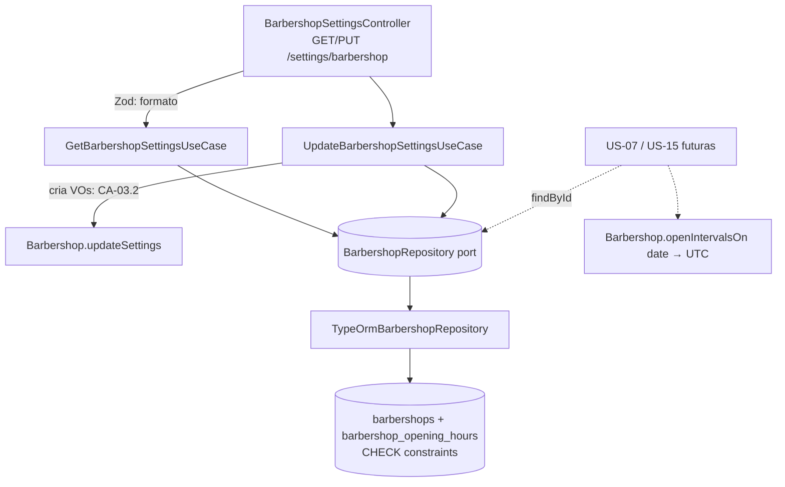

# US-03 Design

**Spec**: `.specs/features/us-03-dados-e-horario-da-barbearia/spec.md`
**Status**: Approved

---

## Architecture Overview

O horário vira value objects de domínio que carregam as regras do CA-03.2; a entidade `Barbershop` ganha endereço, horário e um fuso tipado, e sabe converter um dia local em períodos UTC (CA-03.3). Dois use cases (ler e salvar) usam o `BarbershopRepository` que já existe, estendido. Um controller só-Dono expõe `GET`/`PUT /settings/barbershop`.



**Abordagem escolhida (armazenamento):** tabela `barbershop_opening_hours`, uma linha por dia aberto, com `CHECK` das regras do CA-03.2.
Alternativa descartada: coluna `jsonb` em `barbershops`. É uma migration mais simples, mas o banco não consegue barrar horário incoerente com `CHECK` legível, e a US-07 vai consultar o horário por dia da semana.

---

## Code Reuse Analysis

### Existing Components to Leverage

| Component | Location | How to Use |
| --------- | -------- | ---------- |
| `Barbershop` | `src/domain/entities/barbershop.ts` | Estender com `address`, `openingHours`, `updateSettings`, `openIntervalsOn`; `restore` recebe os novos campos |
| `BarbershopRepository` + TypeORM + in-memory | `src/usecases/ports/barbershop.repository.port.ts`, `src/infrastructure/database/repositories/typeorm-barbershop.repository.ts`, `src/usecases/testing/in-memory-barbershop.repository.ts` | Estender com `saveSettings`; `findById` passa a carregar o horário |
| `DomainError` + `DomainErrorFilter` | `src/domain/errors/`, `src/infrastructure/http/domain-error.filter.ts` | Novo `InvalidOpeningHoursError` mapeado para 400 |
| `ZodValidationPipe` | `src/interface-adapters/controllers/zod-validation.pipe.ts` | Formato do payload (400 com `errors[]`) |
| `SessionGuard` + `@CurrentSession()` (AD-003, AD-007) | `src/infrastructure/http/session.guard.ts` | Rota sem `@Roles` = só Dono; Barbeiro recebe 403 sem código novo |
| Padrão VO `create`/`isValid` | `src/domain/value-objects/phone-number.ts` | Mesmo formato em `TimeOfDay` e `BarbershopTimezone`; o Zod chama `isValid` |
| Helpers de e2e | `test/support/account-flows.ts`, `create-account-test-app.ts`, `truncate-account-tables.ts` | `signupOwner`/`createBarber` para Dono e Barbeiro; o `TRUNCATE ... barbershops CASCADE` já limpa a tabela nova |
| `DEFAULT_TIMEZONE` | `src/domain/entities/barbershop.ts` | Continua sendo o padrão (CFG-12) |

### Integration Points

| System | Integration Method |
| ------ | ------------------ |
| Banco | Migration `AddBarbershopSettings`: coluna `barbershops.address` + tabela `barbershop_opening_hours` com FK para `barbershops` |
| `GET /me` | Sem mudança de código: lê `barbershop.timezone`, que continua `string` |
| `AccountModule` | Passa a exportar `BARBERSHOP_REPOSITORY` para o módulo novo |

---

## Components

### `TimeOfDay` (value object)

- **Purpose**: Hora local de parede `HH:mm` de `00:00` a `23:59`.
- **Location**: `src/domain/value-objects/time-of-day.ts`
- **Interfaces**:
  - `static create(raw: string): TimeOfDay` - lança `InvalidValueError` fora do formato
  - `static isValid(raw: string): boolean`
  - `get minutes(): number` - minutos desde 00:00
  - `toString(): string` - `HH:mm`
- **Dependencies**: nenhuma

### `Weekday`

- **Purpose**: Os 7 dias (`monday` … `sunday`), rótulo em pt-BR ("Segunda-feira" … "Domingo") e número ISO (1 = segunda … 7 = domingo) usado no banco.
- **Location**: `src/domain/value-objects/weekday.ts` (tipo + constantes; sem classe)

### `DayOpeningHours` (value object)

- **Purpose**: Expediente de um dia aberto; garante o CA-03.2.
- **Location**: `src/domain/value-objects/day-opening-hours.ts`
- **Interfaces**:
  - `static create({ weekday, opensAt, closesAt, break?: { startsAt, endsAt } | null }): DayOpeningHours` - lança `InvalidOpeningHoursError` com a mensagem do CFG-08 ou CFG-09
  - `get opensAt`, `closesAt`, `break` (`TimeOfDay` / `null`)
  - `openPeriods(): Array<{ start: TimeOfDay; end: TimeOfDay }>` - 1 ou 2 períodos locais
- **Dependencies**: `TimeOfDay`, `Weekday`, `InvalidOpeningHoursError`

### `WeeklyOpeningHours` (value object)

- **Purpose**: A semana inteira; `null` = fechado.
- **Location**: `src/domain/value-objects/weekly-opening-hours.ts`
- **Interfaces**:
  - `static create(days: Record<Weekday, DayOpeningHours | null>): WeeklyOpeningHours`
  - `static allClosed(): WeeklyOpeningHours` - estado inicial (CFG-06)
  - `forDay(weekday: Weekday): DayOpeningHours | null`

### `BarbershopTimezone` (value object)

- **Purpose**: Fuso IANA restrito às 16 zonas do Brasil; converte hora local em instante UTC.
- **Location**: `src/domain/value-objects/barbershop-timezone.ts`
- **Interfaces**:
  - `static create(raw: string): BarbershopTimezone` / `static isValid(raw: string): boolean`
  - `toUtc(localDate: string, time: TimeOfDay): Date` - `localDate` em `YYYY-MM-DD`
  - `weekdayOf(localDate: string): Weekday`
- **Dependencies**: `Intl.DateTimeFormat` (padrão do JavaScript, sem biblioteca; o domínio continua TypeScript puro)

### `InvalidOpeningHoursError`

- **Location**: `src/domain/errors/invalid-opening-hours.error.ts`
- `code = 'INVALID_OPENING_HOURS'`, `rule = 'RF-32'`; mapeado para 400 no `DomainErrorFilter`.

### `Barbershop` (entidade, estendida)

- **Location**: `src/domain/entities/barbershop.ts`
- **Interfaces**:
  - props ganham `address: string | null` e `openingHours: WeeklyOpeningHours`; `timezone` passa a ser `BarbershopTimezone` internamente, com getter `timezone: string` inalterado
  - `startTrial` nasce com `address: null` e `WeeklyOpeningHours.allClosed()`
  - `updateSettings({ name, address, timezone, openingHours }): void`
  - `openIntervalsOn(localDate: string): Array<{ start: Date; end: Date }>` - CFG-07, CFG-14

### `BarbershopRepository` (port, estendido)

- **Location**: `src/usecases/ports/barbershop.repository.port.ts`
- **Interfaces**:
  - `findById(barbershopId)` - passa a devolver endereço e horário
  - `saveSettings(barbershop: Barbershop): Promise<void>` - numa transação: `UPDATE` de `name`, `address`, `timezone` onde `id = barbershop.id`; `DELETE` dos dias da barbearia; `INSERT` dos dias abertos (AD-004: a escrita recebe a entidade, que carrega o tenant)

### `GetBarbershopSettingsUseCase`

- **Location**: `src/usecases/get-barbershop-settings/get-barbershop-settings.use-case.ts`
- `execute({ barbershopId }): Promise<Barbershop>`; barbearia inexistente lança `InvalidCredentialsError` (mesmo tratamento do `GetMyAccountUseCase`).

### `UpdateBarbershopSettingsUseCase`

- **Location**: `src/usecases/update-barbershop-settings/update-barbershop-settings.use-case.ts`
- `execute({ barbershopId, name, address, timezone, openingHours: Record<Weekday, { opensAt, closesAt, break } | null> }): Promise<Barbershop>` - monta os VOs (erro de domínio antes de qualquer escrita), `updateSettings`, `saveSettings`, devolve a entidade.

### HTTP

- **Schema**: `src/interface-adapters/controllers/schemas/barbershop-settings.schema.ts` - Zod: `name` 2–100 (trim), `address` 5–200 (trim), `timezone` via `BarbershopTimezone.isValid` ("Escolha um fuso horário do Brasil."), `openingHours` com as 7 chaves obrigatórias, cada uma `null` ou `{ opensAt, closesAt, break: { startsAt, endsAt } | null }` com `TimeOfDay.isValid`. Sem regra de ordem de horário (fica no domínio).
- **Presenter**: `src/interface-adapters/presenters/barbershop-settings.presenter.ts`
- **Controller**: `src/interface-adapters/controllers/barbershop-settings.controller.ts` - `@Controller('settings/barbershop')`, sem `@Roles` (só Dono, AD-007), tenant só de `@CurrentSession()`.
- **Módulo**: `src/infrastructure/modules/barbershop-settings.module.ts` - importa o `AccountModule` (que exporta `BARBERSHOP_REPOSITORY`), registra controller e use cases; entra no `AppModule`.

Contrato:

```json
{
  "name": "Barbearia do Zé",
  "address": "Rua das Flores, 123 - Centro, Campinas/SP",
  "timezone": "America/Sao_Paulo",
  "openingHours": {
    "monday": { "opensAt": "09:00", "closesAt": "19:00", "break": { "startsAt": "12:00", "endsAt": "13:00" } },
    "tuesday": { "opensAt": "09:00", "closesAt": "19:00", "break": null },
    "wednesday": null, "thursday": null, "friday": null, "saturday": null, "sunday": null
  }
}
```

---

## Data Models

### `barbershops` (alterada)

`address varchar(200) NULL`

### `barbershop_opening_hours` (nova)

| Coluna | Tipo | Regra |
| ------ | ---- | ----- |
| `barbershop_id` | `uuid` | PK (com `weekday`), FK `barbershops(id)` |
| `weekday` | `smallint` | PK; `CHECK (weekday BETWEEN 1 AND 7)` (ISO) |
| `opens_at` | `time` | NOT NULL |
| `closes_at` | `time` | NOT NULL; `CHECK (closes_at > opens_at)` |
| `break_starts_at` | `time` | NULL |
| `break_ends_at` | `time` | NULL; `CHECK ((break_starts_at IS NULL AND break_ends_at IS NULL) OR (opens_at < break_starts_at AND break_starts_at < break_ends_at AND break_ends_at < closes_at))` |

Dia fechado = sem linha. O Postgres devolve `time` como `HH:mm:ss`; o repositório corta para `HH:mm`.

---

## Error Handling Strategy

| Error Scenario | Handling | User Impact |
| -------------- | -------- | ----------- |
| Payload malformado, fuso fora da lista | `ZodValidationPipe` | 400 `{ message: 'Dados inválidos.', errors: [{ field, message }] }` |
| Fechamento ≤ abertura; intervalo fora do expediente | `InvalidOpeningHoursError` no domínio → `DomainErrorFilter` | 400 `{ message: '<Dia>: …' }` |
| Linha incoerente que escape da aplicação | `CHECK` do Postgres; a transação desfaz tudo | 500 genérico (não deve acontecer pela API) |
| Barbeiro | `SessionGuard` | 403 `{ message: 'Acesso negado.' }` |
| Sem sessão | `SessionGuard` | 401 |

---

## Risks & Concerns

| Concern | Location (file:line) | Impact | Mitigation |
| ------- | -------------------- | ------ | ---------- |
| `InvalidValueError` não está no mapa do filtro e vira 500 | `src/infrastructure/http/domain-error.filter.ts:17` | Um fuso ou horário inválido que passe do Zod responderia 500 | O Zod chama o mesmo `isValid` dos VOs antes do use case; as regras de ordem usam `InvalidOpeningHoursError`, que é mapeado |
| `findById` é usado por `GetMyAccount` e `InviteBarber` | `src/infrastructure/database/repositories/typeorm-barbershop.repository.ts:46` | Passa a fazer uma consulta a mais (horário) nessas rotas | Consulta por PK, até 7 linhas; aceitável. Os testes existentes dessas rotas continuam no gate |
| Conversão de fuso sem biblioteca | `BarbershopTimezone.toUtc` (novo) | Erro de offset daria horário errado na US-07 inteira | Testes unitários com São Paulo (−03), Manaus (−04), Noronha (−02) e Rio Branco (−05); o Brasil não tem horário de verão desde 2019, mas o cálculo lê o offset do próprio `Intl` para a data |
| Cast de string para tipo de domínio no `toDomain` | `src/infrastructure/database/repositories/typeorm-barbershop.repository.ts:55` | Fuso inválido gravado por fora quebraria a leitura | `restore` usa `BarbershopTimezone.create`, que falha alto em vez de seguir com valor inválido |

---

## Tech Decisions

| Decision | Choice | Rationale |
| -------- | ------ | --------- |
| Armazenamento do horário | Tabela por dia com `CHECK` | Banco barra horário incoerente (CFG-11); consulta por dia na US-07 |
| Dia da semana no banco | ISO 1–7 | Evita a ambiguidade do domingo = 0 do `Date.getDay()` |
| Onde fica a regra do CA-03.2 | VO de domínio + `CHECK`; Zod só formato | Regra do CLAUDE.md (invariantes no domínio, validação de formato na borda) |
| Conversão de fuso | `Intl.DateTimeFormat` no domínio | Sem dependência nova; o domínio continua sem framework |
| Módulo novo | `BarbershopSettingsModule` importando o `AccountModule` | Mantém o `AccountModule` focado em conta/acesso e reaproveita o provider do repositório |

Nenhuma decisão de projeto nova para o STATE.md: tudo segue AD-001 a AD-007.
