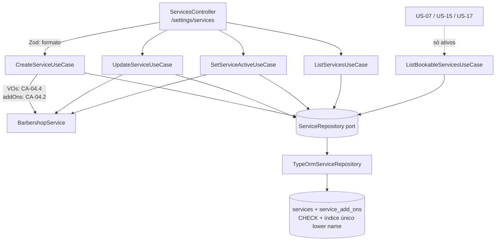

# US-04 Design

**Spec**: `.specs/features/us-04-cadastro-de-servicos/spec.md`
**Status**: Approved

---

## Architecture Overview

Preço e duração viram value objects com as regras do CA-04.4. A entidade `BarbershopService` carrega nome, preço, duração, `active` e a lista de adicionais, e valida os adicionais que recebe (CA-04.2). Um port novo, `ServiceRepository`, é compartilhado por cinco use cases (AD-001). Um controller só-Dono expõe as cinco rotas de `/settings/services`. A unicidade do nome fica no banco (índice único), e o repositório traduz a violação para erro de domínio.

**Abordagem escolhida (unicidade do nome):** índice único `(barbershop_id, lower(name))` no banco como fonte única. O repositório converte a violação `23505` em `ServiceNameAlreadyExistsError`, como o `createWithOwner` já faz com o e-mail. Cobre também duas criações simultâneas (SVC-06).
Alternativa descartada: consulta prévia no use case mais o índice. Seriam duas fontes da mesma regra, e a consulta sozinha não barra a corrida.

**Abordagem escolhida (adicionais):** tabela de junção `service_add_ons` com a posição de cada item, gravada na mesma transação do serviço.
Alternativa descartada: coluna `uuid[]` em `services`. O banco não garante FK em elementos de array.

---

## Code Reuse Analysis

### Existing Components to Leverage

| Component | Location | How to Use |
| --------- | -------- | ---------- |
| Padrão VO `create`/`isValid` | `src/domain/value-objects/time-of-day.ts` | Mesmo formato em `ServicePrice` e `ServiceDuration`; o Zod chama `isValid` |
| `InvalidValueError` | `src/domain/errors/invalid-value.error.ts` | Erro dos VOs fora do limite (SVC-22) |
| `DomainError` + `DomainErrorFilter` | `src/domain/errors/`, `src/infrastructure/http/domain-error.filter.ts` | Três erros novos mapeados (409, 404, 400) |
| `isEmailUniqueViolation` | `src/infrastructure/database/repositories/email-unique-violation.ts` | Mesmo formato para `isServiceNameUniqueViolation` |
| `ZodValidationPipe` + `ApiZodResponse` + `ApiErrorResponse` | `src/interface-adapters/controllers/` | Payload, 400 e Swagger |
| `SessionGuard` + `@CurrentSession()` (AD-003, AD-007) | `src/infrastructure/http/session.guard.ts` | Sem `@Roles` = só Dono; Barbeiro recebe 403 (SVC-24, SVC-25) |
| `ID_GENERATOR` + `UuidIdGenerator` | `src/usecases/ports/id-generator.port.ts` | Id do serviço novo |
| `SequentialIdGenerator` | `src/usecases/testing/sequential-id-generator.ts` | Ids nos testes de use case |
| Helpers de e2e | `test/support/account-flows.ts`, `create-account-test-app.ts`, `truncate-account-tables.ts` | Dono, Barbeiro e limpeza. O `TRUNCATE ... barbershops CASCADE` já limpa as tabelas novas, que têm FK para `barbershops` |
| `UserListPresenter` | `src/interface-adapters/presenters/user-list.presenter.ts` | Formato de lista `{ services: [...] }` |

### Integration Points

| System | Integration Method |
| ------ | ------------------ |
| Banco | Migration `AddServices`: tabelas `services` e `service_add_ons` |
| `AppModule` | Importa o `ServicesModule` novo |
| US-07 e bot | O `ServicesModule` exporta o `ListBookableServicesUseCase` e o `SERVICE_REPOSITORY` |

---

## Components

### `ServicePrice` (value object)

- **Purpose**: Preço em centavos, inteiro de 0 a 1.000.000.
- **Location**: `src/domain/value-objects/service-price.ts`
- **Interfaces**:
  - `static create(cents: number): ServicePrice` - lança `InvalidValueError` fora do limite ou se não for inteiro
  - `static isValid(cents: number): boolean`
  - `get cents(): number`

### `ServiceDuration` (value object)

- **Purpose**: Duração em minutos, inteiro de 5 a 480, múltiplo de 5.
- **Location**: `src/domain/value-objects/service-duration.ts`
- **Interfaces**:
  - `static create(minutes: number): ServiceDuration` / `static isValid(minutes: number): boolean`
  - `get minutes(): number`

### `BarbershopService` (entidade)

- **Purpose**: Um serviço da barbearia e as regras dos adicionais.
- **Location**: `src/domain/entities/barbershop-service.ts`
- **Interfaces**:
  - `static create({ id, barbershopId, name, price, duration, now }): BarbershopService` - nasce ativo, sem adicionais
  - `static restore(props): BarbershopService`
  - getters: `id`, `barbershopId`, `name`, `priceCents`, `durationMinutes`, `active`, `suggestedAddOnIds`, `createdAt`
  - `update({ name, price, duration }): void` - não mexe em `active`
  - `changeSuggestedAddOns(addOns: BarbershopService[]): void` - guarda os ids na ordem recebida; para cada item: outra barbearia → `InvalidServiceAddOnError('Serviço adicional não encontrado.')`; o próprio serviço → `InvalidServiceAddOnError('Um serviço não pode ser adicional de si mesmo.')`; inativo → `InvalidServiceAddOnError('Os serviços adicionais devem estar ativos.')`
  - `deactivate(): void` / `activate(): void` - idempotentes (SVC-17)
- **Dependencies**: `ServicePrice`, `ServiceDuration`, `InvalidServiceAddOnError`

### Erros de domínio

| Erro | Location | `code` | `rule` | Mensagem | HTTP |
| ---- | -------- | ------ | ------ | -------- | ---- |
| `ServiceNameAlreadyExistsError` | `src/domain/errors/service-name-already-exists.error.ts` | `SERVICE_NAME_ALREADY_EXISTS` | `RF-33` | Já existe um serviço com esse nome. | 409 |
| `ServiceNotFoundError` | `src/domain/errors/service-not-found.error.ts` | `SERVICE_NOT_FOUND` | `RN-26` | Serviço não encontrado. | 404 |
| `InvalidServiceAddOnError` | `src/domain/errors/invalid-service-add-on.error.ts` | `INVALID_SERVICE_ADD_ON` | `RF-33` | uma das três do SVC-09/10/11 | 400 |

`InvalidServiceAddOnError` recebe a mensagem no construtor, como o `InvalidOpeningHoursError`. O caso "não encontrado" (SVC-09) usa `new InvalidServiceAddOnError('Serviço adicional não encontrado.')`, lançado pela entidade quando o adicional é de outra barbearia e pelo use case quando o id não volta do repositório.

### `ServiceRepository` (port)

- **Location**: `src/usecases/ports/service.repository.port.ts` (AD-001: usado por cinco use cases)
- **Interfaces** (AD-004: leitura recebe `barbershopId` primeiro; escrita recebe a entidade):
  - `listByBarbershop(barbershopId): Promise<BarbershopService[]>` - todos, por `lower(name)`
  - `listActiveByBarbershop(barbershopId): Promise<BarbershopService[]>` - só ativos, mesma ordem
  - `findById(barbershopId, serviceId): Promise<BarbershopService | null>`
  - `findByIds(barbershopId, serviceIds): Promise<BarbershopService[]>`
  - `create(service): Promise<void>` - serviço e adicionais numa transação; nome repetido → `ServiceNameAlreadyExistsError`, nada gravado
  - `save(service): Promise<void>` - `UPDATE` de nome, preço, duração e `active` onde `id` e `barbershop_id` batem; `DELETE` + `INSERT` dos adicionais; tudo numa transação; nome repetido → `ServiceNameAlreadyExistsError`, nada muda
- **Fake**: `src/usecases/testing/in-memory-service.repository.ts`, com a mesma regra de nome (trim já feito, comparação em minúsculas, excluindo o próprio id).

### Use cases

| Use case | Location | Entrada → saída | Regras |
| -------- | -------- | --------------- | ------ |
| `CreateServiceUseCase` | `src/usecases/create-service/` | `{ barbershopId, name, priceCents, durationMinutes, suggestedAddOnIds }` → `BarbershopService` | VOs antes de qualquer leitura; resolve adicionais; `create` |
| `UpdateServiceUseCase` | `src/usecases/update-service/` | `{ barbershopId, serviceId, name, priceCents, durationMinutes, suggestedAddOnIds }` → `BarbershopService` | `findById` ou `ServiceNotFoundError`; `update`; resolve adicionais; `save` |
| `SetServiceActiveUseCase` | `src/usecases/set-service-active/` | `{ barbershopId, serviceId, active }` → `BarbershopService` | `findById` ou `ServiceNotFoundError`; `activate`/`deactivate`; `save` |
| `ListServicesUseCase` | `src/usecases/list-services/` | `{ barbershopId }` → `BarbershopService[]` | todos (SVC-02) |
| `ListBookableServicesUseCase` | `src/usecases/list-bookable-services/` | `{ barbershopId }` → `BarbershopService[]` | só ativos (SVC-03, SVC-14); sem rota nesta história |

"Resolve adicionais" é a função `applySuggestedAddOns(services, service, ids)` em `src/usecases/shared/apply-suggested-add-ons.ts`, usada por Create e Update: `findByIds(service.barbershopId, ids)`; se algum id não voltou → `InvalidServiceAddOnError('Serviço adicional não encontrado.')`; senão `service.changeSuggestedAddOns(encontrados na ordem de ids)`.

### HTTP

- **Schemas**:
  - `src/interface-adapters/controllers/schemas/service.schema.ts` - `name` string trim 2–60 ("Informe o nome do serviço, com 2 a 60 caracteres."); `priceCents` number com `ServicePrice.isValid` ("Informe o preço em centavos, de 0 a 1000000."); `durationMinutes` number com `ServiceDuration.isValid` ("Informe a duração em minutos, de 5 a 480, em múltiplos de 5."); `suggestedAddOnIds` array de uuid, opcional → `[]`, máximo 5, sem repetidos ("Escolha até 5 serviços adicionais, sem repetir.").
  - `src/interface-adapters/controllers/schemas/service-id.params.schema.ts` - `serviceId` uuid.
- **Presenter**: `src/interface-adapters/presenters/service.presenter.ts` - `serviceResponseSchema` `{ id, name, priceCents, durationMinutes, active, suggestedAddOnIds }` e `serviceListResponseSchema` `{ services: [...] }`.
- **Controller**: `src/interface-adapters/controllers/services.controller.ts` - `@Controller('settings/services')`, `@ApiTags('Configurações')`, sem `@Roles` (AD-007), tenant só de `@CurrentSession()`.
  - `GET /` → 200 lista
  - `POST /` → 201 serviço; 409, 400 (adicional)
  - `PUT /:serviceId` → 200; 404, 409, 400
  - `POST /:serviceId/deactivate` e `POST /:serviceId/activate` → 200 (`@HttpCode(200)`); 404
- **Módulo**: `src/infrastructure/modules/services.module.ts` - provê `SERVICE_REPOSITORY`, `ID_GENERATOR` e os cinco use cases; exporta `SERVICE_REPOSITORY` e `ListBookableServicesUseCase`; entra no `AppModule`.

---

## Data Models

### `services` (nova)

| Coluna | Tipo | Regra |
| ------ | ---- | ----- |
| `id` | `uuid` | PK |
| `barbershop_id` | `uuid` | NOT NULL, FK `barbershops(id)` |
| `name` | `varchar(60)` | NOT NULL |
| `price_cents` | `integer` | NOT NULL; `CHECK (price_cents BETWEEN 0 AND 1000000)` |
| `duration_minutes` | `smallint` | NOT NULL; `CHECK (duration_minutes BETWEEN 5 AND 480 AND duration_minutes % 5 = 0)` |
| `active` | `boolean` | NOT NULL |
| `created_at` | `timestamptz` | NOT NULL |

Índice único `services_name_unique` sobre `(barbershop_id, lower(name))`, criado à mão na migration e declarado na entidade com `@Index('services_name_unique', { synchronize: false })`, para o `migration:generate` não tentar removê-lo.

### `service_add_ons` (nova)

| Coluna | Tipo | Regra |
| ------ | ---- | ----- |
| `service_id` | `uuid` | PK (com `add_on_service_id`), FK `services(id)` |
| `add_on_service_id` | `uuid` | PK, FK `services(id)`; `CHECK (service_id <> add_on_service_id)` |
| `position` | `smallint` | NOT NULL; ordem da lista enviada |

O tenant da relação vem do serviço dono. Não há `ON DELETE CASCADE`: serviço nunca é excluído.

---

## Error Handling Strategy

| Error Scenario | Handling | User Impact |
| -------------- | -------- | ----------- |
| Payload malformado (nome, preço, duração, lista de adicionais, uuid) | `ZodValidationPipe` | 400 `{ message: 'Dados inválidos.', errors: [{ field, message }] }` |
| Nome repetido (inclusive criações simultâneas) | índice único → `ServiceNameAlreadyExistsError` | 409 `{ message: 'Já existe um serviço com esse nome.' }` |
| Serviço inexistente ou de outro tenant | `ServiceNotFoundError` | 404 `{ message: 'Serviço não encontrado.' }` |
| Adicional inexistente, de si mesmo ou inativo | `InvalidServiceAddOnError` | 400 `{ message: '<motivo>' }` |
| Preço ou duração fora da regra que escape do Zod | `InvalidValueError` (não mapeado) → 500; `CHECK` no banco | Não acontece pela API: o Zod usa o mesmo `isValid` |
| Barbeiro / sem sessão | `SessionGuard` | 403 `{ message: 'Acesso negado.' }` / 401 |

---

## Risks & Concerns

| Concern | Location (file:line) | Impact | Mitigation |
| ------- | -------------------- | ------ | ---------- |
| Índice por expressão fora do metadata do TypeORM | migration `AddServices` (nova) | Um `migration:generate` futuro poderia gerar `DROP INDEX` | `@Index(..., { synchronize: false })` na entidade; o e2e de schema prova que o índice existe e barra `Corte`/`corte` |
| `InvalidValueError` não é mapeado e vira 500 | `src/infrastructure/http/domain-error.filter.ts:19` | Preço inválido que passe do Zod responderia 500 | O Zod chama o mesmo `isValid` dos VOs; o `CHECK` barra no banco |
| Violação de unicidade identificada pelo nome da constraint | `src/infrastructure/database/repositories/email-unique-violation.ts:4` (padrão) | Renomear o índice quebraria a tradução para 409 | O nome fica numa constante no repositório; o e2e do repositório cobre o 409 |
| `ID_GENERATOR` não é exportado pelo `AccountModule` | `src/infrastructure/modules/account.module.ts:280` | O módulo novo não o enxergaria | O `ServicesModule` registra o próprio `UuidIdGenerator` (classe sem estado) |

---

## Tech Decisions

| Decision | Choice | Rationale |
| -------- | ------ | --------- |
| Nome da entidade | `BarbershopService` | "Service" sozinho colide com o sentido de serviço do Nest |
| Unicidade do nome | Só o índice único; repositório traduz | Uma fonte da regra; cobre corrida |
| Adicionais | Tabela de junção com `position` | FK real e ordem estável |
| Ativar/desativar | Um use case com `active: boolean` | As duas rotas diferem só no valor |
| Leitura de disponíveis | `ListBookableServicesUseCase` exportado, sem rota | Forma testável do CA-04.1/CA-04.3 sem adiantar a US-07 |
| Módulo | `ServicesModule` próprio | Mantém o `AccountModule` focado em conta |

Nenhuma decisão de projeto nova para o STATE.md: tudo segue AD-001 a AD-007.
