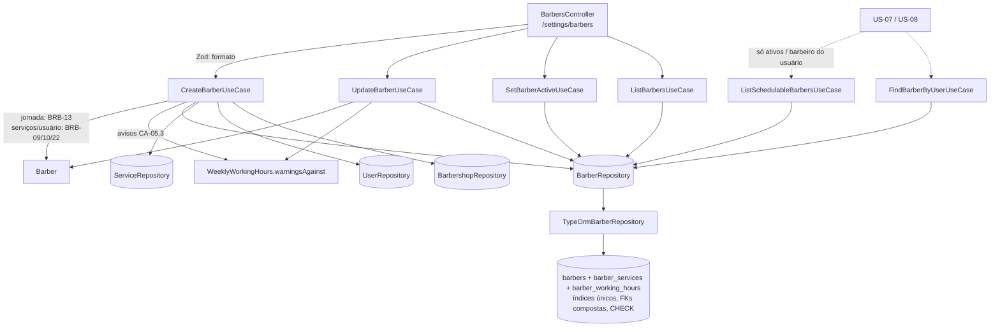

# US-05 Design

**Spec**: `.specs/features/us-05-cadastro-de-barbeiros/spec.md`
**Status**: Approved

---

## Architecture Overview

A jornada vira dois value objects espelhados no funcionamento da US-03: `DayWorkingHours` (um dia, com a regra do BRB-13) e `WeeklyWorkingHours` (os 7 dias, com o cálculo dos avisos do CA-05.3 contra um `WeeklyOpeningHours`). A entidade `Barber` carrega nome, `active`, `userId`, `serviceIds` e a jornada, e valida os serviços e o usuário que recebe. Um port novo, `BarberRepository`, é compartilhado por seis use cases (AD-001). Um controller só-Dono expõe as cinco rotas de `/settings/barbers`. Unicidade do nome, vínculo 1:1 com usuário e tenant das relações ficam também no banco.

**Abordagem escolhida (tenant das relações no banco):** chaves únicas `(id, barbershop_id)` em `services`, `users` e `barbers`, e FKs compostas a partir de `barber_services` e `barbers.user_id`. Assim um `INSERT` direto com serviço ou usuário de outra barbearia falha (BRB-11, BRB-24).
Alternativa descartada: FK simples por id mais checagem só na aplicação. Não atende ao BRB-11 e deixa a lição L-004 (tenant em gravação de filhos) só na mão do código.

**Abordagem escolhida (remoção do usuário):** FK composta `(user_id, barbershop_id) → users(id, barbershop_id)` com `ON DELETE SET NULL ("user_id")` (Postgres 15+), que zera só o `user_id` e mantém o `barbershop_id`. O `removeBarber` da US-02 não muda.
Alternativa descartada: o `RemoveBarberUseCase` desvincular antes de apagar. Duas gravações para uma regra que o banco garante sozinho, e o `DELETE` direto continuaria quebrando.

**Abordagem escolhida (unicidade do nome e do usuário):** só os índices únicos; o repositório traduz a violação `23505` pelo nome da constraint em `BarberNameAlreadyExistsError` ou `BarberUserAlreadyLinkedError`, como na US-04. Cobre gravações simultâneas.

---

## Code Reuse Analysis

### Existing Components to Leverage

| Component | Location | How to Use |
| --------- | -------- | ---------- |
| `TimeOfDay`, `Weekday`, `WEEKDAYS`, `WEEKDAY_LABELS`, `isoWeekdayNumber` | `src/domain/value-objects/` | Horários e dias da jornada; rótulo do dia nas mensagens |
| `DayOpeningHours.openPeriods()` + `LocalPeriod` | `src/domain/value-objects/day-opening-hours.ts` | Períodos abertos para o cálculo dos avisos; `DayWorkingHours.workPeriods()` devolve o mesmo tipo |
| `WeeklyOpeningHours` | `src/domain/value-objects/weekly-opening-hours.ts` | Entrada de `warningsAgainst`; `allClosed()` quando a barbearia nunca salvou |
| Padrão entidade + `restore` + snapshot | `src/domain/entities/barbershop-service.ts`, `src/usecases/testing/in-memory-service.repository.ts` | Mesmo formato em `Barber` e `InMemoryBarberRepository` |
| `applySuggestedAddOns` | `src/usecases/shared/apply-suggested-add-ons.ts` | Mesmo formato em `assignBarberServices` |
| `ServiceRepository.findByIds`, `UserRepository.findById`, `BarbershopRepository.findById` | `src/usecases/ports/` | Serviços, usuário e funcionamento do tenant |
| `TypeOrmServiceRepository` (transação, `affected !== 1` antes de trocar filhos, tradução do `23505`) | `src/infrastructure/database/repositories/typeorm-service.repository.ts` | Mesmo formato em `TypeOrmBarberRepository` |
| `toTimeOfDay` (HH:mm:ss → HH:mm) | `src/infrastructure/database/repositories/typeorm-barbershop.repository.ts` | Mesma conversão na leitura da jornada |
| `ZodValidationPipe`, `ApiZodResponse`, `ApiErrorResponse`, `SessionGuard`, `@CurrentSession()` | `src/interface-adapters/controllers/`, `src/infrastructure/http/` | Payload, Swagger, só Dono (AD-007) |
| `timeField` do schema de funcionamento | `src/interface-adapters/controllers/schemas/barbershop-settings.schema.ts` | Extraído para `schemas/time-of-day.field.ts` e usado pelos dois schemas |
| Helpers de e2e | `test/support/` | Dono, Barbeiro, limpeza (`TRUNCATE barbershops CASCADE` alcança as tabelas novas) |

### Integration Points

| System | Integration Method |
| ------ | ------------------ |
| Banco | Migration `AddBarbers`: tabelas novas + chaves únicas `(id, barbershop_id)` em `services` e `users` |
| `AccountModule` | Passa a exportar `USER_REPOSITORY` |
| `ServicesModule` | Já exporta `SERVICE_REPOSITORY` |
| `AppModule` | Importa o `BarbersModule` novo |
| US-07 / US-08 | O `BarbersModule` exporta `BARBER_REPOSITORY`, `ListSchedulableBarbersUseCase` e `FindBarberByUserUseCase` |

---

## Components

### `DayWorkingHours` (value object)

- **Purpose**: A jornada de um dia de trabalho.
- **Location**: `src/domain/value-objects/day-working-hours.ts`
- **Interfaces**:
  - `static create({ weekday, startsAt, endsAt, break? }): DayWorkingHours` - `endsAt <= startsAt` → `InvalidWorkingHoursError('{Dia}: o fim da jornada deve ser depois do início.')`; intervalo fora de `startsAt < break.startsAt < break.endsAt < endsAt` → `InvalidWorkingHoursError('{Dia}: o intervalo deve começar e terminar dentro da jornada, com o fim depois do início.')`
  - `weekday`, `startsAt`, `endsAt`, `break`
  - `workPeriods(): LocalPeriod[]` - um período, ou dois quando há intervalo

### `WeeklyWorkingHours` (value object)

- **Location**: `src/domain/value-objects/weekly-working-hours.ts`
- **Interfaces**:
  - `static create(days: Record<Weekday, DayWorkingHours | null>)`
  - `forDay(weekday): DayWorkingHours | null`
  - `warningsAgainst(openingHours: WeeklyOpeningHours): WorkingHoursWarning[]` - na ordem de `WEEKDAYS`; para cada dia de trabalho: barbearia fechada → aviso de dia fechado; algum período de trabalho não contido inteiro num único período aberto → aviso de trecho fora. `WorkingHoursWarning = { weekday: Weekday; message: string }`.
- Os períodos abertos de um dia são disjuntos e separados por um intervalo de duração positiva (regra da US-03), então "contido na união" equivale a "contido num único período".

### `Barber` (entidade)

- **Location**: `src/domain/entities/barber.ts`
- **Interfaces**:
  - `static create({ id, barbershopId, name, workingHours, now })` - nasce ativo, sem serviços e sem usuário
  - `static restore(props)`
  - getters: `id`, `barbershopId`, `name`, `active`, `userId`, `serviceIds`, `workingHours`, `createdAt`
  - `update({ name, workingHours })` - não mexe em `active`
  - `changeServices(services: BarbershopService[])` - lista vazia → `InvalidBarberServiceError('Informe pelo menos um serviço realizado.')`; serviço de outra barbearia → `InvalidBarberServiceError('Serviço não encontrado.')`; inativo → `InvalidBarberServiceError('Os serviços realizados devem estar ativos.')`; guarda os ids na ordem recebida
  - `linkUser(user: User | null)` - usuário de outra barbearia → `InvalidBarberUserError()` ("Usuário não encontrado."); `null` desvincula
  - `activate()` / `deactivate()` - idempotentes

### Erros de domínio

| Erro | `code` | `rule` | Mensagem | HTTP |
| ---- | ------ | ------ | -------- | ---- |
| `InvalidWorkingHoursError` | `INVALID_WORKING_HOURS` | `RF-34` | por dia (BRB-13) | 400 |
| `InvalidBarberServiceError` | `INVALID_BARBER_SERVICE` | `RF-34` | BRB-09 / BRB-10 | 400 |
| `InvalidBarberUserError` | `INVALID_BARBER_USER` | `RN-26` | Usuário não encontrado. | 400 |
| `BarberNameAlreadyExistsError` | `BARBER_NAME_ALREADY_EXISTS` | `RF-34` | Já existe um barbeiro com esse nome. | 409 |
| `BarberUserAlreadyLinkedError` | `BARBER_USER_ALREADY_LINKED` | `RF-34` | Esse usuário já está vinculado a outro barbeiro. | 409 |
| `BarberNotFoundError` | `BARBER_NOT_FOUND` | `RN-26` | Barbeiro não encontrado. | 404 |

Todos em `src/domain/errors/`, um arquivo por classe.

### `BarberRepository` (port)

- **Location**: `src/usecases/ports/barber.repository.port.ts`
- **Interfaces** (AD-004):
  - `listByBarbershop(barbershopId)` - todos, por `lower(name)`
  - `listActiveByBarbershop(barbershopId)` - só ativos, mesma ordem
  - `findById(barbershopId, barberId)`
  - `findByUserId(barbershopId, userId)`
  - `create(barber)` - barbeiro, serviços e jornada numa transação; nome repetido → `BarberNameAlreadyExistsError`; usuário já vinculado → `BarberUserAlreadyLinkedError`; nada gravado
  - `save(barber)` - `UPDATE` onde `id` e `barbershop_id` batem (senão `BarberNotFoundError`), depois troca serviços e jornada; mesmas traduções de erro; nada muda quando falha
- **Fake**: `src/usecases/testing/in-memory-barber.repository.ts` (snapshots, mesmas regras de nome e usuário).

### Use cases

| Use case | Location | Entrada → saída | Regras |
| -------- | -------- | --------------- | ------ |
| `CreateBarberUseCase` | `src/usecases/create-barber/` | `{ barbershopId, name, userId, serviceIds, workingHours }` → `{ barber, warnings }` | jornada (VOs) antes de ler; `Barber.create`; `assignBarberServices`; `assignBarberUser`; avisos; `create` |
| `UpdateBarberUseCase` | `src/usecases/update-barber/` | `{ barbershopId, barberId, ...mesmos campos }` → `{ barber, warnings }` | jornada; `findById` ou `BarberNotFoundError`; `update`; serviços; usuário; avisos; `save` |
| `SetBarberActiveUseCase` | `src/usecases/set-barber-active/` | `{ barbershopId, barberId, active }` → `Barber` | `findById` ou 404; `activate`/`deactivate`; `save` |
| `ListBarbersUseCase` | `src/usecases/list-barbers/` | `{ barbershopId }` → `Barber[]` | todos (BRB-02) |
| `ListSchedulableBarbersUseCase` | `src/usecases/list-schedulable-barbers/` | `{ barbershopId }` → `Barber[]` | só ativos (BRB-03, BRB-27); sem rota |
| `FindBarberByUserUseCase` | `src/usecases/find-barber-by-user/` | `{ barbershopId, userId }` → `Barber \| null` | BRB-20, BRB-21; sem rota |

Auxiliares em `src/usecases/shared/`:

- `assign-barber-services.ts` - `findByIds(barber.barbershopId, ids)`; id que não voltou → `InvalidBarberServiceError('Serviço não encontrado.')`; senão `barber.changeServices(na ordem de ids)`.
- `assign-barber-user.ts` - `null` → `linkUser(null)`; senão `users.findById(barber.barbershopId, userId)`; ausente → `InvalidBarberUserError`; senão `linkUser(user)`.
- `working-hours-warnings.ts` - `barbershops.findById(barbershopId)`; `openingHours` dela (ou `allClosed()` se não existir); `barber.workingHours.warningsAgainst(...)`.

Input da jornada nos use cases: `Record<Weekday, { startsAt: string; endsAt: string; break: { startsAt: string; endsAt: string } | null } | null>`, convertido por `toWeeklyWorkingHours` em `src/usecases/shared/to-weekly-working-hours.ts`.

### HTTP

- **Schemas**:
  - `schemas/time-of-day.field.ts` - `timeOfDayField` extraído do schema de funcionamento (mesma mensagem); o `barbershop-settings.schema.ts` passa a importá-lo.
  - `schemas/barber.schema.ts` - `name` trim 2–60 ("Informe o nome do barbeiro, com 2 a 60 caracteres."); `userId` uuid ou `null`, opcional → `null` ("Informe um id de usuário válido, ou null."); `serviceIds` array de uuid, 1 a 50, sem repetidos ("Escolha de 1 a 50 serviços realizados, sem repetir."); `workingHours` com as 7 chaves obrigatórias, cada uma `null` ou `{ startsAt, endsAt, break? }` ("Informe a jornada do dia, ou null se for folga.").
  - `schemas/barber-id.params.schema.ts` - `barberId` uuid.
- **Presenter**: `presenters/barber.presenter.ts` - `barberResponseSchema` `{ id, name, active, userId, serviceIds, workingHours }`, `savedBarberResponseSchema` (acrescenta `warnings: [{ weekday, message }]`), `barberListResponseSchema` `{ barbers: [...] }`.
- **Controller**: `controllers/barbers.controller.ts` - `@Controller('settings/barbers')`, `@ApiTags('Configurações')`, sem `@Roles`:
  - `GET /` → 200 lista
  - `POST /` → 201 com `warnings`; 409 (nome, usuário), 400 (serviço, usuário, jornada)
  - `PUT /:barberId` → 200 com `warnings`; 404, 409, 400
  - `POST /:barberId/deactivate` e `/activate` → 200; 404
- **Módulo**: `infrastructure/modules/barbers.module.ts` - importa `AccountModule` e `ServicesModule`; provê `BARBER_REPOSITORY`, `CLOCK`, `ID_GENERATOR` e os seis use cases; exporta `BARBER_REPOSITORY`, `ListSchedulableBarbersUseCase`, `FindBarberByUserUseCase`.

---

## Data Models

### `barbers` (nova)

| Coluna | Tipo | Regra |
| ------ | ---- | ----- |
| `id` | `uuid` | PK; único `(id, barbershop_id)` (`barbers_id_barbershop_unique`) |
| `barbershop_id` | `uuid` | NOT NULL, FK `barbershops(id)` |
| `name` | `varchar(60)` | NOT NULL; índice único `barbers_name_unique` sobre `(barbershop_id, lower(name))` |
| `user_id` | `uuid` | NULL; índice único `barbers_user_id_unique`; FK `(user_id, barbershop_id) → users(id, barbershop_id) ON DELETE SET NULL ("user_id")` |
| `active` | `boolean` | NOT NULL |
| `created_at` | `timestamptz` | NOT NULL |

### `barber_services` (nova)

| Coluna | Tipo | Regra |
| ------ | ---- | ----- |
| `barber_id` | `uuid` | PK (com `service_id`) |
| `service_id` | `uuid` | PK |
| `barbershop_id` | `uuid` | NOT NULL; FK `(barber_id, barbershop_id) → barbers(id, barbershop_id)`; FK `(service_id, barbershop_id) → services(id, barbershop_id)` |
| `position` | `smallint` | NOT NULL |

### `barber_working_hours` (nova)

| Coluna | Tipo | Regra |
| ------ | ---- | ----- |
| `barber_id` | `uuid` | PK (com `weekday`), FK `barbers(id)` |
| `weekday` | `smallint` | `CHECK (weekday BETWEEN 1 AND 7)` |
| `starts_at`, `ends_at` | `time` | NOT NULL; `CHECK (ends_at > starts_at)` |
| `break_starts_at`, `break_ends_at` | `time` | NULL; mesmo `CHECK` do intervalo da US-03, com `starts_at`/`ends_at` |

Dias de folga não têm linha. Mudanças em tabelas existentes: `services_id_barbershop_unique` e `users_id_barbershop_unique` (`UNIQUE (id, barbershop_id)`), alvo das FKs compostas.

---

## Error Handling Strategy

| Error Scenario | Handling | User Impact |
| -------------- | -------- | ----------- |
| Payload malformado | `ZodValidationPipe` | 400 `{ message: 'Dados inválidos.', errors: [{ field, message }] }` |
| Jornada incoerente | `InvalidWorkingHoursError` | 400 `{ message: 'Segunda-feira: ...' }` |
| Serviço inexistente, de outro tenant ou inativo | `InvalidBarberServiceError` | 400 com o motivo |
| Usuário inexistente ou de outro tenant | `InvalidBarberUserError` | 400 `{ message: 'Usuário não encontrado.' }` |
| Nome repetido / usuário já vinculado | índices únicos → erros de domínio | 409 com a mensagem |
| Barbeiro inexistente ou de outro tenant | `BarberNotFoundError` | 404 |
| Jornada fora do funcionamento | grava e devolve `warnings` | 201/200 com avisos |
| Barbeiro / sem sessão | `SessionGuard` | 403 / 401 |

---

## Risks & Concerns

| Concern | Location (file:line) | Impact | Mitigation |
| ------- | -------------------- | ------ | ---------- |
| `ON DELETE SET NULL ("user_id")` não é expressável no metadata do TypeORM | migration `AddBarbers` (nova) | Um `migration:generate` futuro poderia recriar a FK zerando as duas colunas (falha no `NOT NULL`) | A entidade declara a FK composta com `onDelete: 'SET NULL'` (o diff não compara a lista de colunas); a migration usa a forma com coluna; o e2e de schema prova que apagar o usuário mantém o `barbershop_id` e zera só o `user_id`; conferir que `migration:generate` não gera diff |
| Índice por expressão fora do metadata | `barbers_name_unique` | Mesmo risco da US-04 | `@Index(..., { synchronize: false })` |
| Troca de filhos por `barber_id` sem tenant | repositório novo | Lição L-004: um `save` com entidade forjada de outro tenant apagaria filhos alheios | `affected !== 1` antes de trocar filhos; e2e com barbeiro de outra barbearia pelo próprio id, conferindo serviços e jornada dele |
| `USER_REPOSITORY` não é exportado | `src/infrastructure/modules/account.module.ts:322` | O módulo novo não o enxergaria | Acrescentar ao `exports` |
| `InMemoryUserRepository.removeBarber` não desvincula barbeiros | `src/usecases/testing/in-memory-user.repository.ts:24` | Nenhum teste de use case cobre o BRB-25 | O BRB-25 é regra do banco; coberto em e2e (schema e HTTP) |

---

## Tech Decisions

| Decision | Choice | Rationale |
| -------- | ------ | --------- |
| Jornada | VOs próprios (`DayWorkingHours`, `WeeklyWorkingHours`), não reuso do `DayOpeningHours` | Mensagens diferentes ("jornada", "início/fim") e o cálculo de avisos pertence à jornada |
| Tenant das relações | FKs compostas com `UNIQUE (id, barbershop_id)` | BRB-11/BRB-24 no banco; L-004 |
| Aviso | Calculado no use case, devolvido junto do barbeiro; não persistido | CA-05.3 é sobre o momento de salvar |
| Leituras para agenda | `ListSchedulableBarbersUseCase` e `FindBarberByUserUseCase` exportados, sem rota | Forma testável de CA-05.1/CA-05.2 sem adiantar a US-07/US-08 |
| Módulo | `BarbersModule` próprio, importando `AccountModule` e `ServicesModule` | Mesmo padrão dos módulos anteriores |

Nenhuma decisão de projeto nova para o STATE.md: tudo segue AD-001 a AD-007.
