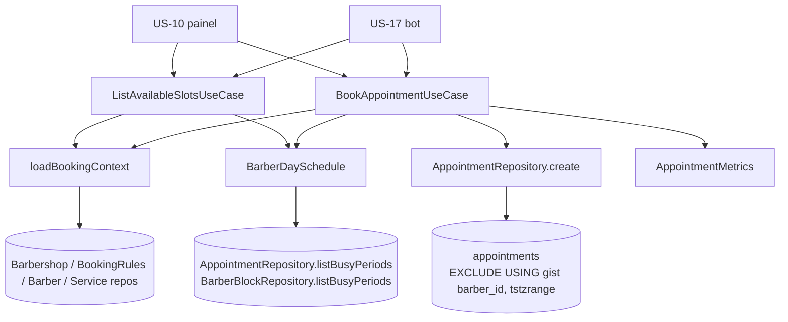

# US-07 Design

**Spec**: `.specs/features/us-07-motor-de-disponibilidade/spec.md`
**Context**: `.specs/features/us-07-motor-de-disponibilidade/context.md`
**Status**: Approved

---

## Approaches

| # | Approach | Verdict |
| - | -------- | ------- |
| **A** | **Regra de agenda num value object de domínio (`BarberDaySchedule`) usado pelos dois use cases; banco barra sobreposição com `EXCLUDE USING gist`.** A consulta monta o dia de cada barbeiro e pede a grade; a gravação monta o mesmo dia e pede a primeira violação. | **Escolhida.** Uma única implementação das regras (CLAUDE.md: motor único), testável em unidade sem banco, e a constraint garante RN-07 sem lock. |
| B | Mesmo cálculo, mas com `pg_advisory_xact_lock` por barbeiro na gravação, em vez da constraint. | Descartada: o CLAUDE.md exige a constraint de exclusão; o lock só serializa quem passa pela aplicação e não barra `INSERT` direto (AVL-29). |
| C | Calcular os horários em SQL (`generate_series` + `tstzrange`). | Descartada: duplica as regras entre SQL e a validação da gravação e tira o motor do alcance dos testes de unidade. |

---

## Architecture Overview



Fluxo da gravação: valida barbeiro e serviços → calcula `início` e `fim` → checa passado e antecedência → monta o `BarberDaySchedule` do dia local do início → pede a primeira violação (funcionamento, jornada, bloqueio, sobreposição) → grava. Se outra gravação venceu a corrida entre a leitura e o `INSERT`, a constraint de exclusão dispara (`23P01`) e o repositório lança `AppointmentConflictError` citando RN-07.

---

## Code Reuse Analysis

| Component | Location | How to Use |
| --------- | -------- | ---------- |
| `Barbershop.openIntervalsOn(localDate)` | `src/domain/entities/barbershop.ts:117` | Períodos de funcionamento do dia em UTC. |
| `DayWorkingHours.workPeriods()` + `BarbershopTimezone.toUtc()` | `src/domain/value-objects/` | Novo `Barber.workIntervalsOn(localDate, timezone)`, espelho do `openIntervalsOn`. |
| `BarbershopTimezone.weekdayOf()` / `toUtc()` | `src/domain/value-objects/barbershop-timezone.ts` | Ganha `localDateOf(instant)` e passa a rejeitar datas que não existem no calendário. |
| `BookingRules.defaults()` | `src/domain/value-objects/booking-rules.ts` | Fallback quando a barbearia não tem regras (AD-008). |
| `BarberRepository.listActiveByBarbershop` | `src/usecases/ports/barber.repository.port.ts` | Barbeiros aptos, já em ordem de nome (AVL-11). |
| `ServiceRepository.findByIds` | `src/usecases/ports/service.repository.port.ts` | Serviços pedidos, filtrados pela barbearia. |
| `Clock` / `FixedClock` | `src/usecases/ports/clock.port.ts` | `agora` da consulta e da gravação. |
| `DomainError(message, rule)` | `src/domain/errors/domain.error.ts` | Todos os erros novos carregam a RN. |
| `BarberNotFoundError`, `ServiceNotFoundError`, `InvalidValueError` | `src/domain/errors/` | AVL-32, AVL-33, AVL-35 e casos de borda. |
| Fixtures `seedBarbershop`, `seedBarber`, `seedService` | `src/usecases/testing/` | Testes de unidade dos use cases. |
| FKs compostas `(id, barbershop_id)` | migration `AddBarbers` | Mesma técnica para AVL-37. |
| `PrometheusAccountMetrics` | `src/infrastructure/observability/` | Modelo do `PrometheusAppointmentMetrics`. |

### Integration Points

| System | Integration Method |
| ------ | ------------------ |
| Postgres | Migration nova: `btree_gist`, `appointments`, `appointment_services`, `barber_blocks`. |
| Nest DI | `SchedulingModule` em `infrastructure/modules/`, exporta os dois use cases para US-10 e US-17. `BookingRulesModule` passa a exportar `BOOKING_RULES_REPOSITORY`. |
| HTTP | Nenhuma rota (context.md). O `DomainErrorFilter` não muda; a US-10 mapeia os erros novos quando expuser as rotas. |

---

## Components

### `BarberDaySchedule` (value object)

- **Purpose**: As regras de agenda de um barbeiro num dia local: períodos livres, grade ofertada e primeira violação de um intervalo.
- **Location**: `src/domain/value-objects/barber-day-schedule.ts`
- **Interfaces**:
  - `static create({ barberId, openPeriods, workPeriods, blocks, appointments }: …): BarberDaySchedule` — todos `UtcPeriod[]`.
  - `offer(durationMinutes: number, earliest: Date): AvailableSlot[]` — AVL-01, 03 a 06: interseção funcionamento × jornada, menos bloqueios e agendamentos; inícios de 30 em 30 a partir do início de cada período livre, `início >= earliest`, fim dentro do período.
  - `violationOf(period: UtcPeriod): ScheduleViolation | null` — AVL-21 a 24 na ordem funcionamento → jornada → bloqueio → sobreposição.
- **Dependencies**: nenhuma (TS puro).
- **Reuses**: `UtcPeriod` de `barbershop.ts`.

`ScheduleViolation = 'outside-opening-hours' | 'outside-working-hours' | 'blocked' | 'overlap'`. O use case traduz para o erro de domínio, e a mesma função decide oferta e gravação (AVL-27).

### `Appointment` (entidade)

- **Purpose**: Agendamento confirmado de um barbeiro.
- **Location**: `src/domain/entities/appointment.ts`
- **Interfaces**: `static book({ id, barbershopId, barberId, serviceIds, startsAt, durationMinutes, origin, now })`, `static restore(props)`, getters.
- **Invariantes**: `status = 'confirmed'` na criação; `endsAt = startsAt + durationMinutes`; `origin ∈ {'bot','manual'}`.

### Erros de domínio novos (`src/domain/errors/`)

| Classe | code | Mensagem | RN |
| ------ | ---- | -------- | -- |
| `MinimumAdvanceNotMetError` | `MINIMUM_ADVANCE_NOT_MET` | `Escolha um horário com pelo menos {n} minutos de antecedência.` | RN-02 |
| `SlotInPastError` | `SLOT_IN_PAST` | `O horário já passou.` | — |
| `OutsideOpeningHoursError` | `OUTSIDE_OPENING_HOURS` | `O horário está fora do funcionamento da barbearia.` | RN-05 |
| `OutsideWorkingHoursError` | `OUTSIDE_WORKING_HOURS` | `O horário está fora da jornada do barbeiro.` | RN-05 |
| `BarberUnavailableError` | `BARBER_UNAVAILABLE` | `O barbeiro está indisponível nesse horário.` | RN-05 |
| `AppointmentConflictError` | `APPOINTMENT_CONFLICT` | `O barbeiro já tem um agendamento nesse horário.` | RN-03 (aplicação) / RN-07 (banco) |
| `ServiceNotPerformedError` | `SERVICE_NOT_PERFORMED` | `O barbeiro não realiza todos os serviços escolhidos.` | — |

### Use cases

- **`ListAvailableSlotsUseCase`** — `src/usecases/list-available-slots/`
  - `execute({ barbershopId, barberId: string | null, serviceIds, date, origin }): Promise<AvailableSlot[]>`
  - `AvailableSlot = { barberId, startsAt: Date, endsAt: Date }`, ordem crescente de início. Com `barberId = null`, calcula por barbeiro apto e fica com o primeiro barbeiro (ordem de nome) em cada início (AVL-11).
- **`BookAppointmentUseCase`** — `src/usecases/book-appointment/`
  - `execute({ barbershopId, barberId, serviceIds, startsAt, origin }): Promise<Appointment>`
  - Ordem AVL-25; incrementa `AppointmentMetrics.booked(origin)` ou `.conflict(origin)` (também quando o conflito vem do banco).
- **`loadBookingContext` / `buildBarberDaySchedule`** — `src/usecases/shared/`: resolve serviços (AVL-33, 35), duração (AVL-02), regras vigentes (AVL-17, padrão AD-008), `earliest` por origem (AVL-14 a 16) e monta o `BarberDaySchedule` do dia com os períodos ocupados lidos do tenant (AVL-36).

`origin` é `'bot' | 'manual'` na consulta e na gravação; `manual` é o "painel" do CA-07.3.

### Ports (`src/usecases/ports/`, AD-001)

- `appointment.repository.port.ts` — `APPOINTMENT_REPOSITORY`
  - `listBusyPeriods(barbershopId, barberIds, range: UtcPeriod): Promise<BusyPeriod[]>` — agendamentos confirmados que tocam o intervalo.
  - `create(appointment): Promise<void>` — grava agendamento e serviços na mesma transação; lança `AppointmentConflictError` (RN-07) quando a constraint de exclusão recusa.
- `barber-block.repository.port.ts` — `BARBER_BLOCK_REPOSITORY`
  - `listBusyPeriods(barbershopId, barberIds, range): Promise<BusyPeriod[]>`
- `appointment-metrics.port.ts` — `APPOINTMENT_METRICS`: `booked(origin)`, `conflict(origin)`.

`BusyPeriod = { barberId, start, end }` fica no port do agendamento e é reusado pelo de bloqueios.

### Infraestrutura

- `TypeOrmAppointmentRepository`, `TypeOrmBarberBlockRepository` em `src/infrastructure/database/repositories/` (AD-002).
- `PrometheusAppointmentMetrics` em `src/infrastructure/observability/`: `appointments_booked_total{origin}`, `appointment_conflicts_total{origin}`.
- `SchedulingModule` em `src/infrastructure/modules/scheduling.module.ts`, registrado no `AppModule`.
- Fakes: `InMemoryAppointmentRepository`, `InMemoryBarberBlockRepository`, `CountingAppointmentMetrics` em `src/usecases/testing/`.

---

## Data Models

```sql
CREATE EXTENSION IF NOT EXISTS btree_gist;

CREATE TABLE appointments (
  id uuid PRIMARY KEY,
  barbershop_id uuid NOT NULL REFERENCES barbershops(id),
  barber_id uuid NOT NULL,
  starts_at timestamptz NOT NULL,
  ends_at timestamptz NOT NULL,
  status varchar(20) NOT NULL CHECK (status IN ('confirmed')),
  origin varchar(20) NOT NULL CHECK (origin IN ('bot', 'manual')),
  created_at timestamptz NOT NULL,
  CONSTRAINT appointments_ends_after_starts_check CHECK (ends_at > starts_at),
  CONSTRAINT appointments_id_barbershop_unique UNIQUE (id, barbershop_id),
  CONSTRAINT appointments_barber_fk FOREIGN KEY (barber_id, barbershop_id) REFERENCES barbers(id, barbershop_id),
  -- RN-07: '[)' deixa encostar (AVL-30); só confirmados ocupam o horário.
  CONSTRAINT appointments_no_overlap EXCLUDE USING gist (
    barber_id WITH =, tstzrange(starts_at, ends_at, '[)') WITH &&
  ) WHERE (status = 'confirmed')
);

CREATE TABLE appointment_services (
  appointment_id uuid NOT NULL,
  position smallint NOT NULL,
  service_id uuid NOT NULL,
  barbershop_id uuid NOT NULL,
  PRIMARY KEY (appointment_id, position),
  UNIQUE (appointment_id, service_id),
  FOREIGN KEY (appointment_id, barbershop_id) REFERENCES appointments(id, barbershop_id),
  FOREIGN KEY (service_id, barbershop_id) REFERENCES services(id, barbershop_id)
);

-- Mínimo estrutural para CA-07.1; motivo e CRUD chegam na US-09.
CREATE TABLE barber_blocks (
  id uuid PRIMARY KEY,
  barbershop_id uuid NOT NULL,
  barber_id uuid NOT NULL,
  starts_at timestamptz NOT NULL,
  ends_at timestamptz NOT NULL,
  created_at timestamptz NOT NULL,
  CHECK (ends_at > starts_at),
  FOREIGN KEY (barber_id, barbershop_id) REFERENCES barbers(id, barbershop_id)
);
CREATE INDEX barber_blocks_barber_range_idx ON barber_blocks (barber_id, starts_at);
```

A constraint de exclusão já cria o índice gist que atende `listBusyPeriods` de agendamentos. As entidades TypeORM usam `@Exclusion`; o `CREATE EXTENSION` fica só na migration.

---

## Error Handling Strategy

| Error Scenario | Handling | User Impact |
| -------------- | -------- | ----------- |
| Regra violada na aplicação | Use case lança o erro da tabela acima; nada é gravado | US-10/US-17 mostram a mensagem |
| Corrida perdida (`23P01` em `appointments_no_overlap`) | Repositório faz rollback e lança `AppointmentConflictError('RN-07')`; métrica de conflito | Mesmo erro de conflito; o bot oferece outras opções (US-17) |
| Outro erro de banco | Propaga sem tradução | 500 genérico |
| Barbearia sem regras | `BookingRules.defaults()` | Nenhum |

---

## Risks & Concerns

| Concern | Location (file:line) | Impact | Mitigation |
| ------- | -------------------- | ------ | ---------- |
| `parseLocalDate` aceita `2026-02-30` e o `Date.UTC` rola para março | `src/domain/value-objects/barbershop-timezone.ts:84` | Consulta de data inexistente devolveria horários de outro dia | Validar ida e volta do calendário; teste de borda da spec. |
| Teste de concorrência instável se depender de timing | e2e novo | CA-07.4 flaky | Decorator de teste no repositório segura as duas leituras numa barreira até ambas lerem; as duas chegam ao `INSERT` e só a constraint decide. |
| `barber_working_hours` só tem FK por `barber_id` | migration `AddBarbers` | Nenhum para esta história | Motor lê jornada via `BarberRepository`, que já filtra por tenant. |
| `CREATE EXTENSION` exige permissão | migration nova | Falha em ambiente com usuário sem privilégio | `btree_gist` é extensão *trusted* no PG 13+; o dono do banco consegue criar. Registrado no PR. |
| Métricas por `origin` | observability | Cardinalidade | Label com 2 valores fixos. |

---

## Tech Decisions

| Decision | Choice | Rationale |
| -------- | ------ | --------- |
| Onde mora a regra de agenda | Value object de domínio `BarberDaySchedule` | Motor único testável sem banco; oferta e gravação usam a mesma função (AVL-27). |
| Origem na consulta | `'bot' \| 'manual'` | Um tipo só para consulta e gravação; `manual` é o painel (CA-10.1, RF-28). |
| Conflito na corrida | Constraint de exclusão + tradução de `23P01` | CLAUDE.md (RN-07); sem lock nem retry. |
| Mapeamento HTTP dos erros novos | Fica para a US-10 | Sem rota nesta história. |
| Exclusão parcial por status | `WHERE (status = 'confirmed')` | US-18 e US-11 criam status que liberam o horário sem mudar a constraint. |
