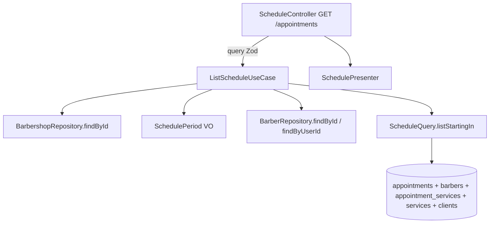

# US-08 Design

**Spec**: `.specs/features/us-08-visualizacao-da-agenda/spec.md`
**Status**: Approved

---

## Architecture Overview

A agenda é uma leitura. Um use case decide **qual** agenda o usuário pode ver (perfil, barbeiro, período) e um port de consulta devolve os agendamentos já montados para exibição, numa única query com joins. O período vem de um value object de domínio que converte `day`/`week` e a data local em um intervalo UTC no fuso da barbearia.



**Abordagens consideradas:**

1. **Port de consulta dedicado (escolhida).** `ScheduleQuery` devolve um read model (`ScheduleEntry`) com barbeiro, cliente e serviços. Uma query com joins, sem N+1, e o use case continua sem conhecer SQL.
2. **Compor a partir dos repositórios.** O use case leria agendamentos, barbeiros, serviços e clientes e juntaria em memória. Exigiria um `ClientRepository` sem outro uso nesta história, mais três idas ao banco e ordenação na aplicação.
3. **Estender o `AppointmentRepository`.** Misturaria leitura de exibição com o port de escrita do motor (US-07), que tem fakes com regras de concorrência.

---

## Code Reuse Analysis

### Existing Components to Leverage

| Component | Location | How to Use |
| --------- | -------- | ---------- |
| `BarbershopTimezone` | `src/domain/value-objects/barbershop-timezone.ts` | `toUtc(date, 00:00)` converte o início do dia; valida a data (`Data inválida.`) |
| `TimeOfDay` | `src/domain/value-objects/time-of-day.ts` | Meia-noite para o `toUtc` |
| `UtcPeriod` | `src/domain/entities/barbershop.ts` | Tipo do intervalo UTC |
| `BarberRepository.findById` / `findByUserId` | `src/usecases/ports/barber.repository.port.ts` | Filtro do Dono (404) e barbeiro do usuário (CA-08.2) |
| `BarbershopRepository.findById` | `src/usecases/ports/barbershop.repository.port.ts` | Fuso da barbearia |
| `BarberNotFoundError` | `src/domain/errors/barber-not-found.error.ts` | 404 já mapeado |
| `InMemoryBarberRepository`, `InMemoryBarbershopRepository`, fixtures | `src/usecases/testing/` | Testes do use case |
| `ZodValidationPipe`, `ApiZodResponse`, `ApiErrorResponse`, `@Roles` | `src/interface-adapters/controllers/` | Borda HTTP e Swagger |
| Padrão do `BookingRulesController` / `BarbersController` | `src/interface-adapters/controllers/` | Estrutura do controller e do presenter |
| `createAccountTestApp`, `signupOwner`, `createBarber` | `test/support/` | e2e com Dono e Barbeiro reais |

### Integration Points

| System | Integration Method |
| ------ | ------------------ |
| `appointments` (US-07) | Ganha `client_id` nulo e FK composta `(client_id, barbershop_id)`; o `TypeOrmAppointmentRepository.create` não muda (grava `NULL`). |
| `SessionGuard` (AD-007) | `@Roles('owner', 'barber')` abre a rota ao Barbeiro; a restrição ao próprio barbeiro fica no use case. |
| `DomainErrorFilter` | Novo mapeamento `ScheduleAccessDeniedError → 403`. |
| Swagger | Query derivada do schema Zod; resposta do presenter; nova tag `Agenda`. |

---

## Components

### SchedulePeriod (value object)

- **Purpose**: Converter visão + data local + fuso em intervalo UTC e datas locais de início e fim.
- **Location**: `src/domain/value-objects/schedule-period.ts`
- **Interfaces**:
  - `SchedulePeriod.create({ view, localDate, timezone }): SchedulePeriod`
  - `view: ScheduleView` (`'day' | 'week'`), `startDate: string`, `endDate: string` (inclusiva), `utc: UtcPeriod` (`[start, end)`)
- **Rules**: `day` = `[00:00 da data, 00:00 do dia seguinte)`; `week` = segunda da semana da data até a segunda seguinte (exclusiva), `endDate` = domingo. Data inválida → `InvalidValueError('Data inválida.')`.
- **Reuses**: `BarbershopTimezone.toUtc`, `TimeOfDay`.

### ScheduleQuery (port) e ScheduleEntry (read model)

- **Location**: `src/usecases/ports/schedule.query.port.ts`
- **Interfaces**:
  - `listStartingIn(barbershopId: string, range: UtcPeriod, barberId: string | null): Promise<ScheduleEntry[]>`: agendamentos da barbearia com `range.start <= starts_at < range.end`, só do barbeiro quando informado, ordenados por início, `lower(nome do barbeiro)`, id.
  - `ScheduleEntry`: `{ id, barber: { id, name }, client: { id, name, phone } | null, services: { id, name }[], startsAt: Date, endsAt: Date, status, origin }`.

### ListScheduleUseCase

- **Location**: `src/usecases/list-schedule/list-schedule.use-case.ts`
- **Interfaces**: `execute({ barbershopId, userId, role, view, date, barberId }): Promise<Schedule>`, onde `Schedule = { period: SchedulePeriod; timezone: string; entries: ScheduleEntry[] }`.
- **Flow**:
  1. Barbearia por id (sem barbearia → `InvalidCredentialsError`, mesmo padrão do `loadBookingContext`); período com o fuso dela.
  2. `role === 'barber'`: barbeiro do usuário. `barberId` informado e diferente do próprio (ou sem ficha) → `ScheduleAccessDeniedError`. Sem ficha e sem `barberId` → `entries: []` sem consultar. Senão, filtra pelo próprio.
  3. `role === 'owner'`: `barberId` informado e inexistente na barbearia → `BarberNotFoundError`; senão filtra por ele ou por nenhum.
- **Dependencies**: `BarbershopRepository`, `BarberRepository`, `ScheduleQuery`.

### ScheduleAccessDeniedError

- **Location**: `src/domain/errors/schedule-access-denied.error.ts`
- `code = 'SCHEDULE_ACCESS_DENIED'`, mensagem `Acesso negado.`, sem RN (regra da seção 5). Mapeado para `403`.

### ClientEntity, migration e AppointmentEntity

- **Location**: `src/infrastructure/database/entities/client.entity.ts`, `src/infrastructure/database/entities/appointment.entity.ts`, `src/infrastructure/database/migrations/<ts>-AddClients.ts`
- Sem entidade de domínio `Client` nesta história: nada cria cliente pela aplicação (a US-10 cria a entidade e o caso de uso).

### TypeOrmScheduleQuery

- **Location**: `src/infrastructure/database/repositories/typeorm-schedule.query.ts` (AD-002)
- Duas queries: agendamentos com join em `barbers` e `LEFT JOIN clients`, ordenados; depois os serviços de todos os ids com join em `services`, ordenados por `position`. Tudo filtrado por `barbershop_id`.

### Schedule query schema, presenter e controller

- **Locations**: `src/interface-adapters/controllers/schemas/schedule.query.schema.ts`, `src/interface-adapters/presenters/schedule.presenter.ts`, `src/interface-adapters/controllers/schedule.controller.ts`
- `GET /appointments?view=day|week&date=AAAA-MM-DD&barberId=<uuid>`; `@Roles('owner', 'barber')`; `@ApiTags('Agenda')`.
- Resposta: `{ view, startDate, endDate, timezone, appointments: [{ id, barber, client, services, startsAt, endsAt, status, origin }] }`, instantes em ISO 8601 UTC.

### ScheduleModule

- **Location**: `src/infrastructure/modules/schedule.module.ts`, registrado no `AppModule`. Importa `AccountModule` e `BarbersModule`; fornece `SCHEDULE_QUERY` e o use case.

---

## Data Models

### clients

```sql
CREATE TABLE clients (
  id uuid PRIMARY KEY,
  barbershop_id uuid NOT NULL REFERENCES barbershops(id),
  name varchar(80) NOT NULL,
  phone varchar(20) NOT NULL,          -- E.164 (PhoneNumber)
  created_at timestamptz NOT NULL,
  CONSTRAINT clients_barbershop_phone_unique UNIQUE (barbershop_id, phone),   -- RN-08
  CONSTRAINT clients_id_barbershop_unique UNIQUE (id, barbershop_id)          -- alvo da FK composta
);
ALTER TABLE appointments ADD client_id uuid NULL;
ALTER TABLE appointments ADD CONSTRAINT appointments_client_fk
  FOREIGN KEY (client_id, barbershop_id) REFERENCES clients(id, barbershop_id);  -- RN-26
CREATE INDEX appointments_barbershop_starts_idx ON appointments (barbershop_id, starts_at);
```

**Relationships**: FK composta `MATCH SIMPLE` (padrão do Postgres): com `client_id` nulo, a FK não é checada, então o agendamento sem cliente é aceito (AGD-19).

---

## Error Handling Strategy

| Error Scenario | Handling | User Impact |
| -------------- | -------- | ----------- |
| Query inválida | `ZodValidationPipe` | `400 { message: 'Dados inválidos.', errors }` |
| Sem sessão | `SessionGuard` | `401` |
| Barbeiro pede outro barbeiro | `ScheduleAccessDeniedError` → filter | `403 { message: 'Acesso negado.' }` |
| Dono filtra barbeiro inexistente / de outra barbearia | `BarberNotFoundError` → filter | `404 { message: 'Barbeiro não encontrado.' }` |
| Barbeiro sem ficha | Use case devolve lista vazia | `200` com `appointments: []` |

---

## Risks & Concerns

| Concern | Location (file:line) | Impact | Mitigation |
| ------- | -------------------- | ------ | ---------- |
| Leitura por período sem índice por barbearia | `src/infrastructure/database/migrations/1790607839456-AddAppointments.ts:10` | Só o índice gist de `barber_id` existe; a agenda do Dono varre por `barbershop_id` | Índice `(barbershop_id, starts_at)` na migration desta história |
| Telefone do cliente na resposta | resposta de `GET /appointments` | Dado pessoal exposto a quem vê a agenda | Barbeiro só vê os próprios agendamentos (AGD-08..10); telefone nunca vai para log (`*.phone` já no `redact`) |
| Convite de barbeiro no e2e vincula usuário a barbeiro? | `test/support/account-flows.ts:67` | `createBarber` cria só o usuário; a ficha de barbeiro vem da US-05 | O e2e cria a ficha com `PUT /settings/barbers` ou por SQL com `user_id` |

---

## Tech Decisions

| Decision | Choice | Rationale |
| -------- | ------ | --------- |
| Onde fica a regra "Barbeiro só vê a própria agenda" | No use case, com erro de domínio 403 | O `SessionGuard` só sabe o perfil; saber qual barbeiro é do usuário é regra de negócio |
| Read model no port | `ScheduleEntry` plano, não entidade de domínio | Leitura de exibição; evita criar `Client` de domínio antes da US-10 |
| Rota | `GET /appointments` | A US-10 vai criar `POST /appointments` no mesmo recurso |
