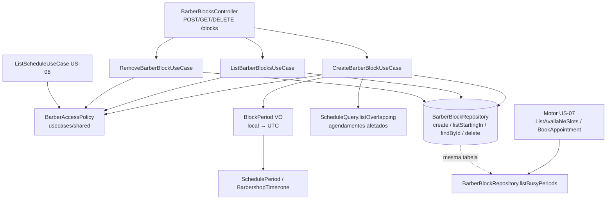

# US-09: Bloqueios e folgas — Design

**Spec**: `.specs/features/us-09-bloqueios-e-folgas/spec.md`
**Context**: `.specs/features/us-09-bloqueios-e-folgas/context.md`
**Status**: Approved

---

## Architecture Overview

Três rotas em `/blocks`, um use case por rota, e nenhuma mudança no motor. O motor da US-07 já lê `barber_blocks` pelo `BarberBlockRepository.listBusyPeriods`; esta história amplia o mesmo port com escrita e listagem, e a tabela ganha `kind` e `reason`.

A regra de perfil (Dono vê todos; Barbeiro só o próprio barbeiro) sai de dentro do `ListScheduleUseCase` para uma política compartilhada, usada pela agenda e pelos três use cases novos.



### Fluxo da criação (CA-09.3)

1. Valida o body com Zod (discriminado por `kind`).
2. `BarberAccessPolicy.targetBarber` resolve o barbeiro: Dono → barbeiro da barbearia ou `BarberNotFoundError`; Barbeiro → só o vinculado a ele, senão `ScheduleAccessDeniedError`.
3. `BlockPeriod.resolve` converte data/horas locais em `UtcPeriod` no fuso da barbearia (`day_off` → o dia inteiro do `SchedulePeriod`; `end = 24:00` → 00:00 do dia seguinte).
4. `ScheduleQuery.listOverlapping` busca os agendamentos `confirmed` do barbeiro que se sobrepõem ao período.
5. Se há afetados e `confirmConflicts !== true` → lança `BarberBlockConflictError` com a lista. Nada é gravado.
6. Senão grava o `BarberBlock` e devolve `{ block, affectedAppointments }`.

---

## Approach: como o 409 leva a lista de agendamentos

O `DomainErrorFilter` responde só `{ message }`, e o CA-09.3 pede a lista no 409.

| Opção | Como | Prós | Contras |
| ----- | ---- | ---- | ------- |
| **A (escolhida)** | O use case lança `BarberBlockConflictError` (erro de domínio com a lista). O controller captura só esse erro e relança `ConflictException` com o corpo do presenter. | Use case segue lançando erro de domínio (CLAUDE.md); o formato da lista sai do presenter e do schema Zod; o filtro global não muda. | Um `try/catch` pontual no controller. |
| B | O use case devolve um resultado discriminado (`conflict` / `created`) e o controller decide o status. | Sem exceção. | Contraria "use cases lançam erros de domínio"; o conflito vira caminho feliz. |
| C | `DomainError` ganha `details` genérico serializado pelo filtro. | Reaproveitável. | O filtro passa a serializar objetos de use case sem presenter; `details: unknown` enfraquece o tipo e o Swagger. |

---

## Code Reuse Analysis

### Existing Components to Leverage

| Component | Location | How to Use |
| --------- | -------- | ---------- |
| `barber_blocks` + `BarberBlockEntity` | `src/infrastructure/database/entities/barber-block.entity.ts` | Ganha `kind` e `reason`; FK composta por barbearia já existe (RN-26). |
| `BarberBlockRepository.listBusyPeriods` | `src/usecases/ports/barber-block.repository.port.ts` | Motor já usa; não muda. O port ganha os métodos novos. |
| `SchedulePeriod` | `src/domain/value-objects/schedule-period.ts` | Dia inteiro da folga e período da listagem (`day`/`week`). |
| `BarbershopTimezone.toUtc` | `src/domain/value-objects/barbershop-timezone.ts` | Conversão de `date` + `HH:mm` para UTC. |
| `TimeOfDay` | `src/domain/value-objects/time-of-day.ts` | Início e fim até `23:59`; `24:00` tratado no `BlockPeriod`. |
| Regra de perfil da agenda | `src/usecases/list-schedule/list-schedule.use-case.ts:57-80` | Extraída para `BarberAccessPolicy` e reusada. |
| `ScheduleEntry` + `TypeOrmScheduleQuery` | `src/usecases/ports/schedule.query.port.ts`, `src/infrastructure/database/repositories/typeorm-schedule.query.ts` | `listOverlapping` reusa o mesmo SQL de montagem (barbeiro, cliente, serviços em ordem). |
| Item de agendamento do presenter | `src/interface-adapters/presenters/schedule.presenter.ts` | Exporta o schema do item e o mapeador para a lista de afetados. |
| `scheduleQuerySchema` | `src/interface-adapters/controllers/schemas/schedule.query.schema.ts` | Mesma query (`view`, `date`, `barberId`) na listagem de bloqueios. |
| `ScheduleAccessDeniedError`, `BarberNotFoundError` | `src/domain/errors/` | 403 e 404 já mapeados no filtro. |
| `ApiZodResponse`, `ApiErrorResponse`, `ZodValidationPipe`, `@Roles` | `src/interface-adapters/controllers/` | Swagger e perfis (AD-007). |
| `InMemoryBarberBlockRepository`, `InMemoryScheduleQuery` | `src/usecases/testing/` | Fakes ampliados para os use cases novos. |

### Integration Points

| System | Integration Method |
| ------ | ------------------ |
| Motor (US-07) | Nenhuma mudança: lê a mesma tabela. Os e2e de BLQ-03/04/09/10/22 criam o bloqueio pela rota e chamam `ListAvailableSlotsUseCase`/`BookAppointmentUseCase` via `app.get()`, como o `test/scheduling.e2e-spec.ts`. |
| Agenda (US-08) | `ListScheduleUseCase` passa a usar `BarberAccessPolicy`; comportamento idêntico, coberto pelos testes existentes. |
| Postgres | Migration `AddBarberBlockDetails`. |

---

## Components

### `BarberBlock` (entidade de domínio)

- **Purpose**: Bloqueio ou folga de um barbeiro, com as invariantes do registro.
- **Location**: `src/domain/entities/barber-block.ts`
- **Interfaces**:
  - `static create({ id, barbershopId, barberId, kind, period, reason, now }): BarberBlock` — `reason` sem espaços nas pontas; vazio vira `null`; mais de 120 caracteres → `InvalidValueError`; `period.end <= period.start` → `InvalidValueError`.
  - `static restore(props): BarberBlock`
  - getters `id`, `barbershopId`, `barberId`, `kind`, `startsAt`, `endsAt`, `reason`, `createdAt`.
- **Types**: `BarberBlockKind = 'block' | 'day_off'`.

### `BlockPeriod` (value object)

- **Purpose**: Converter a entrada local em `UtcPeriod` no fuso da barbearia.
- **Location**: `src/domain/value-objects/block-period.ts`
- **Interfaces**:
  - `static resolve(input: { kind: 'day_off'; localDate } | { kind: 'block'; localDate; start: string; end: string }, timezone: BarbershopTimezone): UtcPeriod`
  - `day_off` → `SchedulePeriod.create({ view: 'day', ... }).utc` (BLQ-08).
  - `block` → `toUtc(localDate, start)` até `toUtc(localDate, end)`; `end = '24:00'` → fim do dia do `SchedulePeriod` (BLQ-02).
  - Fim não depois do início → `InvalidValueError` (o schema já barra; o VO garante a invariante).

### `BarberAccessPolicy` (use case compartilhado)

- **Purpose**: Uma só regra de perfil para agenda e bloqueios (seção 5).
- **Location**: `src/usecases/shared/barber-access-policy.ts`
- **Interfaces**:
  - `constructor(barbers: BarberRepository)`
  - `readScope({ barbershopId, userId, role, barberId? }): Promise<string | null | undefined>` — `null` = todos (Dono sem filtro); `string` = um barbeiro; `undefined` = Barbeiro sem ficha (lista vazia). Mesma regra do US-08 (AGD-03/04/08–11).
  - `targetBarber({ barbershopId, userId, role, barberId }): Promise<Barber>` — Dono → `findById` ou `BarberNotFoundError`; Barbeiro → o vinculado e igual a `barberId`, senão `ScheduleAccessDeniedError` (BLQ-06).
  - `assertCanManage({ barbershopId, userId, role, barberId }): Promise<void>` — Barbeiro só o próprio (BLQ-23).

### `CreateBarberBlockUseCase`

- **Location**: `src/usecases/create-barber-block/create-barber-block.use-case.ts`
- **Interfaces**: `execute(input: CreateBarberBlockInput): Promise<{ block: BarberBlockView; affectedAppointments: ScheduleEntry[] }>`
- **Input**: `{ barbershopId, userId, role, barberId, kind, date, start?, end?, reason?, confirmConflicts }`
- **Dependencies**: `BarbershopRepository`, `BarberAccessPolicy`, `ScheduleQuery`, `BarberBlockRepository`, `Clock`, `IdGenerator`.
- **Errors**: `BarberNotFoundError`, `ScheduleAccessDeniedError`, `BarberBlockConflictError`.

### `BarberBlockConflictError`

- **Location**: `src/usecases/create-barber-block/barber-block-conflict.error.ts` (fica em `usecases/` porque carrega `ScheduleEntry`, que o domínio não conhece).
- **Interfaces**: `extends DomainError`; `code = 'BARBER_BLOCK_CONFLICT'`; mensagem "O bloqueio conflita com agendamentos existentes."; `readonly appointments: ScheduleEntry[]`.

### `ListBarberBlocksUseCase`

- **Location**: `src/usecases/list-barber-blocks/list-barber-blocks.use-case.ts`
- **Interfaces**: `execute({ barbershopId, userId, role, view, date, barberId? }): Promise<{ period: SchedulePeriod; timezone: string; blocks: BarberBlockView[] }>`
- **Reuses**: `SchedulePeriod`, `BarberAccessPolicy.readScope`.

### `RemoveBarberBlockUseCase`

- **Location**: `src/usecases/remove-barber-block/remove-barber-block.use-case.ts`
- **Interfaces**: `execute({ barbershopId, userId, role, blockId }): Promise<void>`
- **Errors**: `BarberBlockNotFoundError` (404, "Bloqueio não encontrado."), `ScheduleAccessDeniedError`.

### `BarberBlockNotFoundError`

- **Location**: `src/domain/errors/barber-block-not-found.error.ts`; mapeado para `404` no `DomainErrorFilter`.

### Ports (ampliados)

- `BarberBlockRepository` (`src/usecases/ports/barber-block.repository.port.ts`):
  - `create(block: BarberBlock): Promise<void>`
  - `findById(barbershopId: string, id: string): Promise<BarberBlock | null>`
  - `delete(barbershopId: string, id: string): Promise<void>`
  - `listStartingIn(barbershopId: string, range: UtcPeriod, barberId: string | null): Promise<BarberBlockView[]>` — ordem: início, `lower(barbers.name)`, id.
  - `listBusyPeriods` sem mudança.
- `ScheduleQuery` (`src/usecases/ports/schedule.query.port.ts`):
  - `listOverlapping(barbershopId: string, barberId: string, range: UtcPeriod): Promise<ScheduleEntry[]>` — só `confirmed`, `[start, end)` sobreposto (encostar fica de fora), ordem por início.

### Gateways TypeORM

- `TypeOrmBarberBlockRepository` ganha os quatro métodos; toda query filtra `barbershop_id` e o join com `barbers` casa `barbershop_id` (RN-26).
- `TypeOrmScheduleQuery.listOverlapping` reusa a montagem de linhas e serviços de `listStartingIn` (extrai um método privado).

### HTTP

- `src/interface-adapters/controllers/schemas/barber-block.schema.ts` — `createBarberBlockSchema` (`z.discriminatedUnion('kind', …)`), `blockTimeField` (`HH:mm`, e `24:00` só no fim), refine fim > início, motivo `trim().max(120)`, `confirmConflicts` booleano opcional.
- `src/interface-adapters/controllers/schemas/block-id.params.schema.ts` — `blockId` UUID.
- `src/interface-adapters/presenters/barber-block.presenter.ts` — `barberBlockResponseSchema`, `createBarberBlockResponseSchema` (`block` + `affectedAppointments`), `barberBlockConflictResponseSchema` (`message` + `appointments`), `barberBlockListResponseSchema` (`view`, `startDate`, `endDate`, `timezone`, `blocks`).
- `schedule.presenter.ts` exporta `scheduleAppointmentSchema` e `SchedulePresenter.toAppointment(entry)`.
- `src/interface-adapters/controllers/barber-blocks.controller.ts` — `@ApiTags('Bloqueios')`, `@Controller('blocks')`, `@Roles('owner', 'barber')` nas três rotas:
  - `POST /blocks` → `201`; captura `BarberBlockConflictError` → `ConflictException(BarberBlockPresenter.toConflict(error))`.
  - `GET /blocks?view&date&barberId` → `200`.
  - `DELETE /blocks/:blockId` → `204`.
- `src/infrastructure/modules/barber-blocks.module.ts` — importa `AccountModule`, `BarbersModule`, `SchedulingModule` (passa a exportar `BARBER_BLOCK_REPOSITORY`) e `ScheduleModule` (passa a exportar `SCHEDULE_QUERY`); registrado no `AppModule`.

---

## Data Models

### Migration `AddBarberBlockDetails`

```sql
ALTER TABLE barber_blocks ADD COLUMN kind varchar(16) NOT NULL DEFAULT 'block';
ALTER TABLE barber_blocks ALTER COLUMN kind DROP DEFAULT;
ALTER TABLE barber_blocks ADD CONSTRAINT barber_blocks_kind_check CHECK (kind IN ('block', 'day_off'));
ALTER TABLE barber_blocks ADD COLUMN reason varchar(120) NULL;
CREATE INDEX barber_blocks_barbershop_range_idx ON barber_blocks (barbershop_id, starts_at);
```

O `DEFAULT` só preenche as linhas antigas (BLQ-27) e sai em seguida: a aplicação sempre grava o tipo, como no AD-008. O índice atende a listagem do Dono sem filtro de barbeiro.

### Read model

```typescript
interface BarberBlockView {
  id: string;
  barber: { id: string; name: string };
  kind: BarberBlockKind;
  startsAt: Date;
  endsAt: Date;
  reason: string | null;
}
```

---

## Error Handling Strategy

| Error Scenario | Handling | User Impact |
| -------------- | -------- | ----------- |
| Body/query/params inválidos | `ZodValidationPipe` | `400` com a mensagem de BLQ-19 |
| Barbeiro em outro barbeiro, ou sem ficha ao criar/remover | `ScheduleAccessDeniedError` | `403` "Acesso negado." |
| Barbeiro inexistente ou de outra barbearia | `BarberNotFoundError` | `404` "Barbeiro não encontrado." |
| Bloqueio inexistente ou de outra barbearia | `BarberBlockNotFoundError` | `404` "Bloqueio não encontrado." |
| Conflito sem confirmação | `BarberBlockConflictError` → `ConflictException` no controller | `409` com `message` e `appointments` |
| Barbearia da sessão sumiu | `InvalidCredentialsError` (mesmo padrão da US-08) | `401` |

---

## Risks & Concerns

| Concern | Location (file:line) | Impact | Mitigation |
| ------- | -------------------- | ------ | ---------- |
| O filtro global só devolve `{ message }` | `src/infrastructure/http/domain-error.filter.ts:57` | O 409 não levaria a lista | Opção A: o controller traduz só o `BarberBlockConflictError`; teste e2e cobre o corpo. |
| Os e2e existentes inserem em `barber_blocks` sem `kind` | `test/database/appointments-schema.e2e-spec.ts:93`, `test/database/typeorm-barber-block.repository.e2e-spec.ts:46` | Quebram depois do `DROP DEFAULT` | A task da migration atualiza os dois `INSERT`. |
| Extrair a regra de perfil do `ListScheduleUseCase` | `src/usecases/list-schedule/list-schedule.use-case.ts:57-80` | Regressão na US-08 | Refatoração em task própria, sem mudar os testes da US-08, que precisam seguir verdes. |
| Corrida entre bloqueio e agendamento | `CreateBarberBlockUseCase` | Agendamento gravado entre a checagem e o INSERT não entra na lista | Aceito na spec (premissa confirmada); o estado final é o que o CA-09.3 permite. |
| Listagem do Dono sem índice por barbearia | `barber_blocks_barber_range_idx` só cobre `barber_id` | Varredura da tabela | Índice `(barbershop_id, starts_at)` na migration. |
| Mensagem de erro do discriminador no Zod 4 | `z.discriminatedUnion(..., { error })` | Mensagem do `kind` pode não sair como a spec pede | Teste do schema (BLQ-19) confere a mensagem; se o `error` do union não bastar, validar `kind` com `z.enum` num pré-passo. |

---

## Tech Decisions

| Decision | Choice | Rationale |
| -------- | ------ | --------- |
| Rota | `/blocks` com `barberId` no body e na query | Mesmo padrão da agenda (`/appointments?barberId=`). |
| Regra de perfil | `BarberAccessPolicy` em `usecases/shared/` | Agenda e bloqueios aplicam a mesma regra da seção 5; uma cópia só. |
| Conflito | Erro de domínio + tradução no controller (opção A) | Mantém a regra de erros do CLAUDE.md e o formato no presenter. |
| Formato dos afetados | Mesmo item da agenda da US-08 | Reuso do schema e do mapeador. |
