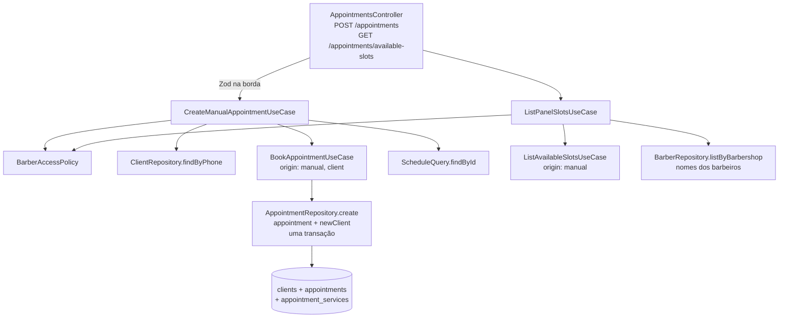

# US-10: Agendamento manual pelo painel — Design

**Spec**: `.specs/features/us-10-agendamento-manual/spec.md`
**Status**: Approved

---

## Architecture Overview

Duas rotas novas num `AppointmentsController`, cada uma com um use case fino que aplica a regra de perfil (`BarberAccessPolicy`) e delega ao motor da US-07. O motor continua único: o agendamento manual chama o `BookAppointmentUseCase` com origem `manual`, e a consulta chama o `ListAvailableSlotsUseCase` com origem `manual`. O cliente novo entra na **mesma transação** do agendamento (abordagem escolhida): o use case resolve o cliente pelo telefone e passa o cliente novo ao `AppointmentRepository.create`, que grava os dois juntos. Se outra requisição gravar o mesmo telefone primeiro, o repositório lança `ClientPhoneTakenError`, e o use case refaz a busca e tenta uma única vez de novo.



Fluxo da criação:

1. Controller valida o body com Zod (`400`) e monta a entrada com a sessão.
2. `access.targetBarber` → `403` (Barbeiro em outro barbeiro ou sem ficha) ou `404` (Dono, barbeiro de fora).
3. `PhoneNumber.create(phone)` → E.164; `clients.findByPhone` → cliente existente (nome mantido) ou `Client.create` novo.
4. `book.execute({ ..., origin: 'manual', client: { client, isNew } })` → recusas do motor (`404`/`400`/`422`/`409`).
5. Se o repositório lançar `ClientPhoneTakenError`, volta ao passo 3 uma única vez.
6. `schedule.findById` → `ScheduleEntry` → `201` pelo `SchedulePresenter.toAppointment`.

---

## Code Reuse Analysis

### Existing Components to Leverage

| Component | Location | How to Use |
| --------- | -------- | ---------- |
| `BookAppointmentUseCase` | `src/usecases/book-appointment/book-appointment.use-case.ts` | Motor único de gravação; ganha o campo opcional `client` |
| `ListAvailableSlotsUseCase` | `src/usecases/list-available-slots/list-available-slots.use-case.ts` | Motor único de consulta, sem mudança; chamado com `origin: 'manual'` |
| `BarberAccessPolicy` | `src/usecases/shared/barber-access-policy.ts` | `targetBarber` na criação; `readScope` na consulta |
| `ScheduleQuery` / `TypeOrmScheduleQuery` | `src/usecases/ports/schedule.query.port.ts`, `src/infrastructure/database/repositories/typeorm-schedule.query.ts` | Ganha `findById`, reusando o SELECT e o mapeamento do item da agenda |
| `SchedulePresenter.toAppointment` + `scheduleAppointmentSchema` | `src/interface-adapters/presenters/schedule.presenter.ts` | Resposta `201` da criação, no formato da US-08 |
| `PhoneNumber` | `src/domain/value-objects/phone-number.ts` | Validação no schema (`isValid`) e normalização E.164 (`create`) |
| `scheduleQuerySchema` / `DATE_MESSAGE` | `src/interface-adapters/controllers/schemas/schedule.query.schema.ts` | Validação de `date` e `barberId` da consulta |
| `ClientEntity` e migration `AddClients` | `src/infrastructure/database/entities/client.entity.ts` | Tabela pronta (US-08): unique `(barbershop_id, phone)` e FK composta; **sem migration nova** |
| `isOverlapViolation` | `src/infrastructure/database/repositories/typeorm-appointment.repository.ts` | Mesmo padrão para detectar a unique de telefone (`23505`) |
| Padrão de módulo | `src/infrastructure/modules/barber-blocks.module.ts` | Mesmo arranjo de imports e factories |

### Integration Points

| System | Integration Method |
| ------ | ------------------ |
| Motor da US-07 | `BookAppointmentUseCase` e `ListAvailableSlotsUseCase`, exportados pelo `SchedulingModule` |
| Agenda da US-08 | `ScheduleQuery.findById` devolve o mesmo `ScheduleEntry`; o agendamento aparece no `GET /appointments` sem mudança |
| Banco | `clients` e `appointments.client_id` já existem; o INSERT do cliente vai na transação do `TypeOrmAppointmentRepository.create` |
| Métricas | `AppointmentMetrics.booked('manual')` e `conflict('manual')` já são chamados pelo motor |

---

## Components

### `Client` (entidade de domínio, nova)

- **Purpose**: Cliente da barbearia identificado pelo telefone (RN-08).
- **Location**: `src/domain/entities/client.ts`
- **Interfaces**:
  - `static create({ id, barbershopId, name, phone: PhoneNumber, now }): Client` — tira os espaços das pontas do nome e lança `InvalidValueError('Informe o nome do cliente, com 2 a 80 caracteres.')` fora de 2 a 80.
  - `static restore(props: ClientProps): Client`
  - getters `id`, `barbershopId`, `name`, `phone` (E.164), `createdAt`
- **Dependencies**: `PhoneNumber`, `InvalidValueError`
- **Reuses**: padrão `create`/`restore` das outras entidades

### `Appointment` (entidade, alterada)

- **Purpose**: Passa a carregar o cliente.
- **Location**: `src/domain/entities/appointment.ts`
- **Interfaces**: `AppointmentProps.clientId: string | null`; `book({ ..., clientId })`; getter `clientId`.
- **Reuses**: entidade da US-07. Chamadas atuais (motor sem cliente, seeds e testes) passam `clientId: null`.

### `ClientPhoneTakenError` (erro de domínio, novo)

- **Purpose**: Sinaliza que outra requisição gravou o mesmo telefone na barbearia entre a busca e o INSERT (RN-08).
- **Location**: `src/domain/errors/client-phone-taken.error.ts`
- **Interfaces**: `code = 'CLIENT_PHONE_TAKEN'`, `rule = 'RN-08'`. Não é mapeado no filtro: o use case sempre o trata.

### `ClientRepository` (port, novo)

- **Purpose**: Lê o cliente da barbearia pelo telefone.
- **Location**: `src/usecases/ports/client.repository.port.ts` (AD-001: compartilhado com a US-14)
- **Interfaces**:
  - `findByPhone(barbershopId: string, phone: string): Promise<Client | null>` — `phone` em E.164.
- **Dependencies**: nenhuma
- **Reuses**: formato dos outros ports (interface + `Symbol` `CLIENT_REPOSITORY`)

### `AppointmentRepository.create` (port, alterado)

- **Interfaces**:
  - `create(appointment: Appointment, newClient?: Client | null): Promise<void>` — na mesma transação, insere `newClient` (se houver) antes do agendamento e grava `client_id`. Lança `ClientPhoneTakenError` quando a unique `clients_barbershop_phone_unique` recusa o cliente, e `AppointmentConflictError('RN-07')` como hoje. Em qualquer erro, nada fica gravado.

### `BookAppointmentUseCase` (motor, alterado)

- **Interfaces**: `BookAppointmentInput.client?: { client: Client; isNew: boolean }`. Sem cliente, grava `clientId: null` (AGD-20 continua valendo). Passa `input.client.isNew ? input.client.client : null` ao `create`.
- **Não muda**: ordem das checagens (AVL-25), antecedência só para `bot`, métricas.

### `CreateManualAppointmentUseCase` (novo)

- **Purpose**: Agendamento manual pelo painel (CA-10.1 a CA-10.5).
- **Location**: `src/usecases/create-manual-appointment/create-manual-appointment.use-case.ts`
- **Interfaces**:
  - `execute(input: BarberAccessRequest & { barberId; serviceIds; startsAt: Date; client: { name; phone } }): Promise<ScheduleEntry>`
- **Dependencies**: `BarberAccessPolicy`, `ClientRepository`, `BookAppointmentUseCase`, `ScheduleQuery`, `IdGenerator`, `Clock`
- **Reuses**: motor, política de acesso, item da agenda
- **Regras**: `targetBarber` antes de qualquer leitura de cliente (AGM-18 sem gravar nada); no máximo uma nova tentativa após `ClientPhoneTakenError` (AGM-09).

### `ListPanelSlotsUseCase` (novo)

- **Purpose**: Horários livres para o painel, com a regra de perfil (AGM-20 a AGM-26).
- **Location**: `src/usecases/list-panel-slots/list-panel-slots.use-case.ts`
- **Interfaces**:
  - `execute(input: BarberAccessRequest & { date; serviceIds; barberId?: string }): Promise<PanelSlots>`
  - `PanelSlots = { date: string; timezone: string; slots: { barber: { id; name }; startsAt: Date; endsAt: Date }[] }`
- **Dependencies**: `BarbershopRepository` (fuso), `BarberAccessPolicy`, `ListAvailableSlotsUseCase`, `BarberRepository`
- **Regras**: `readScope`; Barbeiro com escopo `undefined` (sem ficha) → `ScheduleAccessDeniedError`; escopo `null` (Dono sem filtro) → motor com `barberId: null`. Os nomes vêm de `barbers.listByBarbershop`, numa leitura só.

### `ScheduleQuery.findById` (port e gateway, alterado)

- **Interfaces**: `findById(barbershopId: string, appointmentId: string): Promise<ScheduleEntry | null>`
- **Location**: port em `src/usecases/ports/schedule.query.port.ts`; implementação em `typeorm-schedule.query.ts`, reusando o SELECT base com `a.id = $2 AND a.barbershop_id = $1`.

### `TypeOrmClientRepository` (gateway, novo)

- **Location**: `src/infrastructure/database/repositories/typeorm-client.repository.ts` (AD-002)
- **Interfaces**: `findByPhone` sobre `ClientEntity`, sempre com `barbershopId`.

### Fakes de teste (novos ou alterados)

- `src/usecases/testing/in-memory-client.repository.ts`: guarda clientes, `findByPhone` e `insert` com a unique de telefone por barbearia.
- `InMemoryAppointmentRepository`: recebe o `InMemoryClientRepository` opcional no construtor; `create` checa sobreposição **antes** de inserir o cliente (nada fica gravado em recusa) e lança `ClientPhoneTakenError` se o telefone já existe. Ganha um gancho de teste para simular a corrida (outro cliente gravado entre a busca e o `create`).

### Borda HTTP (nova)

- **Schemas** em `src/interface-adapters/controllers/schemas/`:
  - `service-ids.field.ts`: array de 1 a 10 UUIDs sem repetir, com as mensagens de AGM-16; versão de query que aceita a string separada por vírgula.
  - `create-appointment.schema.ts`: `barberId`, `serviceIds`, `startsAt` (`z.iso.datetime({ offset: true })` + minuto cheio → `Date`), `client.name` (trim, 2 a 80), `client.phone` (`PhoneNumber.isValid`).
  - `available-slots.query.schema.ts`: `date` (mesma regra e mensagem da US-08), `serviceIds` (lista por vírgula), `barberId` opcional.
- **Presenter** `src/interface-adapters/presenters/available-slots.presenter.ts`: `availableSlotsResponseSchema` + `AvailableSlotsPresenter.toResponse`. A criação reusa `scheduleAppointmentSchema` e `SchedulePresenter.toAppointment`.
- **Controller** `src/interface-adapters/controllers/appointments.controller.ts`: `@ApiTags('Agenda')`, `@Controller('appointments')`, `POST` (`201`) e `GET available-slots` (`200`), ambos `@Roles('owner', 'barber')`, com `@ApiOperation`, `@ApiZodResponse` e `@ApiErrorResponse` para cada erro.
- **Módulo** `src/infrastructure/modules/manual-booking.module.ts`: importa `AccountModule`, `BarbersModule`, `SchedulingModule`, `ScheduleModule`; provê `CLIENT_REPOSITORY`, `BarberAccessPolicy`, `CLOCK`, `ID_GENERATOR` e os dois use cases; registrado no `AppModule`.

### `DomainErrorFilter` (alterado)

| Erro | Status |
| ---- | ------ |
| `AppointmentConflictError` | `409` |
| `OutsideOpeningHoursError`, `OutsideWorkingHoursError`, `BarberUnavailableError`, `SlotInPastError` | `422` |
| `ServiceNotPerformedError` | `400` |

`BarberNotFoundError`, `ServiceNotFoundError` (`404`) e `ScheduleAccessDeniedError` (`403`) já estão mapeados.

---

## Data Models

Sem migration: `clients` e `appointments.client_id` vieram da US-08.

```typescript
interface ClientProps {
  id: string;
  barbershopId: string;
  name: string;   // sem espaços nas pontas, 2 a 80
  phone: string;  // E.164, único por barbearia (RN-08)
  createdAt: Date;
}

interface AppointmentProps {
  // ...campos da US-07
  clientId: string | null; // null nos agendamentos do motor sem cliente
}
```

**Relationships**: `appointments.(client_id, barbershop_id)` → `clients.(id, barbershop_id)` (FK composta, RN-26). Um cliente tem muitos agendamentos.

---

## Error Handling Strategy

| Error Scenario | Handling | User Impact |
| -------------- | -------- | ----------- |
| Payload ou query inválidos | `ZodValidationPipe` | `400` com a mensagem de AGM-16/AGM-25 |
| Barbeiro em outro barbeiro ou sem ficha | `ScheduleAccessDeniedError` antes de qualquer gravação | `403` "Acesso negado." |
| Barbeiro ou serviço fora da barbearia ou inativo | Erros do motor | `404` |
| Barbeiro não faz os serviços | `ServiceNotPerformedError` | `400` |
| Horário passado ou violando RN-05 | Erros do motor | `422` com a mensagem da regra |
| Sobreposição (app ou banco) | `AppointmentConflictError`; transação desfeita, cliente novo não fica | `409` |
| Mesmo telefone novo em paralelo | `ClientPhoneTakenError` → nova busca e uma nova tentativa | `201` ligado ao cliente já gravado |
| `ClientPhoneTakenError` na segunda tentativa | Propaga; o filtro responde `500` genérico sem logar dado pessoal | `500` (não deve ocorrer: o cliente já está commitado) |

---

## Risks & Concerns

| Concern | Location (file:line) | Impact | Mitigation |
| ------- | -------------------- | ------ | ---------- |
| `InvalidValueError` não é mapeado e vira `500` de propósito | `src/infrastructure/http/domain-error.filter.spec.ts:163` | Lista de serviços vazia ou repetida, ou horário fora do minuto cheio, que chegue ao motor responde `500` | O schema barra tudo antes (AGM-16), e os testes do schema cobrem cada caso |
| Recusas do motor não estão no filtro | `src/infrastructure/http/domain-error.filter.ts:29-48` | Hoje qualquer recusa vira `500` | Task dedicada ao mapeamento, com teste do filtro para cada erro |
| Mudar `AppointmentProps` afeta seeds e testes | `src/usecases/testing/in-memory-appointment.repository.ts:24`, `test/database/typeorm-appointment.repository.e2e-spec.ts` | Build quebra | A task da entidade atualiza os chamadores no mesmo commit |
| Dois controllers com o prefixo `appointments` | `src/interface-adapters/controllers/schedule.controller.ts:21` | Risco de colisão de rota | Os caminhos não colidem (`GET /appointments` × `GET /appointments/available-slots` × `POST /appointments`); o e2e cobre os três |
| Corrida de telefone depende do bloqueio da unique no Postgres | `src/infrastructure/database/entities/client.entity.ts:8` | Sem o bloqueio, o retry não acharia o cliente | O INSERT concorrente espera o commit do outro e falha com `23505`; e2e com dois pedidos em paralelo (AGM-09) |

---

## Tech Decisions

| Decision | Choice | Rationale |
| -------- | ------ | --------- |
| Cliente novo e agendamento | Mesma transação no `AppointmentRepository.create`, com uma nova tentativa após `ClientPhoneTakenError` | Escolhido pelo usuário; atende AGM-08 e AGM-09 sem criar um port de transação |
| Resposta da criação | Relida por `ScheduleQuery.findById` | Garante o mesmo formato da agenda (AGM-01/AGM-03) sem duplicar o mapeamento |
| Nomes na consulta | `barbers.listByBarbershop` no use case | O motor devolve só `barberId`; não mexer no value object do motor |
| Novo módulo `ManualBookingModule` | Separado do `ScheduleModule` | Mesmo arranjo da US-09; o `ScheduleModule` segue só de leitura |
