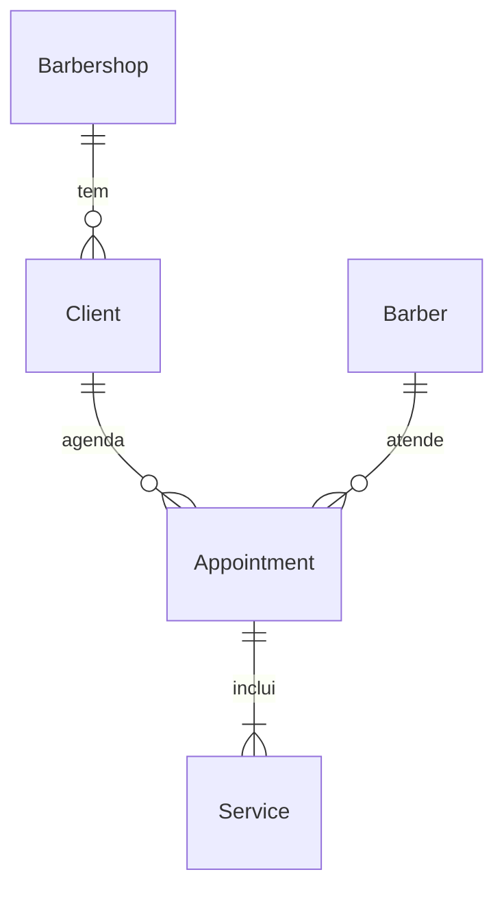

# US-12: Perfil e histórico do cliente

## Problem

O painel grava clientes (US-10) e as faltas deles (US-11), mas não tem como encontrá-los: para saber se um cliente costuma faltar, está bloqueado ou já foi atendido, o Dono precisa percorrer a agenda dia a dia. O número de faltas e o bloqueio só aparecem na resposta de quem acabou de marcar uma falta. O Barbeiro também não tem acesso ao histórico dos clientes que atende. O PRD não traz número de volume nem de suporte, só a história e o RF-30.

Com a entrega, o Dono busca um cliente por nome ou telefone e abre um perfil com os atendimentos passados, os próximos agendamentos, as faltas, o bloqueio, os serviços mais usados e o status do lembrete de retorno. O Barbeiro faz o mesmo, mas só com os clientes e os agendamentos dele.

## Flow

Reaproveita o contador derivado da US-11 (`NoShowLedger.countFor` + `BookingRules.blocksSelfBooking`), o formato de item da agenda da US-08 (`ScheduleEntry` / `scheduleAppointmentSchema`) e o escopo por barbeiro do `BarberAccessPolicy.readScope`. Não cria uma segunda regra de bloqueio nem um segundo formato de agendamento.

1. `GET /clients?q=` -> controller de clientes (new, no door - posição segue as convenções) - valida `q` com Zod e repassa a sessão
2. `BarberAccessPolicy.readScope` (exists) - `null` para o Dono, o id do barbeiro vinculado ao Barbeiro, ou `undefined` para o Barbeiro sem ficha, que recebe a lista vazia
3. `ClientRepository` (exists; ganha a busca) - clientes da barbearia por nome ou dígitos do telefone, limitados ao barbeiro quando houver escopo
4. out: `200 { clients }`
5. `GET /clients/{id}` -> mesmo controller -> `BarberAccessPolicy.readScope` (exists) -> `ClientRepository` (exists) acha o cliente na barbearia; para o Barbeiro, exige ao menos um agendamento dele com o cliente, senão `404`
6. `ScheduleQuery` (exists; ganha a leitura por cliente) - agendamentos do cliente no formato da agenda, limitados ao barbeiro quando houver escopo; deles saem passados, próximos e serviços mais usados
7. `NoShowLedger.countFor` (exists) + `BookingRulesRepository` (exists) - faltas e bloqueio do cliente inteiro, com o limite vigente
8. out: `200` com o perfil; `return_reminder_enabled` (door 1) é lido de `clients`

## Impact

| Front | What changes |
| --- | --- |
| domain | termo novo: `returnReminderEnabled` - o cliente aceitou receber o lembrete de retorno (RN-21); nasce `false` e só a US-25 o altera. Vive em `Client` |
| domain | termo novo: perfil do cliente - leitura que junta cliente, agendamentos, faltas, bloqueio e serviços mais usados; nenhuma regra nova de negócio, só leitura |
| domain | termo existente: `selfBookingBlocked` / `noShowCount` - hoje só a resposta de `PATCH /appointments/{id}/status` (US-11) os devolve; o perfil passa a devolvê-los com a mesma regra, e a resposta da US-11 não muda |
| stored data | `ALTER TABLE clients ADD return_reminder_enabled ... DEFAULT false`: todo cliente existente fica `false`, que é o padrão do CA-25.1; o Postgres 17 adiciona coluna com default constante sem reescrever a tabela. Nada a migrar à mão |
| código existente | os 9 `INSERT INTO clients` dos e2e e o insert de `TypeOrmAppointmentRepository.create` não citam a coluna e continuam válidos por causa do `DEFAULT` |

## Relations

One-way constraints: `Client` ganha o indicador de lembrete de retorno, não nulo e desativado por padrão (door 1). Nenhuma relação nova: o perfil lê as que a US-10 e a US-11 já criaram.

## Surface

| Route | In | Out | Status |
| --- | --- | --- | --- |
| `GET /clients` | `q` (query, opcional) | `clients[]` com `id` · `name` · `phone` | `200`, `400`, `401` |
| `GET /clients/{id}` | `id` (path) | `id` · `name` · `phone` · `noShowCount` · `selfBookingBlocked` · `returnReminderEnabled` · `timezone` · `pastAppointments[]` · `upcomingAppointments[]` · `topServices[]` | `200`, `400`, `401`, `404` |

## Landing

| One-way door | Literal shape | Alternative rejected |
| --- | --- | --- |
| 1. indicador do lembrete de retorno em `clients` | `ALTER TABLE "clients" ADD "return_reminder_enabled" boolean NOT NULL DEFAULT false` | `NOT NULL` sem `DEFAULT` e com backfill, como no AD-008: obrigaria os 9 inserts SQL dos e2e e o insert da US-10 a citar a coluna, e a US-14 a lembrar dela; valor fixo sem coluna (recusado pelo usuário): o campo não refletiria nenhum dado gravado |
| 2. contrato de `GET /clients/{id}` | chaves `noShowCount` e `selfBookingBlocked` com os nomes e o significado da resposta da US-11; `pastAppointments` e `upcomingAppointments` no formato de `scheduleAppointmentSchema`; `topServices[]` com `{ id, name, count }` | um formato próprio de agendamento para o perfil: duas representações do mesmo agendamento divergiriam no primeiro campo novo da agenda |
| 3. cliente fora do alcance do Barbeiro | `404 "Cliente não encontrado."`, a mesma resposta de um id que não existe | `403 "Acesso negado."`: confirmaria ao Barbeiro que aquele id é um cliente da barbearia |

- Nothing else in this change is hard to reverse

## Criteria

### S1: Buscar clientes (P1)

O Dono encontra um cliente da barbearia pelo nome ou pelo telefone (CA-12.1, RF-30).

**Acceptance Criteria**

1. WHEN o Dono chama `GET /clients?q=<termo>` THEN o sistema SHALL responder `200` com os clientes da barbearia cujo nome contém o termo, sem diferenciar maiúsculas de minúsculas
2. WHEN o termo tem 4 ou mais dígitos THEN o sistema SHALL incluir também os clientes cujo telefone em E.164 contém esses dígitos na ordem em que aparecem, ignorando os outros caracteres do termo (ex.: `(11) 98765` acha `+5511987654321`)
3. WHEN `q` é omitido THEN o sistema SHALL responder `200` com os clientes da barbearia sem filtro de texto
4. The sistema SHALL devolver a lista ordenada por nome, sem diferenciar maiúsculas de minúsculas, e depois por id, com no máximo 50 clientes, cada um com `id`, `name` e `phone`
5. IF nenhum cliente corresponde ao termo THEN o sistema SHALL responder `200` com `clients: []`
6. IF `q`, depois de tirar os espaços das pontas, tem menos de 2 ou mais de 80 caracteres THEN o sistema SHALL responder `400` com "Informe de 2 a 80 caracteres para buscar."
7. The sistema SHALL tratar `%` e `_` do termo como texto literal, e não como curinga
8. The busca SHALL incluir só clientes da barbearia da sessão (RN-26)

**Independent test:** e2e com João Silva (+5511987654321) e Maria (+5521912345678): `q=joão` e `q=98765` acham só João; sem `q` vêm os dois, Maria depois de João; `q=%` não acha ninguém.

### S2: Ver o perfil do cliente (P1)

O Dono abre o perfil e vê o histórico, as faltas, o bloqueio, os serviços mais usados e o lembrete de retorno (CA-12.2, RF-30).

**Acceptance Criteria**

9. WHEN o Dono chama `GET /clients/{id}` de um cliente da barbearia THEN o sistema SHALL responder `200` com `id`, `name`, `phone`, `noShowCount`, `selfBookingBlocked`, `returnReminderEnabled`, `timezone` (fuso da barbearia), `pastAppointments`, `upcomingAppointments` e `topServices`
10. The sistema SHALL preencher `pastAppointments` com os agendamentos do cliente cujo início é menor ou igual a agora, em qualquer status, do início mais recente ao mais antigo, no formato do item da agenda da US-08
11. The sistema SHALL preencher `upcomingAppointments` com os agendamentos do cliente cujo início é maior que agora, do mais próximo ao mais distante, no formato do item da agenda da US-08
12. The sistema SHALL preencher `topServices` com até 3 serviços dos agendamentos `attended` do cliente, cada um com `id`, `name` e `count` (quantos agendamentos `attended` o incluem), por `count` decrescente e depois por nome
13. The sistema SHALL devolver em `noShowCount` e `selfBookingBlocked` os mesmos valores que a marcação de atendimento da US-11 devolveria para o cliente naquele momento: faltas desde o último reset e bloqueio quando elas atingem o `noShowLimit` vigente
14. The sistema SHALL devolver em `returnReminderEnabled` o valor gravado do cliente, que é `false` para todo cliente existente e para todo cliente criado pela US-10
15. IF o cliente não tem agendamentos THEN o sistema SHALL responder `200` com `pastAppointments: []`, `upcomingAppointments: []`, `topServices: []`, `noShowCount: 0` e `selfBookingBlocked: false`
16. IF o `id` da rota não é UUID THEN o sistema SHALL responder `400` com "Informe um id de cliente válido."
17. IF o cliente não existe na barbearia da sessão THEN o sistema SHALL responder `404` com "Cliente não encontrado." (RN-26)

**Independent test:** e2e: agora 2026-10-10T15:00Z; João com 2 cortes `attended`, 1 barba `attended`, 1 `no_show` e 1 agendamento em 2026-10-12, limite 2 → `pastAppointments` com 4 itens do mais recente ao mais antigo, `upcomingAppointments` com 1, `topServices` = Corte (2), Barba (1), `noShowCount: 1`, `selfBookingBlocked: false`, `returnReminderEnabled: false`.

### S3: Barbeiro só vê os próprios clientes (P1)

O Barbeiro busca e abre só clientes que atendeu ou vai atender, e vê só os agendamentos dele (CA-12.3, seção 5).

**Acceptance Criteria**

18. WHEN um Barbeiro chama `GET /clients` THEN o sistema SHALL incluir só clientes com pelo menos um agendamento, em qualquer status, do barbeiro vinculado a ele
19. WHEN um Barbeiro abre o perfil de um cliente com agendamento dele THEN o sistema SHALL preencher `pastAppointments`, `upcomingAppointments` e `topServices` só com agendamentos do barbeiro vinculado a ele
20. WHEN um Barbeiro abre o perfil de um cliente com agendamento dele THEN o sistema SHALL devolver `noShowCount` e `selfBookingBlocked` do cliente inteiro, contando faltas com qualquer barbeiro
21. IF um Barbeiro abre o perfil de um cliente da barbearia sem agendamento dele THEN o sistema SHALL responder `404` com "Cliente não encontrado."
22. IF o Barbeiro não tem ficha de barbeiro vinculada THEN o sistema SHALL responder `200` com `clients: []` na busca e `404` com "Cliente não encontrado." no perfil
23. IF a requisição não tem sessão válida THEN as duas rotas SHALL responder `401`
24. The sistema SHALL documentar as duas rotas no Swagger com resumo citando a US-12, parâmetros, resposta `200`, os erros de cada rota e os perfis Dono e Barbeiro

**Independent test:** e2e: João tem um agendamento com Ana e uma falta com Bruno; Ana (Barbeiro) busca e acha João, abre o perfil e vê só o agendamento dela com `noShowCount: 1`; Maria só tem agendamento com Bruno → Ana recebe `404` no perfil de Maria e não a acha na busca.

## Out of scope

| Excluded | Why |
| --- | --- |
| Tela de Clientes | Só API, como nas US-01 a US-11 |
| Editar ou excluir cliente | Nenhum RF pede; exclusão a pedido do titular está em aberto (PRD seção 19) |
| Desbloquear cliente pelo perfil | US-22 (RF-31, RN-14) |
| Ativar ou desativar o lembrete de retorno | US-25 (RN-21, CA-25.5) |
| Paginação da busca e do histórico | Nenhuma lista do painel pagina; a busca devolve no máximo 50 |
| Busca que ignora acentos | Exigiria a extensão `unaccent`, uma dependência nova sem RF |

## Assumptions

| Assumption | Chosen default | Rationale | Confirmed? |
| --- | --- | --- | --- |
| Alcance do Barbeiro | Só clientes com agendamento dele; fora disso, `404`; faltas e bloqueio do cliente inteiro | Decidido pelo usuário | y |
| Lembrete de retorno antes da US-25 | Coluna `return_reminder_enabled` agora, `false` por padrão | Decidido pelo usuário; mínimo estrutural (PRD seção 0) | y |
| Acentos na busca | A busca diferencia acentos: `joao` não acha `João` | Sem `unaccent` no banco; ver Out of scope | n |
| Dígitos mínimos para buscar por telefone | 4 | Menos que isso casa com quase todo DDD e prefixo | n |
| Teto da busca | 50 clientes, sem paginação e sem total | Mesmo padrão das listas existentes; o termo refina | n |
| O que é "atendimento passado" | Todo agendamento com início ≤ agora, em qualquer status (`attended`, `no_show` ou `confirmed` não marcado) | O Dono vê as faltas no histórico e o que ficou sem marcar; `≤` segue a US-11, que libera a marcação em `agora = startsAt` | n |
| Histórico sem limite | `pastAppointments` traz todos os agendamentos passados | Volume por cliente é pequeno; paginação está fora do escopo | n |
| Serviços mais usados | Até 3, contados só nos agendamentos `attended` | Falta e agendamento futuro não são serviço usado | n |

**Open questions:** none - all resolved or logged above.

## Observable

| Surface | Decision | Landing |
| --- | --- | --- |
| API `GET /clients` | response shape | AC 4 |
| API `GET /clients` | error shape and codes | AC 6, AC 23 |
| API `GET /clients` | who may call it | AC 18, AC 22 |
| API `GET /clients/{id}` | response shape | AC 9 |
| API `GET /clients/{id}` | error shape and codes | AC 16, AC 17, AC 21, AC 23 |
| API `GET /clients/{id}` | who may call it | AC 19, AC 21 |
| all new `GET /clients*` | versioning | n/a - nenhuma rota do painel é versionada e o único consumidor é o painel |
| all new `GET /clients*` | rate limits | n/a - nenhuma rota do painel tem limite e nenhum RNF pede |
| all new `GET /clients*` | documentation | AC 24 |
| collection resultado da busca | ordering | AC 4 |
| collection resultado da busca | empty state | AC 5 |
| collection resultado da busca | duplicates | existing - `clients_barbershop_phone_unique` impede dois clientes com o mesmo telefone na barbearia |
| collection resultado da busca | grouping | n/a - lista simples, sem agrupamento |
| collection resultado da busca | the exception that does not fit | AC 7 (curingas do `ILIKE`) |
| collection histórico do perfil | ordering | AC 10, AC 11, AC 12 |
| collection histórico do perfil | empty state | AC 15 |
| screen Clientes | empty, loading, error and unauthorised states | n/a - só API, sem tela (Out of scope) |

## Sources

- [docs/PRD.md](../../../docs/PRD.md) US-12 (CA-12.1 a CA-12.3), RF-30 e seção 5 - o que o perfil mostra e o alcance do Barbeiro
- [docs/PRD.md](../../../docs/PRD.md) US-25, CA-25.1 - o lembrete de retorno nasce desativado
