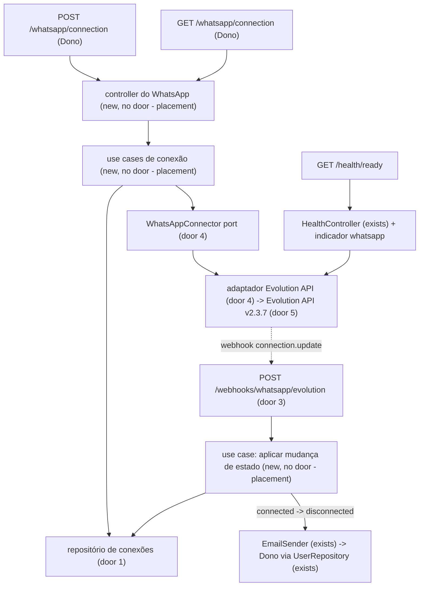
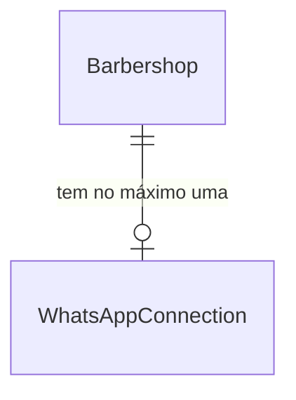

# US-13: Conexão do WhatsApp da barbearia

## Problem

O bot ainda não tem por onde atender: nenhuma barbearia consegue ligar o número de WhatsApp dela à plataforma, e todas as histórias do canal (US-14 a US-19) dependem disso. Quando o número estiver ligado, uma queda deixa o bot mudo sem que o Dono perceba. O cliente manda mensagem e fica sem resposta até alguém notar por acaso. O PRD põe a desconexão do conector não oficial entre os riscos de impacto alto e probabilidade média (seção 17), mas não traz números de volume nem de suporte.

Com a entrega, o Dono gera um QR code no painel e o lê no WhatsApp Business do celular. Depois disso, vê se o número está conectado ou desconectado e, se a conexão cair, recebe um e-mail e um aviso no painel. O celular continua funcionando como antes.

## Flow

Reaproveita o `EmailSender` (US-02) para o alerta, o `UserRepository.listByBarbershop` para achar o Dono, o `SessionGuard` com o padrão só-Dono (AD-007) e o `HealthController` para o indicador de prontidão. Nenhum código fora do adaptador conhece a Evolution API.

1. `POST /whatsapp/connection`: o controller passa a sessão ao use case, que garante a instância da barbearia no conector (nome = `barbershopId`, door 2), pede o QR code, grava `connecting` e devolve o QR. O QR não é gravado.
2. `GET /whatsapp/connection`: o use case pergunta o estado atual ao conector e aplica a mesma transição do webhook. Se o conector não responder, devolve o que está gravado.
3. `POST /webhooks/whatsapp/evolution`: o adaptador valida o segredo e o payload com Zod, traduz `connection.update` para o evento neutro `open` / `connecting` / `close` e entrega ao use case de transição. Os outros eventos são ignorados.
4. Transição `connected -> disconnected`: um `UPDATE` condicional grava a queda. Só quem mudou a linha envia o e-mail aos Donos, e o `GET` passa a devolver `disconnectedAt` como aviso para o painel.

## Impact

| Front | What changes |
| --- | --- |
| domain | termo novo: conexão do WhatsApp - estado do número da barbearia no conector (`disconnected`, `connecting`, `connected`), com o momento da última queda; vive em uma entidade de domínio própria |
| domain | termo novo: queda - passagem de `connected` para `disconnected`. É o único evento que alerta o Dono; um QR que expira sem leitura não é queda |
| stored data | tabela nova, vazia; nenhuma barbearia existente ganha linha até o Dono pedir a conexão. Nada a migrar |
| infraestrutura | serviço novo `evolution-api` no `docker-compose` (perfil `whatsapp`, imagem `evoapicloud/evolution-api:v2.3.7`), usando o Postgres do compose com um banco próprio |
| configuração | 4 variáveis novas obrigatórias no `env.schema.ts` e no `.env.example`: `EVOLUTION_API_URL`, `EVOLUTION_API_KEY`, `WHATSAPP_WEBHOOK_URL`, `WHATSAPP_WEBHOOK_SECRET`. A aplicação deixa de subir sem elas |
| observabilidade | `GET /health/ready` ganha o indicador `whatsapp`: com a Evolution API fora, a API inteira responde `503` no ready, como pede o CLAUDE.md para integrações críticas |
| código existente | `test/app.e2e-spec.ts` passa a trocar o `WhatsAppConnector` por um fake, porque o `/health/ready` o chama; os outros e2e sobem o adaptador real, mas nenhum deles chama o conector. O `AccountModule` passa a exportar o `EMAIL_SENDER`, reaproveitado no alerta, e o `validEnv` de `env.schema.spec.ts` ganha as 4 variáveis novas |

## Relations

One-way constraints: uma conexão por barbearia, com o id da barbearia como chave (door 1); estado não nulo, restrito a `disconnected`, `connecting` e `connected` (door 1). No columns and no types here.

## Surface

| Route | In | Out | Status |
| --- | --- | --- | --- |
| `POST /whatsapp/connection` | nada | `status` (`connecting`) · `qrCode` (data URL PNG) | `200`, `401`, `403`, `409`, `502` |
| `GET /whatsapp/connection` | nada | `status` · `disconnectedAt` | `200`, `401`, `403` |
| `POST /webhooks/whatsapp/evolution` | header `authorization`, corpo do webhook da Evolution | vazio | `204`, `400`, `401` |

## Landing

| One-way door | Literal shape | Alternative rejected |
| --- | --- | --- |
| 1. tabela de conexões | `whatsapp_connections (barbershop_id uuid PRIMARY KEY REFERENCES barbershops(id) ON DELETE CASCADE, status text NOT NULL CHECK (status IN ('disconnected','connecting','connected')), disconnected_at timestamptz NULL, updated_at timestamptz NOT NULL)` | colunas em `barbershops`: o webhook grava estado a toda hora e colidiria com `saveSettings` (US-03), o mesmo motivo do AD-008 |
| 2. nome da instância no conector | `instanceName = barbershopId` (UUID); o webhook resolve o tenant pelo campo `instance` | nome aleatório gravado na tabela: mais uma coluna e uma consulta sem tenant para achar a barbearia pelo nome, sem ganho, já que a Evolution é nossa (self-hosted) |
| 3. contrato do webhook | `POST /webhooks/whatsapp/evolution`, `@Public()`, header `authorization: Bearer <WHATSAPP_WEBHOOK_SECRET>` comparado em tempo constante; a instância é criada com `webhook: { enabled: true, url: WHATSAPP_WEBHOOK_URL, byEvents: false, events: ['CONNECTION_UPDATE'], headers: { authorization: 'Bearer …' } }` | conferir o `apikey` do corpo: é o token da instância, que teríamos de guardar por barbearia; webhook global por variável da Evolution: prende a configuração ao deploy da Evolution, fora do código |
| 4. port de mensageria | `WhatsAppConnector` em `src/usecases/ports/` com `ensureInstance(barbershopId)`, `requestQrCode(barbershopId)` e `getState(barbershopId)`, que devolvem só tipos neutros (`'open' \| 'connecting' \| 'close'`); o adaptador fica em `src/infrastructure/external/whatsapp/evolution/` com o controller do webhook. A US-14 acrescenta envio e recebimento de mensagens a esse mesmo port | um port por capacidade (conexão, envio, recebimento): três contratos para um único fornecedor, que trocamos inteiro na fase 2 (RNF-05) |
| 5. dependência nova | Evolution API `v2.3.7` (imagem fixa, sem `latest`), acessada por `fetch` nativo do Node 24 com o header `apikey: EVOLUTION_API_KEY`. Nenhum pacote npm novo | SDK não oficial (`evolution-api-sdk`): mais uma dependência de terceiro para 3 chamadas HTTP; Z-API: recusado pelo usuário |
| 6. alerta único por queda | `UPDATE whatsapp_connections SET status='disconnected', disconnected_at=$now WHERE barbershop_id=$1 AND status='connected' RETURNING barbershop_id`; o e-mail sai só quando a linha voltou | ler e depois gravar: dois webhooks `close` simultâneos, ou um webhook e um `GET`, mandariam dois e-mails |
| 7. verificação de prontidão no port | `WhatsAppConnector.ping(): Promise<void>`, que rejeita quando a Evolution não responde; o indicador `whatsapp` do `/health/ready` usa o port, não o adaptador | indicador chamando o adaptador direto: o e2e do ready não conseguiria trocá-lo pelo fake e dependeria de uma Evolution no ar |

- Nothing else in this change is hard to reverse

## Criteria

### S1: Conectar o número pelo QR code (P1)

O Dono pede a conexão e recebe um QR code para ler no WhatsApp Business (CA-13.1, RF-36).

**Acceptance Criteria**

1. WHEN o Dono chama `POST /whatsapp/connection` e a barbearia não está `connected` THEN o sistema SHALL responder `200` com `status: "connecting"` e `qrCode` começando por `data:image/png;base64,`
2. WHEN a barbearia ainda não tem instância no conector THEN o sistema SHALL criá-la com `instanceName` igual ao `barbershopId`, integração `WHATSAPP-BAILEYS` e o webhook do door 3, antes de pedir o QR code
3. WHEN a barbearia já tem instância no conector THEN o sistema SHALL pedir um QR code novo sem criar outra instância, de modo que chamar de novo a rota devolva um QR atualizado
4. WHEN o QR code é emitido THEN o sistema SHALL gravar a conexão da barbearia com `status = connecting`, sem gravar o QR code
5. IF a barbearia está `connected` THEN o sistema SHALL responder `409` com "O WhatsApp já está conectado."
6. IF o conector não responde em 10 segundos, responde com erro ou não devolve QR code THEN o sistema SHALL responder `502` com "Não foi possível falar com o WhatsApp. Tente de novo em instantes." e não alterar o estado gravado
7. The sistema SHALL criar a instância com `alwaysOnline: false` e `readMessages: false`, para que o celular do Dono continue recebendo notificações e vendo as mensagens como não lidas (CA-13.4)

**Independent test:** e2e com o conector fake: `POST` numa barbearia nova → `200` com QR e `GET` → `connecting`; o fake passa a responder erro → `502` e o estado continua `connecting`.

### S2: Ver o status da conexão (P1)

O painel mostra se o número está conectado ou desconectado (CA-13.2, RF-36).

**Acceptance Criteria**

8. WHEN o Dono chama `GET /whatsapp/connection` THEN o sistema SHALL responder `200` com `status` (`connected`, `connecting` ou `disconnected`) e `disconnectedAt` (ISO 8601 em UTC ou `null`)
9. IF a barbearia nunca pediu a conexão THEN o sistema SHALL responder `200` com `status: "disconnected"` e `disconnectedAt: null`, sem chamar o conector
10. WHEN o conector informa `open` THEN o sistema SHALL gravar e devolver `connected` e zerar `disconnectedAt`
11. WHEN o conector informa `close` para uma conexão `connecting` THEN o sistema SHALL gravar e devolver `disconnected` com `disconnectedAt` inalterado e sem alertar, porque um QR que expira sem leitura não é queda
12. WHEN o conector informa `connecting` para uma conexão `connected` THEN o sistema SHALL manter `connected`, porque a Evolution reconecta sozinha as quedas transitórias
13. IF o conector não responde no `GET` THEN o sistema SHALL responder `200` com o estado gravado
14. IF o conector não tem instância para a barbearia THEN o sistema SHALL tratar o estado como `close`

**Independent test:** e2e: o fake devolve `open` → `GET` mostra `connected`; o fake para de responder → `GET` ainda mostra `connected`.

### S3: Alertar o Dono quando a conexão cai (P1)

Uma queda vira e-mail e aviso no painel (CA-13.3, RNF-07).

**Acceptance Criteria**

15. WHEN a conexão passa de `connected` para `disconnected`, pelo webhook ou pelo `GET`, THEN o sistema SHALL gravar `disconnectedAt` com o horário atual e enviar um e-mail a cada Dono da barbearia com o assunto "O WhatsApp da barbearia desconectou"
16. The e-mail SHALL informar o nome da barbearia, o horário da queda no fuso da barbearia (`dd/MM/yyyy HH:mm`) e o link `${APP_WEB_URL}/configuracoes/whatsapp` para conectar de novo
17. WHILE a conexão está `disconnected` com `disconnectedAt` preenchido, o `GET /whatsapp/connection` SHALL devolver esse `disconnectedAt`, que é o aviso do painel, até a conexão voltar a `connected`
18. IF duas notificações de queda chegam para a mesma barbearia ao mesmo tempo THEN o sistema SHALL enviar um único e-mail (door 6)
19. IF uma notificação `close` chega para uma conexão que já está `disconnected` THEN o sistema SHALL não enviar e-mail nem alterar `disconnectedAt`
20. IF o envio do e-mail falha THEN o sistema SHALL manter a queda gravada e logar o erro sem o endereço de e-mail

**Independent test:** e2e: conexão `connected`, dois webhooks `close` em paralelo → um único e-mail no fake e `GET` com `disconnectedAt`; um webhook `open` → `connected` com `disconnectedAt: null`.

### S4: Receber o webhook da Evolution (P1)

A Evolution avisa as mudanças de estado, e só ela consegue fazer isso (CA-13.3, RNF-07).

**Acceptance Criteria**

21. WHEN chega `POST /webhooks/whatsapp/evolution` com o segredo correto e `event: "connection.update"` THEN o sistema SHALL aplicar `data.state` (`open`, `connecting` ou `close`) à conexão da barbearia cujo id é `instance`, pelas regras dos AC 10 a 12 e 15, e responder `204`
22. IF o header `authorization` falta ou não é `Bearer <WHATSAPP_WEBHOOK_SECRET>` THEN o sistema SHALL responder `401` sem ler o corpo
23. IF o corpo não tem `event` e `instance` em texto THEN o sistema SHALL responder `400`
24. IF o evento não é `connection.update`, o `data.state` não é `open`, `connecting`, `close` nem `refused`, ou a barbearia de `instance` não tem conexão gravada THEN o sistema SHALL responder `204` sem alterar nada
25. WHEN o `data.state` é `refused` (a Evolution desistiu de emitir QR codes) THEN o sistema SHALL tratá-lo como `close`
26. The sistema SHALL não logar o corpo do webhook nem o header `authorization`

**Independent test:** e2e: webhook sem segredo → `401`; com segredo e `connection.update` `open` → `204` e `GET` mostra `connected`; `messages.upsert` → `204` e nada muda.

### S5: Isolamento do fornecedor, permissões e operação (P1)

O código do bot só conhece a interface interna, e só o Dono mexe na conexão (CA-13.5, RNF-05, RNF-07, seção 5).

**Acceptance Criteria**

27. The sistema SHALL restringir as importações do adaptador da Evolution a `src/infrastructure/`: nenhum arquivo de `domain/`, `usecases/` ou `interface-adapters/` importa algo de `infrastructure/external/whatsapp/`
28. IF um Barbeiro chama `POST` ou `GET /whatsapp/connection` THEN o sistema SHALL responder `403` com "Acesso negado."
29. IF a requisição às duas rotas do painel não tem sessão válida THEN o sistema SHALL responder `401`
30. The sistema SHALL ler e gravar a conexão só pelo `barbershopId` da sessão ou, no webhook, pelo `instance` (door 2) (RN-26)
31. WHEN a Evolution API não responde THEN `GET /health/ready` SHALL responder `503` com o indicador `whatsapp` em `down`
32. The sistema SHALL contar as quedas na métrica `whatsapp_disconnections_total` e as chamadas ao conector que falham em `whatsapp_connector_errors_total{operation}`, sem label de barbearia
33. The sistema SHALL documentar as três rotas no Swagger com resumo citando a US-13, a resposta de sucesso e os erros de cada rota

**Independent test:** `npm run lint` com uma importação proibida falha; e2e com sessão de Barbeiro → `403`; `/health/ready` com o conector fake fora → `503`.

## Out of scope

| Excluded | Why |
| --- | --- |
| Tela de Configurações > Conexão WhatsApp | Só API, como nas US-01 a US-12 |
| Enviar e receber mensagens | US-14 em diante; aqui só nasce o port que elas vão estender |
| Desconectar o número pelo painel (logout) | Nenhum CA pede |
| Mostrar o número ou o nome do perfil conectado | Nenhum CA pede |
| Conectar por código de pareamento (sem QR) | CA-13.1 pede QR code |
| Rotina periódica que confere o estado de todas as barbearias | Webhook + conferência no `GET` cobrem o CA-13.3; ver Assumptions |
| QR code em tempo real por push (SSE/WebSocket) | O painel pede um QR novo chamando o `POST` de novo (AC 3) |

## Assumptions

| Assumption | Chosen default | Rationale | Confirmed? |
| --- | --- | --- | --- |
| Fornecedor | Evolution API self-hosted, `v2.3.7` | Decidido pelo usuário | y |
| Como a queda é detectada | Webhook `connection.update` + conferência ao vivo em todo `GET`; sem job periódico | A Evolution reconecta sozinha as quedas transitórias e só avisa `close` quando desiste (logout, sessão inválida). Um job acharia `close` no meio de uma reconexão e alertaria à toa. Custo: se o webhook se perder e ninguém abrir o painel, o e-mail não sai | n |
| Quem recebe o e-mail | Todo usuário `owner` da barbearia | É o Dono quem reconecta; a seção 5 não dá Configurações ao Barbeiro | n |
| Aviso no painel | Campo `disconnectedAt` no `GET`, preenchido só depois de uma queda | Sem tela nesta história; o painel mostra o aviso quando o campo vem preenchido | n |
| Timeout do conector | 10 s por chamada, padrão configurável `EVOLUTION_TIMEOUT_MS` | O `POST` espera a Evolution gerar o QR (ela aguarda 2 s internamente) | n |
| Evolution fora derruba o ready | `503` no `/health/ready` | Regra do CLAUDE.md para integrações críticas; o trade-off (painel fora do balanceador junto com a Evolution) fica registrado | n |
| Texto do e-mail | Assunto "O WhatsApp da barbearia desconectou"; corpo com o nome da barbearia, o horário no fuso dela e o link | O PRD não dá o texto (L-007) | n |
| Mensagem do `502` | "Não foi possível falar com o WhatsApp. Tente de novo em instantes." | O PRD não dá o texto (L-007) | n |
| Mensagem do `409` | "O WhatsApp já está conectado." | O PRD não dá o texto (L-007) | n |
| CA-13.4 (celular continua funcionando) | Provado pela configuração da instância (AC 7) e por um roteiro manual com um número real antes do go-live | O WhatsApp real não entra em teste automatizado; a Evolution conecta como aparelho vinculado, que não desliga o celular | n |

**Open questions:**

| # | Kind | Question | Until answered |
| --- | --- | --- | --- |
| 1 | blocks go-live | Onde a Evolution API roda em produção, com qual URL pública para o webhook e com qual chave | Nenhuma barbearia real conecta; local e e2e usam o compose e o fake |

## Observable

| Surface | Decision | Landing |
| --- | --- | --- |
| API `POST /whatsapp/connection` | response shape | AC 1 |
| API `POST /whatsapp/connection` | error shape and codes | AC 5, AC 6, AC 28, AC 29 |
| API `POST /whatsapp/connection` | who may call it | AC 28 |
| API `GET /whatsapp/connection` | response shape | AC 8 |
| API `GET /whatsapp/connection` | error shape and codes | AC 13, AC 28, AC 29 |
| API `GET /whatsapp/connection` | who may call it | AC 28 |
| webhook `POST /webhooks/whatsapp/evolution` | response shape | AC 21 |
| webhook `POST /webhooks/whatsapp/evolution` | error shape and codes | AC 22, AC 23, AC 24, AC 25 |
| webhook `POST /webhooks/whatsapp/evolution` | who may call it | AC 22 |
| webhook `POST /webhooks/whatsapp/evolution` | rate limit | n/a - só a Evolution, autenticada pelo segredo, chama a rota; nenhum RNF pede limite |
| all new routes | versioning | n/a - nenhuma rota é versionada; o webhook segue o formato da Evolution fixada no door 5 |
| all new `/whatsapp/connection` | rate limits | n/a - nenhuma rota do painel tem limite e nenhum RNF pede |
| all new routes | documentation | AC 33 |
| document e-mail de queda | structure, tone and next step | AC 15, AC 16 |
| screen Configurações > Conexão WhatsApp | empty, loading, error and unauthorised states | n/a - só API, sem tela (Out of scope); o estado vazio da API é o AC 9 |

## Sources

- [docs/PRD.md](../../../docs/PRD.md) US-13 (CA-13.1 a CA-13.5), RF-36, RNF-05, RNF-07 e seções 16 e 17
- Evolution API `2.3.7`, código-fonte (`webhook.controller.ts`, `whatsapp.baileys.service.ts`, `instance.controller.ts`): o evento chega como `connection.update`, os estados são `open`, `connecting`, `close` e `refused`, e as quedas transitórias são reconectadas sem webhook `close`
