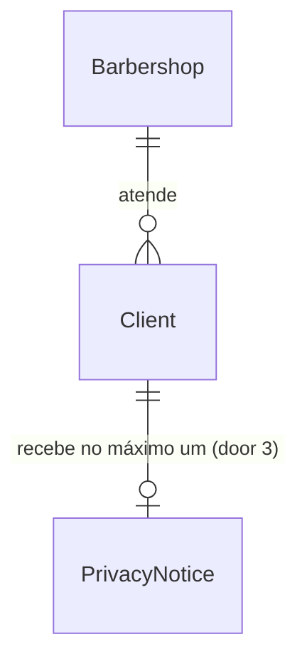

# US-14: Primeiro contato do cliente e aviso de privacidade

## Problem

O número da barbearia já está ligado à plataforma (US-13), mas uma mensagem de cliente não produz nada: a Evolution só avisa mudanças de conexão, e o cliente que escreve não vira cadastro nem fica sabendo que vai falar com uma IA. A LGPD e a decisão D-18 pedem que o cliente seja informado, já no primeiro contato, de que o atendimento é automatizado, de como os dados dele são usados e de onde está a política de privacidade (RN-20). Sem cadastro, as histórias seguintes do bot (US-15 a US-19) não têm a quem associar a conversa (RN-08). O PRD não traz números de volume.

Com a entrega, quem escreve pela primeira vez para o WhatsApp da barbearia ganha um cadastro com o telefone e o nome do perfil e recebe um único aviso de privacidade. Quem já recebeu o aviso não o recebe de novo.

## Flow

Reaproveita o webhook, o guard e o port `WhatsAppConnector` da US-13 (AD-011), o `ClientRepository` e a unicidade `(barbershop_id, phone)` da US-10, o `PhoneNumber` para o telefone E.164 e o `BarbershopRepository.findById` para o nome da barbearia no aviso.

1. `POST /webhooks/whatsapp/evolution` com `event: "messages.upsert"` -> `EvolutionWebhookController` (exists) - o guard confere o segredo; o controller descarta mensagens que não são de um cliente (enviadas pelo próprio número, de grupo, de lista de transmissão, sem telefone ou antigas, door 5), converte o JID em telefone E.164 (door 4) e entrega `{ barbershopId, phone, profileName }` ao use case. Nenhum conteúdo de mensagem atravessa essa fronteira nesta história
2. use case de mensagem recebida (new, no door - placement) - confere que a barbearia tem conexão gravada; busca o cliente pelo telefone e, se não existe, cria com o nome do perfil (door 2)
3. mesmo use case - reivindica o aviso com um `UPDATE` condicional (door 3); só quem reivindicou monta o texto com o nome da barbearia e `PRIVACY_POLICY_URL`
4. out: `WhatsAppConnector.sendText` (door 1) -> adaptador Evolution (exists) -> `POST /message/sendText/{barbershopId}`; se o envio falha, a reivindicação é desfeita e o webhook responde `204` do mesmo jeito

## Impact

| Front | What changes |
| --- | --- |
| domain | termo novo: aviso de privacidade - a mensagem do RN-20, enviada no máximo uma vez por cliente; vive no registro do cliente como o instante do envio, reivindicado e desfeito pelo `ClientRepository` (door 3). A entidade `Client` não muda, porque nenhum outro fluxo lê o instante |
| domain | termo existente: cliente - antes só nascia no agendamento manual (US-10); agora nasce também na primeira mensagem pelo WhatsApp, com o nome do perfil. Quem usa o cliente hoje (agenda US-08, busca e perfil US-12, faltas US-11) lê o mesmo registro e não muda |
| stored data | coluna nova em `clients`, nula para todos os clientes existentes: todos foram criados no painel e nunca receberam o aviso, então recebem na primeira mensagem que mandarem. Nada a migrar |
| webhook existente | `POST /webhooks/whatsapp/evolution` passa a tratar `messages.upsert`; entrada, saída e status não mudam. A descrição no Swagger é atualizada |
| instâncias existentes na Evolution | as instâncias criadas pela US-13 só assinam `CONNECTION_UPDATE`. O `ensureInstance` passa a regravar o webhook com os dois eventos também quando a instância já existe, então uma barbearia já conectada só recebe mensagens depois que o Dono chama `POST /whatsapp/connection` de novo. Não há barbearia real conectada (a US-13 está bloqueada para go-live) |
| configuração | variável nova obrigatória `PRIVACY_POLICY_URL` no `env.schema.ts` e no `.env.example`; a aplicação deixa de subir sem ela |
| código existente | o `FakeWhatsAppConnector` e os fakes do `ClientRepository` ganham os métodos novos; o `validEnv` de `env.schema.spec.ts` ganha a variável |

## Relations

One-way constraints: um cliente por `(barbearia, telefone)`, a unicidade que já existe desde a US-10 e agora decide o cadastro concorrente (door 2); o aviso é um instante no próprio cliente, nulo até o envio (door 3). No columns and no types here.

## Surface

None - o único consumidor externo é a Evolution, pela rota do webhook que já existe; entrada, saída e status continuam os da US-13.

## Landing

| One-way door | Literal shape | Alternative rejected |
| --- | --- | --- |
| 1. envio no port de mensageria | `WhatsAppConnector.sendText(barbershopId: string, phone: string /* E.164 */, text: string): Promise<void>`, que rejeita com `WhatsAppConnectorUnavailableError`; o adaptador chama `POST /message/sendText/{barbershopId}` com `{ number: phone sem '+', text }`. A instância assina `events: ['CONNECTION_UPDATE', 'MESSAGES_UPSERT']`, e o `ensureInstance` regrava isso com `POST /webhook/set/{barbershopId}` quando a instância já existe | port separado para envio: o AD-011 fixa um port só para o fornecedor inteiro; mandar o JID recebido em vez do telefone: tipo do fornecedor vazando para o use case (RNF-05) |
| 2. cadastro concorrente do cliente | `INSERT INTO clients (...) VALUES (...) ON CONFLICT ON CONSTRAINT clients_barbershop_phone_unique DO NOTHING`, seguido de `findByPhone` | buscar e depois inserir: duas mensagens simultâneas do mesmo número novo batem na unicidade e a segunda responde `500` |
| 3. aviso único por cliente | coluna `clients.privacy_notice_sent_at timestamptz NULL`; reivindicação `UPDATE clients SET privacy_notice_sent_at = $now WHERE barbershop_id = $1 AND id = $2 AND privacy_notice_sent_at IS NULL RETURNING id`; se o envio falha, `UPDATE clients SET privacy_notice_sent_at = NULL WHERE barbershop_id = $1 AND id = $2 AND privacy_notice_sent_at = $now` | enviar e depois gravar: dois webhooks simultâneos (ou a Evolution reentregando o mesmo evento) mandariam dois avisos; tabela de conversas: antecipa o estado de conversa da US-16 sem um CA que peça |
| 4. telefone a partir do JID | `<dígitos>@s.whatsapp.net` -> `PhoneNumber.create(dígitos)`; quando o número nacional tem 10 dígitos e o assinante (8 dígitos) começa com 6, 7, 8 ou 9, insere o `9` depois do DDD: `553188887777@s.whatsapp.net` -> `+5531988887777` | gravar os dígitos do JID como vieram: o WhatsApp mantém celulares antigos sem o nono dígito (a própria Evolution os remove em `createJid`), e o cliente cadastrado no painel como `+5531988887777` viraria um segundo cadastro |
| 5. mensagens que não são do cliente | o controller só entrega ao use case `messages.upsert` com `data.key.fromMe === false`, `data.key.remoteJid` terminando em `@s.whatsapp.net` e `data.messageTimestamp` (segundos) no máximo 5 minutos antes de agora | processar tudo: as respostas do Dono pelo celular (`fromMe`), os grupos e o histórico que a Evolution reemite ao conectar (`append`) mandariam avisos a quem não escreveu agora |

- Nothing else in this change is hard to reverse

## Criteria

### S1: Cadastro no primeiro contato (P1)

Um número que nunca falou com a barbearia vira cliente na primeira mensagem (CA-14.1, RF-29, RN-08).

**Acceptance Criteria**

1. WHEN chega `messages.upsert` de um cliente (door 5) cujo telefone não está cadastrado na barbearia de `instance` THEN o sistema SHALL criar o cliente dessa barbearia com o telefone E.164 e o nome do perfil (`data.pushName`) e responder `204`
2. WHEN o JID tem assinante de 8 dígitos começando por 6, 7, 8 ou 9 THEN o sistema SHALL gravar o telefone com o nono dígito (`553188887777@s.whatsapp.net` -> `+5531988887777`)
3. WHEN o telefone já está cadastrado na barbearia (inclusive pelo painel) THEN o sistema SHALL não criar outro cliente nem alterar o nome gravado
4. IF o nome do perfil falta, tem menos de 2 caracteres depois de aparar os espaços, ou é só dígitos THEN o sistema SHALL criar o cliente com o nome "Cliente do WhatsApp"
5. IF o nome do perfil tem mais de 80 caracteres depois de aparar os espaços THEN o sistema SHALL gravar os 80 primeiros
6. IF duas mensagens do mesmo número novo chegam ao mesmo tempo THEN o sistema SHALL criar um único cliente e responder `204` às duas (door 2)
7. IF o mesmo telefone escreve para duas barbearias THEN o sistema SHALL criar um cliente em cada uma, sem que uma leia ou altere o cliente da outra (RN-26)

**Independent test:** e2e com o conector fake: webhook `messages.upsert` de um número novo -> `204` e `GET /clients?q=<telefone>` mostra o cliente com o nome do perfil; o mesmo webhook de novo -> continua um cliente.

### S2: Aviso de privacidade uma única vez (P1)

O cliente fica sabendo que fala com uma IA, para que servem os dados e onde está a política, e não ouve isso duas vezes (CA-14.2, CA-14.3, RF-10, RN-20).

**Acceptance Criteria**

8. WHEN um cliente que ainda não recebeu o aviso manda mensagem THEN o sistema SHALL enviar a ele pelo conector, no número da barbearia, o texto "Olá! Aqui é o assistente virtual da {nome da barbearia}. O atendimento é feito por inteligência artificial, e usamos seu nome e telefone para agendar seus horários. Política de privacidade: {PRIVACY_POLICY_URL}"
9. WHEN o aviso é enviado THEN o sistema SHALL gravar no cliente o instante do envio
10. WHILE o cliente tem o instante do aviso gravado, o sistema SHALL não enviar o aviso de novo nas mensagens seguintes (CA-14.3)
11. WHEN um cliente criado no painel manda a primeira mensagem THEN o sistema SHALL enviar o aviso, porque ele nunca o recebeu
12. IF duas mensagens de um cliente sem aviso chegam ao mesmo tempo, ou a Evolution reentrega o mesmo evento, THEN o sistema SHALL enviar um único aviso (door 3)
13. IF o conector falha ao enviar o aviso THEN o sistema SHALL responder `204`, deixar o cliente sem o instante do aviso, para que a próxima mensagem tente de novo, e logar o erro sem o telefone
14. The sistema SHALL recusar a inicialização quando `PRIVACY_POLICY_URL` falta ou não é uma URL

**Independent test:** e2e: primeira mensagem -> o fake registra um `sendText` com o texto e a URL; segunda mensagem -> nenhum envio novo; o fake falhando -> `204` e a mensagem seguinte envia.

### S3: O que o webhook ignora (P1)

Só mensagens de clientes, recentes e de uma barbearia conectada, disparam cadastro e aviso (RN-08, RNF-05, CA-13.4).

**Acceptance Criteria**

15. IF `data.key.fromMe` é `true` (o Dono respondendo pelo celular) THEN o sistema SHALL responder `204` sem criar cliente nem enviar aviso
16. IF `data.key.remoteJid` não termina em `@s.whatsapp.net` (grupo `@g.us`, `status@broadcast`, `@newsletter` ou `@lid` sem telefone) THEN o sistema SHALL responder `204` sem criar cliente nem enviar aviso
17. IF `data.messageTimestamp` é anterior a 5 minutos antes de agora, ou falta THEN o sistema SHALL responder `204` sem criar cliente nem enviar aviso
18. IF o JID não vira um telefone brasileiro válido pelo `PhoneNumber` THEN o sistema SHALL responder `204` sem criar cliente nem enviar aviso
19. IF a barbearia de `instance` não tem conexão gravada, ou `instance` não é um UUID, THEN o sistema SHALL responder `204` sem criar cliente nem enviar aviso
20. IF o `data` do `messages.upsert` não tem `key` com `remoteJid` em texto e `fromMe` booleano THEN o sistema SHALL responder `204` sem alterar nada

**Independent test:** e2e: webhooks com `fromMe: true`, de grupo e com timestamp de 10 minutos atrás -> `204`, nenhum cliente e nenhum `sendText` no fake.

### S4: Fornecedor isolado, instâncias e operação (P1)

O envio passa pela interface interna, a instância assina as mensagens, e nada sensível vai para o log (RNF-05, AD-011, seção 15).

**Acceptance Criteria**

21. The sistema SHALL criar a instância na Evolution assinando `CONNECTION_UPDATE` e `MESSAGES_UPSERT`
22. WHEN o `POST /whatsapp/connection` encontra a instância já criada THEN o sistema SHALL regravar o webhook dela com os mesmos dois eventos, a URL e o header `authorization` do door 3 da US-13
23. The adaptador SHALL enviar o texto com `POST /message/sendText/{barbershopId}` e `{ number, text }`, em que `number` é o telefone E.164 sem o `+`, e tratar resposta fora de 2xx, `{ error: true }` ou timeout como falha, contando em `whatsapp_connector_errors_total{operation="sendText"}`
24. The sistema SHALL não logar telefone, nome do perfil, texto da mensagem nem o corpo do webhook
25. The sistema SHALL contar os avisos enviados em `whatsapp_privacy_notices_total{outcome}`, com `outcome` `sent` ou `failed`, e os clientes criados pelo WhatsApp em `whatsapp_clients_created_total`, sem label de barbearia ou cliente
26. The sistema SHALL manter a importação da Evolution restrita a `src/infrastructure/`: o use case recebe só `barbershopId`, telefone E.164 e nome do perfil
27. The sistema SHALL descrever no Swagger do webhook o tratamento de `messages.upsert`, citando a US-14

**Independent test:** teste do adaptador com `fetch` fake: `sendText` monta a URL e o corpo esperados; `ensureInstance` com a instância existente chama `POST /webhook/set/{id}`; `npm run lint` passa com a regra de boundaries.

## Out of scope

| Excluded | Why |
| --- | --- |
| Responder ao conteúdo da mensagem | US-15 (dúvidas), US-16 (transferência) e US-17 (agendamento); aqui só cadastro e aviso |
| Gravar o conteúdo das conversas | Nenhum CA pede, e o período de retenção está em aberto (seção 19) |
| URL da política por barbearia | Decidido pelo usuário: uma política da plataforma, por variável de ambiente |
| Atualizar o nome do cliente quando o perfil do WhatsApp muda | CA-14.1 só fala do primeiro contato |
| Mensagens de grupo e de números estrangeiros | O cliente é identificado por telefone brasileiro (seção 19, suposições) |
| Resposta ao pedido de exclusão de dados pelo WhatsApp | Seção 15, "sugestão, a validar", sem história |

## Assumptions

| Assumption | Chosen default | Rationale | Confirmed? |
| --- | --- | --- | --- |
| Texto e URL da política (pendência da US-14) | URL em `PRIVACY_POLICY_URL`, uma para a plataforma; texto fixo no código, com o nome da barbearia (AC 8) | Decidido pelo usuário | y |
| Nome quando o perfil não serve | "Cliente do WhatsApp" (AC 4) | O `Client` exige 2 a 80 caracteres, e a Evolution preenche o `pushName` ausente com os dígitos do número; o PRD não dá o texto (L-007) | n |
| Janela de mensagens antigas | 5 minutos (AC 17) | Ao conectar, a Evolution reemite mensagens de histórico como `messages.upsert`; sem a janela, clientes antigos receberiam avisos fora de hora. O PRD não dá o valor | n |
| Envio síncrono dentro do webhook | O aviso sai na mesma requisição do webhook, sem fila | Uma chamada HTTP de até `EVOLUTION_TIMEOUT_MS`; uma fila entra quando a US-15 trouxer a chamada ao Gemini | n |
| Barbearia conectada antes da US-14 | Só recebe mensagens depois de chamar `POST /whatsapp/connection` de novo (AC 22) | Não há barbearia real conectada; evita uma rotina de migração na Evolution | n |

**Open questions:**

| # | Kind | Question | Until answered |
| --- | --- | --- | --- |
| 1 | blocks go-live | Qual a URL pública da política de privacidade em produção, e qual o texto da política | O aviso sai com a URL de desenvolvimento do `.env.example` |
| 2 | blocks go-live | Onde a Evolution API roda em produção (herdada da US-13) | Nenhuma barbearia real recebe mensagens |

## Observable

| Surface | Decision | Landing |
| --- | --- | --- |
| webhook `POST /webhooks/whatsapp/evolution` (`messages.upsert`) | response shape | AC 1, AC 13 |
| webhook `POST /webhooks/whatsapp/evolution` (`messages.upsert`) | error shape and codes | AC 15 a AC 20; `401` e `400` do envelope ficam como na US-13 |
| webhook `POST /webhooks/whatsapp/evolution` | who may call it | existing - guard do segredo da US-13 |
| webhook `POST /webhooks/whatsapp/evolution` | versioning | n/a - o formato segue a Evolution fixada em `v2.3.7` (AD-011) |
| webhook `POST /webhooks/whatsapp/evolution` | rate limit | n/a - só a Evolution, autenticada pelo segredo, chama a rota; nenhum RNF pede limite |
| webhook `POST /webhooks/whatsapp/evolution` | documentation | AC 27 |
| document mensagem do aviso de privacidade | structure, tone, depth | AC 8 |
| document mensagem do aviso de privacidade | what the reader does next | n/a - o aviso informa (D-18: sem aceite explícito); a conversa segue com a mensagem que o cliente mandou, tratada a partir da US-15 |

## Sources

- [docs/PRD.md](../../../docs/PRD.md) US-14 (CA-14.1 a CA-14.3), RF-10, RF-29, RN-08, RN-20, D-18 e seção 15
- Evolution API `2.3.7`, código-fonte (`whatsapp.baileys.service.ts`, `utils/createJid.ts`, `webhook.router.ts`): `messages.upsert` traz `key.remoteJid` (trocado por `remoteJidAlt` quando é `@lid`), `key.fromMe`, `pushName` e `messageTimestamp`; `createJid` remove o nono dígito de celulares com DDD a partir de 31
