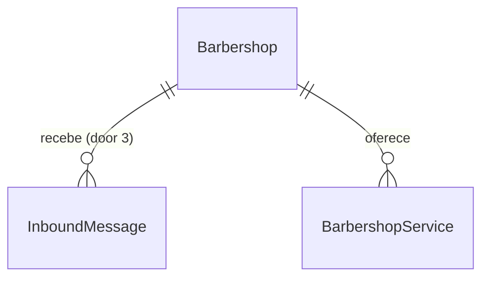

# US-15: Bot responde dúvidas sobre a barbearia

## Problem

O cliente que escreve para o WhatsApp da barbearia hoje recebe, no máximo, o aviso de privacidade (US-14). A pergunta dele ("quanto custa corte e barba?", "onde fica?", "abre sábado?") fica sem resposta até alguém da equipe pegar o celular, e quem está cortando cabelo não pega. O cliente espera ou desiste. O PRD não traz volume de mensagens nem taxa de desistência; o alvo que ele fixa é responder em até 10 s em 95% dos casos (RNF-01, CA-15.5).

Responder errado é pior que não responder: um preço inventado vira discussão no balcão (RF-09, risco "IA inventa informações" da seção 17). E o número é da barbearia, então o bot não pode virar um assistente genérico (RF-08).

Com a entrega, a mensagem de texto de um cliente recebe na hora uma resposta com os preços e durações cadastrados, o endereço ou o horário de funcionamento; um serviço que a barbearia não oferece é dito como tal; e um assunto de fora é recusado com educação.

## Flow

Reaproveita o webhook, o controller e o `ReceiveWhatsAppMessageUseCase` da US-14 (cadastro e aviso seguem iguais e vêm antes da resposta), o `WhatsAppConnector.sendText` para responder, o `ServiceRepository.listActiveByBarbershop` e o `BarbershopRepository.findById` como única fonte dos dados da resposta, e o `WEEKDAY_LABELS` para os dias.

1. `POST /webhooks/whatsapp/evolution` com `messages.upsert` -> `EvolutionWebhookController` (exists) - aplica os filtros da US-14 e passa a extrair também `data.key.id` e o texto (`data.message.conversation` ou `data.message.extendedTextMessage.text`)
2. `ReceiveWhatsAppMessageUseCase` (exists) - cadastro e aviso como na US-14, sem mudança; o controller só segue para a resposta quando a mensagem tem id e texto
3. `AnswerClientQuestionUseCase` (new, no door - placement) - confere a conexão, reivindica `(barbershopId, messageId)` (door 3) e só quem reivindicou segue; carrega a barbearia e os serviços ativos e chama `MessageInterpreter.interpret` (door 1) com o texto e os nomes do catálogo
4. `GeminiMessageInterpreter` (door 2) - `generateContent` com saída JSON, valida com Zod, registra latência, tokens e desfecho; devolve só a interpretação estruturada
5. mesmo use case - monta o texto a partir dos dados do banco (nunca do texto do modelo, exceto o nome do serviço desconhecido, limitado); em falha do intérprete, monta o texto de indisponibilidade
6. out: `WhatsAppConnector.sendText` (exists) -> Evolution; o webhook responde `204` em todos os casos

## Impact

| Front | What changes |
| --- | --- |
| domain | termo novo: interpretação da mensagem - o que o modelo extrai do texto (tópicos, serviços citados, serviços desconhecidos, fora de contexto); vive no port `MessageInterpreter` (door 1). US-16 e US-17 vão acrescentar tópicos a ele |
| domain | termo existente: mensagem recebida - na US-14 era só "alguém escreveu" (cadastro e aviso); agora carrega id e texto. Quem ramifica nela hoje: só o `ReceiveWhatsAppMessageUseCase` e o controller do webhook |
| stored data | tabela nova de mensagens reivindicadas (door 3), vazia; nada a migrar. `clients` não muda |
| webhook existente | `POST /webhooks/whatsapp/evolution` passa a responder ao texto de `messages.upsert`; entrada, saída e status não mudam. A descrição no Swagger é atualizada |
| rota existente | `GET /health/ready` ganha o indicador `gemini`; com o Gemini fora, a rota passa a responder `503` (regra do CLAUDE.md para integrações críticas) |
| configuração | `GEMINI_API_KEY` e `GEMINI_MODEL` (já no `.env.example`) entram no `env.schema.ts` como obrigatórias; nova `GEMINI_TIMEOUT_MS` com padrão 8000. A aplicação deixa de subir sem chave e modelo |
| código existente | o `FakeWhatsAppConnector` não muda; os e2e que consultam `/health/ready` ou mandam mensagens passam a trocar o intérprete por um fake, e o `validEnv` de `env.schema.spec.ts` ganha as variáveis. O e2e da US-14 passa a mandar uma foto em vez de um texto: com texto, a US-15 também responde, e os checks da US-14 contam só o aviso |

## Relations

One-way constraints: uma mensagem reivindicada por `(barbearia, id da mensagem no WhatsApp)`, unicidade que decide qual entrega responde (door 3). A tabela não guarda texto nem telefone. No columns and no types here.

## Surface

None - o único consumidor externo é a Evolution, pela rota do webhook que já existe; entrada, saída e status continuam os da US-13. O `/health/ready` só ganha uma chave no corpo (Impact).

## Landing

| One-way door | Literal shape | Alternative rejected |
| --- | --- | --- |
| 1. port do LLM | `src/usecases/ports/message-interpreter.port.ts`: `MessageInterpreter.interpret({ barbershopName: string, serviceNames: string[], text: string }): Promise<MessageInterpretation>`, `ping(): Promise<void>`, rejeitando com `MessageInterpreterUnavailableError`; `MessageInterpretation = { topics: ('services' \| 'address' \| 'opening_hours')[], services: string[], unknownServices: string[], offTopic: boolean }` | port que devolve o texto da resposta: RF-09 passaria a depender do modelo e nenhum teste com fake provaria que o preço não é inventado (decidido pelo usuário) |
| 2. dependência e chamada do Gemini | `@google/genai` (já no `package.json`, `2.24.0`) importado só em `src/infrastructure/external/gemini/`; `ai.models.generateContent({ model: GEMINI_MODEL, contents: text, config: { systemInstruction, responseMimeType: 'application/json', responseJsonSchema: z.toJSONSchema(interpretationSchema), temperature: 0, abortSignal: AbortSignal.timeout(GEMINI_TIMEOUT_MS) } })`; `ping` = `ai.models.get({ model })` | function calling: nenhuma ação é executada nesta história, e a saída estruturada tem um único formato a validar; SDK antigo `@google/generative-ai`: descontinuado, o CLAUDE.md fixa `@google/genai` |
| 3. uma resposta por mensagem | tabela `whatsapp_inbound_messages` com PK `(barbershop_id, message_id)` e `received_at timestamptz`; reivindicação `INSERT ... ON CONFLICT DO NOTHING RETURNING message_id`; a reivindicação não é desfeita se o Gemini ou o envio falham | sem deduplicação: a Evolution reentrega o evento (visto na US-14) e o cliente receberia duas respostas; conjunto em memória: perde-se no restart e não vale entre réplicas |
| 4. processamento síncrono | o webhook espera cadastro, aviso, Gemini e envio antes do `204`, com o Gemini limitado por `GEMINI_TIMEOUT_MS` | fila persistida (decidido pelo usuário): dependência nova e conteúdo de conversa gravado, com retenção em aberto (seção 19) |

- Nothing else in this change is hard to reverse

## Criteria

### S1: Preços e durações dos serviços (P1)

A pergunta sobre serviços é respondida só com o cadastro (CA-15.1, CA-15.2, RF-05, RF-09).

**Acceptance Criteria**

1. WHEN a interpretação traz o tópico `services` com serviços do catálogo THEN o sistema SHALL responder "Na {barbearia}:" seguido de uma linha "- {nome}: R$ {preço}, {duração}" por serviço citado, na ordem do catálogo, com o preço e a duração cadastrados (CA-15.1)
2. The sistema SHALL formatar o preço de centavos como `R$ 1.234,50` (espaço comum, ponto de milhar, vírgula decimal) e a duração como `30 min`, `1h` ou `1h30`
3. WHEN a interpretação traz o tópico `services` sem serviço citado nem desconhecido THEN o sistema SHALL listar todos os serviços ativos no formato do AC 1
4. WHEN a interpretação traz um serviço desconhecido THEN o sistema SHALL responder "A {barbearia} não oferece {nome}." sem preço nem duração (CA-15.2)
5. IF a interpretação cita um nome que não bate (sem diferenciar maiúsculas) com um serviço ativo da barbearia THEN o sistema SHALL tratá-lo como desconhecido (AC 4), inclusive serviço inativo ou de outra barbearia (RN-26)
6. IF a barbearia não tem serviço ativo e o tópico é `services` THEN o sistema SHALL responder "A {barbearia} ainda não tem serviços cadastrados."
7. The sistema SHALL mandar ao intérprete só os nomes dos serviços ativos da barbearia da mensagem

**Independent test:** e2e com intérprete fake devolvendo `{ topics: ['services'], services: ['Corte', 'Barba'] }` -> o fake do conector registra o texto com os preços e durações do banco.

### S2: Endereço e horário de funcionamento (P1)

Endereço e horário vêm da configuração da US-03 (CA-15.4, RF-05).

**Acceptance Criteria**

8. WHEN a interpretação traz o tópico `address` THEN o sistema SHALL responder "Endereço da {barbearia}: {endereço}"
9. IF o endereço não está cadastrado THEN o sistema SHALL responder "A {barbearia} ainda não informou o endereço."
10. WHEN a interpretação traz o tópico `opening_hours` THEN o sistema SHALL responder "Horário de funcionamento:" seguido de uma linha por dia, de segunda a domingo, "{Dia}: 09:00 às 18:00", com " (intervalo 12:00 às 13:00)" quando há intervalo e "{Dia}: fechado" quando não abre
11. WHEN a interpretação traz mais de um tópico THEN o sistema SHALL enviar uma única mensagem com os blocos na ordem serviços, endereço, horário, separados por uma linha em branco

**Independent test:** e2e: intérprete fake com `['address', 'opening_hours']` -> uma mensagem com o endereço e os sete dias gravados pela US-03.

### S3: Fora de contexto e mensagens sem tópico (P1)

O bot não vira assistente genérico e não fica mudo (CA-15.3, RF-08).

**Acceptance Criteria**

12. WHEN a interpretação traz `offTopic: true` THEN o sistema SHALL responder só "Desculpe, só posso ajudar com assuntos da {barbearia}: serviços, preços, endereço e horário de funcionamento." (CA-15.3)
13. WHEN a interpretação não traz tópico e `offTopic` é `false` THEN o sistema SHALL responder "Posso te ajudar com serviços, preços, endereço e horário de funcionamento da {barbearia}. O que você gostaria de saber?"
14. IF a mensagem não tem texto (áudio, imagem, figurinha) ou o texto é vazio depois de aparar os espaços THEN o sistema SHALL não chamar o intérprete nem responder, mantendo cadastro e aviso da US-14

**Independent test:** e2e: intérprete fake com `offTopic: true` -> o texto de recusa; mensagem de áudio -> nenhum `interpret` e nenhum `sendText` além do aviso.

### S4: Ordem, unicidade e falhas (P1)

Uma resposta por mensagem, depois do aviso, e o cliente nunca fica sem retorno quando o Gemini falha.

**Acceptance Criteria**

15. WHEN a primeira mensagem de um cliente tem texto THEN o sistema SHALL enviar o aviso de privacidade antes da resposta
16. IF a Evolution entrega de novo o mesmo `data.key.id` para a mesma barbearia, inclusive ao mesmo tempo THEN o sistema SHALL chamar o intérprete e responder uma única vez (door 3)
17. IF o intérprete falha, estoura `GEMINI_TIMEOUT_MS` ou devolve JSON que não passa no schema THEN o sistema SHALL responder "Desculpe, não consegui responder agora. Tente de novo em alguns instantes." e o webhook SHALL responder `204`
18. IF o envio da resposta falha THEN o webhook SHALL responder `204` e logar o erro sem telefone nem texto
19. The sistema SHALL cortar o texto enviado ao intérprete em 1000 caracteres
20. IF a interpretação traz mais de 3 serviços desconhecidos ou um com mais de 60 caracteres THEN o sistema SHALL tratar a interpretação como inválida (AC 17)

**Independent test:** e2e: o mesmo webhook duas vezes em paralelo -> um `interpret` e um `sendText` de resposta; intérprete fake rejeitando -> texto de indisponibilidade e `204`.

### S5: Gemini isolado e observável (P1)

O Gemini fica atrás do port, com custo e latência medidos (RNF-01, CA-15.5, seção 13).

**Acceptance Criteria**

21. The sistema SHALL importar `@google/genai` só em `src/infrastructure/external/gemini/`
22. The adaptador SHALL chamar `generateContent` com `GEMINI_MODEL`, `responseMimeType: 'application/json'`, o JSON Schema da interpretação, `temperature: 0` e um `abortSignal` de `GEMINI_TIMEOUT_MS`, e validar a resposta com Zod
23. The sistema SHALL recusar a inicialização quando `GEMINI_API_KEY` ou `GEMINI_MODEL` falta, ou quando `NODE_ENV` é `production` e `GEMINI_MODEL` termina em `-latest`
24. The sistema SHALL registrar cada chamada ao Gemini em `gemini_requests_total{outcome}` (`ok`, `invalid`, `error`, `timeout`), `gemini_request_duration_seconds` e `gemini_tokens_total{type}` (`prompt`, `output`), sem label de barbearia ou cliente
25. The sistema SHALL logar por chamada ao Gemini o modelo, a latência, os tokens e o desfecho, sem o texto do cliente nem a saída do modelo
26. The sistema SHALL contar as respostas enviadas em `whatsapp_replies_total{kind}` (`answer`, `off_topic`, `fallback`, `unavailable`)
27. WHEN `ai.models.get({ model })` falha THEN `GET /health/ready` SHALL responder `503` com `gemini` fora
28. The sistema SHALL descrever no Swagger do webhook a resposta às dúvidas, citando a US-15

**Independent test:** teste do adaptador com o cliente do SDK trocado por fake: a chamada leva os parâmetros do AC 22; resposta inválida -> `MessageInterpreterUnavailableError` e `outcome="invalid"`; `npm run lint` passa com a regra de boundaries.

## Out of scope

| Excluded | Why |
| --- | --- |
| Agendar, remarcar ou cancelar pela conversa | US-17 e US-18; uma mensagem de agendamento cai no AC 13 |
| Transferir para humano e contar falhas de entendimento | US-16 (RF-11, RF-12) |
| Lembrar mensagens anteriores da conversa | Nenhum CA pede, e guardar conversa depende da retenção em aberto (seção 19); cada mensagem é interpretada sozinha |
| Responder áudio, imagem ou figurinha | RF-01 fala de linguagem natural em texto; transcrição não tem requisito |
| Texto da resposta gerado pelo modelo | Decidido pelo usuário: o modelo só classifica (door 1) |
| Nomes dos barbeiros nas respostas | RF-05 lista serviços, preços, duração, endereço e horário |
| Limpeza da tabela de mensagens reivindicadas | Guarda só ids; a rotina entra quando a retenção for definida (seção 19) |

## Assumptions

| Assumption | Chosen default | Rationale | Confirmed? |
| --- | --- | --- | --- |
| Timeout do Gemini | `GEMINI_TIMEOUT_MS` com padrão 8000 | Cabe nos 10 s do RNF-01 com o envio pela Evolution; configurável porque o alvo é "sugestão, a validar" | y |
| Textos das respostas | Os textos literais dos AC 1, 4, 6, 8 a 10, 12, 13 e 17 | O PRD não dá os textos (L-007) | y |
| Serviço inativo | Tratado como não oferecido (AC 5) | O cliente não pode agendar um serviço inativo (US-04) | y |
| Limite do texto e dos desconhecidos | 1000 caracteres para o Gemini; até 3 desconhecidos de até 60 caracteres (AC 19, AC 20) | Limita custo por mensagem e o eco de texto do cliente na resposta | y |
| Resposta quando o envio falha | Não há nova tentativa; a reivindicação fica (door 3) | Sem fila (door 4), e reenviar exigiria desfazer a reivindicação e arriscar duas respostas | y |
| Gemini no `/health/ready` | Indicador `gemini` via `models.get`, sem gastar tokens | Regra do CLAUDE.md para integrações críticas | y |

**Open questions:**

| # | Kind | Question | Until answered |
| --- | --- | --- | --- |
| 1 | blocks go-live | Qual versão fixa do modelo Gemini usar em produção, e a chave de produção | A aplicação não sobe em `production` com o `gemini-flash-latest` do `.env.example` (AC 23) |
| 2 | blocks go-live | Contrato com o Google garantindo que o conteúdo não é usado para treino (seção 15) | O conteúdo das mensagens não pode ir ao Gemini com clientes reais |
| 3 | blocks go-live | Onde a Evolution API roda em produção (herdada da US-13) | Nenhuma barbearia real recebe respostas |

## Observable

| Surface | Decision | Landing |
| --- | --- | --- |
| webhook `POST /webhooks/whatsapp/evolution` (`messages.upsert` com texto) | response shape | AC 17, AC 18: sempre `204` |
| webhook `POST /webhooks/whatsapp/evolution` | error shape and codes | existing - `401` e `400` do envelope, como na US-13 |
| webhook `POST /webhooks/whatsapp/evolution` | who may call it | existing - guard do segredo da US-13 |
| webhook `POST /webhooks/whatsapp/evolution` | versioning | n/a - o formato segue a Evolution fixada em `v2.3.7` (AD-011) |
| webhook `POST /webhooks/whatsapp/evolution` | rate limit | n/a - só a Evolution autenticada chama; o custo por mensagem é limitado pelo AC 19 e nenhum RNF pede limite |
| webhook `POST /webhooks/whatsapp/evolution` | documentation | AC 28 |
| API `GET /health/ready` | response shape | AC 27 |
| document respostas do bot | structure, tone, depth | AC 1 a AC 4, AC 6, AC 8 a AC 13, AC 17 |
| document respostas do bot | what the reader does next | AC 13: convida a perguntar; agendar pela conversa chega na US-17 |

## Sources

- [docs/PRD.md](../../../docs/PRD.md) US-15 (CA-15.1 a CA-15.5), RF-05, RF-08, RF-09, RNF-01, seções 13, 15 e 17
- [CLAUDE.md](../../../CLAUDE.md) seção "IA (Gemini)": port em `usecases/`, saída estruturada validada com Zod, modelo por variável, fake nos testes, métricas de latência e tokens
