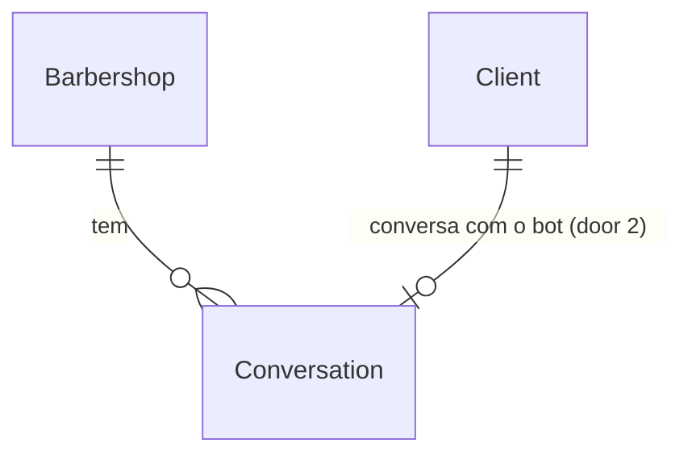

# US-16: Transferência para atendimento humano

## Problem

Hoje o bot responde toda mensagem de texto do cliente, e não existe saída para uma pessoa. Quem escreve "quero falar com alguém" recebe de volta "Posso te ajudar com serviços, preços, endereço e horário de funcionamento…"; quem pergunta algo que o bot não entende recebe o mesmo texto de novo, quantas vezes escrever. Se o Dono responde pelo app WhatsApp Business, o bot continua respondendo junto na mesma conversa. O cliente fica preso em respostas automáticas e a barbearia não sabe que tem alguém esperando.

O PRD não traz volume nem taxa de abandono. Registra o risco "cliente final não aceita falar com IA", mitigado por "transferência para humano sempre disponível (RF-11)" (seção 17), e usa "% de atendimentos sem humano" como métrica de sucesso (D-21), o que exige contar as transferências.

Com a entrega, o cliente que pede um atendente, ou que o bot não entende duas vezes seguidas, recebe "Vou chamar alguém da equipe para te ajudar." e o bot fica calado naquela conversa até o Dono reativá-lo pelo painel ou até passarem 12h sem mensagens. O Dono vê no painel a lista das conversas aguardando humano.

## Flow

Reaproveita o webhook, o controller e o `AnswerClientQuestionUseCase` da US-15 (reivindicação da mensagem, intérprete, envio e métricas), o `MessageInterpreter` e o adaptador Gemini (só ganham um campo, door 1), o `ClientRepository.findByPhone` para achar o cliente e o `ClientNotFoundError` da US-12 para o 404.

1. `POST /webhooks/whatsapp/evolution` com `messages.upsert` -> `EvolutionWebhookController` (exists) - mensagem do cliente: cadastro e aviso da US-14 sem mudança; mensagem da equipe (`key.fromMe`) deixa de ser só ignorada e passa a registrar atividade na conversa pausada daquele telefone
2. `AnswerClientQuestionUseCase` (exists) - depois da reivindicação da US-15, lê a conversa (door 2): pausada e dentro do prazo, registra a atividade e não chama o intérprete nem responde; pausada e fora do prazo, reativa (door 3) e segue
3. `GeminiMessageInterpreter` (exists) - devolve a interpretação com `humanRequested` (door 1)
4. mesmo use case - `humanRequested` pausa com motivo `requested`; resposta sem tópico conta uma falha e, na segunda seguida, pausa com motivo `not_understood`; outra resposta zera a contagem. A pausa é gravada antes do aviso de transferência
5. out: `WhatsAppConnector.sendText` (exists) com a resposta ou o aviso de transferência; o webhook responde `204` em todos os casos
6. `GET /whatsapp/conversations/waiting-human` e `POST /whatsapp/conversations/:clientId/resume` -> controller novo (no door - placement) -> use cases novos (placement) sobre a conversa (door 2), só para o Dono (AD-007)

## Impact

| Front | What changes |
| --- | --- |
| domain | termo novo: conversa - o estado do bot com um cliente (ativo ou pausado para humano, falhas seguidas de entendimento, última atividade); uma por cliente, vive na tabela da door 2. US-17 e US-18 vão acrescentar motivos de pausa (cliente bloqueado, fora do prazo de cancelamento, RN-22) |
| domain | termo existente: interpretação da mensagem (US-15) - ganha `humanRequested`. Quem ramifica nela hoje: `composeReply` e o `AnswerClientQuestionUseCase`; o `FakeMessageInterpreter` passa a ter `humanRequested: false` no padrão |
| domain | termo existente: resposta sem tópico (`fallback`, AC 13 da US-15) - passa a significar "não entendi" e conta para a transferência. Quem ramifica nela hoje: só `composeReply` e a métrica `whatsapp_replies_total{kind}` |
| stored data | tabela nova, vazia; nada a migrar. Uma conversa nasce na primeira mensagem de texto que chega depois do deploy. `clients` não muda |
| webhook existente | `POST /webhooks/whatsapp/evolution`: entrada, saída e status não mudam; a mensagem `fromMe` passa a ser lida (sem cadastrar cliente nem responder). A descrição no Swagger é atualizada |
| configuração | nova `WHATSAPP_HANDOFF_RESUME_HOURS`, padrão 12 (RN-23, "sugestão, a validar"), no `env.schema.ts` e no `.env.example` |
| testes existentes | no e2e da US-15, duas mensagens seguidas sem tópico do mesmo cliente passam a transferir; os testes que dependem disso trocam de cliente ou de interpretação |

## Relations

One-way constraints: no máximo uma conversa por cliente da barbearia (door 2); motivo de pausa presente se e somente se a conversa está pausada, com o motivo num conjunto fechado (door 2). No columns and no types here.

## Surface

| Route | In | Out | Status |
| --- | --- | --- | --- |
| `GET /whatsapp/conversations/waiting-human` | - | `conversations[]`: `clientId`, `clientName`, `phone`, `reason`, `pausedAt`, `lastActivityAt` | `200`, `401`, `403` |
| `POST /whatsapp/conversations/:clientId/resume` | `clientId` (uuid) | - | `204`, `400`, `401`, `403`, `404` |

## Landing

| One-way door | Literal shape | Alternative rejected |
| --- | --- | --- |
| 1. pedido de atendente no port do LLM | `MessageInterpretation` ganha `humanRequested: boolean`; o schema Zod e o JSON Schema mandado ao Gemini ganham o campo, com a instrução "true quando o cliente pede para falar com uma pessoa, atendente ou alguém da equipe" | palavras-chave no código ("atendente", "humano"): não pega "quero falar com alguém" e variações, que é o próprio exemplo do CA-16.1; novo valor em `topics`: `topics` são assuntos que o bot responde, e a transferência não é resposta |
| 2. tabela da conversa | `whatsapp_conversations` com PK `(barbershop_id, client_id)`, FK `client_id -> clients(id) ON DELETE CASCADE` e `barbershop_id -> barbershops(id) ON DELETE CASCADE`; `consecutive_failures integer NOT NULL DEFAULT 0 CHECK (>= 0)`; `paused_at timestamptz NULL`; `pause_reason text NULL CHECK (pause_reason IN ('requested', 'not_understood'))`; `CHECK ((paused_at IS NULL) = (pause_reason IS NULL))`; `last_activity_at timestamptz NOT NULL`. Pausar é `UPDATE ... SET paused_at = $now ... WHERE paused_at IS NULL`, e a falha é `consecutive_failures = consecutive_failures + 1 RETURNING` | colunas em `clients`: o cliente é o cadastro do painel (US-10, US-12), e a conversa seria escrita a cada mensagem e cresceria com os motivos da US-17 e US-18; guardar só "pausado" sem motivo: a lista do CA-16.6 e a métrica perdem o porquê |
| 3. reativação automática calculada na leitura | a pausa vale enquanto `greatest(paused_at, last_activity_at) > now - WHATSAPP_HANDOFF_RESUME_HOURS`; a primeira mensagem do cliente depois disso reativa a conversa (condicional ao mesmo predicado) e é respondida, e a lista filtra pelo mesmo predicado | job agendado (AD-009): reativa com atraso de até um intervalo, é um segundo escritor disputando com a reativação do Dono, e nada observável acontece na hora exata das 12h além da próxima mensagem |

- Nothing else in this change is hard to reverse

## Criteria

### S1: Pedido explícito de atendente (P1)

O cliente que pede uma pessoa é atendido por uma pessoa (CA-16.1, RF-11, RF-13, RN-22).

**Acceptance Criteria**

1. WHEN a interpretação de uma mensagem de conversa ativa traz `humanRequested: true` THEN o sistema SHALL pausar a conversa com motivo `requested` e enviar só "Vou chamar alguém da equipe para te ajudar." (CA-16.1)
2. WHEN a interpretação traz `humanRequested: true` junto com tópicos ou `offTopic` THEN o sistema SHALL transferir como no AC 1, sem a resposta aos tópicos
3. IF o envio do aviso de transferência falha THEN o sistema SHALL manter a conversa pausada, o webhook SHALL responder `204` e o erro SHALL ser logado sem telefone nem texto

**Independent test:** e2e com intérprete fake devolvendo `humanRequested: true` -> o fake do conector registra o aviso de transferência e a conversa aparece na lista do S6.

### S2: Duas falhas seguidas de entendimento (P1)

O cliente que o bot não entende duas vezes não fica preso (CA-16.2, RF-12, RN-22).

**Acceptance Criteria**

4. WHEN uma mensagem de conversa ativa recebe a resposta sem tópico (AC 13 da US-15) THEN o sistema SHALL contar uma falha de entendimento
5. WHEN a segunda falha seguida acontece THEN o sistema SHALL enviar "Vou chamar alguém da equipe para te ajudar." no lugar da resposta sem tópico e pausar a conversa com motivo `not_understood` (CA-16.2)
6. WHEN uma mensagem recebe resposta com tópico ou a recusa de assunto fora de contexto THEN o sistema SHALL zerar a contagem de falhas
7. IF o intérprete está indisponível (AC 17 da US-15) THEN o sistema SHALL manter a contagem de falhas como estava
8. IF duas mensagens do mesmo cliente chegam ao mesmo tempo e cada uma seria a segunda falha THEN o sistema SHALL pausar a conversa e enviar o aviso de transferência uma única vez (door 2)

**Independent test:** e2e: duas mensagens do mesmo cliente com intérprete fake sem tópico -> a primeira recebe a resposta da US-15, a segunda recebe o aviso de transferência.

### S3: Conversa pausada (P1)

Enquanto a equipe atende, o bot fica calado (CA-16.3, RF-13, RF-14, RN-23).

**Acceptance Criteria**

9. WHILE a conversa está pausada e dentro do prazo, WHEN o cliente envia uma mensagem THEN o sistema SHALL não chamar o intérprete nem enviar resposta (CA-16.3)
10. WHILE a conversa está pausada, WHEN chega qualquer mensagem do cliente, com ou sem texto, ou uma mensagem da equipe (`fromMe`) para o telefone dele THEN o sistema SHALL gravar o momento como a última atividade da conversa
11. IF a mensagem `fromMe` é para um telefone sem cliente ou sem conversa pausada na barbearia THEN o sistema SHALL não cadastrar cliente, não enviar nada e não criar conversa
12. The sistema SHALL resolver a conversa só dentro da barbearia da instância (RN-26): a pausa de um cliente numa barbearia não cala o mesmo telefone em outra

**Independent test:** e2e: com a conversa pausada, uma mensagem de texto do cliente -> nenhum `interpret` e nenhum `sendText`; uma mensagem `fromMe` -> `last_activity_at` atualizado.

### S4: Reativação pelo Dono (P1)

O Dono devolve a conversa ao bot pelo painel (CA-16.4, RF-15).

**Acceptance Criteria**

13. WHEN o Dono chama `POST /whatsapp/conversations/:clientId/resume` para uma conversa pausada THEN o sistema SHALL responder `204`, tirar a pausa e zerar a contagem de falhas, e a mensagem seguinte do cliente SHALL ser respondida pelo bot (CA-16.4)
14. WHEN o Dono chama a reativação para um cliente cuja conversa não está pausada ou não existe THEN o sistema SHALL responder `204` sem mudar nada
15. IF o `clientId` não é de um cliente da barbearia da sessão THEN o sistema SHALL responder `404` com "Cliente não encontrado." (RN-26)
16. IF o `clientId` não é um uuid THEN o sistema SHALL responder `400` pelo `ZodValidationPipe`
17. IF quem chama é um Barbeiro THEN o sistema SHALL responder `403` com "Acesso negado." (AD-007)

**Independent test:** e2e: pausar pelo webhook, chamar a reativação como Dono, mandar outra mensagem -> o bot responde.

### S5: Reativação automática (P1)

Uma conversa esquecida volta ao bot sozinha (CA-16.5, RN-23).

**Acceptance Criteria**

18. The sistema SHALL considerar a conversa pausada enquanto a mais recente entre a pausa e a última atividade tiver menos de `WHATSAPP_HANDOFF_RESUME_HOURS` horas (padrão 12) (door 3)
19. WHEN uma mensagem do cliente chega com a pausa vencida THEN o sistema SHALL reativar a conversa, zerar a contagem de falhas e responder à mensagem como numa conversa ativa (CA-16.5)
20. The sistema SHALL recusar a inicialização quando `WHATSAPP_HANDOFF_RESUME_HOURS` não é um inteiro positivo

**Independent test:** e2e com `FixedClock`: pausar, avançar o relógio 12h01 sem mensagens, mandar texto -> o bot responde; avançar 11h59 -> não responde.

### S6: Conversas aguardando humano (P1)

O Dono sabe quem está esperando (CA-16.6).

**Acceptance Criteria**

21. WHEN o Dono chama `GET /whatsapp/conversations/waiting-human` THEN o sistema SHALL responder `200` com `conversations` contendo, por conversa pausada dentro do prazo, `clientId`, `clientName`, `phone`, `reason` (`requested` ou `not_understood`), `pausedAt` e `lastActivityAt`, da pausa mais antiga para a mais nova (CA-16.6)
22. The lista SHALL omitir conversas ativas, reativadas pelo Dono, com pausa vencida (AC 18) e de outras barbearias (RN-26)
23. WHEN não há conversa aguardando THEN o sistema SHALL responder `200` com `conversations: []`
24. IF quem chama é um Barbeiro THEN o sistema SHALL responder `403` com "Acesso negado." (AD-007)

**Independent test:** e2e: duas conversas pausadas na barbearia A e uma na B -> o Dono da A vê as duas, em ordem de pausa.

### S7: Observável e documentado (P1)

As transferências são contadas e as rotas documentadas (D-21, CLAUDE.md).

**Acceptance Criteria**

25. The sistema SHALL contar as transferências em `whatsapp_handoffs_total{reason}` (`requested`, `not_understood`) e o aviso enviado em `whatsapp_replies_total{kind="handoff"}`, sem label de barbearia ou cliente
26. The sistema SHALL contar as reativações em `whatsapp_bot_resumes_total{trigger}` (`owner`, `timeout`)
27. The sistema SHALL logar cada transferência com o id da barbearia e o motivo, sem telefone nem texto
28. The sistema SHALL documentar no Swagger as duas rotas novas (US-16) e descrever no webhook a transferência e o silêncio da conversa pausada

**Independent test:** e2e: `GET /metrics` depois de uma transferência mostra `whatsapp_handoffs_total{reason="requested"} 1`; `api-docs.e2e-spec.ts` passa.

## Out of scope

| Excluded | Why |
| --- | --- |
| Transferir cliente bloqueado por faltas ou fora do prazo de cancelamento | Os outros dois gatilhos do RN-22 dependem de agendar e cancelar pelo bot (US-17, US-18); a door 2 já tem onde pôr o motivo |
| Reativar o bot por comando no WhatsApp | RF-15 aceita "painel ou comando"; o CA-16.4 pede o painel |
| Caixa de entrada ou histórico das mensagens no painel | Fase futura (seção 6.2); a equipe responde pelo app (RF-14, D-12) |
| Avisar o Dono por e-mail ou push a cada transferência | Nenhum CA pede; o CA-16.6 é o aviso |
| Mensagem ao cliente quando o bot é reativado | Nenhum CA pede |
| Transferir quando o intérprete está indisponível | RF-12 fala de falha de entendimento; o Gemini fora já tem a resposta de indisponibilidade da US-15 |
| Contar áudio, imagem ou figurinha como falha | A US-15 não responde a essas mensagens; não houve tentativa de entender |

## Assumptions

| Assumption | Chosen default | Rationale | Confirmed? |
| --- | --- | --- | --- |
| CA-16.6 entra | Lista só para o Dono (S6) | Pendência do PRD; decidido pelo usuário | y |
| O que conta para o prazo de 12h | Mensagem do cliente (com ou sem texto) e da equipe (`fromMe`) na conversa pausada (AC 10) | Decidido pelo usuário: o bot não volta no meio de um atendimento da equipe | y |
| Prazo de reativação | `WHATSAPP_HANDOFF_RESUME_HOURS`, padrão 12, por ambiente e não por barbearia | RN-23 é "sugestão, a validar" e não pede configuração pelo Dono | n |
| Texto do aviso de transferência | "Vou chamar alguém da equipe para te ajudar." nos dois gatilhos | Literal do CA-16.2, com ponto final; o CA-16.1 só diz "avisa que vai chamar a equipe" (L-007) | n |
| O que é "não entender" | Só a resposta sem tópico (`fallback`); recusa de fora de contexto e resposta com tópico zeram; indisponibilidade não conta nem zera (AC 4, 6, 7) | Fora de contexto e serviço desconhecido foram entendidos; o Gemini fora não é falha do cliente | n |
| Quem vê e reativa | Só o Dono (AD-007, sem `@Roles`) | RF-15 diz "o dono"; seção 5 não dá ao Barbeiro conversas de clientes | n |
| Eco das mensagens do próprio bot | Uma mensagem `fromMe` ecoada pela Evolution conta como atividade da equipe | Na conversa pausada o bot só envia o aviso de transferência, no mesmo instante da pausa; não muda o prazo | n |
| Tamanho da lista | Sem paginação | São as conversas pausadas das últimas 12h de uma barbearia; a US-12 também devolve lista limitada só por busca | n |

**Open questions:** none - all resolved or logged above. As pendências de go-live da US-15 (modelo fixo, contrato com o Google, Evolution em produção) seguem valendo.

## Observable

| Surface | Decision | Landing |
| --- | --- | --- |
| API `GET /whatsapp/conversations/waiting-human` | response shape | AC 21 |
| API `GET /whatsapp/conversations/waiting-human` | empty state | AC 23 |
| API `GET /whatsapp/conversations/waiting-human` | ordering | AC 21: pausa mais antiga primeiro |
| API `GET /whatsapp/conversations/waiting-human` | who may call it | AC 24 |
| API `POST /whatsapp/conversations/:clientId/resume` | response shape | AC 13, AC 14: `204` sem corpo |
| API `POST /whatsapp/conversations/:clientId/resume` | error shape and codes | AC 15, AC 16, AC 17; formato `{ message }` do `DomainErrorFilter` existente |
| API `POST /whatsapp/conversations/:clientId/resume` | who may call it | AC 17 |
| all new `/whatsapp/conversations*` | versioning, rate limits | n/a - o painel é o único consumidor, sem versionamento nas rotas existentes; nenhum RNF pede limite em rota autenticada |
| webhook `POST /webhooks/whatsapp/evolution` | response shape, error shape, who may call it | existing - `204`, `400` e `401` da US-13, sem mudança (AC 3) |
| webhook `POST /webhooks/whatsapp/evolution` | versioning, rate limit | n/a - formato da Evolution fixado em `v2.3.7` (AD-011); só ela chama |
| API todas as rotas novas | documentation | AC 28 |
| document aviso de transferência | structure, tone, depth | AC 1: uma frase, o texto do CA-16.2 |
| document aviso de transferência | what the reader does next | AC 1: esperar a equipe, que responde pelo app no mesmo número (RF-14) |

## Sources

- [docs/PRD.md](../../../docs/PRD.md) US-16 (CA-16.1 a CA-16.6), RF-11 a RF-15, RN-22, RN-23, D-05, D-12, D-21, seções 17 e 19
- [.specs/STATE.md](../../STATE.md) AD-007 (só-Dono por padrão), AD-009 (jobs), AD-011 (webhook e port do WhatsApp)
