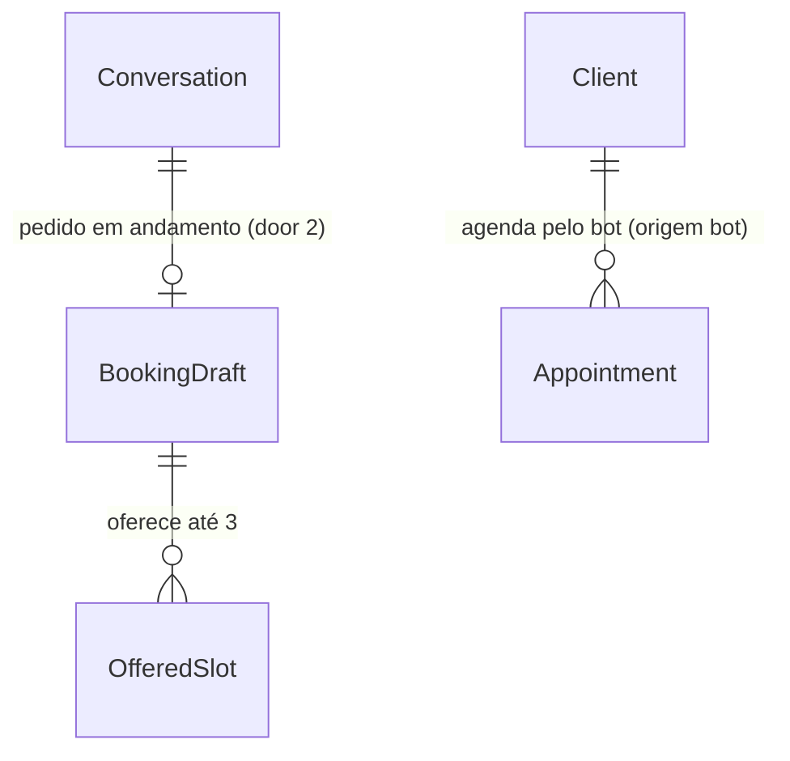

# US-17: Agendamento pelo WhatsApp

## Problem

Hoje o cliente que escreve "tem horário amanhã à tarde com o João para corte?" no WhatsApp da barbearia recebe, no máximo, o preço do corte (US-15). O bot não consulta a agenda nem marca horário. Para agendar, o cliente precisa ligar ou ir até a barbearia, e alguém da equipe lança o horário no painel (US-10). Fora do expediente, ninguém marca nada. A proposta de valor do produto ("agendar a qualquer hora, sem baixar aplicativo", seção 1) ainda não existe para o cliente final.

O PRD não traz volume de pedidos. Ele define como meta a "% de agendamentos feitos pelo bot sem intervenção humana" (D-21, RF-39), e hoje essa taxa é zero por construção.

Com a entrega, o cliente pede em linguagem natural e recebe até 3 horários livres calculados pelo motor da US-07, cada um com o nome do barbeiro. Ao responder com o número de um deles, o horário é agendado como confirmado, com origem `bot`, e o cliente recebe serviço, barbeiro, data, hora, valor e endereço. O cliente bloqueado por faltas vai para a equipe (US-16) em vez de agendar.

## Flow

Reaproveita o webhook, a reivindicação da mensagem, a conversa e a transferência da US-15/US-16 (`AnswerClientQuestionUseCase`). Os horários vêm do `ListAvailableSlotsUseCase` e a gravação do `BookAppointmentUseCase` da US-07, com origem `bot` (antecedência mínima, sobreposição e constraint de exclusão incluídas). O bloqueio usa o `clientNoShowStatus` da US-11. Nenhuma regra de agenda é reescrita.

1. `POST /webhooks/whatsapp/evolution` com `messages.upsert` -> `EvolutionWebhookController` (exists) - sem mudança até chamar `AnswerClientQuestionUseCase`
2. `AnswerClientQuestionUseCase` (exists) - reivindica a mensagem e entra na conversa como hoje; pede ao `BookViaWhatsAppUseCase` (passo 5) o rascunho em vigor (door 2), a data de hoje da barbearia, os barbeiros ativos e as opções oferecidas, e passa os três últimos ao intérprete
3. `GeminiMessageInterpreter` (exists) - devolve a interpretação com intenção de agendar, barbeiro, "tanto faz", data, período, hora e número da opção escolhida (door 1)
4. mesmo use case - pedido de atendente transfere (US-16) e assunto fora de contexto recusa (US-15), como hoje; com intenção de agendar ou escolha de opção, delega a `BookViaWhatsAppUseCase` (new, no door - placement); o resto segue a US-15
5. `BookViaWhatsAppUseCase` - cliente bloqueado (`clientNoShowStatus`, exists) transfere com motivo `blocked_client` (door 3); falta serviço ou preferência de barbeiro, pergunta; com dados suficientes, busca no `ListAvailableSlotsUseCase` (exists, origem `bot`) e grava a oferta no rascunho (door 2)
6. mesmo use case - escolha de opção reivindica o rascunho (door 2) e chama `BookAppointmentUseCase` (exists, origem `bot`, cliente existente), que persiste `Appointment` confirmado; conflito ou antecedência vencida volta ao passo 5 com o aviso
7. out: `WhatsAppConnector.sendText` (exists) com a pergunta, a oferta ou o resumo do agendamento; o use case devolve o id do agendamento e o `EvolutionWebhookController` (exists) loga o agendamento; o webhook responde `204` em todos os casos; o agendamento aparece na agenda do painel (US-08) com origem `bot`

## Impact

| Front | What changes |
| --- | --- |
| domain | termo novo: rascunho de agendamento. O que o bot já sabe do pedido em andamento (serviços, barbeiro ou "tanto faz", data, período, hora) e as opções oferecidas. Um por conversa, vive na door 2 |
| domain | termo existente: interpretação da mensagem (US-15/US-16). Ganha os campos da door 1. Quem ramifica nela hoje: `composeReply`, `AnswerClientQuestionUseCase`, o schema Zod do Gemini e o `FakeMessageInterpreter` (os padrões dos campos novos são `false`, `null` e vazio) |
| domain | termo existente: motivo de transferência (`HANDOFF_REASONS`, AD-012). Ganha `blocked_client`. Quem ramifica nele hoje: métrica `whatsapp_handoffs_total{reason}`, presenter e schema da lista `waiting-human`, CHECK do banco |
| domain | termo existente: tipo de resposta (`ClientReplyKind`). Ganha `booking` (pergunta ou oferta) e `booked` (resumo). Quem ramifica hoje: só a métrica `whatsapp_replies_total{kind}` |
| stored data | `whatsapp_conversations` ganha a coluna do rascunho, nula nas linhas existentes; o CHECK de `pause_reason` é trocado por um que aceita `blocked_client`. Nada a migrar: nenhuma linha existente viola o CHECK novo |
| rota existente | `GET /whatsapp/conversations/waiting-human`: `reason` passa a poder valer `blocked_client` (ver Surface) |
| webhook existente | `POST /webhooks/whatsapp/evolution`: entrada, saída e status não mudam; a descrição no Swagger ganha o agendamento |
| testes existentes | as fixtures de interpretação da US-15/US-16 ganham os campos novos com os padrões; o setup do spec do `AnswerClientQuestionUseCase` ganha os ports de agenda |

## Relations

One-way constraints: no máximo um rascunho por conversa, guardado dentro dela (door 2); uma oferta é consumida uma única vez (door 2); motivo de pausa `blocked_client` no conjunto fechado (door 3). `Appointment` e a constraint de exclusão da US-07 não mudam. No columns and no types here.

## Surface

| Route | In | Out | Status |
| --- | --- | --- | --- |
| `GET /whatsapp/conversations/waiting-human` | - | `conversations[]`: `reason` passa a aceitar `blocked_client`; os outros campos não mudam | `200`, `401`, `403` |

## Landing

| One-way door | Literal shape | Alternative rejected |
| --- | --- | --- |
| 1. pedido de agendamento no port do LLM | `MessageInterpretation` ganha `bookingRequested: boolean`, `barber: string \| null` (nome como no cadastro), `anyBarber: boolean`, `date: string \| null` (`YYYY-MM-DD` no fuso da barbearia), `period: 'morning' \| 'afternoon' \| 'evening' \| null`, `time: string \| null` (`HH:MM`) e `choice: number \| null` (1 a 3). `services` passa a valer também como serviço do agendamento. `MessageInterpreterInput` ganha `today` (data local e dia da semana), `barberNames` e `offeredOptions` (os textos das opções em oferta). O schema Zod valida formato e faixa antes do use case | o modelo escolher o horário ou chamar uma função que agenda: a IA não executa ações (CLAUDE.md), e o horário tem de sair do motor; mandar o histórico da conversa ao modelo: guarda texto do cliente (LGPD) e deixa o modelo reconstruir a oferta, que o código já sabe |
| 2. rascunho de agendamento na conversa | coluna `booking_draft jsonb NULL` em `whatsapp_conversations`: `{ id, serviceIds, barberId, anyBarber, date, period, time, offer: [{ barberId, startsAt }], updatedAt }`, validada com Zod na leitura (valor inválido conta como sem rascunho). Vale por 60 min desde `updatedAt`. Consumir a oferta é `UPDATE ... SET booking_draft = NULL WHERE ... AND booking_draft->>'id' = $id RETURNING`, então só uma mensagem agenda a partir de uma oferta. É limpo ao agendar, ao pausar e ao reativar | tabela `whatsapp_booking_drafts`: um segundo registro por conversa com o mesmo ciclo de vida e a mesma chave; colunas separadas: a US-18 vai guardar outra forma de pedido (qual agendamento remarcar) e cada campo viraria migration |
| 3. motivo `blocked_client` | `HANDOFF_REASONS = ['requested', 'not_understood', 'blocked_client']`; migration troca `whatsapp_conversations_pause_reason_check` por `CHECK ("pause_reason" IN ('requested', 'not_understood', 'blocked_client'))`; o enum do `reason` na resposta de `waiting-human` ganha o valor | reusar `requested`: a lista do painel (CA-16.6) e a métrica deixariam de mostrar que o cliente foi barrado pelas faltas, que é o que a equipe precisa saber para decidir (RN-14) |

- Nothing else in this change is hard to reverse. O rascunho (door 2) chega até a US-18, então entra em `.specs/STATE.md` como AD-013 antes do código.

## Criteria

### S1: Pedido vira oferta de horários (P1)

O cliente pede em linguagem natural e recebe até 3 horários livres do motor (CA-17.1, CA-17.3, RF-01, RF-02, RF-03, RN-02, RN-06).

**Acceptance Criteria**

1. WHEN a interpretação traz `bookingRequested: true` com serviço, barbeiro e data THEN o sistema SHALL buscar no `ListAvailableSlotsUseCase` com origem `bot` e responder com até 3 horários livres, em ordem cronológica, no formato da oferta (Assumptions) (CA-17.1)
2. WHEN a interpretação traz um período (`morning`, `afternoon`, `evening`) THEN o sistema SHALL oferecer só horários cujo início, no fuso da barbearia, cai em [00:00, 12:00), [12:00, 18:00) ou [18:00, 24:00), respectivamente
3. WHEN o pedido não traz data THEN o sistema SHALL oferecer os primeiros horários livres a partir de agora, dentro de 7 dias locais a contar de hoje
4. WHEN a interpretação traz `anyBarber: true` THEN o sistema SHALL buscar entre todos os barbeiros ativos que fazem os serviços, e cada opção SHALL trazer o nome do barbeiro que vai atender (CA-17.3, RN-06)
5. WHEN o pedido não traz barbeiro nem `anyBarber` THEN o sistema SHALL perguntar a preferência com a lista dos barbeiros que fazem os serviços, sem oferecer horários (RF-03)
6. WHEN o pedido não traz serviço do catálogo ativo THEN o sistema SHALL perguntar o serviço com a lista dos serviços ativos, em ordem de nome
7. IF o barbeiro citado não faz algum dos serviços THEN o sistema SHALL responder que ele não faz o serviço e listar os barbeiros que fazem
8. IF nenhum barbeiro ativo faz os serviços THEN o sistema SHALL responder "Nenhum barbeiro faz <serviços> no momento." e descartar o rascunho
9. WHEN uma mensagem seguinte completa o pedido (por exemplo, "tanto faz" depois da pergunta do AC 5) THEN o sistema SHALL combinar os dados novos com os do rascunho, com o dado novo prevalecendo sobre o antigo
10. WHEN o pedido traz uma hora exata livre para o barbeiro pedido (ou para algum barbeiro apto, com `anyBarber`) THEN o sistema SHALL oferecer só esse horário, como opção 1
11. IF a hora exata pedida não está livre e respeita a antecedência mínima THEN o sistema SHALL responder "O horário das <hora> de <data> não está livre." seguido da oferta do mesmo dia e período
12. IF a data pedida é anterior a hoje no fuso da barbearia THEN o sistema SHALL responder "Essa data já passou." seguido da oferta a partir de agora
13. The sistema SHALL mandar ao intérprete só os barbeiros ativos e os serviços ativos da barbearia da instância (RN-26)
14. The oferta SHALL ser gravada no rascunho da conversa com barbeiro e início de cada opção, na ordem mostrada ao cliente

**Independent test:** e2e com intérprete fake (`bookingRequested`, `services: ['Corte']`, `barber: 'João'`, amanhã, `afternoon`) -> o fake do conector recebe a oferta com até 3 horários da tarde do João.

### S2: Escolha vira agendamento confirmado (P1)

Responder com o número de uma opção agenda o horário (CA-17.2, RN-01).

**Acceptance Criteria**

15. WHEN a interpretação traz `choice` entre 1 e o número de opções da oferta em vigor THEN o sistema SHALL criar o agendamento com status `confirmed`, origem `bot`, o cliente da conversa, os serviços, o barbeiro e o início da opção (CA-17.2, RN-01)
16. WHEN o agendamento é criado THEN o sistema SHALL responder com o resumo (serviço, barbeiro, data, hora, valor e endereço, formato em Assumptions) e descartar o rascunho (CA-17.2)
17. The valor do resumo SHALL ser a soma dos preços dos serviços, formatado como na US-15 (`R$ 45,00`)
18. IF a barbearia não tem endereço THEN o resumo SHALL trazer "Endereço: ainda não informado"
19. IF `choice` está fora das opções em oferta THEN o sistema SHALL responder "Não encontrei essa opção." seguido da mesma oferta, sem agendar
20. IF `choice` chega sem oferta em vigor (sem rascunho, rascunho sem oferta ou com mais de 60 min) THEN o sistema SHALL tratar a mensagem como não entendida (resposta sem tópico da US-15, que conta falha da US-16)
21. IF duas mensagens do mesmo cliente escolhem opções da mesma oferta ao mesmo tempo THEN o sistema SHALL criar um único agendamento (door 2)
22. IF o envio do resumo falha THEN o agendamento SHALL continuar gravado, o webhook SHALL responder `204` e o erro SHALL ser logado sem telefone nem texto

**Independent test:** e2e: oferta gravada, mensagem com `choice: 2` -> linha em `appointments` com `origin = 'bot'`, `status = 'confirmed'`, e o conector recebe o resumo.

### S3: Horário ocupado durante a conversa (P1)

Quem perde o horário recebe novas opções (CA-17.4, RN-07).

**Acceptance Criteria**

23. IF o horário escolhido foi ocupado depois da oferta (conflito da aplicação ou da constraint de exclusão) THEN o sistema SHALL não criar agendamento e responder "Esse horário acabou de ser ocupado." seguido de uma nova oferta com os mesmos critérios (CA-17.4)
24. IF o horário escolhido deixou de ser válido por bloqueio, folga ou jornada THEN o sistema SHALL responder como no AC 23

**Independent test:** unitário com repositório em memória: oferta gravada, outro agendamento criado no mesmo horário, `choice: 1` -> nenhum agendamento novo do cliente e o aviso com nova oferta.

### S4: Antecedência mínima (P1)

O bot explica a regra em vez de só negar (CA-17.5, RN-02).

**Acceptance Criteria**

25. IF a hora exata pedida é anterior a agora mais a antecedência mínima em vigor THEN o sistema SHALL responder "Só agendamos pelo WhatsApp com pelo menos <antecedência> de antecedência." seguido da oferta com o primeiro horário válido, como opção 1 (CA-17.5)
26. IF a opção escolhida ficou dentro da antecedência mínima enquanto a oferta esperava THEN o sistema SHALL responder como no AC 25, sem agendar
27. The antecedência SHALL ser lida das regras da barbearia a cada mensagem (US-06) e escrita como na US-15 (`1h`, `30 min`, `1h30`)

**Independent test:** unitário com `FixedClock` às 14:30 e antecedência de 1h: pedido para hoje às 15:00 -> a regra e a oferta das 15:30.

### S5: Sem horário no período pedido (P1)

O cliente recebe alternativas em vez de um "não" (CA-17.7).

**Acceptance Criteria**

28. IF não há horário livre na data e período pedidos THEN o sistema SHALL responder "Não há horário livre <período> em <data>." seguido da oferta de até 3 horários de outros períodos, do início da data pedida até 6 dias depois, excluindo o período pedido naquela data (CA-17.7)
29. IF não há horário livre na data pedida, sem período THEN o sistema SHALL responder "Não há horário livre em <data>." seguido da oferta dos dias seguintes, até 6 dias depois
30. IF não há horário livre em nenhum dos 7 dias THEN o sistema SHALL responder "Não encontrei horário livre para <serviços> até <última data>." e descartar a oferta

**Independent test:** unitário: tarde do João toda ocupada amanhã -> "Não há horário livre à tarde em ..." e três horários da manhã ou do dia seguinte.

### S6: Cliente bloqueado por faltas (P1)

O bot não agenda para quem atingiu o limite de faltas (CA-17.6, RN-12, RN-22).

**Acceptance Criteria**

31. WHEN um cliente com o autoagendamento bloqueado (`clientNoShowStatus`) manda mensagem com `bookingRequested: true` ou com `choice` THEN o sistema SHALL não oferecer nem criar agendamento, pausar a conversa com motivo `blocked_client` e enviar "Vou chamar alguém da equipe para te ajudar." (CA-17.6)
32. WHEN um cliente bloqueado só pergunta sobre serviços, endereço ou horário de funcionamento THEN o sistema SHALL responder como na US-15, sem transferir
33. The lista `GET /whatsapp/conversations/waiting-human` SHALL trazer a conversa com `reason: 'blocked_client'`

**Independent test:** e2e: cliente com 2 faltas e limite 2, mensagem com `bookingRequested` -> aviso de transferência, conversa pausada e listada com `blocked_client`.

### S7: Conversa, métricas e documentação (P1)

O agendamento convive com as regras da US-15/US-16 e é observável (D-21, CLAUDE.md).

**Acceptance Criteria**

34. WHEN a interpretação traz `humanRequested: true` junto com dados de agendamento THEN o sistema SHALL transferir como na US-16, sem oferecer nem agendar, e descartar o rascunho
35. WHEN a interpretação traz `offTopic: true` THEN o sistema SHALL recusar como na US-15, sem oferecer nem agendar, e manter o rascunho
36. WHEN uma mensagem vai para o agendamento THEN o sistema SHALL não responder aos `topics` da mesma mensagem e SHALL zerar a contagem de falhas (US-16)
37. WHEN a interpretação traz tópicos sem `bookingRequested` nem `choice` com um rascunho em vigor THEN o sistema SHALL responder como na US-15 e manter o rascunho
38. IF o intérprete está indisponível THEN o sistema SHALL responder como na US-15 e manter o rascunho e a contagem de falhas
39. The sistema SHALL contar as respostas de agendamento em `whatsapp_replies_total{kind}` com `booking` (pergunta ou oferta) e `booked` (resumo), e o agendamento em `appointments_booked_total{origin="bot"}` (existente), sem label de barbearia ou cliente
40. The sistema SHALL logar cada agendamento pelo bot com o id da barbearia e o id do agendamento, sem telefone, nome nem texto
41. The sistema SHALL descrever no Swagger do webhook o agendamento pelo bot (US-17) e o novo valor `blocked_client` na lista `waiting-human`

**Independent test:** e2e: `GET /metrics` depois de um agendamento pelo bot mostra `whatsapp_replies_total{kind="booked"} 1` e `appointments_booked_total{origin="bot"} 1`; `api-docs.e2e-spec.ts` passa.

## Out of scope

| Excluded | Why |
| --- | --- |
| Sugerir serviço adicional durante o agendamento | RF-06 (Should) aparece no Fluxo 9.1, mas não está nas referências nem nos CAs da US-17 |
| Oferecer lista de espera quando não há horário | RF-07 e US-23 |
| Remarcar ou cancelar pelo bot | US-18 |
| Lembretes do agendamento | US-19 |
| Recusar agendamento com assinatura inativa | RN-25, US-21 |
| Limite de agendamentos futuros por cliente | Nenhum RF ou RN pede |
| Aviso à equipe ou ao barbeiro a cada agendamento do bot | Nenhum CA pede; o agendamento aparece na agenda (US-08) |
| Agendar mensagem de áudio ou imagem | A US-15 só responde a texto |

## Assumptions

| Assumption | Chosen default | Rationale | Confirmed? |
| --- | --- | --- | --- |
| O que cria o agendamento | Responder com o número de uma opção já agenda; não há passo "confirma?" (AC 15) | Decidido pelo usuário; segue o Fluxo 9.1 | y |
| Pedido sem data | Oferece os primeiros horários livres a partir de agora (AC 3) | Decidido pelo usuário | y |
| Hora exata livre | É oferecida como opção 1, e só agenda quando o cliente escolhe (AC 10) | Agendar só a partir de uma opção oferecida mantém um único caminho de gravação; "tem às 15h?" é pergunta, não ordem | n |
| Formato da oferta | `Horários para <serviços> (<valor>, <duração>):` e uma linha por opção `<n>. <dia da semana>, <dd/mm>, às <HH:MM>, com <barbeiro>`, fechando com `Responda com o número do horário que você quer.` Serviços unidos por ` + `; dia da semana em minúsculas (`quinta-feira`) | L-007: texto literal antes do código; o nome do barbeiro em toda linha cobre o CA-17.3 | n |
| Formato do resumo | `Agendamento confirmado!` e as linhas `Serviço: <serviços>`, `Barbeiro: <nome>`, `Data: <dia da semana>, <dd/mm>`, `Horário: <HH:MM>`, `Valor: <R$>`, `Endereço: <endereço>`; com mais de um serviço, `Serviços:` com os nomes unidos por `, ` | Os seis itens do CA-17.2, na ordem do CA | n |
| Pergunta do serviço (AC 6) | `Qual serviço você quer agendar? Temos: <serviços ativos por nome, unidos por ", ">.`; sem serviço ativo, o texto do AC 6 da US-15: `A <barbearia> ainda não tem serviços cadastrados.` | L-007 | n |
| Pergunta do barbeiro (AC 5) e barbeiro inapto (AC 7) | `Tem preferência de barbeiro? Fazem <serviços>: <barbeiros por nome>. Se não tiver, responda "tanto faz".` e `<barbeiro> não faz <serviços>. Fazem <serviços>: <barbeiros>. Se não tiver preferência, responda "tanto faz".` | RF-03; sem artigo antes do nome, para não presumir gênero | n |
| Nome do período no AC 28 | `de manhã`, `à tarde`, `à noite`; data como `quinta-feira, 01/10` | L-007 | n |
| Janela de busca | 7 dias locais a partir da data pedida (ou de hoje) | Nenhum RN fixa horizonte; 7 dias limitam a 7 consultas ao motor por mensagem e cobrem "esta semana" | n |
| Validade do rascunho | 60 min desde a última mensagem que o alterou; depois disso a conversa se comporta como sem rascunho (AC 20) | Uma oferta antiga seria revalidada de qualquer forma (AC 23); o prazo evita que um "1" solto horas depois agende um horário esquecido | n |
| Precedência na mesma mensagem | Atendente > fora de contexto > agendamento > tópicos da US-15 (AC 34 a 37) | A US-16 já põe a transferência na frente; a oferta mostra preço e duração, que é o que a pergunta de tópico quase sempre quer saber junto | n |
| Quando o bloqueio é conferido | Em toda mensagem que vai para o agendamento (pedido ou escolha), lendo o limite em vigor (AC 31) | CA-17.6 diz "quando ele pede para agendar"; uma falta marcada no meio da conversa vale na escolha seguinte | n |
| Hora fora da grade de 30 min | "14:15" só é livre se o motor oferece 14:15 (AC 11) | O motor da US-07 é a única fonte de horários; nenhuma regra nova de grade | n |

**Open questions:** none - all resolved or logged above. As pendências de go-live da US-15 (modelo fixo do Gemini, contrato com o Google, Evolution em produção) continuam valendo.

## Observable

| Surface | Decision | Landing |
| --- | --- | --- |
| API `GET /whatsapp/conversations/waiting-human` | response shape | AC 33: só o enum de `reason` cresce |
| API `GET /whatsapp/conversations/waiting-human` | error shape and codes, who may call it | existing - `401`/`403` da US-16 (AD-007), sem mudança |
| API `GET /whatsapp/conversations/waiting-human` | versioning | n/a - valor novo num enum lido só pelo painel, sem versionamento nas rotas existentes |
| webhook `POST /webhooks/whatsapp/evolution` | response shape, error shape, who may call it | existing - `204`, `400` e `401` da US-13, sem mudança (AC 22) |
| webhook `POST /webhooks/whatsapp/evolution` | versioning, rate limit | n/a - formato da Evolution fixado (AD-011); só ela chama |
| API todas as rotas alteradas | documentation | AC 41 |
| document oferta de horários | structure, tone, depth | AC 1, AC 4 e Assumptions (formato da oferta) |
| document oferta de horários | what the reader does next | Assumptions: `Responda com o número do horário que você quer.` |
| document oferta de horários | empty state | AC 28, AC 29, AC 30 |
| document resumo do agendamento | structure, depth | AC 16, AC 17, AC 18 |
| document resumo do agendamento | what the reader does next | n/a - agendamento concluído; remarcar e cancelar chegam na US-18 |
| document perguntas do bot (serviço, barbeiro) | structure, what the reader does next | AC 5, AC 6, AC 7 e Assumptions |
| document mensagens de recusa (ocupado, antecedência, data passada, opção inválida) | structure, what the reader does next | AC 11, AC 12, AC 19, AC 23, AC 25: cada uma segue com uma nova oferta |
| collection opções oferecidas | ordering, duplicates | AC 1: cronológica; um início aparece uma vez, com o primeiro barbeiro livre por nome (motor da US-07) |

## Sources

- [docs/PRD.md](../../../docs/PRD.md) US-17 (CA-17.1 a CA-17.7), RF-01 a RF-03, RN-01, RN-02, RN-03, RN-06, RN-07, RN-12, RN-22, Fluxo 9.1, D-21
- [.specs/STATE.md](../../STATE.md) AD-008 (regras lidas a cada chamada), AD-011 (webhook e port do WhatsApp), AD-012 (conversa, pausa e motivos)
