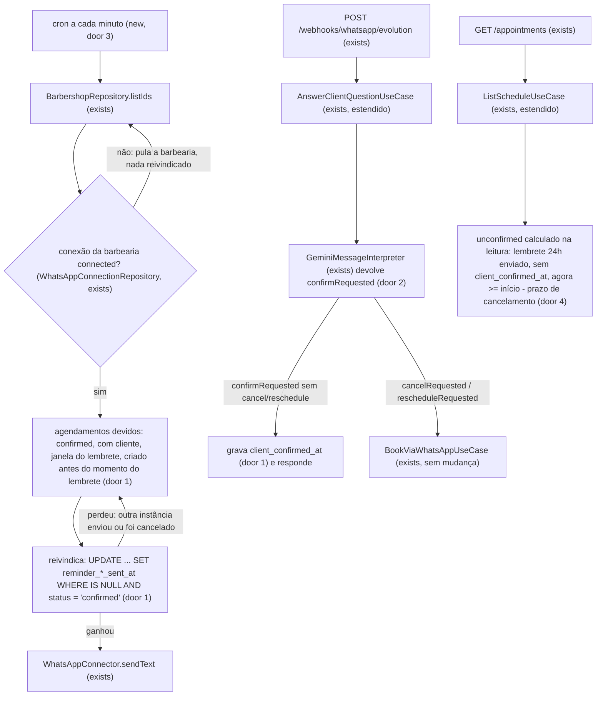

# US-19: Lembretes de 24h e 1h

## Problem

Hoje, depois de agendar (pelo WhatsApp na US-17, ou pelo painel na US-10), o cliente não recebe mais nenhuma mensagem até a hora do horário. Quem esqueceu simplesmente não aparece: o barbeiro fica com o horário parado e a barbearia só descobre na hora, quando já não dá para encaixar mais ninguém. A equipe também não tem como saber, antes do horário, quais clientes ainda pretendem vir: todo agendamento `confirmed` parece igual na agenda. O PRD não traz número de faltas; a meta é qualitativa ("reduzir faltas", D-09).

Com a entrega, o cliente recebe pelo WhatsApp da barbearia um lembrete 24h antes (com as opções confirmar, remarcar ou cancelar) e outro 1h antes. Quem responde "confirmar" fica marcado como confirmado pelo cliente; quem pede para remarcar ou cancelar cai no fluxo da US-18. Na agenda do painel, um agendamento que recebeu o lembrete de 24h e chegou ao prazo de cancelamento sem resposta aparece com o alerta "não confirmado".

## Flow

Reaproveita a rotina por barbearia do reset de faltas (AD-009, `@nestjs/schedule`), o `WhatsAppConnector.sendText` e o estado da conexão da US-13, o fluxo de mensagem da US-15/US-16/US-17/US-18 (`AnswerClientQuestionUseCase` e a interpretação do Gemini) e, para "remarcar" e "cancelar", o `BookViaWhatsAppUseCase` da US-18 sem mudança. Nenhuma regra de agenda é reescrita.

1. **Envio:** um job novo dispara a cada minuto e, barbearia por barbearia (AD-009), lista os agendamentos devidos de cada tipo de lembrete; pula a barbearia cuja conexão do WhatsApp não está `connected`, sem reivindicar nada. Cada agendamento devido é reivindicado com um `UPDATE` condicional (só uma instância vence, e um agendamento cancelado nesse meio tempo não é reivindicado) e só então o texto vai pelo `WhatsAppConnector.sendText`. Erro de uma barbearia é contado e logado, e a rotina segue.
2. **Resposta:** a mensagem do cliente entra pelo webhook e pelo `AnswerClientQuestionUseCase` como hoje. A interpretação ganha `confirmRequested`. Com ele (e sem `cancelRequested`/`rescheduleRequested`), o caso de uso grava `client_confirmed_at` nos agendamentos lembrados do cliente e responde. Remarcar ou cancelar seguem para o `BookViaWhatsAppUseCase` da US-18, que não muda.
3. **Painel:** `GET /appointments` calcula `unconfirmed` na leitura, com o relógio e o prazo de cancelamento das regras da barbearia; todas as rotas que usam o formato de agendamento da agenda passam a trazer `clientConfirmedAt`.

## Impact

| Front | What changes |
| --- | --- |
| domain | termo novo: **lembrete de 24h** e **lembrete de 1h** - mensagem enviada uma vez por agendamento, gravada como o instante do envio no próprio agendamento (door 1) |
| domain | termo novo: **confirmado pelo cliente** - um agendamento `confirmed` em que o cliente respondeu "confirmar" ao lembrete; é um registro ao lado do status, não um status novo (door 1). Ninguém ramifica nele hoje |
| domain | termo novo: **não confirmado** - alerta calculado na leitura, nunca gravado (door 4) |
| domain | existente: `AppointmentStatus` não muda. `SLOT_HOLDING_STATUSES`, `appointments_no_overlap`, `Appointment.cancel` e `markAttendance` ficam como estão |
| domain | existente: interpretação da mensagem ganha `confirmRequested` (door 2). Quem ramifica: `AnswerClientQuestionUseCase`, o schema Zod e o JSON Schema da resposta do Gemini, o `FakeMessageInterpreter` (padrão `false`) e as fixtures de interpretação da US-15 a US-18 |
| domain | existente: tipos de resposta do bot (`reply(kind)` na métrica de respostas) ganham o da confirmação de presença |
| stored data | `appointments` ganha três colunas nulas (door 1); linhas existentes ficam com `NULL` e nada é migrado. Efeito no deploy: agendamentos já existentes, criados há mais de 24h e dentro da janela, recebem o lembrete no primeiro minuto depois do deploy - é o comportamento desejado |
| rota existente | `GET /appointments`, `GET /clients/:id`, `PATCH /appointments/:id/status`, `POST /blocks` (`affectedAppointments` no `201`, `appointments` no `409`): o formato de agendamento (`scheduleAppointmentSchema`) ganha `clientConfirmedAt` |
| rota existente | `GET /appointments`: cada agendamento ganha `unconfirmed` |
| painel (repo `barbershop-panel`) | precisa exibir "confirmado pelo cliente" e o alerta "não confirmado"; fica fora deste repositório (Out of scope) |
| testes existentes | fixtures de `ScheduleEntry` e as asserções de formato das rotas acima ganham o campo novo |

## Relations

`None - nenhuma entidade ou cardinalidade nova. Os lembretes e a confirmação do cliente são atributos do agendamento existente (um de cada por agendamento), não entidades; ver Landing.`

## Surface

| Route | In | Out | Status |
| --- | --- | --- | --- |
| `GET /appointments` | sem mudança | cada item de `appointments[]` ganha `clientConfirmedAt` (`date-time` ou `null`) e `unconfirmed` (`boolean`) | `200`, `400`, `401`, `403` (sem mudança) |
| `GET /clients/:id` | sem mudança | `pastAppointments[]` e `upcomingAppointments[]` ganham `clientConfirmedAt` | `200`, `401`, `404` (sem mudança) |
| `PATCH /appointments/:id/status` | sem mudança | `appointment` ganha `clientConfirmedAt` | `200`, `400`, `401`, `403`, `404`, `409` (sem mudança) |
| `POST /blocks` | sem mudança | cada agendamento de `affectedAppointments` (`201`) e de `appointments` (`409`) ganha `clientConfirmedAt` | `201`, `400`, `401`, `403`, `404`, `409` (sem mudança) |

## Landing

| One-way door | Literal shape | Alternative rejected |
| --- | --- | --- |
| 1. registro dos lembretes e da confirmação do cliente | Migration adiciona a `appointments` as colunas `reminder_24h_sent_at timestamptz NULL`, `reminder_1h_sent_at timestamptz NULL` e `client_confirmed_at timestamptz NULL`, sem `DEFAULT`. Reivindicar um lembrete é `UPDATE appointments SET reminder_24h_sent_at = $now WHERE barbershop_id = $1 AND id = $2 AND reminder_24h_sent_at IS NULL AND status = 'confirmed'` (idem para 1h), e só quem afeta uma linha envia. Confirmar é `UPDATE ... SET client_confirmed_at = $now WHERE ... AND client_confirmed_at IS NULL AND status = 'confirmed' AND reminder_24h_sent_at IS NOT NULL` | (a) um status novo `client_confirmed`: todo lugar que hoje olha `confirmed` (`SLOT_HOLDING_STATUSES`, a constraint de exclusão, `cancel`, `markAttendance`, a busca da US-18) precisaria aceitar os dois; (b) uma tabela `appointment_reminders (appointment_id, kind, sent_at)`: um JOIN a mais em toda leitura da agenda para dois fatos de cardinalidade fixa 1:1; o lembrete de retorno da US-25 é por cliente, não por agendamento, e não caberia nela de qualquer jeito |
| 2. intenção de confirmar presença | `MessageInterpretation.confirmRequested: boolean` (padrão `false`), no schema Zod e no JSON Schema mandado ao Gemini, mesmo padrão de `cancelRequested` (US-18) | reconhecer a palavra "confirmar" por regex antes do Gemini: CLAUDE.md manda a intenção sair do modelo, e "confirmo sim", "pode deixar que eu vou" e "ok" escapariam de uma lista de palavras |
| 3. job dos lembretes | `@Cron('* * * * *', { name: 'appointment-reminders', timeZone: 'America/Sao_Paulo' })` num job novo em `src/infrastructure/jobs/`, no padrão do `NoShowResetJob`; roda em toda instância, e a trava da porta 1 garante um envio por lembrete | uma fila com agendamento por mensagem (ex.: BullMQ + Redis): dependência e serviço novos no compose para um volume que cabe numa varredura por minuto; o código não tem fila hoje |
| 4. formato da resposta da agenda | `scheduleAppointmentSchema` ganha `clientConfirmedAt: string (date-time) \| null`; só o item de `GET /appointments` ganha `unconfirmed: boolean`, calculado na leitura (AC 14), nunca gravado | (a) gravar o alerta numa coluna por um job: um segundo job para um valor que muda só com o relógio; (b) `unconfirmed` no `scheduleAppointmentSchema`: obrigaria as rotas de perfil, presença e bloqueio a carregar relógio e regras só para repetir o alerta, que o CA-19.5 pede só na agenda |

- Nada mais nesta mudança é difícil de reverter.

## Criteria

Momentos: o lembrete de 24h de um agendamento que começa em `T` tem momento `T - 24h`; o de 1h, `T - 1h`. "Agora" é o relógio da aplicação. Os textos ficam no fuso da barbearia (RNF-04).

### S1: Lembrete de 24h enviado (P1)

O cliente recebe, uma vez, o lembrete com as opções confirmar, remarcar e cancelar (CA-19.1).

**Acceptance Criteria**

1. WHEN o job roda e um agendamento `confirmed` da barbearia tem cliente, `reminder_24h_sent_at` nulo, `T - 24h <= agora < T - 1h` e `created_at <= T - 24h` THEN o sistema SHALL enviar ao telefone do cliente o lembrete de 24h (texto em Assumptions) e gravar `reminder_24h_sent_at = agora` (CA-19.1, RF-16, RN-18)
2. The lembrete de 24h SHALL trazer o nome da barbearia, os serviços, o barbeiro, o dia da semana, a data `dd/mm` e a hora `HH:MM` no fuso da barbearia, e as três opções confirmar, remarcar e cancelar
3. IF o envio do lembrete falha THEN o sistema SHALL manter `reminder_24h_sent_at` gravado (sem reenvio), contar a falha na métrica do AC 20 e logar sem telefone nem texto, e o job SHALL seguir para o próximo agendamento

**Independent test:** e2e com `FixedClock` em `T - 23h59`, agendamento confirmado criado 2 dias antes, rodar o job uma vez -> uma chamada ao `sendText` do fake com o texto literal, `reminder_24h_sent_at` gravado; rodar de novo -> nenhuma chamada nova.

### S2: Lembrete de 1h enviado (P1)

O cliente recebe, uma vez, o lembrete final (CA-19.3).

**Acceptance Criteria**

4. WHEN o job roda e um agendamento `confirmed` da barbearia tem cliente, `reminder_1h_sent_at` nulo, `T - 1h <= agora < T` e `created_at <= T - 1h` THEN o sistema SHALL enviar ao cliente o lembrete de 1h (texto em Assumptions) e gravar `reminder_1h_sent_at = agora` (CA-19.3, RF-17, RN-18)
5. The lembrete de 1h SHALL ser enviado também quando o cliente já confirmou presença ou não recebeu o lembrete de 24h
6. IF o envio do lembrete de 1h falha THEN o sistema SHALL se comportar como no AC 3 para `reminder_1h_sent_at`

**Independent test:** e2e com `FixedClock` em `T - 59min`, rodar o job -> uma chamada ao `sendText` com o texto do lembrete de 1h, `reminder_1h_sent_at` gravado.

### S3: Lembretes que não saem (P1)

Agendamento criado depois do momento, cancelado, sem cliente ou com WhatsApp desconectado não recebe lembrete (CA-19.4, CA-19.6).

**Acceptance Criteria**

7. IF o agendamento foi criado depois do momento de um lembrete (`created_at > T - 24h` ou `created_at > T - 1h`) THEN o sistema SHALL nunca enviar esse lembrete, mesmo dentro da janela, e o outro lembrete SHALL seguir a própria regra (CA-19.4, RN-18)
8. IF o agendamento tem status diferente de `confirmed` (`cancelled`, `attended`, `no_show`) quando o job roda THEN o sistema SHALL não enviar nenhum lembrete dele (CA-19.6)
9. IF o agendamento é cancelado entre a listagem dos devidos e a reivindicação THEN a reivindicação SHALL não afetar a linha e o sistema SHALL não enviar o lembrete (CA-19.6, porta 1)
10. IF o agendamento não tem cliente (`client_id` nulo, agendamento manual sem cliente) THEN o sistema SHALL não enviar lembrete
11. WHILE a conexão do WhatsApp da barbearia não está `connected` (ou não existe) o sistema SHALL não reivindicar nem enviar lembretes dela; WHEN ela volta a `connected` THEN os lembretes ainda dentro da janela SHALL sair no próximo minuto
12. WHEN duas instâncias rodam o job ao mesmo tempo sobre o mesmo agendamento devido THEN o sistema SHALL enviar o lembrete uma vez só (porta 1)

**Independent test:** e2e com `FixedClock`: um agendamento criado em `T - 3h` (só o de 1h sai), um `cancelled`, um sem cliente e uma barbearia com conexão `disconnected`, rodar o job em `T - 59min` -> só uma chamada ao `sendText`, a do agendamento criado em `T - 3h`.

### S4: Cliente confirma presença (P1)

"Confirmar" marca o agendamento lembrado como confirmado pelo cliente; remarcar e cancelar seguem a US-18 (CA-19.2).

**Acceptance Criteria**

13. WHEN a interpretação traz `confirmRequested: true`, sem `cancelRequested` nem `rescheduleRequested`, e o cliente tem agendamentos `confirmed` que começam depois de agora e já receberam o lembrete de 24h THEN o sistema SHALL gravar `client_confirmed_at = agora` nos que ainda não têm, e responder com a confirmação de presença listando todos eles (texto em Assumptions) (CA-19.2)
14. IF a interpretação traz `confirmRequested: true` e o cliente não tem nenhum agendamento nas condições do AC 13 THEN o sistema SHALL responder "Você não tem nenhum agendamento aguardando confirmação." sem gravar nada
15. WHEN a interpretação traz `cancelRequested` ou `rescheduleRequested`, com ou sem `confirmRequested` THEN o sistema SHALL seguir o fluxo da US-18 sem mudança e não gravar `client_confirmed_at` (CA-19.2)
16. The precedência SHALL ser: pedido de atendente (US-16) > fora de contexto (US-15) > cancelar/remarcar/agendar/escolha (US-17/US-18) > confirmar presença > dúvidas
17. WHILE a conversa está pausada para atendimento humano (US-16) o sistema SHALL não processar "confirmar" (o bot fica em silêncio, como hoje)
18. The confirmação de presença SHALL ler e gravar só agendamentos da barbearia e do cliente da conversa (RN-26)
19. The sistema SHALL contar cada confirmação de presença numa métrica de negócio nova, sem label de cliente nem de barbearia

**Independent test:** e2e: agendamento com `reminder_24h_sent_at` gravado, mensagem com `confirmRequested: true` -> `client_confirmed_at` gravado e resposta "Presença confirmada!" com o agendamento; uma segunda mensagem igual -> mesma resposta, `client_confirmed_at` inalterado.

### S5: Alerta "não confirmado" no painel (P2)

A agenda mostra quem recebeu o lembrete e não respondeu até o prazo de cancelamento (CA-19.5, RF-18).

**Acceptance Criteria**

20. The sistema SHALL contar cada lembrete numa métrica de negócio nova com os labels `kind` (`24h`, `1h`) e `outcome` (`sent`, `failed`), sem label de cliente nem de barbearia
21. WHEN `GET /appointments` lista um agendamento `confirmed` com `reminder_24h_sent_at` preenchido, `client_confirmed_at` nulo e `agora >= T - cancellationDeadlineMinutes` (regras da barbearia, padrão 120 min) THEN o sistema SHALL devolver `unconfirmed: true` nesse item (CA-19.5, RF-18)
22. IF qualquer uma das condições do AC 21 falha (status diferente de `confirmed`, lembrete de 24h não enviado, cliente já confirmou, ou ainda antes do prazo) THEN o sistema SHALL devolver `unconfirmed: false`
23. The `clientConfirmedAt` SHALL vir em todas as rotas que usam o formato de agendamento da agenda (Surface), `null` quando o cliente não confirmou (CA-19.2)
24. The sistema SHALL descrever no Swagger `clientConfirmedAt` no formato de agendamento e `unconfirmed` em `GET /appointments`, com `.meta({ description, example })`

**Independent test:** e2e: com `FixedClock` em `T - 1h59` e prazo de 120 min, um agendamento lembrado sem confirmação -> `unconfirmed: true` em `GET /appointments`; o mesmo em `T - 2h01` -> `false`; um lembrado e confirmado -> `false` e `clientConfirmedAt` preenchido.

## Out of scope

| Excluded | Why |
| --- | --- |
| Exibir "confirmado pelo cliente" e o alerta "não confirmado" na interface | O painel é o repositório `barbershop-panel`; esta história entrega os campos da API |
| Lembrete de retorno (RF-19, RF-20) | US-25 |
| Reenviar um lembrete que falhou | Nenhum CA pede; ver Assumptions |
| Configurar a antecedência dos lembretes (24h e 1h) por barbearia | RN-18 fixa 24h e 1h e não marca como "sugestão, a validar" |
| Avisar a equipe quando um cliente confirma ou fica sem confirmar | Nenhum CA pede; o alerta do painel cobre RF-18 |
| Lembrar agendamentos de clientes bloqueados por assinatura inativa | US-21 decide o que o bot faz com assinatura inativa |

## Assumptions

| Assumption | Chosen default | Rationale | Confirmed? |
| --- | --- | --- | --- |
| Limite do alerta "não confirmado" (Pendência do CA-19.5) | `cancellationDeadlineMinutes` das regras da barbearia (padrão 120 min), sem configuração nova | O próprio PRD diz que o CA-19.5 "usa como limite o prazo de cancelamento"; depois dele o cliente já não consegue remarcar nem cancelar pelo bot, então é o último momento em que a resposta muda algo | y |
| Envio que falha | Sem reenvio: o lembrete fica marcado como enviado, a falha vai para log e métrica | Mesma escolha da US-15 (a reivindicação fica mesmo quando a resposta falha); um telefone inválido seria tentado 1.380 vezes até o fim da janela; o caso comum (WhatsApp desconectado) já é coberto pelo AC 11, que não reivindica | y |
| Janela de envio de cada lembrete | 24h: de `T - 24h` até `T - 1h`; 1h: de `T - 1h` até `T` | Com o job parado, o lembrete atrasado ainda sai enquanto faz sentido, e os dois nunca saem no mesmo minuto | y |
| Texto do lembrete de 24h (AC 1, AC 2) | `Lembrete do seu horário na <barbearia>:` + `Serviço(s): <serviços>` + `Barbeiro: <nome>` + `Data: <dia da semana>, <dd/mm>` + `Horário: <HH:MM>` + linha em branco + `Responda *confirmar* para confirmar presença, *remarcar* para trocar o horário ou *cancelar* para desmarcar.` | L-007; mesmo vocabulário do resumo da US-17; não diz "amanhã" porque um envio atrasado (janela) pode sair no mesmo dia | y |
| Texto do lembrete de 1h (AC 4) | `Seu horário na <barbearia> é hoje às <HH:MM>, com <barbeiro>. Até já!` | L-007; curto, sem opções, porque já passou do prazo de cancelamento padrão | y |
| Texto da confirmação de presença (AC 13) | `Presença confirmada!` + uma linha por agendamento `<serviços>, <dia da semana>, <dd/mm>, às <HH:MM>, com <barbeiro>` | L-007; mesma linha da lista de candidatos da US-18 | y |
| Mais de um agendamento lembrado e sem confirmação | "Confirmar" confirma todos eles de uma vez (AC 13) | Quem recebeu dois lembretes e responde "confirmo" quer ir aos dois; perguntar "qual deles" pediria um terceiro tipo de rascunho para um caso raro | y |
| Conversa pausada para atendimento humano | O lembrete sai mesmo assim; a resposta do cliente fica com a equipe (AC 17) | RF-13 pausa as respostas automáticas, não os avisos da agenda; deixar de lembrar aumentaria as faltas que a história quer reduzir | y |
| Lembrete e a atividade da conversa | Enviar um lembrete não altera `last_activity_at` nem o rascunho da conversa | A reativação automática (RN-23) conta mensagens do cliente; o lembrete não é uma resposta do bot | y |
| "Remarcar"/"cancelar" depois do lembrete | Segue a US-18 sem pré-selecionar o agendamento lembrado: com mais de um agendamento futuro, o bot pergunta qual | CA-19.2 manda "seguir a US-18"; pré-selecionar exigiria guardar o lembrete no rascunho, que vence em 60 min (AD-013) | y |

**Open questions:** none - all resolved or logged above. O usuário aprovou o plano com as recomendações (alerta no prazo de cancelamento; sem reenvio).

## Observable

| Surface | Decision | Landing |
| --- | --- | --- |
| API `GET /appointments` | response shape | AC 21, AC 22, AC 23, porta 4 |
| API `GET /clients/:id`, `PATCH /appointments/:id/status`, `POST /blocks` | response shape | AC 23, porta 4 |
| API todas as rotas alteradas | error shape and codes | existing - nenhum erro novo, só campos novos na resposta |
| API todas as rotas alteradas | documentation | AC 24 |
| API todas as rotas alteradas | authorization, versioning, rate limit | existing - AD-007 e US-08/US-12, sem mudança; campo aditivo, sem versão nova |
| webhook `POST /webhooks/whatsapp/evolution` | response shape, error shape, quem chama | existing - `204` da US-13, sem mudança |
| scheduled task job dos lembretes | output format and verbosity | AC 3, AC 20 - log por falha sem telefone nem texto e um log de resumo por execução, no padrão do `NoShowResetJob` |
| scheduled task job dos lembretes | flags and defaults, exit codes | n/a - não é comando; roda dentro da API, sem flags (porta 3) |
| scheduled task job dos lembretes | what it prints when it fails halfway | AC 3 e AD-009 - a falha de um agendamento ou de uma barbearia é logada e a rotina segue |
| document lembrete de 24h | structure, tone, what the reader does next | AC 1, AC 2, Assumptions |
| document lembrete de 1h | structure, what the reader does next | AC 4, Assumptions |
| document confirmação de presença | structure, what the reader does next | AC 13, AC 14, Assumptions |
| collection agendamentos confirmados na resposta (AC 13) | ordering, duplicates | ordem cronológica, um por agendamento (mesmo padrão da lista de candidatos da US-18) |

## Sources

- [docs/PRD.md](../../../docs/PRD.md) seção 11, US-19 (CA-19.1 a CA-19.6, RF-16, RF-17, RF-18, RN-18) e a Pendência do CA-19.5 - define a história
- [.specs/STATE.md](../../STATE.md) AD-009 (rotina por barbearia), AD-011 (conector), AD-014 (cancelamento como transição de status)
