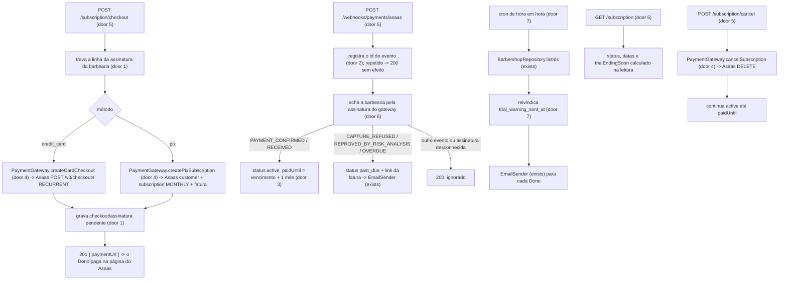
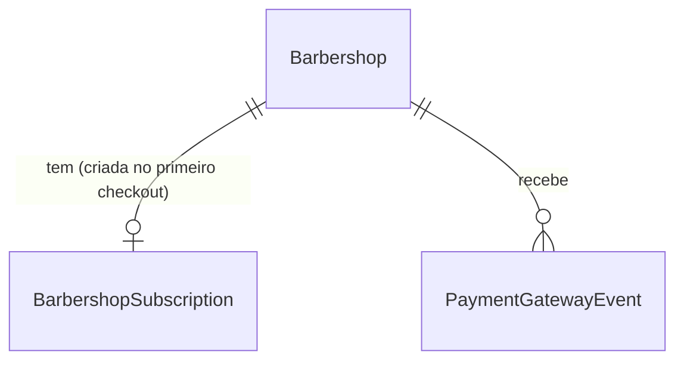

# US-20: Cobrança recorrente da assinatura

## Problem

Hoje toda barbearia nasce em teste gratuito (`subscription_status = 'trialing'`, `trial_ends_at` = cadastro + 14 dias, US-01) e não existe nenhum caminho para sair dele: o Dono que quer continuar não tem como pagar, e a plataforma não tem como receber. Ninguém avisa o Dono de que o teste está acabando, e uma cobrança que falhe não chega a ninguém. Sem isso o produto não pode ir a pilotos pagos (entrega da etapa 6 do PRD). O PRD não traz números de conversão; a meta "conversão do teste" (D-21) ainda não tem valor.

Com a entrega, o Dono abre a tela Assinatura, escolhe cartão ou Pix e paga numa página hospedada pelo Asaas; quando o Asaas confirma o pagamento, a assinatura fica ativa e mostra a data da próxima cobrança. Três dias antes do fim do teste, o Dono recebe um e-mail e vê o aviso no painel. Se uma cobrança falhar, ele recebe um e-mail com o link da fatura para pagar de novo. Ele também pode cancelar, e a assinatura continua ativa até o fim do mês já pago.

## Flow

Reaproveita o padrão de integração do WhatsApp (port neutro em `usecases/ports/`, adaptador e webhook só em `infrastructure/external/`, AD-011), o `EmailSender`, a rotina por barbearia com reivindicação no banco (AD-009, AD-015) e o padrão só-Dono do `SessionGuard` (AD-007). Nada de agenda é tocado.

1. **Assinar:** a rota trava a linha de assinatura da barbearia (criada na primeira vez) para que dois cliques simultâneos não criem duas assinaturas no Asaas. Cartão cria um Checkout recorrente do Asaas (só cartão, cobrança mensal começando hoje) e devolve o link. Pix cria o cliente no Asaas com o CPF/CNPJ informado, cancela uma assinatura Pix anterior ainda não paga e cria uma assinatura mensal com vencimento hoje, devolvendo o link da primeira fatura, que mostra o QR Code Pix. Nada vira `active` aqui.
2. **Webhook:** o Asaas avisa o pagamento. O id do evento é gravado na mesma transação da mudança, então uma reentrega não faz nada. A barbearia sai do id da assinatura no Asaas que guardamos; se ainda não guardamos (assinatura criada pelo checkout de cartão), o adaptador consulta a assinatura no Asaas e liga pelo checkout ou pela `externalReference`.
3. **Aviso do teste:** um job de hora em hora, barbearia por barbearia, reivindica o aviso com um `UPDATE` condicional e manda o e-mail aos Donos. O aviso no painel é calculado na leitura, independente do e-mail.
4. **Cancelar:** apaga a assinatura no Asaas (não há mais cobranças) e grava o pedido de cancelamento; o status continua `active` e a resposta traz até quando.

## Impact

| Front | What changes |
| --- | --- |
| domain | `SubscriptionStatus` era só `'trialing'`; passa a ser `'trialing' \| 'active' \| 'past_due'` (door 3). Quem ramifica hoje: só o `MyAccountPresenter` (`z.enum(['trialing'])`), as fixtures de barbearia dos testes e o painel (`../barbershop-panel`), que lê `GET /me` |
| domain | termo novo: **assinatura** - o vínculo pago da barbearia com o gateway: método (`credit_card` ou `pix`), pago até (`paidUntil`), pedido de cancelamento e problema de pagamento pendente (door 1) |
| domain | termo novo: **pago até** (`paidUntil`) - data local até a qual o último pagamento confirmado cobre; é também a data da próxima cobrança enquanto não houver cancelamento |
| domain | termo novo: **fim do teste próximo** (`trialEndingSoon`) - calculado na leitura, nunca gravado |
| stored data | `barbershops` ganha `trial_warning_sent_at` nula e um `CHECK` em `subscription_status` (door 3, door 7); todas as linhas existentes estão em `'trialing'`, então o `CHECK` passa sem backfill. Duas tabelas novas, vazias (door 1, door 2) |
| stored data | efeito no deploy: barbearias em teste que já estão a 3 dias ou menos do fim recebem o e-mail na primeira hora cheia depois do deploy - é o comportamento desejado |
| rota existente | `GET /me`: `barbershop.subscriptionStatus` aceita os dois valores novos (só amplia o enum, o formato não muda) |
| configuração | variáveis novas no `env.schema.ts` e no `.env.example`: `ASAAS_API_URL`, `ASAAS_API_KEY`, `ASAAS_WEBHOOK_TOKEN`, `ASAAS_TIMEOUT_MS`, `SUBSCRIPTION_PRICE_CENTS`, `SUBSCRIPTION_TRIAL_WARNING_DAYS`. Os e2e e o compose precisam delas |
| logs | o `redact` do `logger.options.ts` ganha `*.cpfCnpj` e o header `asaas-access-token` |
| testes existentes | as suítes e2e que montam o `AppModule` já param os crons (AD-015); o job novo é parado pelo mesmo helper |
| docs | PRD: seção 18 ganha a decisão do gateway (Asaas, Pix como cobrança mensal) e a seção 19 marca o gateway como resolvido; `STATE.md` ganha um AD para o port de pagamento e o webhook (alcança a US-21) |
| painel (repo `barbershop-panel`) | precisa da tela Assinatura e dos avisos; fica fora deste repositório (Out of scope) |

## Relations

One-way constraints: `BarbershopSubscription` tem chave = `barbershop_id` (no máximo uma por barbearia, door 1); o id da assinatura no gateway é único entre todas as barbearias (door 1, é por ele que o webhook acha o tenant); `PaymentGatewayEvent` é único por (gateway, id do evento) (door 2); `subscription_status` só aceita `trialing`, `active` e `past_due` (door 3). No columns and no types here.

## Surface

| Route | In | Out | Status |
| --- | --- | --- | --- |
| `GET /subscription` | sessão (só Dono) | `status` · `trialEndsAt` · `trialEndingSoon` · `priceCents` · `paymentMethod` · `paidUntil` · `nextChargeDate` · `cancelsAt` · `paymentIssueUrl` | `200`, `401`, `403` |
| `POST /subscription/checkout` | sessão (só Dono); `method` (`credit_card` ou `pix`), `cpfCnpj` (obrigatório no Pix) | `paymentUrl` | `201`, `400`, `401`, `403`, `409`, `502` |
| `POST /subscription/cancel` | sessão (só Dono) | `cancelsAt` | `200`, `401`, `403`, `409`, `502` |
| `POST /webhooks/payments/asaas` | header `asaas-access-token`; evento do Asaas (`id`, `event`, `payment`) | vazio | `200`, `401` |

## Landing

| One-way door | Literal shape | Alternative rejected |
| --- | --- | --- |
| 1. Tabela da assinatura | `barbershop_subscriptions` com PK `barbershop_id` (FK `barbershops`), `payment_method` `CHECK IN ('credit_card','pix')`, `gateway_customer_id`, `gateway_subscription_id` com `UNIQUE` parcial `WHERE NOT NULL`, `gateway_checkout_id` com `UNIQUE` parcial, `paid_until date` (data local), `cancel_requested_at`, `payment_failed_at`, `payment_issue_url`. O checkout faz `SELECT ... FOR UPDATE` nessa linha durante a chamada ao gateway | Colunas em `barbershops`: misturaria cobrança com dados que a US-03 grava (o mesmo motivo do AD-008). Sem lock: dois cliques criariam duas assinaturas Pix no Asaas, ou seja, cobrança dupla |
| 2. Deduplicação do webhook | `payment_gateway_events (gateway varchar, event_id varchar, barbershop_id uuid null, received_at timestamptz, PRIMARY KEY (gateway, event_id))`, inserido na mesma transação da mudança; conflito = reentrega, responde `200` sem efeito. Uma falha desfaz o insert e responde `500`, e o Asaas reenvia | Deduplicar pelo estado (aplicar `max(paidUntil)`): não impede o segundo e-mail de falha. O Asaas documenta entrega "pelo menos uma vez" e pede para guardar o `id` |
| 3. Estados da assinatura | `barbershops.subscription_status` `CHECK IN ('trialing','active','past_due')`. Cancelar não é um status: a assinatura cancelada é `active` com `cancel_requested_at` até `paid_until` | Status `canceled`: mentiria durante o mês já pago (CA-20.4 diz "continua ativa"). Status `suspended`/`expired` agora: é a US-21, que vai ampliar o `CHECK` |
| 4. Port de pagamento | `PaymentGateway` em `src/usecases/ports/payment-gateway.port.ts` com tipos neutros: `createCardCheckout`, `createPixSubscription`, `cancelSubscription`, `findSubscriptionBarbershop`. O adaptador `AsaasPaymentGateway` e o webhook ficam em `src/infrastructure/external/payments/asaas/`; `fetch` nativo com timeout, sem SDK, como o adaptador da Evolution | SDK do Asaas: não há SDK oficial para Node, e um pacote de terceiros seria dependência nova para quatro chamadas HTTP. Asaas direto no use case: quebra a regra de dependência e prende a US-21 ao fornecedor |
| 5. Contrato das rotas | as quatro rotas de `## Surface`, com os nomes de campo de lá; o webhook autentica por `asaas-access-token` igual a `ASAAS_WEBHOOK_TOKEN` (comparação em tempo constante) e responde `200` para todo evento válido, aplicado ou ignorado | Responder `4xx` para evento desconhecido ou payload estranho: o Asaas trata como falha e, depois de várias, pausa a fila de webhooks da conta |
| 6. Tenant do webhook | o tenant sai do `payment.subscription` comparado com `gateway_subscription_id`; sem correspondência, o adaptador faz `GET /v3/subscriptions/{id}` e liga pela sessão de checkout guardada (cartão) ou pela `externalReference = barbershopId` (Pix). Nunca do corpo do webhook sozinho | Confiar em `payment.externalReference`: não está documentado que a assinatura repassa esse campo às cobranças, e um corpo forjado com o token vazado escolheria o tenant. Exceção nova ao AD-004, no mesmo molde do AD-011 |
| 7. Aviso de fim do teste | `barbershops.trial_warning_sent_at timestamptz null`, reivindicado com `UPDATE ... SET trial_warning_sent_at = now WHERE id = $1 AND trial_warning_sent_at IS NULL AND subscription_status = 'trialing'` por um `@Cron('0 * * * *')`; envio que falha mantém a reivindicação (AD-015) | Calcular "já avisado" pelo log de e-mails: não existe log, e duas instâncias mandariam duas vezes |

- Nothing else in this change is hard to reverse

## Criteria

### S1: o Dono assina com cartão ou Pix e a assinatura fica ativa quando o Asaas confirma (P1)

CA-20.1: escolher o método, pagar na página do Asaas e ver a assinatura ativa com a próxima cobrança 1 mês depois.

**Acceptance Criteria**

1. WHEN o Dono de uma barbearia `trialing` faz `POST /subscription/checkout` com `method: 'credit_card'` THEN the system SHALL criar no gateway um checkout com `chargeTypes: ['RECURRENT']`, `billingTypes: ['CREDIT_CARD']`, ciclo `MONTHLY`, valor `SUBSCRIPTION_PRICE_CENTS`, primeiro vencimento na data de hoje no fuso da barbearia e `externalReference` = id da barbearia, e responder `201 { paymentUrl }` com o link do checkout
2. WHEN o Dono de uma barbearia `trialing` faz `POST /subscription/checkout` com `method: 'pix'` e um `cpfCnpj` válido THEN the system SHALL criar no gateway o cliente com esse documento e uma assinatura mensal Pix de valor `SUBSCRIPTION_PRICE_CENTS` com vencimento hoje no fuso da barbearia, e responder `201 { paymentUrl }` com o link da primeira fatura
3. WHEN o Dono pede um checkout Pix e a barbearia já tem uma assinatura Pix criada e ainda não paga THEN the system SHALL cancelar essa assinatura no gateway antes de criar a nova
4. WHEN dois `POST /subscription/checkout` Pix da mesma barbearia chegam ao mesmo tempo THEN the system SHALL deixar no máximo uma assinatura Pix não cancelada no gateway
5. IF `method` é `pix` e `cpfCnpj` está ausente THEN the system SHALL responder `400` com a mensagem `Informe o CPF ou CNPJ para pagar com Pix.`
6. IF `cpfCnpj` não tem 11 ou 14 dígitos (ignorando `.`, `-` e `/`) ou falha nos dígitos verificadores THEN the system SHALL responder `400` com a mensagem `Informe um CPF ou CNPJ válido.`
7. IF a barbearia está `active` ou `past_due` THEN the system SHALL responder `409` com a mensagem `Esta barbearia já tem uma assinatura.` sem chamar o gateway
8. IF o gateway falha ou não responde em `ASAAS_TIMEOUT_MS` THEN the system SHALL responder `502` com a mensagem `Não foi possível falar com o serviço de pagamento. Tente novamente.` e não alterar o status da barbearia
9. WHEN chega um webhook `PAYMENT_CONFIRMED` ou `PAYMENT_RECEIVED` de uma cobrança com vencimento D da assinatura da barbearia THEN the system SHALL deixar a barbearia `active` com `paidUntil` = D + 1 mês de calendário (dia 29 a 31 sem par no mês seguinte vira o último dia desse mês), sem nunca diminuir um `paidUntil` maior
10. WHEN o webhook de pagamento cita uma assinatura do gateway que ainda não está ligada a nenhuma barbearia THEN the system SHALL consultar a assinatura no gateway e ligá-la à barbearia pelo checkout guardado ou pela `externalReference` antes de aplicar o evento
11. IF a assinatura do evento não pertence a nenhuma barbearia, mesmo depois da consulta ao gateway, THEN the system SHALL responder `200` sem alterar nada
12. IF o header `asaas-access-token` está ausente ou é diferente de `ASAAS_WEBHOOK_TOKEN` THEN the system SHALL responder `401` sem alterar nada
13. WHEN o mesmo `id` de evento chega duas vezes THEN the system SHALL responder `200` à segunda entrega sem alterar nada nem enviar e-mail
14. IF o processamento de um evento falha depois de iniciado THEN the system SHALL desfazer o registro do evento e responder `500`, para que a reentrega do Asaas o aplique

**Independent test:** e2e com o port de pagamento falso: criar o checkout, postar o webhook de pagamento confirmado e ler `GET /subscription` com `status: 'active'` e `nextChargeDate` um mês depois.

### S2: o Dono vê a situação da assinatura (P1)

A tela Assinatura do painel tem de onde ler o estado.

**Acceptance Criteria**

15. WHEN o Dono faz `GET /subscription` THEN the system SHALL responder `200` com `status`, `trialEndsAt`, `trialEndingSoon`, `priceCents` (= `SUBSCRIPTION_PRICE_CENTS`), `paymentMethod` (`null` antes do primeiro checkout), `paidUntil`, `nextChargeDate`, `cancelsAt` e `paymentIssueUrl`
16. WHILE a barbearia está `active` sem pedido de cancelamento the system SHALL devolver `nextChargeDate` = `paidUntil` e `cancelsAt` = `null`
17. IF um usuário Barbeiro chama `GET /subscription`, `POST /subscription/checkout` ou `POST /subscription/cancel` THEN the system SHALL responder `403` com `Acesso negado.`

**Independent test:** `GET /subscription` de uma barbearia recém-cadastrada devolve `status: 'trialing'`, `paymentMethod: null` e o `trialEndsAt` do cadastro.

### S3: aviso de fim do teste por e-mail e no painel (P1)

CA-20.2: faltando 3 dias para o fim do teste, o Dono é avisado por e-mail e no painel.

**Acceptance Criteria**

18. WHEN o job roda e uma barbearia `trialing` tem `trialEndsAt` no futuro e a no máximo `SUBSCRIPTION_TRIAL_WARNING_DAYS` dias (padrão 3) de agora, sem aviso enviado, THEN the system SHALL enviar um e-mail a cada Dono da barbearia com o assunto `Seu teste gratuito termina em breve` e o texto da Assumption "texto do e-mail de fim do teste", e gravar o envio
19. WHEN o job roda de novo para uma barbearia já avisada THEN the system SHALL não enviar outro e-mail
20. IF a barbearia não está `trialing` THEN the system SHALL não enviar o aviso
21. IF o envio do e-mail falha THEN the system SHALL manter o aviso como enviado, logar o erro com o id da barbearia e seguir para a próxima barbearia
22. WHILE a barbearia está `trialing` e `trialEndsAt` está no futuro e a no máximo `SUBSCRIPTION_TRIAL_WARNING_DAYS` dias de agora the system SHALL devolver `trialEndingSoon: true` em `GET /subscription`, e `false` fora dessa condição

**Independent test:** e2e chamando o `run()` do job sobre uma barbearia com teste acabando em 2 dias e lendo o e-mail no `EmailSender` falso.

### S4: cobrança recusada avisa o Dono com o link para pagar (P1)

CA-20.3: o gateway avisa a falha, e o Dono recebe o link para atualizar o pagamento.

**Acceptance Criteria**

23. WHEN chega um webhook `PAYMENT_CREDIT_CARD_CAPTURE_REFUSED`, `PAYMENT_REPROVED_BY_RISK_ANALYSIS` ou `PAYMENT_OVERDUE` de uma cobrança com vencimento igual ou posterior ao `paidUntil` de uma barbearia `active` THEN the system SHALL deixar a barbearia `past_due`, gravar o instante da falha e o `invoiceUrl` da cobrança como `paymentIssueUrl`, e enviar a cada Dono um e-mail com o assunto `Não conseguimos cobrar sua assinatura` e o texto da Assumption "texto do e-mail de falha", com esse link
24. IF a cobrança do evento de falha vence antes do `paidUntil` da barbearia (período já pago) THEN the system SHALL ignorar o evento
25. IF a barbearia não está `active` quando chega o evento de falha THEN the system SHALL ignorar o evento, sem e-mail e sem mudar o instante da primeira falha
26. WHEN chega um pagamento confirmado para uma barbearia `past_due` THEN the system SHALL deixá-la `active` e limpar `paymentIssueUrl` e o instante da falha
27. IF o e-mail de falha não pode ser enviado THEN the system SHALL manter o `past_due` gravado, logar o erro com o id da barbearia e responder `200` ao webhook

**Independent test:** e2e com uma barbearia `active`, postar `PAYMENT_CREDIT_CARD_CAPTURE_REFUSED` e ver `past_due`, o `paymentIssueUrl` em `GET /subscription` e o e-mail no falso.

### S5: cancelar mantendo o período pago (P2)

CA-20.4: cancelar não corta o acesso já pago.

**Acceptance Criteria**

28. WHEN o Dono de uma barbearia `active` sem pedido de cancelamento faz `POST /subscription/cancel` THEN the system SHALL cancelar a assinatura no gateway, gravar o pedido e responder `200 { cancelsAt }` com `cancelsAt` = `paidUntil`, mantendo o status `active`
29. WHILE a barbearia `active` tem pedido de cancelamento the system SHALL devolver em `GET /subscription` `cancelsAt` = `paidUntil` e `nextChargeDate: null`
30. IF a barbearia não está `active` ou já pediu o cancelamento THEN the system SHALL responder `409` com a mensagem `Não há assinatura ativa para cancelar.` sem chamar o gateway
31. IF o gateway falha ao cancelar THEN the system SHALL responder `502` com a mensagem `Não foi possível falar com o serviço de pagamento. Tente novamente.` e não gravar o pedido

**Independent test:** com uma barbearia `active`, `POST /subscription/cancel` devolve `cancelsAt` e `GET /subscription` continua `active` com `nextChargeDate: null`.

### S6: a cobrança é observável (P2)

**Acceptance Criteria**

32. WHEN um webhook do Asaas é processado THEN the system SHALL incrementar `payment_webhook_events_total` no `METRICS_REGISTRY` com `event_group` em `payment_confirmed`, `payment_failed` ou `other` e `outcome` em `applied`, `duplicate`, `ignored` ou `failed`
33. WHEN o adaptador chama o Asaas THEN the system SHALL logar a operação, a duração em ms e o status HTTP ou o erro, sem `cpfCnpj`, token ou chave de API

**Independent test:** `GET /metrics` depois de um webhook repetido mostra `outcome="duplicate"`.

## Out of scope

| Excluded | Why |
| --- | --- |
| Suspender o bot e deixar o painel em modo leitura (teste vencido ou falha há 5 dias) | É a US-21 (RF-43, RN-25); aqui o `past_due` só é registrado |
| Fim do acesso quando passa o `cancelsAt` | Também é a US-21: o que acontece com uma assinatura sem pagamento é a suspensão dela |
| Trocar o cartão dentro do painel | Exigiria receber dado de cartão (escopo PCI); o link da fatura do Asaas cobre o CA-20.3 |
| Pix Automático (débito autorizado) | Decidido nesta história: o Pix é uma fatura mensal; o Pix Automático exige conta elegível e outro fluxo |
| Boleto como método oferecido ao Dono | O RF-41 pede cartão ou Pix |
| Desfazer um cancelamento antes do fim do período | Nenhum CA pede; assinar de novo depois é o caminho |
| Mudar o preço de assinaturas existentes | O preço vem de configuração e vale para assinaturas novas; reprecificar não está em nenhum RF |
| Aviso de fim do teste por WhatsApp | O CA-20.2 pede e-mail e painel |
| Telas do painel (Assinatura e avisos) | Ficam no repositório `barbershop-panel` |

## Assumptions

| Assumption | Chosen default | Rationale | Confirmed? |
| --- | --- | --- | --- |
| Gateway | Asaas | Escolha do usuário nesta sessão | y |
| Pix recorrente | assinatura do Asaas que gera uma fatura Pix por mês; o Dono paga cada uma | Escolha do usuário nesta sessão; o Checkout recorrente do Asaas só aceita cartão | y |
| `billingType` da assinatura Pix | `PIX` | A referência de `POST /v3/subscriptions` lista `UNDEFINED`, `BOLETO`, `CREDIT_CARD` e `PIX` (trecho enviado pelo usuário); `UNDEFINED` deixaria o pagador escolher na fatura, mas o método já foi escolhido no painel | y |
| Preço | `SUBSCRIPTION_PRICE_CENTS` obrigatório, sem padrão no código; `.env.example` traz `9900` como valor de exemplo | O preço está em aberto (PRD seção 19); configurável, nunca fixo | n |
| CPF/CNPJ | Enviado ao Asaas e não guardado no nosso banco; só o id do cliente no Asaas fica gravado | O Asaas exige `cpfCnpj` para criar o cliente; não guardar evita mais um dado pessoal sob a LGPD | n |
| Primeiro vencimento | Hoje, no fuso da barbearia, também durante o teste | O CA-20.1 diz que a assinatura fica ativa ao concluir o pagamento; esperar o fim do teste deixaria o Dono pago e ainda em `trialing` | n |
| Fatura Pix não paga durante o teste | O evento `PAYMENT_OVERDUE` é ignorado enquanto a barbearia está `trialing` (critério 25) | Só há falha de cobrança depois de existir assinatura ativa; o fim do teste é tratado na US-21 | n |
| Validade do checkout de cartão | `minutesToExpire: 60` | Limita a chance de um link antigo ser pago depois que o Dono já assinou por outro caminho | n |
| Frequência do job de aviso | De hora em hora | O aviso pode chegar até 1h depois de faltar 3 dias; um cron diário erraria por até 24h | n |
| Texto do e-mail de fim do teste | `Olá, {nome do Dono}! O teste gratuito da {nome da barbearia} termina em {dd/MM/yyyy, fuso da barbearia}. Para continuar usando, assine em {APP_WEB_URL}/assinatura.` | L-007: copy em pt-BR fixada antes do build | n |
| Texto do e-mail de falha | `Olá, {nome do Dono}! Não conseguimos cobrar a assinatura da {nome da barbearia}. Para continuar usando, faça o pagamento por este link: {paymentIssueUrl}` | L-007 | n |
| Retorno do checkout | `callback.successUrl` e `cancelUrl` = `{APP_WEB_URL}/assinatura` | O painel lê o estado em `GET /subscription`; a confirmação vem só pelo webhook, nunca pelo redirecionamento | n |
| Indicador no `/health/ready` | Nenhum para o Asaas | Uma queda do gateway só afeta o checkout (502) e os webhooks, que o Asaas reenvia; bot e agenda não dependem dele | n |

**Open questions:** duas, nenhuma bloqueia o build.

| # | Kind | Question | Until answered |
| --- | --- | --- | --- |
| 1 | blocks go-live | Preço da assinatura mensal (PRD seção 19) | `SUBSCRIPTION_PRICE_CENTS` de produção fica sem valor real |
| 2 | blocks go-live | Conta do Asaas (sandbox para validar, produção para lançar) com a chave de API e o webhook cadastrado apontando para `/webhooks/payments/asaas` | Os testes usam um port falso e um `fetch` falso, como os da Evolution; sem a chave do sandbox, o campo que liga a assinatura criada pelo checkout de cartão ao checkout fica confirmado só pela documentação |

## Observable

| Surface | Decision | Landing |
| --- | --- | --- |
| API `POST /subscription/checkout` | response shape | AC 1, AC 2 |
| API `POST /subscription/checkout` | error shape and codes | AC 5, AC 6, AC 7, AC 8, AC 17 |
| API `POST /subscription/checkout` | who may call it | AC 17 |
| API `GET /subscription` | response shape | AC 15, AC 16, AC 22, AC 29 |
| API `GET /subscription` | error shape and codes | AC 17; 401 existing - `SessionGuard` (AD-003) |
| API `POST /subscription/cancel` | response shape | AC 28 |
| API `POST /subscription/cancel` | error shape and codes | AC 30, AC 31, AC 17 |
| API `POST /webhooks/payments/asaas` | who may call it | AC 12 |
| API `POST /webhooks/payments/asaas` | response shape and codes | AC 11, AC 13, AC 14; 200 para todo evento válido (door 5) |
| all new `/subscription*` and webhook | versioning | n/a - nenhuma rota da API é versionada; o painel e o Asaas são os únicos consumidores |
| all new `/subscription*` and webhook | rate limit | n/a - a API não tem throttling em nenhuma rota; o checkout é só do Dono, e o webhook é autenticado por token |
| scheduled task trial-warning job | output and failure halfway | AC 21; log de fim com barbearias avisadas e falhas, como o `NoShowResetJob` |
| scheduled task trial-warning job | flags and exit codes | n/a - cron interno, sem flags nem processo próprio |
| document e-mail de fim do teste | structure, tone, next step | AC 18 e Assumption "texto do e-mail de fim do teste": o próximo passo é assinar em `/assinatura` |
| document e-mail de falha | structure, tone, next step | AC 23 e Assumption "texto do e-mail de falha": o próximo passo é pagar pelo link |

## Sources

- [docs/PRD.md](../../../docs/PRD.md) seção 11, US-20 (CA-20.1 a CA-20.4), RF-41, RF-42, RN-24, seção 13
- Documentação do Asaas: [Checkout com assinatura](https://docs.asaas.com/docs/checkout-com-assinatura-recorrente) (recorrente só com cartão), [Criar assinatura](https://docs.asaas.com/reference/criar-nova-assinatura), [Webhooks](https://docs.asaas.com/docs/sobre-os-webhooks) (`asaas-access-token`, entrega pelo menos uma vez, `id` do evento) e [Eventos de cobrança](https://docs.asaas.com/docs/webhook-para-cobrancas)
