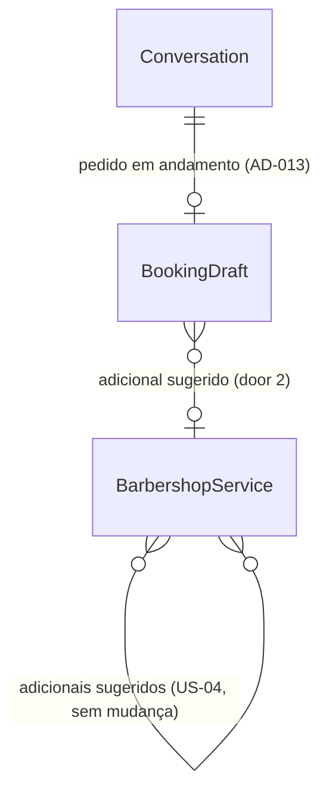

# US-23: Sugestão de serviços adicionais

## Problem

O Dono já marca, na US-04, quais serviços são "adicionais sugeridos" de outro (Barba para Corte, por exemplo), mas essa relação não é lida por ninguém. O cliente que pede "corte amanhã à tarde" pelo WhatsApp recebe só os horários do corte (US-17). Ninguém oferece a barba, e o cliente que a queria precisa lembrar de pedir, ou a barbearia perde a venda. O atendente humano faria essa sugestão; o bot não faz. O PRD não traz números de ticket médio nem de conversão, só a história, o RF-06, o RN-04 e o Fluxo 9.1 ("oferece horários e sugere serviço adicional").

Com a entrega, quando o serviço pedido tem um adicional configurado, o bot pergunta uma vez se o cliente quer incluí-lo, com o preço, antes de buscar horários. Se o cliente aceitar, os horários são buscados com a duração somada e o agendamento sai com os dois serviços e o valor somado. Se recusar, o bot segue só com o serviço pedido e não pergunta de novo.

## Flow

Reaproveita o fluxo de agendamento da US-17 inteiro: o rascunho da conversa (AD-013) guarda a sugestão, o motor da US-07 já soma as durações (RN-04) quando recebe mais de um serviço, e a oferta e o resumo já mostram vários serviços com o valor somado. Nenhuma regra de agenda é reescrita.

1. `POST /webhooks/whatsapp/evolution` com `messages.upsert` -> `EvolutionWebhookController` (exists) - sem mudança
2. `AnswerClientQuestionUseCase` (exists) - pede ao `BookViaWhatsAppUseCase.prepare`, agora com os serviços ativos, o rascunho em vigor, que informa o nome do adicional com sugestão pendente (door 2), e o passa ao intérprete
3. `GeminiMessageInterpreter` (exists) - recebe o adicional sugerido e devolve se o cliente aceitou (door 1); a mensagem que aceita vai para o agendamento, mesmo sem `bookingRequested`
4. `BookViaWhatsAppUseCase` (exists) - com sugestão pendente, aceitar soma o adicional aos serviços do rascunho e qualquer outra resposta recusa; nos dois casos a sugestão deixa de estar pendente
5. mesmo use case, ao buscar - com os serviços resolvidos e algum barbeiro apto, se o rascunho ainda não sugeriu nada e algum serviço tem adicional sugerível, grava a sugestão no rascunho (door 2) e responde com ela, sem consultar o motor; senão segue a US-17 (pergunta de barbeiro, `ListAvailableSlotsUseCase` (exists) com todos os serviços, oferta)
6. `TypeOrmConversationRepository` (exists) - grava e relê o rascunho com o campo novo; um rascunho gravado antes da US-23 é lido como "sem sugestão" (door 2)
7. out: `WhatsAppConnector.sendText` (exists) com a sugestão, a pergunta de barbeiro ou a oferta; o webhook responde `204` como hoje

## Impact

| Front | What changes |
| --- | --- |
| domain | termo novo: sugestão de adicional. O adicional oferecido ao cliente em um agendamento em andamento e se a resposta dele ainda está pendente. Vive no rascunho (door 2), um por rascunho |
| domain | termo existente: interpretação da mensagem (US-15 a US-19). Ganha `addOnAccepted` (door 1). Quem ramifica nela hoje: `AnswerClientQuestionUseCase` (roteamento para o agendamento), `BookViaWhatsAppUseCase`, `composeReply`, o schema Zod do Gemini e o `FakeMessageInterpreter`; o padrão do campo novo é `false` |
| domain | termo existente: `suggestedAddOnIds` do serviço (US-04). Até aqui só era gravado e devolvido pelo painel; passa a ser lido pelo bot. O comentário de `changeSuggestedAddOns` já prevê que a US-23 pula adicionais inativos |
| domain | termo existente: rascunho de agendamento (AD-013). Ganha o campo da sugestão (door 2). Quem lê: `BookViaWhatsAppUseCase` e o schema de leitura do repositório |
| stored data | nada a migrar: o campo vive dentro do `jsonb` `booking_draft`; rascunhos já gravados não têm o campo e são lidos com o padrão "sem sugestão" |
| testes existentes | as fixtures de interpretação ganham `addOnAccepted: false`, e os testes da US-15 que conferem a entrada inteira do intérprete (unitário e e2e) ganham `suggestedAddOn: null`. Nenhuma fixture da US-17/US-18 configura adicionais, então os cenários existentes não recebem a sugestão |
| webhook existente | `POST /webhooks/whatsapp/evolution`: entrada, saída e status não mudam; a descrição no Swagger ganha a sugestão de adicional |

## Relations

One-way constraints: no máximo uma sugestão por rascunho, e ela nunca volta a pendente depois de respondida (door 2). A relação de adicionais da US-04 e a tabela `whatsapp_conversations` não mudam. No columns and no types here.

## Surface

`None - nothing consumed outside`. Nenhuma rota muda de assinatura; só a descrição do webhook no Swagger cresce (AC 16).

## Landing

| One-way door | Literal shape | Alternative rejected |
| --- | --- | --- |
| 1. aceite do adicional no port do LLM | `MessageInterpretation` ganha `addOnAccepted: boolean`; `MessageInterpreterInput` ganha `suggestedAddOn: string \| null` (nome do adicional com sugestão pendente, como no catálogo). O schema Zod do Gemini valida o boolean antes do use case, e o prompt ganha a linha do adicional sugerido e a regra do campo | reaproveitar `choice` (opção 1 = aceitar): `choice` já significa "horário ou agendamento listado", e um "sim" passaria a ter dois sentidos no mesmo campo; deixar o código procurar "sim" no texto: a interpretação da linguagem é do modelo (CLAUDE.md) |
| 2. sugestão no rascunho | `BookingDraft` ganha `addOnSuggestion: { serviceId: string; pending: boolean } \| null`, no `jsonb` `booking_draft`; o schema de leitura usa `.default(null)`, então um rascunho antigo conta como sem sugestão. `null` = nada sugerido neste rascunho; `pending: true` = aguardando a resposta; `pending: false` = respondida, não sugere de novo | dois campos soltos (`suggestedAddOnId`, `addOnPending`): permitem o estado sem sentido "pendente sem adicional"; uma coluna em `whatsapp_conversations`: a sugestão tem o ciclo de vida do rascunho (some ao agendar, pausar ou vencer) e o AD-013 já guarda esse estado no `jsonb` |

- Nothing else in this change is hard to reverse. A door 2 só acrescenta um campo ao formato do AD-013, que já prevê rascunhos antigos lidos com padrão, então não pede um AD novo.

## Criteria

### S1: O bot sugere o adicional uma vez (P1)

O cliente que pede um serviço com adicional recebe a pergunta com o preço antes dos horários (CA-23.1, CA-23.4, RF-06).

**Acceptance Criteria**

1. WHEN um pedido de agendamento (ação `book`) tem os serviços resolvidos, algum barbeiro ativo os faz e um deles tem adicional sugerível THEN o sistema SHALL responder com o texto da sugestão (Assumptions) e SHALL não consultar o `ListAvailableSlotsUseCase` nessa mensagem (CA-23.1)
2. The adicional sugerido SHALL ser o primeiro, percorrendo os serviços do pedido na ordem do rascunho e, em cada um, os `suggestedAddOnIds` na ordem cadastrada, que esteja ativo, não esteja no pedido e seja feito, junto com todos os serviços do pedido, pelo barbeiro pedido ou, sem barbeiro pedido, por algum barbeiro ativo
3. WHEN a sugestão é enviada THEN o rascunho SHALL guardar `addOnSuggestion` com o id do adicional e `pending: true`, mantendo os outros dados do pedido
4. IF nenhum serviço do pedido tem adicional sugerível (nenhum configurado, todos inativos, todos já no pedido ou nenhum barbeiro apto a fazê-lo junto) THEN o sistema SHALL seguir como na US-17, sem sugestão (CA-23.4)
5. WHILE o rascunho tem `addOnSuggestion` diferente de `null` o sistema SHALL não sugerir nenhum adicional, inclusive os adicionais do adicional aceito e a nova busca depois de "Esse horário acabou de ser ocupado." (CA-23.1, "uma única vez")
6. WHERE o rascunho é de remarcação (ação `reschedule`, US-18) o sistema SHALL não sugerir adicional
7. IF o cliente está bloqueado por faltas THEN o sistema SHALL transferir como na US-17 (CA-17.6), sem sugerir
8. WHILE a sugestão está pendente o sistema SHALL mandar ao intérprete o nome do adicional em `suggestedAddOn`, e `null` nos outros casos

**Independent test:** e2e com intérprete fake (`bookingRequested`, `services: ['Corte']`, `barber: 'João'`, amanhã, `afternoon`) e Barba como adicional de Corte -> o conector recebe só a sugestão, e o rascunho guarda Barba com `pending: true`.

### S2: Aceitar soma o adicional (P1)

O cliente que aceita recebe horários com a duração somada e o agendamento com os dois serviços (CA-23.2, RN-04).

**Acceptance Criteria**

9. WHEN a sugestão está pendente e a interpretação traz `addOnAccepted: true` THEN o sistema SHALL acrescentar o adicional ao fim dos serviços do rascunho, marcar `pending: false` e seguir como na US-17 com todos os serviços (pergunta de barbeiro ou busca) (CA-23.2)
10. WHEN a sugestão está pendente e a interpretação traz em `services` o nome do adicional THEN o sistema SHALL tratar a mensagem como aceite, mantendo os serviços que já estavam no rascunho
11. WHEN o adicional é aceito THEN a busca SHALL passar ao `ListAvailableSlotsUseCase` os ids de todos os serviços, e a oferta SHALL mostrar os nomes unidos por ` + `, a soma dos preços e a soma das durações (CA-23.2, RN-04)
12. WHEN o cliente agenda depois de aceitar THEN o agendamento SHALL ter todos os serviços, e o resumo SHALL trazer `Serviços:` com os nomes e o valor somado (formato da US-17)
13. WHEN a mensagem que aceita traz também barbeiro, data, período ou hora THEN o sistema SHALL combiná-los com o rascunho como na US-17 (AC 9 da US-17)
14. WHEN a interpretação traz `addOnAccepted: true` sem `bookingRequested` THEN o sistema SHALL encaminhar a mensagem ao agendamento, com a mesma precedência do pedido de agendamento (atendente > fora de contexto > agendamento)

**Independent test:** unitário com repositórios em memória: rascunho com Barba pendente, `addOnAccepted: true` -> oferta "Horários para Corte + Barba (R$ 75,00, 50 min):" e o fake do motor recebe os dois ids.

### S3: Recusar não insiste (P1)

Quem recusa segue só com o serviço pedido e não ouve a sugestão de novo (CA-23.3).

**Acceptance Criteria**

15. WHEN a sugestão está pendente e a mensagem vai para o agendamento sem aceitar (nem `addOnAccepted`, nem o nome do adicional em `services`) THEN o sistema SHALL manter os serviços do rascunho, marcar `pending: false` e seguir como na US-17 (pergunta de barbeiro ou busca), sem repetir a sugestão (CA-23.3)

**Independent test:** unitário: rascunho com Barba pendente, `bookingRequested: true` e nada mais -> oferta "Horários para Corte (...)", e uma nova mensagem com `bookingRequested` não traz a sugestão.

### S4: Documentação (P1)

Quem integra lê no Swagger que o webhook também sugere adicionais (CLAUDE.md, Documentação da API).

**Acceptance Criteria**

16. The sistema SHALL descrever no Swagger do webhook `POST /webhooks/whatsapp/evolution` a sugestão de adicional (US-23)

**Independent test:** `api-docs.e2e-spec.ts` passa e o documento gerado traz a menção à US-23 na descrição do webhook.

## Out of scope

| Excluded | Why |
| --- | --- |
| Sugerir adicional no agendamento manual do painel | RF-06 e os CAs falam só do bot |
| Sugerir mais de um adicional por agendamento | Decidido pelo usuário: um único adicional (CA-23.1, singular) |
| Sugerir adicional ao remarcar | A remarcação mantém os serviços do agendamento (US-18); CA-23.1 fala de escolher o serviço |
| Desconto ou preço diferente para o adicional | Nenhum RF ou RN pede; o preço é o do cadastro (RF-09) |
| Métrica de sugestões aceitas ou de ticket médio | Nenhum CA pede; os relatórios são a US-26 |

## Assumptions

| Assumption | Chosen default | Rationale | Confirmed? |
| --- | --- | --- | --- |
| Momento da sugestão | Antes de buscar horários, logo que os serviços estão resolvidos e há barbeiro apto, antes da pergunta de barbeiro (AC 1) | Decidido pelo usuário; o CA-23.2 pressupõe a resposta antes da busca | y |
| Quantos adicionais | Só o primeiro adicional sugerível (AC 2) | Decidido pelo usuário | y |
| Texto da sugestão | `Quer incluir <adicional> por +<preço>? Responda "sim" para incluir ou "não" para seguir só com <serviços>.`, com o preço como na US-15 (`R$ 20,00`) e os serviços do pedido unidos por ` + ` | L-007: texto literal antes do código; o CA-23.1 dá o exemplo "quer incluir barba por +R$20?" | n |
| Barbeiro já pedido que não faz o adicional | O adicional não é sugerido se o barbeiro pedido não o faz junto com o pedido; sem barbeiro pedido, basta um barbeiro ativo (AC 2) | Sugerir algo que leva a "<barbeiro> não faz <serviços>" ou "Nenhum barbeiro faz ..." pioraria a conversa por causa de uma venda extra | n |
| Escopo de "uma única vez" | Por rascunho: um pedido novo depois de agendar, de vencer o rascunho (60 min) ou de pausar pode receber a sugestão de novo (AC 5) | O rascunho é a unidade de "agendamento em andamento" do AD-013; o CA-23.1 fala de "quando o cliente escolhe esse serviço" | n |
| "sim, mas só barba" | Com sugestão pendente, citar o adicional em `services` sempre soma, sem trocar os serviços anteriores (AC 10) | Caso raro; a regra simples evita interpretar intenção no código | n |
| Contagem da resposta | A sugestão conta como `whatsapp_replies_total{kind="booking"}` e zera a contagem de falhas, como as outras perguntas do agendamento | Nenhum CA pede métrica nova; segue o tipo das perguntas da US-17 | n |

**Open questions:** none - all resolved or logged above.

## Observable

| Surface | Decision | Landing |
| --- | --- | --- |
| webhook `POST /webhooks/whatsapp/evolution` | response shape, error shape, who may call it | existing - `204`, `400` e `401` da US-13, sem mudança |
| webhook `POST /webhooks/whatsapp/evolution` | versioning, rate limit | n/a - formato da Evolution fixado (AD-011); só ela chama |
| webhook `POST /webhooks/whatsapp/evolution` | documentation | AC 16 |
| document mensagem de sugestão | structure, tone, depth | AC 1 e Assumptions (texto da sugestão) |
| document mensagem de sugestão | what the reader does next | Assumptions: `Responda "sim" para incluir ou "não" para seguir só com <serviços>.` |
| document mensagem de sugestão | empty state | AC 4: sem adicional sugerível não há mensagem |
| document oferta e resumo com adicional | structure, depth | AC 11, AC 12: formato da US-17, com serviços somados |
| collection adicionais de um serviço | ordering, duplicates, the exception that does not fit | AC 2: primeiro na ordem cadastrada; já no pedido, inativo ou sem barbeiro apto é pulado |

## Sources

- [docs/PRD.md](../../../docs/PRD.md) US-23 (CA-23.1 a CA-23.4), RF-06, RN-04, Fluxo 9.1
- [.specs/STATE.md](../../STATE.md) AD-013 (rascunho de agendamento no `jsonb` da conversa)
