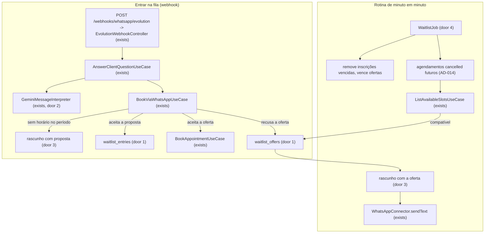
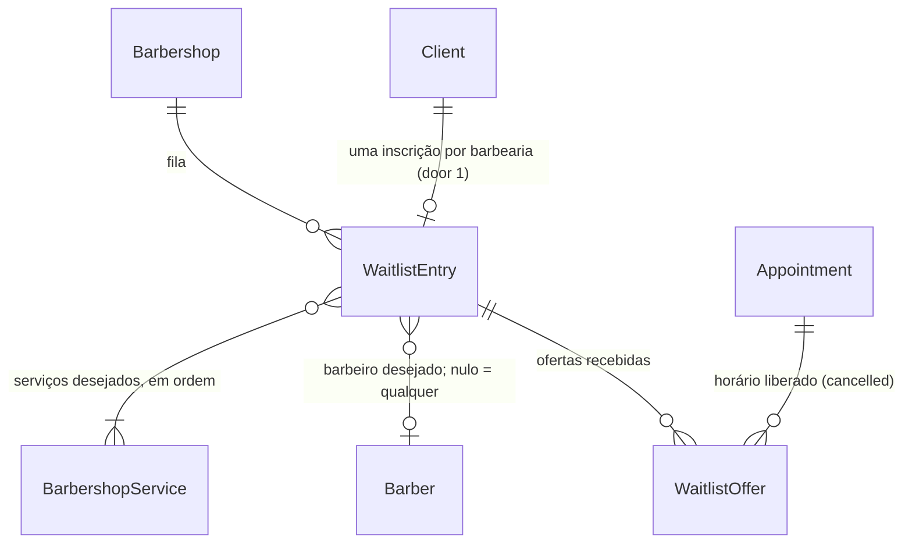

# US-24: Lista de espera

## Problem

Quando o cliente pede um horário pelo WhatsApp e o período que ele quer está cheio, o bot só informa e oferece outros horários (CA-17.7). Se nenhum serve, a conversa acaba ali. Quando outro cliente cancela ou remarca pelo bot (US-18), o horário volta a ficar livre na agenda, mas ninguém avisa quem queria aquele período. O horário fica vazio, a menos que alguém por acaso volte a perguntar. O cliente que queria o horário vai embora, e a barbearia perde o atendimento e a receita daquela cadeira. Um atendente humano faria essa lista de cabeça; o bot não faz. O PRD não traz números de cancelamentos nem de horários perdidos. Traz a história, os RF-21 a RF-23, os RN-15 a RN-17 e o Fluxo 9.3.

Com a entrega, quem não encontra horário no período que quer pode entrar na fila de espera respondendo ao bot. Quando um horário compatível é liberado por um cancelamento ou uma remarcação, o primeiro da fila recebe a oferta pelo WhatsApp e tem o prazo configurado pela barbearia (padrão 15 min, já em `waitlistOfferMinutes` da US-06) para aceitar. Se ele aceitar e o horário ainda estiver livre, o agendamento é criado. Se recusar ou não responder, o próximo compatível recebe a oferta.

## Flow

Reaproveita o fluxo de agendamento da US-17 e da US-18: o rascunho da conversa (AD-013) guarda a proposta de entrar na fila e a oferta enviada; o motor da US-07 decide se o horário liberado serve para a inscrição (RN-03 a RN-05 e a antecedência mínima, RN-02); o aceite agenda pelo mesmo `choose` com `BookAppointmentUseCase`; o horário liberado é o agendamento `cancelled` do AD-014, lido por um cron no molde do AD-015 e do AD-009. Nenhuma regra de agenda é reescrita.

1. Entrar: com a ação `book`, quando o período pedido não tem horário (data sem horário ou nada em 7 dias), o `BookViaWhatsAppUseCase` (exists) responde como hoje e acrescenta a proposta de entrar na fila, que fica guardada no rascunho (door 3). A mensagem seguinte com `waitlistAccepted` (door 2) grava a inscrição (door 1).
2. Liberar e ofertar: o `WaitlistJob` (door 4) roda a cada minuto, barbearia por barbearia (AD-009). Remove as inscrições cujo período acabou, vence as ofertas fora do prazo e, para cada agendamento `cancelled` que começa no futuro e não tem oferta pendente, pergunta ao `ListAvailableSlotsUseCase` (exists) se o primeiro da fila ainda não ofertado pode ocupar aquele horário. Para o primeiro compatível, grava a oferta (door 1), troca o rascunho do cliente pela oferta (door 3) e envia o texto pelo `WhatsAppConnector` (exists).
3. Responder: um "sim" vira `choice: 1` (regra que o prompt já tem para oferta de uma opção). O `choose` (exists) reivindica a oferta dentro do prazo, agenda e tira o cliente da fila. Com `offerDeclined` (door 2), a oferta fica recusada e a rotina seguinte passa o horário ao próximo.
4. out: respostas pelo `WhatsAppConnector.sendText` (exists); o webhook responde `204` como hoje.

## Impact

| Front | What changes |
| --- | --- |
| domain | termo novo: inscrição na lista de espera. Um cliente, seus serviços, barbeiro (ou qualquer) e o período desejado (datas locais e turno opcional). Vive em `waitlist_entries` (door 1), uma por cliente por barbearia |
| domain | termo novo: oferta da lista de espera. Um horário liberado (o agendamento cancelado) oferecido a uma inscrição, com prazo e desfecho (`pending`, `accepted`, `declined`, `expired`). Vive em `waitlist_offers` (door 1) |
| domain | termo existente: interpretação da mensagem (US-15 a US-23). Ganha `waitlistAccepted` e `offerDeclined` (door 2). Quem ramifica nela hoje: `AnswerClientQuestionUseCase` (roteamento para o agendamento), `BookViaWhatsAppUseCase`, `composeReply`, o schema Zod do Gemini e o `FakeMessageInterpreter`. O padrão dos campos novos é `false` |
| domain | termo existente: rascunho de agendamento (AD-013). Ganha `waitlistProposal` e `waitlistOfferId` (door 3). Quem lê: `BookViaWhatsAppUseCase` e o schema de leitura do repositório |
| domain | termo existente: agendamento `cancelled` (AD-014). Até aqui só era gravado; passa a ser lido pela rotina como horário liberado. O AD-014 já previa esse consumidor |
| domain | termo existente: `waitlistOfferMinutes` das regras (US-06). Até aqui só era gravado e devolvido pelo painel; passa a definir o prazo da oferta |
| stored data | duas tabelas novas, vazias na criação: nada a migrar. Rascunhos já gravados não têm os campos novos e são lidos com `null` |
| testes existentes | as fixtures de interpretação ganham `waitlistAccepted: false` e `offerDeclined: false`, e os testes que conferem a entrada inteira do intérprete ganham `waitlistProposal: null` e `waitlistOffer: false`. Os cenários da US-17 que terminam sem horário (`nothingFreeText`, `emptyDateText`) passam a ter a proposta no fim da resposta |
| e2e | a suíte nova monta o `AppModule` e chama `stopScheduledJobs(app)` (AD-015); o helper já para todo cron registrado, inclusive o novo, sem mudança |
| webhook existente | `POST /webhooks/whatsapp/evolution`: entrada, saída e status não mudam; a descrição no Swagger ganha a lista de espera |

## Relations

One-way constraints (door 1): uma inscrição por cliente por barbearia; no máximo uma oferta pendente por agendamento liberado; no máximo uma oferta pendente por inscrição; uma inscrição recebe cada agendamento liberado no máximo uma vez; o desfecho da oferta está num conjunto fechado; remover a inscrição remove as ofertas dela. Toda linha carrega a barbearia (RN-26). No columns and no types here.

## Surface

`None - nothing consumed outside`. Nenhuma rota muda de assinatura; só a descrição do webhook no Swagger cresce (AC 27). A fila não aparece no painel (Out of scope).

## Landing

| One-way door | Literal shape | Alternative rejected |
| --- | --- | --- |
| 1. tabelas da fila | `waitlist_entries` com `UNIQUE (barbershop_id, client_id)`, serviços em `waitlist_entry_services` com a posição; `waitlist_offers` com `status` em `CHECK (status IN ('pending', 'accepted', 'declined', 'expired'))`, `expires_at timestamptz`, FK para a inscrição com `ON DELETE CASCADE`, e os índices `UNIQUE (barbershop_id, appointment_id) WHERE status = 'pending'`, `UNIQUE (entry_id) WHERE status = 'pending'` e `UNIQUE (entry_id, appointment_id)`. A rotina grava a oferta com `INSERT ... ON CONFLICT DO NOTHING` antes de enviar, então de duas instâncias só uma oferta | ofertas num `jsonb` da inscrição: o banco não garantiria uma oferta pendente por horário entre instâncias (RN-15); várias inscrições por cliente: duas ofertas ao mesmo cliente disputariam o único rascunho da conversa (AD-013) |
| 2. lista de espera no port do LLM | `MessageInterpretation` ganha `waitlistAccepted: boolean` (aceita entrar na fila proposta) e `offerDeclined: boolean` (recusa o horário da lista de espera oferecido); `MessageInterpreterInput` ganha `waitlistProposal: string \| null` (o período proposto, como o cliente leu) e `waitlistOffer: boolean`. O aceite da oferta continua sendo `choice: 1`. O schema Zod do Gemini valida os dois booleans | um campo genérico `answer: 'yes' \| 'no'`: deixaria o `addOnAccepted` da US-23 como um segundo mecanismo para a mesma coisa, ou exigiria reescrevê-lo agora; reaproveitar `addOnAccepted`: um "sim" teria dois sentidos no mesmo campo |
| 3. fila no rascunho | `BookingDraft` ganha `waitlistProposal: { startsOn: string; endsOn: string; period: BookingPeriod \| null } \| null` e `waitlistOfferId: string \| null`, no `jsonb` `booking_draft`, com `.default(null)` na leitura (AD-013) | uma coluna em `whatsapp_conversations`: proposta e oferta vivem o ciclo do rascunho (somem ao agendar, pausar ou vencer), que o AD-013 já guarda no `jsonb` |
| 4. horário liberado lido por cron | `WaitlistJob` com `@Cron('* * * * *')` em toda instância (AD-015), barbearia por barbearia (AD-009); "liberado" = agendamento `status = 'cancelled'` com `starts_at > now`, sem coluna nova em `appointments`. Novo AD-018 em `.specs/STATE.md` | gancho no cancelamento do bot: o AD-014 decidiu que nada é despachado, e a oferta seguinte (CA-24.4) precisa de uma rotina de qualquer jeito; consultar o motor para toda inscrição a cada minuto: ofereceria horários que sempre estiveram livres e não saberia qual horário a inscrição já recusou |

- Nothing else in this change is hard to reverse. A oferta não segura o horário: enquanto ela está pendente, o horário continua livre para qualquer outro agendamento, como pede o CA-24.3 ("e o horário ainda está livre").

## Criteria

### S1: Entrar na lista de espera (P1)

Quem não encontra horário no período que quer pode entrar na fila respondendo ao bot (CA-24.1, RF-07, RF-21).

**Acceptance Criteria**

1. WHEN uma busca da ação `book` não encontra horário até o fim da janela de 7 dias (resposta `nothingFreeText`) THEN o sistema SHALL acrescentar à resposta o texto da proposta (Assumptions) e SHALL guardar no rascunho `waitlistProposal` com `startsOn` = a primeira data buscada, `endsOn` = a última data buscada e `period` = o turno pedido ou `null` (CA-24.1)
2. WHEN a data pedida, com ou sem turno ou hora, não tem horário e o bot oferece horários de outros turnos ou dias (resposta `emptyDateText`) THEN o sistema SHALL acrescentar a proposta depois da oferta e SHALL guardar `waitlistProposal` com `startsOn` = `endsOn` = a data pedida e `period` = o turno pedido, o turno da hora pedida ou `null` (CA-24.1)
3. WHILE o rascunho em vigor tem `waitlistProposal` o sistema SHALL mandar ao intérprete em `waitlistProposal` o período como o cliente leu na proposta, e `null` nos outros casos
4. WHEN a interpretação traz `waitlistAccepted: true` e o rascunho em vigor tem `waitlistProposal` THEN o sistema SHALL gravar a inscrição com os serviços do rascunho na ordem, o barbeiro do rascunho (ou `null` com "tanto faz"), `startsOn`, `endsOn`, `period` e o instante de entrada, SHALL limpar o rascunho e SHALL responder com o texto de inscrição (Assumptions) (CA-24.1, RF-21)
5. IF o cliente já tem uma inscrição na barbearia THEN a nova inscrição SHALL substituir a anterior, com o instante de entrada da nova
6. IF a interpretação traz `waitlistAccepted: true` sem `waitlistProposal` no rascunho em vigor THEN o sistema SHALL não gravar inscrição e SHALL seguir como um pedido de agendamento da US-17
7. WHERE o rascunho é de remarcação (ação `reschedule`, US-18) o sistema SHALL não propor a lista de espera
8. WHEN a interpretação traz `waitlistAccepted: true` ou `offerDeclined: true` sem `bookingRequested` THEN o sistema SHALL encaminhar a mensagem ao agendamento, com a mesma precedência do pedido de agendamento (atendente > fora de contexto > agendamento)

**Independent test:** e2e com intérprete fake: pedido de Corte com João amanhã à tarde, agenda cheia na semana -> a resposta termina com a proposta; a mensagem seguinte com `waitlistAccepted` grava a inscrição e responde a confirmação.

### S2: Oferta ao primeiro compatível (P1)

Quando um horário é liberado, o primeiro da fila que pode ocupá-lo recebe a oferta com prazo (CA-24.2, CA-24.5, RF-22, RN-15, RN-16).

**Acceptance Criteria**

9. WHEN a rotina roda para uma barbearia com WhatsApp `connected` e sem suspensão THEN o sistema SHALL, para cada agendamento `cancelled` com início depois de agora e sem oferta pendente, em ordem de início, ofertar o horário à primeira inscrição compatível por ordem de entrada (instante de entrada, depois id) que não tenha oferta pendente e ainda não tenha recebido esse agendamento (CA-24.2, RN-15)
10. The inscrição SHALL ser compatível com o horário liberado quando o barbeiro dela é `null` ou o do agendamento cancelado, a data local do início está entre `startsOn` e `endsOn`, o início cai no turno dela (quando há turno) e o `ListAvailableSlotsUseCase`, com origem `bot`, o barbeiro do agendamento, os serviços da inscrição e a data local do início, lista um horário que começa exatamente nesse início
11. WHEN uma oferta é feita THEN o sistema SHALL gravá-la `pending` com `expires_at` = agora + `waitlistOfferMinutes` das regras da barbearia, SHALL trocar o rascunho do cliente por um rascunho `book` com os critérios da inscrição, `offer` com o horário (barbeiro e início) e `waitlistOfferId`, e SHALL enviar o texto da oferta (Assumptions) ao telefone do cliente (RN-16)
12. IF o início do horário liberado está a menos da antecedência mínima de agora THEN o sistema SHALL não ofertá-lo a nenhuma inscrição (CA-24.5)
13. IF o cliente da inscrição está bloqueado por faltas (RN-12) ou a conversa dele está pausada para atendimento humano (RN-23) THEN o sistema SHALL pular a inscrição nessa rodada, sem gravar oferta, e seguir para a próxima compatível
14. The sistema SHALL manter no máximo uma oferta pendente por agendamento liberado e por inscrição, inclusive com duas rodadas da rotina ao mesmo tempo (door 1)
15. WHILE o WhatsApp da barbearia não está `connected` ou a barbearia está suspensa (AD-017) o sistema SHALL não gravar nem enviar ofertas
16. IF o envio da oferta falha THEN o sistema SHALL manter a oferta `pending` até `expires_at`, sem reenviar, e SHALL registrar a falha no log e na métrica
17. IF ler ou ofertar falha em uma barbearia THEN a rotina SHALL registrar a falha e seguir para a próxima barbearia (AD-009)

**Independent test:** unitário com repositórios em memória: inscrições de Ana (entrou antes) e Bruno para Corte à tarde amanhã, o agendamento das 15:00 com João cancelado -> só Ana recebe a oferta, com `expires_at` 15 min depois.

### S3: Aceitar a oferta (P1)

Quem aceita dentro do prazo, com o horário livre, sai com o agendamento e deixa a fila (CA-24.3).

**Acceptance Criteria**

18. WHEN o cliente escolhe a opção 1 de um rascunho com `waitlistOfferId`, antes de `expires_at` e com o horário livre THEN o sistema SHALL marcar a oferta `accepted`, SHALL criar o agendamento com origem `bot` pelo `BookAppointmentUseCase`, SHALL responder com o resumo da US-17 e SHALL remover a inscrição do cliente (CA-24.3)
19. IF o cliente escolhe a opção 1 depois de `expires_at` ou quando a oferta não está mais `pending` THEN o sistema SHALL não agendar, SHALL limpar o rascunho, SHALL manter a inscrição e SHALL responder com o texto de oferta expirada (Assumptions)
20. IF o horário foi ocupado ou deixou de ser válido antes do aceite THEN o sistema SHALL seguir como no CA-17.4 e no CA-17.5 (aviso e nova busca com os critérios da inscrição), SHALL manter a inscrição e SHALL não ofertar de novo esse agendamento a ela

**Independent test:** e2e: oferta pendente para Ana; mensagem com `choice: 1` dentro do prazo -> agendamento criado, oferta `accepted`, inscrição removida.

### S4: Recusa e prazo passam a vez (P1)

Uma oferta recusada ou sem resposta vai para o próximo compatível; sem ninguém, o horário fica livre (CA-24.4, RF-23, Fluxo 9.3).

**Acceptance Criteria**

21. WHEN a interpretação traz `offerDeclined: true` e o rascunho em vigor tem `waitlistOfferId` THEN o sistema SHALL marcar a oferta `declined` se ainda `pending`, SHALL limpar o rascunho, SHALL manter a inscrição e SHALL responder com o texto de recusa (Assumptions) (CA-24.4)
22. WHEN a rotina roda e uma oferta `pending` tem `expires_at` até agora THEN o sistema SHALL marcá-la `expired` e, na mesma rodada, ofertar o horário à próxima inscrição compatível (CA-24.4, RN-16)
23. WHEN a oferta de um horário foi recusada ou expirou THEN a próxima oferta desse horário SHALL ir para outra inscrição, nunca de novo para a que já o recebeu
24. IF nenhuma inscrição compatível resta para o horário liberado THEN o sistema SHALL não enviar oferta, e o horário SHALL continuar livre para qualquer agendamento (Fluxo 9.3, passo 5)

**Independent test:** unitário: oferta de Ana vencida -> a rodada a marca `expired` e oferta a Bruno; uma terceira rodada não oferta a ninguém.

### S5: Inscrição vencida sai da fila (P1)

A inscrição dura até o fim do período desejado (CA-24.6, RN-17).

**Acceptance Criteria**

25. WHEN a rotina roda e o fim do período da inscrição já passou THEN o sistema SHALL remover a inscrição e as ofertas dela, mesmo com o WhatsApp desconectado ou a barbearia suspensa. O fim é `endsOn` às 12:00 locais (`morning`), às 18:00 (`afternoon`) ou às 00:00 do dia seguinte (`evening` ou sem turno) (CA-24.6, RN-17)

**Independent test:** unitário com relógio fixo: inscrição de manhã de hoje, relógio às 12:00 -> removida; outra à tarde de hoje continua.

### S6: Observabilidade e documentação (P1)

A operação vê a fila funcionar e quem integra lê no Swagger que o webhook trata a lista de espera.

**Acceptance Criteria**

26. The sistema SHALL contar `waitlist_entries_total{event}` com `event` em `joined`, `expired`, `booked` e `waitlist_offers_total{outcome}` com `outcome` em `sent`, `send_failed`, `accepted`, `declined`, `expired`, no registry `METRICS_REGISTRY` e sem id de cliente ou barbearia nos labels; a rotina SHALL logar ao fim de cada rodada as contagens, sem telefone nem nome do cliente
27. The sistema SHALL descrever no Swagger do webhook `POST /webhooks/whatsapp/evolution` a lista de espera (US-24)

**Independent test:** `GET /metrics` depois do e2e de oferta traz `waitlist_offers_total{outcome="sent"} 1`; `api-docs.e2e-spec.ts` passa e a descrição do webhook cita a US-24.

## Out of scope

| Excluded | Why |
| --- | --- |
| Ver ou editar a fila no painel | Nenhum RF da seção 8.5 ou 8.7 pede; os CAs são todos do bot |
| Oferecer horários liberados por bloqueio removido, jornada alterada ou agendamento manual cancelado | O CA-24.2 define o evento como o da US-18 (AD-014); o painel ainda não cancela agendamentos |
| Lista de espera na remarcação | Exigiria cancelar o agendamento antigo ao aceitar; o CA-24.1 fala do pedido de horário |
| Segurar o horário enquanto a oferta está pendente | O CA-24.3 pede o aceite "e o horário ainda está livre"; reservar mudaria a regra de sobreposição (RN-03) |
| Mais de uma inscrição por cliente | Cada oferta ocupa o rascunho único da conversa (AD-013) |
| Sair da fila a pedido ("me tira da lista") | Nenhum RF/CA pede; a inscrição vence com o período (RN-17) |

## Assumptions

| Assumption | Chosen default | Rationale | Confirmed? |
| --- | --- | --- | --- |
| Texto da proposta | `Se preferir, posso te colocar na lista de espera para <serviços> <quando> e te aviso se vagar um horário. Responda "lista de espera" para entrar.`, com `<serviços>` unidos por ` + ` e `<quando>` = `à tarde em quarta-feira, 08/10`, `em quarta-feira, 08/10` ou `à tarde até terça-feira, 14/10` / `até terça-feira, 14/10` | L-007: texto literal antes do código. Pedir "lista de espera", e não "sim", evita confundir com `choice: 1` quando a oferta ao lado tem uma opção só | n |
| Texto de inscrição | `Pronto! Você está na lista de espera para <serviços> <quando>. Se vagar um horário, eu te aviso por aqui.` | L-007 | n |
| Texto da oferta | `Vagou um horário: <serviços>, <optionLabel> (<preço>, <duração>). Responda "sim" em até <prazo> para agendar ou "não" para recusar.`, com `<prazo>` como `formatDuration` (`15 min`) | L-007; reaproveita o formato da oferta da US-17 | n |
| Texto de oferta expirada | `O prazo para aceitar esse horário acabou. Você continua na lista de espera.` | L-007 | n |
| Texto de recusa | `Tudo bem, você continua na lista de espera.` | L-007 | n |
| Quem recusa ou deixa vencer continua na fila | A inscrição só sai ao agendar pela oferta, ao ser substituída ou ao vencer o período | RF-23 manda passar a oferta ao próximo, não remover; o cliente esperava pelo período, não por um horário só | n |
| Oferta substitui o rascunho em andamento | A oferta troca qualquer rascunho do cliente, e outra mensagem de agendamento depois dela troca a oferta; a oferta substituída continua `pending` até vencer | A oferta tem prazo curto; um rascunho antigo vence em 60 min de qualquer forma (AD-013) | n |
| Rascunho da oferta e TTL | O aceite vale até `expires_at` da oferta, mesmo que o rascunho valesse mais | RN-16: o prazo é o da oferta | n |
| Resposta e contagem | Proposta, inscrição, recusa e oferta expirada contam como `whatsapp_replies_total{kind="booking"}` e zeram a contagem de falhas; o aceite conta como `booked` | Segue o tipo das respostas do agendamento da US-17 e da US-23 | n |

**Open questions:** none - all resolved or logged above. A Pendência da US-24 (prazo de 15 min) já é configurável por barbearia desde a US-06 (`waitlistOfferMinutes`, 5 a 120 min).

## Observable

| Surface | Decision | Landing |
| --- | --- | --- |
| webhook `POST /webhooks/whatsapp/evolution` | response shape, error shape, who may call it | existing - `204`, `400` e `401` da US-13, sem mudança |
| webhook `POST /webhooks/whatsapp/evolution` | versioning, rate limit | n/a - formato da Evolution fixado (AD-011); só ela chama |
| webhook `POST /webhooks/whatsapp/evolution` | documentation | AC 27 |
| scheduled task `WaitlistJob` | output format and verbosity | AC 26: um log por rodada com as contagens |
| scheduled task `WaitlistJob` | flags and defaults | n/a - sem flags; o prazo vem de `waitlistOfferMinutes` (US-06) |
| scheduled task `WaitlistJob` | exit codes | n/a - roda dentro da API; erro é log, não saída de processo |
| scheduled task `WaitlistJob` | what it prints when it fails halfway | AC 16, AC 17 |
| document proposta, inscrição, oferta, expirada, recusa | structure, tone, depth | AC 1, AC 4, AC 11, AC 19, AC 21 e os textos em Assumptions |
| document proposta e oferta | what the reader does next | Assumptions: `Responda "lista de espera"`; `Responda "sim" ... ou "não"` |
| document proposta | empty state | AC 7, AC 1, AC 2: só aparece quando o período pedido não tem horário |
| collection fila de uma barbearia | grouping, ordering | AC 9: por ordem de entrada (instante, depois id) |
| collection fila de uma barbearia | duplicates | AC 5: uma inscrição por cliente, a nova substitui |
| collection fila de uma barbearia | the exception that does not fit | AC 13: bloqueado ou pausado é pulado na rodada |

## Sources

- [docs/PRD.md](../../../docs/PRD.md) US-24 (CA-24.1 a CA-24.6), RF-07, RF-21 a RF-23, RN-15 a RN-17, Fluxo 9.3
- [.specs/STATE.md](../../STATE.md) AD-009, AD-013, AD-014, AD-015, AD-017
