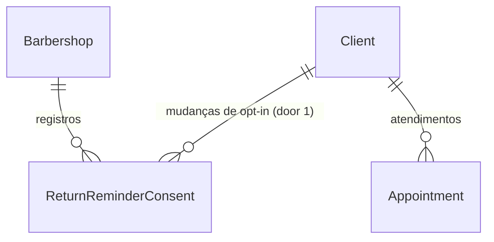

# US-25: Lembrete de retorno com opt-in

## Problem

Depois de um atendimento concluído, o bot não fala mais com o cliente. A barbearia só volta a ouvir dele se ele lembrar de agendar sozinho. O cliente que costuma cortar todo mês esquece, passa do ponto e às vezes acaba indo a outra barbearia, que tem a cadeira livre no dia em que ele lembra. Um atendente humano mandaria um "já faz um mês, bora marcar?" para os clientes fiéis. O bot não manda, e também não pode mandar para todo mundo: o PRD escolheu o consentimento como base legal desse contato (seção 15, D-09). Por isso só recebe quem pediu, e o pedido precisa ficar registrado para comprovar o consentimento. O PRD não traz números de retorno nem de clientes perdidos. Traz a história, o RF-19, o RF-20, o RN-19 e o RN-21.

Com a entrega, o cliente recebe uma pergunta depois do primeiro atendimento concluído e pode aceitar respondendo ao bot. Quem aceitou recebe um convite para agendar quando se passam os dias configurados pela barbearia (padrão 30, já em `returnReminderDays` da US-06) e ele não tem horário marcado. A qualquer momento, "parar lembretes" desliga o lembrete na hora, e cada mudança fica gravada com data, hora e canal.

## Flow

Reaproveita a conversa do bot das US-15 a US-24: o `AnswerClientQuestionUseCase` roteia a mensagem e o intérprete só extrai a intenção (CLAUDE.md, IA). A rotina segue o molde dos lembretes da US-19: `@Cron` de minuto em minuto em toda instância, envio reivindicado no banco antes de sair (AD-015) e barbearia por barbearia (AD-009). O "último atendimento" vem dos agendamentos `attended` da US-11, e o prazo vem das regras da US-06. A coluna `clients.return_reminder_enabled` é a do AD-010. Nenhuma regra de agenda é reescrita, e nenhum dado da barbearia é inventado (RF-09).

```mermaid
flowchart TD
    subgraph Resposta["Ativar e desativar (webhook)"]
        W["POST /webhooks/whatsapp/evolution -> EvolutionWebhookController (exists)"] --> A["AnswerClientQuestionUseCase (exists)"]
        A --> P["BookViaWhatsAppUseCase.prepare (exists): returnReminderQuestion"]
        P --> I["GeminiMessageInterpreter (exists, door 2)"]
        I -->|returnReminder| C["clients.return_reminder_enabled + return_reminder_consents (door 1)"]
        C --> S1["WhatsAppConnector.sendText (exists)"]
    end
    subgraph Rotina["Rotina de minuto em minuto"]
        J["ReturnReminderJob (door 3)"] --> Q["ScheduleQuery (exists): attended que terminaram nas últimas 24h"]
        Q -->|"reivindica clients.return_reminder_asked_at (door 1)"| S2["pergunta: WhatsAppConnector.sendText (exists)"]
        J --> R["ScheduleQuery (exists): clientes com opt-in e último attended + returnReminderDays"]
        R -->|"reivindica appointments.return_reminder_sent_at (door 1)"| S3["convite: WhatsAppConnector.sendText (exists)"]
    end
```

1. Perguntar: o `ReturnReminderJob` (door 3) roda a cada minuto, barbearia por barbearia (AD-009). Para cada agendamento `attended` com cliente que terminou nas últimas 24h, reivindica a pergunta no cliente (door 1) e envia o texto pelo `WhatsAppConnector` (exists).
2. Responder: o `prepare` do `BookViaWhatsAppUseCase` (exists) informa ao intérprete se o cliente acabou de receber a pergunta (`returnReminderQuestion`, door 2). Com `returnReminder: 'enable'` ou `'disable'` na interpretação, o `AnswerClientQuestionUseCase` (exists) grava o novo valor e a mudança na mesma transação (door 1) e responde.
3. Convidar: na mesma rodada, para cada cliente com opt-in ativo cujo último atendimento passou do prazo e que não tem agendamento futuro, reivindica o convite no agendamento atendido (door 1) e envia o texto.
4. out: respostas e mensagens pelo `WhatsAppConnector.sendText` (exists); o webhook responde `204` como hoje.

## Impact

| Front | What changes |
| --- | --- |
| domain | termo novo: mudança de opt-in. Registro de quando o lembrete de retorno de um cliente foi ativado ou desativado, com o canal. Vive em `return_reminder_consents` (door 1), só acrescentado, nunca alterado |
| domain | termo existente: `clients.return_reminder_enabled` (AD-010). Até aqui sempre `false`; passa a ser gravado pelo bot. Quem lê hoje: o perfil do cliente no painel (CA-12.2, `client.presenter.ts`), que passa a mostrar o valor real sem mudança de código |
| domain | termo existente: interpretação da mensagem (US-15 a US-24). Ganha `returnReminder: 'enable' \| 'disable' \| null`, e a entrada ganha `returnReminderQuestion: boolean` (door 2). Quem ramifica nela hoje: `AnswerClientQuestionUseCase`, `BookViaWhatsAppUseCase.prepare`, o schema Zod do Gemini, o prompt e o `FakeMessageInterpreter`. O padrão é `null` e `false` |
| domain | termo existente: `returnReminderDays` das regras (US-06). Até aqui só era gravado e devolvido pelo painel; passa a definir o prazo do convite |
| domain | termo existente: agendamento `attended` (US-11). Até aqui só alimentava o histórico; passa a disparar a pergunta e a contar como "último atendimento" |
| stored data | `clients.return_reminder_asked_at` e `appointments.return_reminder_sent_at` entram nulas em todas as linhas; tabela nova vazia. Na implantação, os clientes atendidos nas 24h anteriores recebem a pergunta. Nenhum cliente tem opt-in ainda, então não há convite acumulado |
| testes existentes | as fixtures de interpretação ganham `returnReminder: null`, e os testes que conferem a entrada inteira do intérprete ganham `returnReminderQuestion: false` |
| e2e | a suíte nova monta o `AppModule` e chama `stopScheduledJobs(app)` (AD-015); o helper já para todo cron registrado, inclusive o novo |
| webhook existente | `POST /webhooks/whatsapp/evolution`: entrada, saída e status não mudam; a descrição no Swagger ganha o lembrete de retorno |

## Relations

One-way constraints (door 1): uma pergunta por cliente, reivindicada no próprio cliente; um convite por agendamento atendido, reivindicado no próprio agendamento; cada mudança de opt-in é uma linha nova que nunca é alterada; o canal está num conjunto fechado; toda linha carrega a barbearia (RN-26) e aponta para um cliente dela. No columns and no types here.

## Surface

`None - nothing consumed outside`. Nenhuma rota muda de assinatura; o perfil do cliente já devolve `returnReminderEnabled` (CA-12.2). Só a descrição do webhook no Swagger cresce (AC 25).

## Landing

| One-way door | Literal shape | Alternative rejected |
| --- | --- | --- |
| 1. opt-in, reivindicações e registro | `clients.return_reminder_asked_at timestamptz NULL`, reivindicada com `UPDATE ... WHERE return_reminder_asked_at IS NULL AND return_reminder_enabled = false`; `appointments.return_reminder_sent_at timestamptz NULL`, reivindicada com `UPDATE ... WHERE return_reminder_sent_at IS NULL AND status = 'attended'`; tabela `return_reminder_consents` (`id`, `barbershop_id`, `client_id`, `enabled boolean`, `channel` com `CHECK (channel IN ('whatsapp'))`, `recorded_at timestamptz`), FK `(client_id, barbershop_id)` para `clients (id, barbershop_id)`. A mudança é `UPDATE clients SET return_reminder_enabled = $v WHERE ... AND return_reminder_enabled <> $v` mais o `INSERT` do registro, na mesma transação, e só quando o `UPDATE` alterou a linha | opt-in só em `clients` com a data da última mudança: o CA-25.5 pede comprovar o consentimento, e uma coluna sobrescrita apaga a prova anterior; reivindicar o convite no cliente: um convite por visita precisa saber de qual atendimento ele partiu |
| 2. lembrete no port do LLM | `MessageInterpretation` ganha `returnReminder: 'enable' \| 'disable' \| null`; `MessageInterpreterInput` ganha `returnReminderQuestion: boolean` (a pergunta acabou de ser feita e nada mais espera resposta). O schema Zod do Gemini valida o enum | dois booleans `returnReminderEnabled`/`returnReminderDisabled`: admitem os dois `true` ao mesmo tempo; reaproveitar `confirmRequested`: "confirmar" já confirma presença (US-19), e um "sim" teria dois sentidos no mesmo campo |
| 3. rotina do lembrete de retorno | `ReturnReminderJob` com `@Cron('* * * * *')` em toda instância (AD-015), barbearia por barbearia (AD-009), com a pergunta e o convite na mesma rodada. Novo AD-019 em `.specs/STATE.md` | enviar a pergunta no endpoint que marca "atendido" (US-11): acopla o painel ao WhatsApp e falharia a requisição do Barbeiro com o WhatsApp desconectado; um cron diário: a pergunta sairia horas depois da visita |

- Nothing else in this change is hard to reverse.

## Criteria

### S1: Pergunta depois do atendimento (P1)

O cliente atendido recebe uma vez a pergunta se quer o lembrete de retorno, que continua desativado até ele aceitar (CA-25.1, RN-21).

**Acceptance Criteria**

1. WHEN a rotina roda para uma barbearia com WhatsApp `connected` e sem suspensão THEN o sistema SHALL enviar o texto da pergunta (Assumptions) ao telefone do cliente de cada agendamento `attended` cujo `ends_at` está entre agora menos 24h e agora, quando o cliente tem o lembrete desativado, nunca recebeu a pergunta e não tem nenhuma mudança de opt-in registrada (CA-25.1)
2. The sistema SHALL enviar a pergunta no máximo uma vez por cliente, inclusive com duas rodadas da rotina ao mesmo tempo e com vários atendimentos dele na janela (door 1)
3. The envio da pergunta SHALL não alterar `return_reminder_enabled`, que continua `false` até o cliente aceitar (CA-25.1)
4. IF a conversa do cliente está pausada para atendimento humano (RN-23) THEN o sistema SHALL não enviar nem reivindicar a pergunta nessa rodada
5. WHILE o WhatsApp da barbearia não está `connected` ou a barbearia está suspensa (AD-017) o sistema SHALL não reivindicar nem enviar a pergunta
6. IF o envio da pergunta falha THEN o sistema SHALL manter a reivindicação, sem reenviar, e SHALL registrar a falha no log e na métrica

**Independent test:** unitário com repositórios em memória e relógio fixo: corte de Ana `attended` que terminou há 1h -> uma pergunta enviada; segunda rodada -> nenhuma.

### S2: Ativar e desativar pelo WhatsApp (P1)

O cliente liga o lembrete respondendo à pergunta ou pedindo, e desliga com "parar lembretes" a qualquer momento (CA-25.3, RF-20, RN-21).

**Acceptance Criteria**

7. WHILE o cliente recebeu a pergunta há no máximo 24h, está com o lembrete desativado e o rascunho em vigor não tem oferta, agendamentos listados, adicional pendente nem proposta de lista de espera, o sistema SHALL mandar ao intérprete `returnReminderQuestion: true`, e `false` nos outros casos
8. WHEN a interpretação traz `returnReminder: 'enable'` THEN o sistema SHALL gravar `return_reminder_enabled = true` e SHALL responder com o texto de ativação (Assumptions) (RF-20)
9. WHEN a interpretação traz `returnReminder: 'disable'` THEN o sistema SHALL gravar `return_reminder_enabled = false` antes de responder e SHALL responder com o texto de desativação (Assumptions), para qualquer cliente, inclusive o que nunca recebeu a pergunta (CA-25.3, RN-21)
10. IF o lembrete já está no valor pedido THEN o sistema SHALL não gravar mudança nem registro e SHALL responder com o mesmo texto de ativação ou desativação
11. WHEN a interpretação traz `returnReminder` diferente de `null` sem `humanRequested` THEN o sistema SHALL tratar o opt-in e nada mais da mensagem, mesmo com `offTopic`, pedido de agendamento ou confirmação de presença, e SHALL contar a resposta como `whatsapp_replies_total{kind="return_reminder"}` e zerar a contagem de falhas
12. WHEN a interpretação traz `humanRequested: true` THEN a transferência da US-16 SHALL vir antes do opt-in, sem alterar o lembrete

**Independent test:** e2e com intérprete fake: cliente com a pergunta enviada responde e o fake devolve `returnReminder: 'enable'` -> `clients.return_reminder_enabled` vira `true` e chega a resposta de ativação; "parar lembretes" -> volta a `false` com a resposta de desativação.

### S3: Convite para voltar (P1)

Quem aceitou recebe um convite quando passa o prazo desde o último atendimento e não tem horário marcado; quem não aceitou não recebe nada (CA-25.2, CA-25.4, RF-19, RN-19).

**Acceptance Criteria**

13. WHEN a rotina roda para uma barbearia com WhatsApp `connected` e sem suspensão THEN o sistema SHALL enviar o texto do convite (Assumptions) a cada cliente com `return_reminder_enabled = true` cujo último atendimento (o agendamento `attended` de maior início) tem `ends_at` + `returnReminderDays` dias das regras da barbearia até agora e ainda não gerou convite (CA-25.2, RN-19)
14. IF o cliente tem um agendamento `confirmed` com início depois de agora THEN o sistema SHALL não enviar nem reivindicar o convite (RN-19)
15. IF o cliente está com o lembrete desativado THEN o sistema SHALL não enviar nem reivindicar o convite, mesmo com o prazo vencido (CA-25.4)
16. The sistema SHALL enviar no máximo um convite por agendamento atendido, inclusive com duas rodadas da rotina ao mesmo tempo (door 1)
17. IF o cliente está bloqueado por faltas (RN-12) ou a conversa dele está pausada (RN-23) THEN o sistema SHALL não enviar nem reivindicar o convite nessa rodada
18. WHILE o WhatsApp da barbearia não está `connected` ou a barbearia está suspensa (AD-017) o sistema SHALL não reivindicar nem enviar convites
19. IF o envio do convite falha THEN o sistema SHALL manter a reivindicação, sem reenviar, e SHALL registrar a falha no log e na métrica
20. IF ler ou enviar falha em uma barbearia THEN a rotina SHALL registrar a falha e seguir para a próxima barbearia (AD-009)

**Independent test:** unitário com relógio fixo: Ana com opt-in e corte `attended` há 30 dias, sem agendamento futuro -> convite enviado; Bruno igual, mas sem opt-in -> nada; Carla com opt-in e horário marcado para amanhã -> nada.

### S4: Registro do consentimento (P1)

Toda mudança de opt-in deixa prova com data, hora e canal (CA-25.5, seção 15).

**Acceptance Criteria**

21. WHEN o lembrete de um cliente muda de valor THEN o sistema SHALL gravar, na mesma transação da mudança, um registro com a barbearia, o cliente, o novo valor, o canal `whatsapp` e o instante em UTC (CA-25.5)
22. The sistema SHALL gravar um único registro quando duas mensagens pedem o mesmo valor ao mesmo tempo (door 1)
23. The sistema SHALL manter os registros anteriores quando o lembrete muda de novo: cada mudança é uma linha nova

**Independent test:** e2e: ativar e depois desativar -> duas linhas em `return_reminder_consents`, `true` e depois `false`, ambas com canal `whatsapp`.

### S5: Observabilidade e documentação (P1)

A operação vê a rotina e os opt-ins funcionarem; quem integra lê no Swagger que o webhook trata o lembrete de retorno.

**Acceptance Criteria**

24. The sistema SHALL contar `return_reminder_messages_total{kind,outcome}` com `kind` em `question`, `invite` e `outcome` em `sent`, `failed`, e `return_reminder_opt_in_changes_total{enabled}` com `enabled` em `true`, `false`, no registry `METRICS_REGISTRY` e sem id de cliente ou barbearia nos labels; a rotina SHALL logar ao fim de cada rodada as contagens, sem telefone nem nome do cliente
25. The sistema SHALL descrever no Swagger do webhook `POST /webhooks/whatsapp/evolution` o lembrete de retorno (US-25)

**Independent test:** `GET /metrics` depois do e2e de opt-in traz `return_reminder_opt_in_changes_total{enabled="true"} 1`; `api-docs.e2e-spec.ts` passa e a descrição do webhook cita a US-25.

## Out of scope

| Excluded | Why |
| --- | --- |
| Ligar, desligar ou ver o histórico de consentimento no painel | O RF-20 dá o controle ao cliente pelo WhatsApp; o perfil já mostra o status (CA-12.2) |
| Repetir o convite quando o cliente não agenda | O RN-19 pede um convite quando o prazo passa; insistir viraria marketing sem pedido |
| Perguntar de novo a quem recusou ou ignorou | Decisão do usuário: uma pergunta por cliente |
| Janela de horário silencioso para os envios | Nenhum RF/RN pede; o convite sai na hora do dia em que o cliente esteve na barbearia (Assumptions) |
| Retenção e exclusão dos registros de consentimento | Questão em aberto do PRD (seção 19, "período de retenção") |

## Assumptions

| Assumption | Chosen default | Rationale | Confirmed? |
| --- | --- | --- | --- |
| Momento da pergunta | Rotina de minuto em minuto, depois do fim de um agendamento `attended`, até 24h depois | Decisão do usuário (Pendência da US-25) | y |
| Quantas perguntas | Uma por cliente; recusa ou silêncio não geram outra | Decisão do usuário | y |
| Texto da pergunta | `Obrigado pela visita à <barbearia>! Quer que eu te avise quando estiver na hora de voltar? Responda "sim" e eu te mando um lembrete daqui a <N> dias. Se não quiser, é só ignorar.`, com `<N>` = `returnReminderDays` | L-007: texto literal antes do código | n |
| Texto de ativação | `Combinado! Vou te lembrar de voltar <N> dias depois do seu último atendimento. Para parar, é só responder "parar lembretes".` | L-007 | n |
| Texto de desativação | `Pronto, você não vai mais receber lembretes de retorno. Se mudar de ideia, é só responder "quero lembrete".` | L-007; serve também ao "não" dado à pergunta | n |
| Texto do convite | `Oi, <nome>! Já faz <N> dias do seu último atendimento na <barbearia>. Que tal agendar o próximo? É só me dizer o dia e o horário. Para não receber mais este lembrete, responda "parar lembretes".` | L-007; a saída do opt-in em toda mensagem não pedida (seção 15) | n |
| Hora do convite | O convite vence em `ends_at` + N dias, na mesma hora do dia em que o cliente terminou o atendimento | Cai no horário em que a barbearia funciona, sem regra nova de horário silencioso | n |
| "Não" à pergunta | Vira `returnReminder: 'disable'`; como o lembrete já está desligado, nada é gravado (AC 10) | Sem um terceiro valor; recusar não é mudança de opt-in | n |
| Conversa pausada ou barbearia suspensa | O bot não lê a mensagem (RN-23) ou responde o texto fixo da suspensão (RN-25), então "parar lembretes" não é tratado nesse período; a rotina também não envia nada a quem está pausado nem em barbearia suspensa | Mantém as regras da US-16 e da US-21; nada sai para o cliente enquanto isso | n |
| Mensagem com opt-in e outro pedido | Só o opt-in é tratado (AC 11) | Uma resposta por mensagem, como nas outras ações do bot | n |

**Open questions:** none - all resolved or logged above. As Pendências da US-25 estão resolvidas: o momento da pergunta foi decidido pelo usuário, e os 30 dias já são configuráveis por barbearia desde a US-06 (`returnReminderDays`, 7 a 365).

## Observable

| Surface | Decision | Landing |
| --- | --- | --- |
| webhook `POST /webhooks/whatsapp/evolution` | response shape, error shape, who may call it | existing - `204`, `400` e `401` da US-13, sem mudança |
| webhook `POST /webhooks/whatsapp/evolution` | versioning, rate limit | n/a - formato da Evolution fixado (AD-011); só ela chama |
| webhook `POST /webhooks/whatsapp/evolution` | documentation | AC 25 |
| scheduled task `ReturnReminderJob` | output format and verbosity | AC 24: um log por rodada com as contagens |
| scheduled task `ReturnReminderJob` | flags and defaults | n/a - sem flags; o prazo vem de `returnReminderDays` (US-06) |
| scheduled task `ReturnReminderJob` | exit codes | n/a - roda dentro da API; erro é log, não saída de processo |
| scheduled task `ReturnReminderJob` | what it prints when it fails halfway | AC 6, AC 19, AC 20 |
| document pergunta, ativação, desativação, convite | structure, tone, depth | AC 1, AC 8, AC 9, AC 13 e os textos em Assumptions |
| document pergunta e convite | what the reader does next | Assumptions: `Responda "sim"`; `responda "parar lembretes"` |
| document pergunta e convite | empty state | AC 1, AC 13 a AC 15: só saem quando as condições valem |
| collection registros de consentimento | ordering, duplicates | AC 22, AC 23: uma linha por mudança, em ordem de `recorded_at` |
| collection registros de consentimento | the exception that does not fit | AC 10: pedir o valor que já está não é mudança |

## Sources

- [docs/PRD.md](../../../docs/PRD.md) US-25 (CA-25.1 a CA-25.5), RF-19, RF-20, RN-19, RN-21, seção 15
- [.specs/STATE.md](../../STATE.md) AD-009, AD-010, AD-013, AD-015, AD-017
