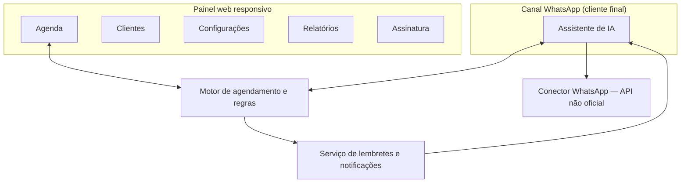
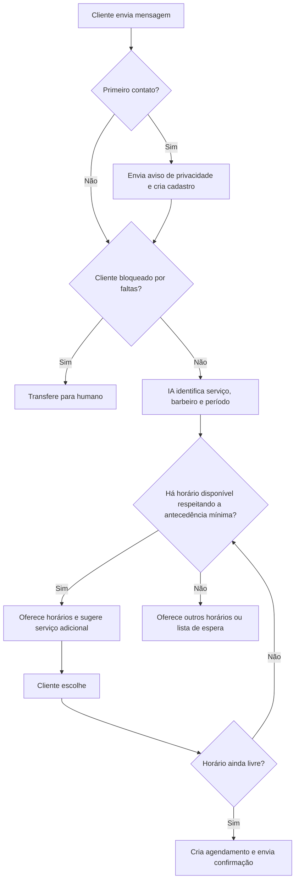
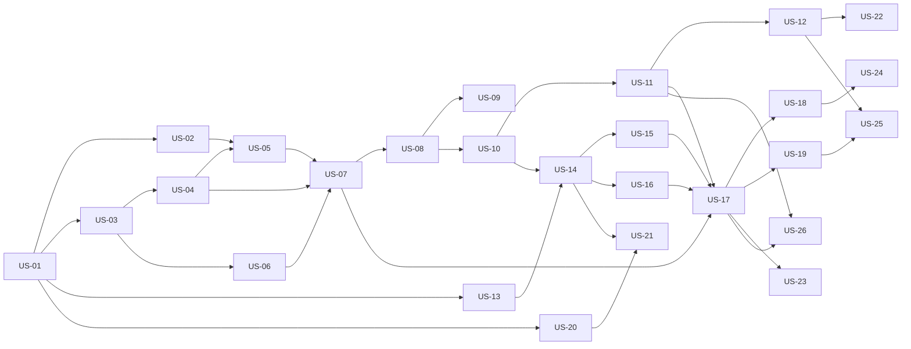

# PRD: Agendamento de Barbearias com IA no WhatsApp

| Campo | Valor |
|---|---|
| Nome do produto | *A definir (nome provisório: "BarberBot")* |
| Versão | 1.1 |
| Data | 2026-09-27 |
| Autor | Ederson Rodrigo |
| Status | Rascunho — MVP |

> Itens marcados com **(sugestão, a validar)** são valores propostos durante a elaboração e ainda precisam de confirmação definitiva.

## 0. Como usar este documento (guia para o agente de desenvolvimento)

Este PRD é a fonte única de verdade para o desenvolvimento. O trabalho é organizado em **histórias de usuário** (seção 11), executadas **em cascata** na ordem da seção 12.

**Para cada história:**
1. Pegue a próxima história da seção 12 cujas dependências já estejam **concluídas**.
2. Leia a história, os requisitos (`RF-`, `RNF-`) e as regras de negócio (`RN-`) referenciados, e o fluxo relacionado (seção 9), se houver.
3. Se o campo **Pendências** apontar uma questão em aberto que bloqueia a implementação, pare e pergunte ao responsável. Valores marcados como "sugestão, a validar" podem ser usados como padrão configurável.
4. Quebre a história em tasks técnicas (ex.: modelo de dados, API, interface, integração, testes). Cada task deve citar o ID da história e os `RF`/`RN` que implementa.
5. Implemente as tasks e escreva testes automatizados que cubram **cada critério de aceite** (`CA-xx.y`).
6. Mantenha a documentação da API (Swagger/OpenAPI) em dia: toda rota nova, ou alteração de rota existente (payload, resposta, status de erro, perfis com acesso), é documentada no mesmo commit, conforme a seção "Documentação da API" do `CLAUDE.md`.
7. Marque a história como concluída apenas quando ela atender à **Definição de Pronto** (seção 11.1).

**Não faça:**
- Não implemente comportamento que não esteja descrito nos `RF`/`RN`/`CA`. Se faltar informação, registre como questão em aberto (seção 19).
- Não adiante funcionalidades de histórias futuras, exceto o mínimo estrutural necessário (ex.: campos de banco de dados).
- Não altere regras de negócio sem atualizar este documento.

---

## 1. Resumo executivo

SaaS para barbearias no Brasil em que um assistente de IA atende clientes no **número de WhatsApp da própria barbearia** e **agenda, remarca e cancela horários automaticamente**, sem intervenção humana. O dono e os barbeiros gerenciam agenda, clientes e configurações por um **painel web responsivo**. A receita vem de **assinatura mensal por barbearia**, com 14 dias grátis.

## 2. Contexto e problema

- **Problema:** barbearias perdem clientes e tempo respondendo WhatsApp manualmente enquanto atendem na cadeira. Mensagens ficam sem resposta, horários são marcados em duplicidade e as faltas (no-show) deixam buracos na agenda.
- **Como é resolvido hoje:** agenda em papel ou no próprio WhatsApp; sistemas como Trinks e AppBarber, com agendamento por link/app; chatbots de menu (opções numeradas), que são pouco naturais para o cliente.
- **Oportunidade:** a IA em linguagem natural permite que o cliente agende "conversando" no canal que já usa, 24h por dia. A política da Meta de 2026 permite explicitamente IA com propósito definido, como agendamento, no WhatsApp.

## 3. Objetivos e métricas de sucesso

| Objetivo | Métrica | Meta |
|---|---|---|
| Automatizar o atendimento de agendamento | % de agendamentos concluídos sem intervenção humana | ≥ 70% **(sugestão, a validar)** |
| Validar disposição a pagar | Conversão do teste gratuito (14 dias) para assinatura paga | A definir |
| Reter barbearias | Churn mensal de barbearias assinantes | A definir |

### Fora dos objetivos (non-goals)
- Não ser um marketplace: o cliente final não descobre novas barbearias pela plataforma.
- Não processar pagamentos do cliente final no MVP.
- Não ser um assistente de IA de uso geral (também proibido pela política do WhatsApp).

## 4. Público-alvo e personas

| Persona | Quem é | Objetivo | Dores |
|---|---|---|---|
| **Dono da barbearia** | Proprietário, frequentemente também barbeiro, com 1 a 10 cadeiras | Agenda cheia, sem perder tempo no celular | Responde WhatsApp entre cortes, sofre com faltas e conflitos de horário |
| **Barbeiro** | Profissional que atende na barbearia | Saber sua agenda e bloquear horários | Depende do dono para saber quem vem |
| **Cliente final** | Pessoa que corta cabelo/barba regularmente | Agendar rápido, a qualquer hora | Demora de resposta, precisa baixar outro app |

## 5. Perfis de usuário e permissões

| Perfil | Descrição | Pode | Não pode |
|---|---|---|---|
| **Dono** | Administrador da barbearia (tenant) | Tudo: configurações, serviços, barbeiros, horários, regras, clientes, todas as agendas, relatórios, assinatura | — |
| **Barbeiro** | Profissional vinculado à barbearia | Ver a própria agenda, criar agendamento manual para si, bloquear seus horários, marcar atendimento/falta nos seus agendamentos, ver histórico dos clientes atendidos | Ver agenda de outros barbeiros, alterar configurações, serviços, preços, relatórios gerais ou assinatura |
| **Cliente final** | Interage apenas pelo WhatsApp | Agendar, remarcar, cancelar, tirar dúvidas, entrar na lista de espera, ativar/desativar o lembrete de retorno | Acessar o painel |

## 6. Escopo

### 6.1 MVP (dentro do escopo)
- Bot de IA no WhatsApp: agendar, remarcar, cancelar, responder dúvidas, sugerir serviços adicionais, lista de espera.
- Transferência para atendimento humano no app WhatsApp Business.
- Lembretes automáticos (24h e 1h) e lembrete de retorno com opt-in.
- Regras de antecedência, cancelamento e bloqueio por faltas.
- Painel web responsivo: agenda, cadastros, clientes, agendamento manual, relatórios básicos.
- Perfis Dono e Barbeiro.
- Assinatura mensal com 14 dias grátis e cobrança recorrente (cartão/Pix).
- Integração WhatsApp via API não oficial.

### 6.2 Fases futuras
- Migração para a API oficial do WhatsApp (Cloud API).
- Sinal/pagamento antecipado via Pix para clientes com faltas.
- Mensagem pós-atendimento com pedido de avaliação.
- Caixa de entrada de conversas no painel.
- App mobile nativo.
- Perfil Recepcionista.

### 6.3 Fora do escopo
- Marketplace de barbearias.
- Estoque, comissões de barbeiros, fidelidade e clube de assinatura.
- Emissão de nota fiscal.

## 7. Estrutura do produto

**Navegação do painel**
- Agenda (visão dia/semana, por barbeiro)
- Clientes (lista, perfil, histórico, faltas, status do lembrete de retorno)
- Relatórios
- Configurações
  - Barbearia (dados, endereço, horário de funcionamento)
  - Serviços (nome, preço, duração, serviços adicionais sugeridos)
  - Barbeiros (cadastro, horários, folgas)
  - Regras de agendamento (antecedência, cancelamento, faltas, lista de espera, retorno)
  - Conexão WhatsApp
  - Usuários
- Assinatura

## 8. Funcionalidades e requisitos funcionais

> Os critérios de aceite ficam nas histórias de usuário (seção 11), que referenciam estes requisitos.

### 8.1 Assistente de IA no WhatsApp

**Descrição:** atende o cliente final em linguagem natural, usando apenas os dados cadastrados da barbearia, e executa ações na agenda.

| ID | Requisito | Prioridade |
|---|---|---|
| RF-01 | O bot deve entender pedidos em linguagem natural (ex.: "tem horário amanhã à tarde com o João?") e extrair serviço, barbeiro, data e horário. | Must |
| RF-02 | O bot deve agendar consultando disponibilidade em tempo real, considerando duração do serviço, horário de funcionamento, folgas, bloqueios e agendamentos existentes. | Must |
| RF-03 | O bot deve perguntar a preferência de barbeiro; se o cliente não tiver ("tanto faz"), oferecer o primeiro barbeiro disponível que realiza o serviço. | Must |
| RF-04 | O bot deve permitir remarcar e cancelar agendamentos do próprio cliente (identificado pelo número de telefone). | Must |
| RF-05 | O bot deve responder dúvidas sobre serviços, preços, duração, endereço e horário de funcionamento, a partir dos dados cadastrados. | Must |
| RF-06 | O bot deve sugerir serviços adicionais configurados pela barbearia durante o agendamento. | Should |
| RF-07 | O bot deve oferecer entrada na lista de espera quando não houver horário no período desejado. | Should |
| RF-08 | O bot não deve responder assuntos fora do contexto da barbearia; deve redirecionar educadamente. | Must |
| RF-09 | O bot não deve inventar informações (preços, serviços, horários) que não estejam cadastrados. | Must |
| RF-10 | Na primeira interação de cada cliente, o bot deve enviar o aviso de privacidade (ver RN-20). | Must |

### 8.2 Transferência para atendimento humano

| ID | Requisito | Prioridade |
|---|---|---|
| RF-11 | O bot deve transferir a conversa para humano quando o cliente pedir explicitamente um atendente. | Must |
| RF-12 | O bot deve transferir a conversa quando não entender o cliente após 2 tentativas consecutivas. | Must |
| RF-13 | Ao transferir, o bot deve avisar o cliente e pausar as respostas automáticas naquela conversa. | Must |
| RF-14 | O humano responde pelo app WhatsApp Business, no mesmo número. | Must |
| RF-15 | O dono deve conseguir reativar o bot na conversa, pelo painel ou por comando definido. | Must |

### 8.3 Lembretes e notificações

| ID | Requisito | Prioridade |
|---|---|---|
| RF-16 | Enviar lembrete 24h antes do agendamento, com opções de confirmar, remarcar ou cancelar. | Must |
| RF-17 | Enviar lembrete 1h antes do agendamento. | Must |
| RF-18 | Sinalizar no painel os agendamentos não confirmados após o lembrete de 24h. | Should |
| RF-19 | Enviar lembrete de retorno X dias após o último atendimento, apenas para clientes com opt-in ativo. | Should |
| RF-20 | Permitir que o cliente ative ou desative o lembrete de retorno a qualquer momento pelo WhatsApp (ex.: "parar lembretes"). | Must |

### 8.4 Lista de espera

| ID | Requisito | Prioridade |
|---|---|---|
| RF-21 | Registrar o cliente na lista de espera com serviço, barbeiro (ou qualquer) e período desejado. | Should |
| RF-22 | Quando um horário compatível for liberado, oferecer ao primeiro da fila com prazo para aceitar. | Should |
| RF-23 | Se o prazo expirar ou o cliente recusar, oferecer ao próximo da fila. | Should |

### 8.5 Painel: Agenda

| ID | Requisito | Prioridade |
|---|---|---|
| RF-24 | Exibir a agenda por dia e semana, filtrável por barbeiro (o Dono vê todos; o Barbeiro, só a própria). | Must |
| RF-25 | Criar agendamento manual (cliente que liga ou chega na hora), com as mesmas validações de conflito do bot. | Must |
| RF-26 | Criar, listar e remover bloqueios de horário (almoço, compromisso) e folgas. | Must |
| RF-27 | Marcar agendamento como atendido ou falta. | Must |
| RF-28 | Identificar a origem do agendamento (bot ou manual). | Should |

### 8.6 Painel: Clientes

| ID | Requisito | Prioridade |
|---|---|---|
| RF-29 | Criar automaticamente o cadastro do cliente no primeiro contato pelo WhatsApp (nome e telefone). | Must |
| RF-30 | Exibir histórico de atendimentos, faltas, serviços preferidos e status do lembrete de retorno. | Must |
| RF-31 | Permitir ao Dono desbloquear manualmente um cliente bloqueado por faltas. | Should |

### 8.7 Painel: Configurações

| ID | Requisito | Prioridade |
|---|---|---|
| RF-32 | Cadastrar dados da barbearia: nome, endereço, horário de funcionamento. | Must |
| RF-33 | Cadastrar serviços: nome, preço, duração, barbeiros aptos e serviços adicionais sugeridos. | Must |
| RF-34 | Cadastrar barbeiros: nome, serviços realizados, jornada semanal. | Must |
| RF-35 | Configurar regras: antecedência mínima, prazo de cancelamento, limite de faltas, prazo da oferta da lista de espera, dias para o lembrete de retorno. | Must |
| RF-36 | Conectar o número de WhatsApp da barbearia (via QR code) e exibir o status da conexão. | Must |
| RF-37 | Convidar e remover usuários com perfil Barbeiro. | Must |

### 8.8 Painel: Relatórios

| ID | Requisito | Prioridade |
|---|---|---|
| RF-38 | Exibir, por período e por barbeiro: total de agendamentos, cancelamentos, faltas, taxa de ocupação e receita estimada (soma dos preços dos serviços atendidos). | Should |
| RF-39 | Exibir a % de agendamentos feitos pelo bot sem intervenção humana. | Should |

### 8.9 Assinatura (SaaS)

| ID | Requisito | Prioridade |
|---|---|---|
| RF-40 | Cadastro self-service da barbearia com 14 dias de teste gratuito, sem exigir pagamento no início. | Must |
| RF-41 | Cobrança recorrente mensal por cartão ou Pix via gateway (ex.: Asaas, Stripe, Iugu). | Must |
| RF-42 | Avisar o Dono antes do fim do teste e em caso de falha de pagamento. | Must |
| RF-43 | Suspender o bot e restringir o painel quando a assinatura estiver inativa (ver RN-25). | Must |

## 9. Fluxos principais

### 9.1 Agendamento pelo bot

### 9.2 Cancelamento ou remarcação
1. O cliente pede para cancelar ou remarcar.
2. O bot localiza os agendamentos futuros do cliente; se houver mais de um, pergunta qual.
3. Se faltar mais que o prazo de cancelamento (padrão 2h), o bot executa a ação e confirma.
4. Se o prazo já passou, o bot informa a regra e transfere para humano.
5. Ao liberar um horário, o sistema dispara a lista de espera (RN-15).

### 9.3 Lista de espera
1. O horário é liberado.
2. O sistema busca o primeiro cliente da fila compatível (serviço, barbeiro, período).
3. Envia a oferta, que expira no prazo configurado (padrão 15 min).
4. O cliente aceita: agendamento criado. Recusa ou não responde: oferta para o próximo.
5. Se a fila acabar, o horário volta a ficar livre.

### 9.4 Falta (no-show)
1. O barbeiro ou o Dono marca "falta" no painel.
2. O contador de faltas do cliente é incrementado.
3. Ao atingir o limite (padrão 2), o bot deixa de agendar automaticamente para esse cliente e passa a transferi-lo para humano.
4. Após 90 dias sem novas faltas, o contador zera.

## 10. Regras de negócio

### Agendamento

| ID | Regra | Condição | Comportamento | Exceções | Origem |
|---|---|---|---|---|---|
| RN-01 | Confirmação automática | Agendamento feito pelo bot com horário livre | Agendamento criado como confirmado imediatamente | Cliente bloqueado por faltas (RN-12) | D-04 |
| RN-02 | Antecedência mínima | Pedido de agendamento pelo bot | Só oferecer horários a partir de agora + antecedência mínima (padrão 1h, configurável) | Agendamento manual no painel ignora essa regra | D-06 |
| RN-03 | Sem sobreposição | Qualquer agendamento | Um barbeiro não pode ter dois agendamentos sobrepostos, considerando a duração total dos serviços | — | D-04 |
| RN-04 | Duração total | Agendamento com serviços adicionais | A duração é a soma das durações dos serviços escolhidos | — | D-01 |
| RN-05 | Horário válido | Qualquer agendamento | Deve estar dentro do horário de funcionamento e da jornada do barbeiro, fora de folgas e bloqueios | Dono pode forçar no painel com aviso | D-04 |
| RN-06 | Escolha do barbeiro | Cliente sem preferência | Oferecer o primeiro horário disponível entre os barbeiros aptos ao serviço | — | D-03 |
| RN-07 | Concorrência | Dois clientes escolhem o mesmo horário simultaneamente | Apenas a primeira confirmação é gravada; a segunda recebe novas opções | — | D-04 |
| RN-08 | Identificação do cliente | Mensagem recebida | O cliente é identificado pelo número de telefone do WhatsApp | — | D-01 |

### Cancelamento, remarcação e faltas

| ID | Regra | Condição | Comportamento | Exceções | Origem |
|---|---|---|---|---|---|
| RN-09 | Prazo de cancelamento | Pedido de cancelamento/remarcação pelo bot | Permitido até X horas antes (padrão 2h, configurável) | Após o prazo, transfere para humano | D-07 |
| RN-10 | Remarcação | Pedido dentro do prazo | O novo horário segue as regras RN-02 a RN-05; o antigo só é liberado após a confirmação do novo | — | D-07 |
| RN-11 | Registro de falta | Cliente não comparece | O barbeiro ou Dono marca "falta" no painel; o contador do cliente é incrementado | — | D-08 |
| RN-12 | Bloqueio por faltas | Contador ≥ limite (padrão 2, configurável) | O bot não agenda automaticamente; transfere para humano | Dono pode agendar manualmente | D-08, D-19 |
| RN-13 | Reset de faltas | 90 dias sem novas faltas | Contador zera e o autoagendamento é reativado | — | D-20 |
| RN-14 | Desbloqueio manual | Dono decide | Dono pode zerar o contador pelo painel | — | Derivada de D-20 **(sugestão, a validar)** |

### Lista de espera

| ID | Regra | Condição | Comportamento | Exceções | Origem |
|---|---|---|---|---|---|
| RN-15 | Oferta sequencial | Horário liberado com fila compatível | Ofertar ao primeiro da fila (ordem de entrada) | — | D-13 |
| RN-16 | Prazo da oferta | Oferta enviada | O cliente tem X minutos para aceitar (padrão 15 min **(sugestão, a validar)**, configurável); depois passa ao próximo | Se faltar menos que a antecedência mínima para o horário, a oferta não é enviada | D-13 |
| RN-17 | Validade da inscrição | Cliente na fila | A inscrição expira ao fim do período desejado | — | Derivada de D-13 |

### Lembretes e comunicação

| ID | Regra | Condição | Comportamento | Exceções | Origem |
|---|---|---|---|---|---|
| RN-18 | Lembretes de agendamento | Agendamento confirmado | Envio 24h antes (com confirmar/remarcar/cancelar) e 1h antes | Agendamentos criados com menos antecedência que o lembrete não recebem aquele lembrete | D-09 |
| RN-19 | Lembrete de retorno | Opt-in ativo e X dias desde o último atendimento (padrão 30 dias **(sugestão, a validar)**) | Envia convite para agendar | Não envia se o cliente já tiver agendamento futuro | D-09 |
| RN-20 | Aviso de privacidade | Primeira mensagem do cliente | Informar que o atendimento é feito por IA, que os dados são usados para agendamento e enviar o link da política de privacidade | — | D-18 |
| RN-21 | Opt-in de retorno | Cliente ativa/desativa | O status é atualizado e respeitado imediatamente | — | D-09 |

### Atendimento humano

| ID | Regra | Condição | Comportamento | Exceções | Origem |
|---|---|---|---|---|---|
| RN-22 | Gatilhos de transferência | Cliente pede atendente, OU 2 falhas consecutivas de entendimento, OU cliente bloqueado, OU fora do prazo de cancelamento | Bot avisa o cliente e pausa na conversa | — | D-05 |
| RN-23 | Retorno do bot | Conversa transferida | O bot permanece pausado até ser reativado pelo Dono | Reativação automática após período sem mensagens **(sugestão, a validar: 12h)** | D-12 |

### Assinatura

| ID | Regra | Condição | Comportamento | Exceções | Origem |
|---|---|---|---|---|---|
| RN-24 | Teste gratuito | Nova barbearia | 14 dias com todas as funcionalidades | — | D-16 |
| RN-25 | Assinatura inativa | Fim do teste sem pagamento ou falha de pagamento | O bot para de agendar e responde com mensagem para contatar a barbearia; o painel fica em modo leitura | Período de tolerância para falha de pagamento **(sugestão, a validar: 5 dias)** | D-16 |
| RN-26 | Isolamento de dados | Qualquer acesso | Cada barbearia só acessa seus próprios dados (multi-tenant) | — | D-01 |

## 11. Histórias de usuário

Cada história é uma unidade de entrega que pode ser testada. O agente cria as tasks técnicas a partir dela (ver seção 0).

**Legenda**
- **Prioridade:** `Must` (obrigatória no MVP) ou `Should` (importante, mas o MVP funciona sem ela).
- **Ordem:** posição na execução em cascata (seção 12).
- **Tipo:** `Funcional` (entrega valor visível ao usuário) ou `Técnica` (base necessária para outras histórias).
- **Critérios de aceite (`CA-xx.y`):** formato Dado / Quando / Então. Cada um deve virar pelo menos um teste automatizado.

### 11.1 Definição de Pronto (vale para todas as histórias)
- [ ] Todos os critérios de aceite da história passam em testes automatizados.
- [ ] Os `RF` e `RN` referenciados foram implementados sem comportamento extra não documentado.
- [ ] O isolamento entre barbearias (RN-26) é respeitado em toda consulta e gravação nova.
- [ ] As permissões por perfil (seção 5) são respeitadas nas telas e endpoints novos.
- [ ] Os endpoints novos ou alterados estão documentados no Swagger (resumo, payloads, respostas de sucesso e de erro, perfis com acesso).
- [ ] As telas novas funcionam em celular (360 px) e desktop (RNF-03).
- [ ] O código foi revisado e integrado à branch principal, sem quebrar testes existentes.

### 11.2 Épicos

| Épico | Nome | Histórias |
|---|---|---|
| E1 | Conta e acesso | US-01, US-02 |
| E2 | Configuração da barbearia | US-03, US-04, US-05, US-06 |
| E3 | Agenda e clientes (painel) | US-07, US-08, US-09, US-10, US-11, US-12, US-22 |
| E4 | Canal WhatsApp e assistente de IA | US-13, US-14, US-15, US-16, US-17, US-18, US-23, US-24 |
| E5 | Lembretes | US-19, US-25 |
| E6 | Assinatura do SaaS | US-20, US-21 |
| E7 | Relatórios | US-26 |

---

### US-01: Cadastro da barbearia e acesso do Dono
| Prioridade | Ordem | Tipo | Épico | Depende de |
|---|---|---|---|---|
| Must | 1 | Funcional | E1 | — |

**História:** Como **Dono**, quero criar a conta da minha barbearia e acessar o painel, para começar o teste gratuito sem informar pagamento.

**Referências:** RF-40 · RN-24, RN-26 · Seção 5

**Critérios de aceite**
- **CA-01.1** Dado um visitante na página de cadastro, quando ele informa nome da barbearia, nome, e-mail, telefone e senha válidos, então a barbearia e o usuário Dono são criados e ele entra no painel.
- **CA-01.2** Dado um cadastro novo, quando a conta é criada, então o período de teste de 14 dias começa com todas as funcionalidades liberadas, sem pedir dados de pagamento.
- **CA-01.3** Dado um e-mail já cadastrado, quando alguém tenta criar outra conta com ele, então o cadastro é recusado com mensagem clara.
- **CA-01.4** Dado um Dono logado, quando ele acessa qualquer dado, então só vê dados da própria barbearia.
- **CA-01.5** Dado um usuário que esqueceu a senha, quando ele pede a recuperação, então recebe um link por e-mail para criar uma nova senha.

**Pendências:** nenhuma.

---

### US-02: Convite de barbeiros e permissões
| Prioridade | Ordem | Tipo | Épico | Depende de |
|---|---|---|---|---|
| Must | 2 | Funcional | E1 | US-01 |

**História:** Como **Dono**, quero convidar meus barbeiros para o painel com acesso limitado, para que cada um gerencie a própria agenda sem ver o resto da barbearia.

**Referências:** RF-37 · RN-26 · Seção 5

**Critérios de aceite**
- **CA-02.1** Dado o Dono na tela de usuários, quando ele convida um barbeiro por e-mail, então o barbeiro recebe um link para criar a senha e entra com perfil Barbeiro.
- **CA-02.2** Dado um usuário Barbeiro logado, quando ele tenta acessar configurações, relatórios gerais, assinatura ou a agenda de outro barbeiro (pela tela ou diretamente pela API), então o acesso é negado.
- **CA-02.3** Dado o Dono, quando ele remove um barbeiro, então o acesso desse usuário é revogado imediatamente e os agendamentos existentes dele continuam na agenda.

**Pendências:** nenhuma.

---

### US-03: Dados da barbearia e horário de funcionamento
| Prioridade | Ordem | Tipo | Épico | Depende de |
|---|---|---|---|---|
| Must | 3 | Funcional | E2 | US-01 |

**História:** Como **Dono**, quero cadastrar os dados e o horário de funcionamento da barbearia, para que o bot informe corretamente os clientes e só ofereça horários em que estamos abertos.

**Referências:** RF-32 · RNF-04

**Critérios de aceite**
- **CA-03.1** Dado o Dono em Configurações > Barbearia, quando ele salva nome, endereço e horário de funcionamento por dia da semana (com possibilidade de dia fechado e intervalo), então os dados ficam disponíveis para a agenda e o bot.
- **CA-03.2** Dado um horário de fechamento anterior ao de abertura, quando o Dono tenta salvar, então o sistema recusa com mensagem de erro.
- **CA-03.3** Dado o fuso horário padrão America/Sao_Paulo, quando o Dono escolhe outro fuso, então todos os horários da barbearia passam a usar esse fuso.

**Pendências:** nenhuma.

---

### US-04: Cadastro de serviços
| Prioridade | Ordem | Tipo | Épico | Depende de |
|---|---|---|---|---|
| Must | 4 | Funcional | E2 | US-03 |

**História:** Como **Dono**, quero cadastrar os serviços com preço e duração, para que o bot e a agenda calculem os horários e informem valores corretos.

**Referências:** RF-33 · RN-04

**Critérios de aceite**
- **CA-04.1** Dado o Dono em Configurações > Serviços, quando ele cria um serviço com nome, preço (BRL) e duração em minutos, então o serviço aparece na lista e fica disponível para agendamento.
- **CA-04.2** Dado um serviço, quando o Dono indica outros serviços como "adicionais sugeridos", então essa relação fica salva (será usada pela US-23).
- **CA-04.3** Dado um serviço com agendamentos futuros, quando o Dono o desativa, então ele deixa de ser oferecido em novos agendamentos, e os agendamentos existentes não são alterados.
- **CA-04.4** Dado preço negativo ou duração zero, quando o Dono tenta salvar, então o sistema recusa.

**Pendências:** nenhuma.

---

### US-05: Cadastro de barbeiros e jornada
| Prioridade | Ordem | Tipo | Épico | Depende de |
|---|---|---|---|---|
| Must | 5 | Funcional | E2 | US-02, US-04 |

**História:** Como **Dono**, quero cadastrar cada barbeiro com os serviços que realiza e sua jornada semanal, para que só sejam oferecidos horários reais de cada profissional.

**Referências:** RF-34

**Critérios de aceite**
- **CA-05.1** Dado o Dono em Configurações > Barbeiros, quando ele cadastra um barbeiro com nome, serviços realizados e jornada por dia da semana, então o barbeiro fica disponível na agenda.
- **CA-05.2** Dado um barbeiro, quando o Dono o vincula a um usuário do painel (US-02), então esse usuário passa a ver a agenda desse barbeiro.
- **CA-05.3** Dado uma jornada fora do horário de funcionamento da barbearia, quando o Dono salva, então o sistema avisa que só o trecho dentro do funcionamento estará disponível.

**Pendências:** nenhuma.

---

### US-06: Configuração das regras de agendamento
| Prioridade | Ordem | Tipo | Épico | Depende de |
|---|---|---|---|---|
| Must | 6 | Funcional | E2 | US-03 |

**História:** Como **Dono**, quero ajustar as regras de agendamento da minha barbearia, para adaptar o bot ao meu jeito de trabalhar.

**Referências:** RF-35 · RN-02, RN-09, RN-12, RN-16, RN-19

**Critérios de aceite**
- **CA-06.1** Dado uma barbearia nova, quando o Dono abre Configurações > Regras, então vê os padrões: antecedência mínima 1h, prazo de cancelamento 2h, limite de faltas 2, prazo da oferta da lista de espera 15 min, lembrete de retorno 30 dias.
- **CA-06.2** Dado o Dono, quando ele altera qualquer valor e salva, então a nova regra vale para os próximos atendimentos e agendamentos, sem alterar agendamentos já criados.
- **CA-06.3** Dado um valor inválido (negativo ou vazio), quando o Dono tenta salvar, então o sistema recusa.

**Pendências:** os valores padrão de lista de espera (15 min) e de retorno (30 dias) são sugestões a validar (seção 19). Eles podem ser implementados como padrão configurável.

---

### US-07: Motor de disponibilidade e validação de agendamentos
| Prioridade | Ordem | Tipo | Épico | Depende de |
|---|---|---|---|---|
| Must | 7 | **Técnica** | E3 | US-04, US-05, US-06 |

**História:** Como **sistema**, preciso de um serviço único que calcule horários disponíveis e valide agendamentos, para que o painel e o bot sigam exatamente as mesmas regras.

**Referências:** RN-02, RN-03, RN-04, RN-05, RN-07

**Critérios de aceite**
- **CA-07.1** Dado barbeiro, serviços (um ou mais) e data, quando o motor é consultado, então retorna apenas horários que cabem inteiros na duração somada, dentro do funcionamento e da jornada, fora de bloqueios, folgas e agendamentos existentes.
- **CA-07.2** Dado "qualquer barbeiro", quando o motor é consultado, então considera todos os barbeiros aptos ao serviço e indica qual barbeiro atende cada horário.
- **CA-07.3** Dado origem "bot", quando o motor é consultado, então descarta horários com menos que a antecedência mínima configurada. Com origem "painel", essa restrição não se aplica.
- **CA-07.4** Dado duas tentativas simultâneas de gravar o mesmo horário do mesmo barbeiro, quando ambas são processadas, então só a primeira é gravada, e a segunda recebe erro de conflito.
- **CA-07.5** Dado um horário que viola qualquer regra, quando alguém tenta gravá-lo, então o motor recusa e informa qual regra foi violada.

**Pendências:** nenhuma.

---

### US-08: Visualização da agenda
| Prioridade | Ordem | Tipo | Épico | Depende de |
|---|---|---|---|---|
| Must | 8 | Funcional | E3 | US-07 |

**História:** Como **Dono ou Barbeiro**, quero ver a agenda do dia e da semana, para saber quem vou atender e quando.

**Referências:** RF-24, RF-28 · Seção 5

**Critérios de aceite**
- **CA-08.1** Dado o Dono, quando ele abre a agenda, então vê todos os barbeiros e pode filtrar por barbeiro, em visão dia ou semana.
- **CA-08.2** Dado um Barbeiro, quando ele abre a agenda, então vê somente os próprios agendamentos.
- **CA-08.3** Dado um agendamento, quando exibido na agenda, então mostra cliente, serviços, horário, status e origem (bot ou manual).
- **CA-08.4** Dado um celular com tela de 360 px, quando a agenda é aberta, então ela é utilizável sem rolagem horizontal da página.

**Pendências:** nenhuma.

---

### US-09: Bloqueios e folgas
| Prioridade | Ordem | Tipo | Épico | Depende de |
|---|---|---|---|---|
| Must | 9 | Funcional | E3 | US-08 |

**História:** Como **Dono ou Barbeiro**, quero bloquear horários e registrar folgas, para que ninguém agende quando eu não estiver disponível.

**Referências:** RF-26 · RN-05

**Critérios de aceite**
- **CA-09.1** Dado um Barbeiro, quando ele cria um bloqueio (data, início, fim, motivo opcional) na própria agenda, então esse período deixa de aparecer como disponível no motor (US-07).
- **CA-09.2** Dado o Dono, quando ele registra uma folga de dia inteiro para um barbeiro, então nenhum horário desse barbeiro é oferecido no dia.
- **CA-09.3** Dado um bloqueio que conflita com agendamentos existentes, quando o usuário tenta salvar, então o sistema lista os agendamentos afetados e não cancela nenhum automaticamente.

**Pendências:** nenhuma.

---

### US-10: Agendamento manual pelo painel
| Prioridade | Ordem | Tipo | Épico | Depende de |
|---|---|---|---|---|
| Must | 10 | Funcional | E3 | US-08 |

**História:** Como **Dono ou Barbeiro**, quero registrar agendamentos de clientes que ligam ou chegam na hora, para manter toda a agenda num só lugar.

**Referências:** RF-25, RF-28 · RN-03, RN-05, RN-07, RN-08

**Critérios de aceite**
- **CA-10.1** Dado um usuário no painel, quando ele cria um agendamento informando cliente, serviço(s), barbeiro e horário válido, então o agendamento é gravado com origem "manual".
- **CA-10.2** Dado um cliente que ainda não existe, quando o usuário informa nome e telefone no agendamento, então o cadastro do cliente é criado, e o telefone é a chave única (RN-08).
- **CA-10.3** Dado um horário com menos que a antecedência mínima, quando o agendamento é manual, então ele é permitido.
- **CA-10.4** Dado um conflito de horário, quando o usuário tenta salvar, então o sistema recusa e explica o motivo.
- **CA-10.5** Dado um Barbeiro, quando ele cria um agendamento manual, então só pode escolher a si mesmo como barbeiro.

**Pendências:** nenhuma.

---

### US-11: Registro de atendimento, falta e bloqueio automático
| Prioridade | Ordem | Tipo | Épico | Depende de |
|---|---|---|---|---|
| Must | 11 | Funcional | E3 | US-10 |

**História:** Como **Dono ou Barbeiro**, quero marcar se o cliente compareceu ou faltou, para que o sistema aplique a política de faltas automaticamente.

**Referências:** RF-27 · RN-11, RN-12, RN-13 · Fluxo 9.4

**Critérios de aceite**
- **CA-11.1** Dado um agendamento cujo horário já passou, quando o usuário marca "atendido" ou "falta", então o status é atualizado.
- **CA-11.2** Dado um cliente com 1 falta e limite 2, quando uma nova falta é marcada, então o cliente fica com status "bloqueado para autoagendamento".
- **CA-11.3** Dado um cliente bloqueado cuja última falta ocorreu há 90 dias ou mais, quando a rotina diária de reset roda, então o contador zera e o bloqueio é removido.
- **CA-11.4** Dado uma falta marcada por engano, quando o usuário muda o status para "atendido", então o contador de faltas é decrementado.

**Pendências:** nenhuma.

---

### US-12: Perfil e histórico do cliente
| Prioridade | Ordem | Tipo | Épico | Depende de |
|---|---|---|---|---|
| Must | 12 | Funcional | E3 | US-11 |

**História:** Como **Dono**, quero ver o perfil e o histórico de cada cliente, para conhecer frequência, faltas e preferências.

**Referências:** RF-30 · Seção 5

**Critérios de aceite**
- **CA-12.1** Dado o Dono em Clientes, quando ele busca por nome ou telefone, então encontra o cliente.
- **CA-12.2** Dado o perfil de um cliente, quando aberto, então mostra atendimentos passados, próximos agendamentos, número de faltas, status de bloqueio, serviços mais usados e status do lembrete de retorno.
- **CA-12.3** Dado um Barbeiro, quando ele abre o perfil de um cliente, então só vê o histórico dos atendimentos feitos por ele.

**Pendências:** nenhuma.

---

### US-13: Conexão do WhatsApp da barbearia
| Prioridade | Ordem | Tipo | Épico | Depende de |
|---|---|---|---|---|
| Must | 13 | Funcional | E4 | US-01 |

**História:** Como **Dono**, quero conectar o número de WhatsApp da minha barbearia lendo um QR code, para que o bot atenda nesse número.

**Referências:** RF-36 · RNF-05, RNF-07 · Seção 16 · Risco da API não oficial (seção 17)

**Critérios de aceite**
- **CA-13.1** Dado o Dono em Configurações > Conexão WhatsApp, quando ele solicita a conexão, então é exibido um QR code que, lido no app WhatsApp Business, vincula o número.
- **CA-13.2** Dado um número conectado, quando o painel é aberto, então o status "conectado" ou "desconectado" é exibido.
- **CA-13.3** Dado uma queda de conexão, quando o sistema detecta a desconexão, então o Dono recebe um alerta (e-mail e aviso no painel).
- **CA-13.4** Dado o número conectado, quando o dono continua usando o app WhatsApp Business no celular, então as mensagens continuam funcionando nos dois lados.
- **CA-13.5** Dado o código do bot, quando ele envia ou recebe mensagens, então usa uma interface interna de mensageria, e não o fornecedor de API diretamente (RNF-05).

**Pendências:** escolher o fornecedor da API não oficial (ex.: Evolution API, Z-API).

---

### US-14: Primeiro contato do cliente e aviso de privacidade
| Prioridade | Ordem | Tipo | Épico | Depende de |
|---|---|---|---|---|
| Must | 14 | Funcional | E4 | US-10, US-13 |

**História:** Como **cliente final**, quero ser informado de que falo com uma IA e de como meus dados são usados, para confiar no atendimento.

**Referências:** RF-10, RF-29 · RN-08, RN-20 · Seção 15

**Critérios de aceite**
- **CA-14.1** Dado um número de telefone que nunca falou com a barbearia, quando ele envia a primeira mensagem, então o cadastro do cliente é criado com telefone e nome do perfil do WhatsApp.
- **CA-14.2** Dado o primeiro contato, quando o bot responde, então informa que o atendimento é feito por IA, que os dados serão usados para agendamento e envia o link da política de privacidade.
- **CA-14.3** Dado um cliente que já recebeu o aviso, quando ele volta a conversar, então o aviso não é repetido.

**Pendências:** texto e URL da política de privacidade.

---

### US-15: Bot responde dúvidas sobre a barbearia
| Prioridade | Ordem | Tipo | Épico | Depende de |
|---|---|---|---|---|
| Must | 15 | Funcional | E4 | US-14 |

**História:** Como **cliente final**, quero tirar dúvidas sobre serviços, preços, endereço e horários pelo WhatsApp, para decidir sem esperar alguém responder.

**Referências:** RF-05, RF-08, RF-09 · RNF-01

**Critérios de aceite**
- **CA-15.1** Dado os serviços cadastrados, quando o cliente pergunta "quanto custa corte e barba?", então o bot responde com os preços e durações cadastrados.
- **CA-15.2** Dado um serviço que não existe no cadastro, quando o cliente pergunta por ele, então o bot informa que a barbearia não oferece esse serviço, sem inventar preço.
- **CA-15.3** Dado uma pergunta fora do contexto (ex.: "me ajuda com um trabalho da faculdade"), quando enviada, então o bot recusa educadamente e volta ao assunto da barbearia.
- **CA-15.4** Dado uma pergunta sobre endereço ou horário de funcionamento, quando enviada, então o bot responde com os dados da US-03.
- **CA-15.5** Dado uma mensagem do cliente, quando processada, então a resposta é enviada em até 10 s em 95% dos casos.

**Pendências:** nenhuma. Provedor de IA definido: Google Gemini (D-22).

---

### US-16: Transferência para atendimento humano
| Prioridade | Ordem | Tipo | Épico | Depende de |
|---|---|---|---|---|
| Must | 16 | Funcional | E4 | US-14 |

**História:** Como **cliente final**, quero falar com uma pessoa quando o bot não resolver, para não ficar preso em respostas automáticas.

**Referências:** RF-11, RF-12, RF-13, RF-14, RF-15 · RN-22, RN-23

**Critérios de aceite**
- **CA-16.1** Dado uma conversa com o bot, quando o cliente pede "quero falar com alguém", então o bot avisa que vai chamar a equipe e pausa naquela conversa.
- **CA-16.2** Dado que o bot não entendeu o cliente duas vezes seguidas, quando ocorre a segunda falha, então o cliente recebe "Vou chamar alguém da equipe para te ajudar" e o bot pausa.
- **CA-16.3** Dado uma conversa pausada, quando o cliente envia mensagens, então o bot não responde, e o Dono responde pelo app WhatsApp Business.
- **CA-16.4** Dado uma conversa pausada, quando o Dono a reativa pelo painel, então o bot volta a responder.
- **CA-16.5** Dado uma conversa pausada sem mensagens há 12h, quando esse prazo passa, então o bot é reativado automaticamente.
- **CA-16.6** Dado uma transferência, quando ela ocorre, então aparece no painel uma lista de "conversas aguardando humano".

**Pendências:** o prazo de 12h para reativação automática é uma sugestão a validar. CA-16.6 é um complemento sugerido para o Dono saber que há conversa pendente; confirmar.

---

### US-17: Agendamento pelo WhatsApp
| Prioridade | Ordem | Tipo | Épico | Depende de |
|---|---|---|---|---|
| Must | 17 | Funcional | E4 | US-07, US-11, US-15, US-16 |

**História:** Como **cliente final**, quero agendar conversando naturalmente pelo WhatsApp, para marcar meu horário a qualquer hora, sem baixar aplicativo.

**Referências:** RF-01, RF-02, RF-03 · RN-01, RN-02, RN-03, RN-06, RN-07, RN-12 · Fluxo 9.1

**Critérios de aceite**
- **CA-17.1** Dado um pedido como "tem horário amanhã à tarde com o João para corte?", quando o bot processa, então identifica serviço, barbeiro e período e oferece até 3 horários disponíveis consultando o motor (US-07).
- **CA-17.2** Dado que o cliente escolhe um horário livre, quando confirma, então o agendamento é criado como confirmado (origem "bot") e o cliente recebe serviço, barbeiro, data, hora, valor e endereço.
- **CA-17.3** Dado que o cliente diz "tanto faz o barbeiro", quando o bot busca horários, então oferece o primeiro disponível entre os barbeiros aptos e informa quem vai atender.
- **CA-17.4** Dado que o horário escolhido foi ocupado durante a conversa, quando o cliente confirma, então o bot avisa e oferece novas opções.
- **CA-17.5** Dado um horário com menos que a antecedência mínima, quando o cliente o pede, então o bot explica a regra e oferece o próximo horário válido.
- **CA-17.6** Dado um cliente bloqueado por faltas, quando ele pede para agendar, então o bot não agenda e transfere para humano (US-16).
- **CA-17.7** Dado que não há horário no período pedido, quando o bot responde, então oferece horários em outros períodos.

**Pendências:** nenhuma.

---

### US-18: Remarcação e cancelamento pelo WhatsApp
| Prioridade | Ordem | Tipo | Épico | Depende de |
|---|---|---|---|---|
| Must | 18 | Funcional | E4 | US-17 |

**História:** Como **cliente final**, quero remarcar ou cancelar meu horário pelo WhatsApp, para resolver imprevistos sem ligar.

**Referências:** RF-04 · RN-09, RN-10, RN-22 · Fluxo 9.2

**Critérios de aceite**
- **CA-18.1** Dado um cliente com um agendamento futuro, quando pede para cancelar com mais de 2h de antecedência, então o agendamento é cancelado, o horário é liberado e o cliente recebe a confirmação.
- **CA-18.2** Dado um cliente com mais de um agendamento futuro, quando pede para cancelar ou remarcar, então o bot pergunta qual deles.
- **CA-18.3** Dado um pedido de remarcação dentro do prazo, quando o cliente escolhe um novo horário válido, então o novo é confirmado e só depois o antigo é liberado.
- **CA-18.4** Dado um pedido feito com menos de 2h de antecedência, quando o bot processa, então informa a regra e transfere para humano.
- **CA-18.5** Dado um horário liberado, quando o cancelamento ou a remarcação é concluído, então é emitido um evento "horário liberado" (usado pela US-24).

**Pendências:** nenhuma.

---

### US-19: Lembretes de 24h e 1h
| Prioridade | Ordem | Tipo | Épico | Depende de |
|---|---|---|---|---|
| Must | 19 | Funcional | E5 | US-17 |

**História:** Como **Dono**, quero que o cliente seja lembrado do horário automaticamente, para reduzir faltas.

**Referências:** RF-16, RF-17, RF-18 · RN-18

**Critérios de aceite**
- **CA-19.1** Dado um agendamento confirmado, quando faltam 24h, então o cliente recebe um lembrete com as opções confirmar, remarcar ou cancelar.
- **CA-19.2** Dado o lembrete de 24h, quando o cliente responde "confirmar", então o agendamento fica marcado como "confirmado pelo cliente". Se ele pede para remarcar ou cancelar, segue a US-18.
- **CA-19.3** Dado um agendamento confirmado, quando falta 1h, então o cliente recebe o lembrete final.
- **CA-19.4** Dado um agendamento criado com menos de 24h (ou 1h) de antecedência, quando o horário do lembrete já passou, então esse lembrete não é enviado.
- **CA-19.5** Dado um lembrete de 24h sem resposta até 2h antes do horário, quando esse prazo passa, então o agendamento aparece com alerta "não confirmado" no painel.
- **CA-19.6** Dado um agendamento cancelado, quando chega a hora do lembrete, então nada é enviado.

**Pendências:** CA-19.5 usa como limite o prazo de cancelamento (2h); confirmar.

---

### US-20: Cobrança recorrente da assinatura
| Prioridade | Ordem | Tipo | Épico | Depende de |
|---|---|---|---|---|
| Must | 20 | Funcional | E6 | US-01 |

**História:** Como **Dono**, quero assinar o plano com cartão ou Pix recorrente, para continuar usando o produto depois do teste.

**Referências:** RF-41, RF-42 · RN-24 · Seção 13

**Critérios de aceite**
- **CA-20.1** Dado o Dono na tela Assinatura, quando ele escolhe cartão ou Pix e conclui o pagamento, então a assinatura fica ativa e a próxima cobrança é agendada para 1 mês depois.
- **CA-20.2** Dado um teste gratuito, quando faltam 3 dias para acabar, então o Dono recebe um aviso por e-mail e no painel.
- **CA-20.3** Dado uma cobrança recusada, quando o gateway notifica a falha, então o Dono é avisado com um link para atualizar o pagamento.
- **CA-20.4** Dado o Dono, quando ele cancela a assinatura, então ela continua ativa até o fim do período já pago.

**Pendências:** gateway definido: Asaas (D-23). O preço da assinatura (seção 19) bloqueia só o lançamento: entra como valor configurável. CA-20.2 (3 dias) e CA-20.4 são sugestões a validar.

---

### US-21: Suspensão por assinatura inativa
| Prioridade | Ordem | Tipo | Épico | Depende de |
|---|---|---|---|---|
| Must | 21 | Funcional | E6 | US-20, US-14 |

**História:** Como **plataforma**, quero suspender o serviço de barbearias sem assinatura ativa, para garantir o pagamento.

**Referências:** RF-43 · RN-25

**Critérios de aceite**
- **CA-21.1** Dado um teste encerrado sem pagamento, quando o prazo acaba, então o bot deixa de agendar e responde aos clientes pedindo que entrem em contato direto com a barbearia.
- **CA-21.2** Dado uma assinatura inativa, quando o Dono acessa o painel, então consegue ver os dados, mas não criar nem alterar nada, e vê um aviso para regularizar.
- **CA-21.3** Dado uma falha de pagamento, quando se passam 5 dias sem regularização, então a suspensão é aplicada.
- **CA-21.4** Dado uma barbearia suspensa, quando o pagamento é regularizado, então tudo é reativado imediatamente.

**Pendências:** tolerância de 5 dias é sugestão a validar.

---

### US-22: Desbloqueio manual de cliente
| Prioridade | Ordem | Tipo | Épico | Depende de |
|---|---|---|---|---|
| Should | 22 | Funcional | E3 | US-12 |

**História:** Como **Dono**, quero desbloquear manualmente um cliente bloqueado por faltas, para dar uma nova chance a quem justificou a ausência.

**Referências:** RF-31 · RN-14

**Critérios de aceite**
- **CA-22.1** Dado um cliente bloqueado, quando o Dono clica em "desbloquear" no perfil, então o contador de faltas zera e o bot volta a agendar para ele.
- **CA-22.2** Dado um usuário Barbeiro, quando ele vê o perfil de um cliente bloqueado, então a opção de desbloqueio não aparece.

**Pendências:** RN-14 é uma sugestão a validar.

---

### US-23: Sugestão de serviços adicionais
| Prioridade | Ordem | Tipo | Épico | Depende de |
|---|---|---|---|---|
| Should | 23 | Funcional | E4 | US-17 |

**História:** Como **Dono**, quero que o bot sugira serviços complementares durante o agendamento, para aumentar o ticket médio.

**Referências:** RF-06 · RN-04

**Critérios de aceite**
- **CA-23.1** Dado um serviço com adicionais configurados (US-04), quando o cliente escolhe esse serviço, então o bot sugere uma única vez o adicional com preço (ex.: "quer incluir barba por +R$20?").
- **CA-23.2** Dado que o cliente aceita, quando o bot busca horários, então usa a duração somada dos serviços.
- **CA-23.3** Dado que o cliente recusa, quando a conversa continua, então o bot não insiste.
- **CA-23.4** Dado um serviço sem adicionais configurados, quando o cliente o escolhe, então nenhuma sugestão é feita.

**Pendências:** nenhuma.

---

### US-24: Lista de espera
| Prioridade | Ordem | Tipo | Épico | Depende de |
|---|---|---|---|---|
| Should | 24 | Funcional | E4 | US-18 |

**História:** Como **cliente final**, quero entrar numa lista de espera quando não houver horário, para ser avisado se alguém cancelar.

**Referências:** RF-07, RF-21, RF-22, RF-23 · RN-15, RN-16, RN-17 · Fluxo 9.3

**Critérios de aceite**
- **CA-24.1** Dado que não há horário no período desejado, quando o bot informa, então oferece entrar na lista de espera, registrando serviço, barbeiro (ou qualquer) e período.
- **CA-24.2** Dado um evento "horário liberado" (US-18), quando há clientes compatíveis na fila, então o primeiro por ordem de entrada recebe a oferta com prazo de 15 min.
- **CA-24.3** Dado uma oferta enviada, quando o cliente aceita dentro do prazo e o horário ainda está livre, então o agendamento é criado e o cliente sai da fila.
- **CA-24.4** Dado uma oferta sem resposta no prazo ou recusada, quando o prazo acaba, então a oferta passa para o próximo compatível.
- **CA-24.5** Dado um horário liberado com menos que a antecedência mínima, quando o evento ocorre, então nenhuma oferta é enviada.
- **CA-24.6** Dado uma inscrição cujo período desejado já passou, quando a rotina roda, então a inscrição é removida.

**Pendências:** prazo de 15 min é sugestão a validar.

---

### US-25: Lembrete de retorno com opt-in
| Prioridade | Ordem | Tipo | Épico | Depende de |
|---|---|---|---|---|
| Should | 25 | Funcional | E5 | US-19, US-12 |

**História:** Como **cliente final**, quero escolher se recebo um lembrete quando estiver na hora de voltar à barbearia, para não esquecer sem receber mensagens que não pedi.

**Referências:** RF-19, RF-20 · RN-19, RN-21 · Seção 15 (base legal: consentimento)

**Critérios de aceite**
- **CA-25.1** Dado um atendimento concluído, quando o bot envia a mensagem de agradecimento/confirmação, então pergunta se o cliente quer receber lembrete de retorno. O padrão é **desativado** até ele aceitar.
- **CA-25.2** Dado um cliente com opt-in ativo, quando se passam 30 dias (configurável) do último atendimento e ele não tem agendamento futuro, então recebe um convite para agendar.
- **CA-25.3** Dado qualquer cliente, quando ele escreve "parar lembretes" (ou equivalente), então o opt-in é desativado imediatamente e ele recebe a confirmação.
- **CA-25.4** Dado um cliente sem opt-in, quando o prazo de retorno passa, então nenhuma mensagem é enviada.
- **CA-25.5** Dado uma mudança de opt-in, quando ela ocorre, então data, hora e canal ficam registrados, para comprovar o consentimento (LGPD).

**Pendências:** o momento de pedir o opt-in (CA-25.1) é uma sugestão a validar. 30 dias também é sugestão.

---

### US-26: Relatórios básicos
| Prioridade | Ordem | Tipo | Épico | Depende de |
|---|---|---|---|---|
| Should | 26 | Funcional | E7 | US-11, US-17 |

**História:** Como **Dono**, quero ver números da minha barbearia e do bot, para acompanhar a ocupação, as faltas e o valor do produto.

**Referências:** RF-38, RF-39 · Seção 3

**Critérios de aceite**
- **CA-26.1** Dado um período e, opcionalmente, um barbeiro, quando o Dono abre Relatórios, então vê total de agendamentos, cancelamentos, faltas, taxa de ocupação e receita estimada (soma dos preços dos atendimentos marcados como "atendido").
- **CA-26.2** Dado os agendamentos do período, quando o relatório é exibido, então mostra a % de agendamentos feitos pelo bot sem transferência para humano.
- **CA-26.3** Dado um usuário Barbeiro, quando ele tenta acessar Relatórios, então o acesso é negado.

**Pendências:** fórmula da taxa de ocupação (sugestão: minutos agendados ÷ minutos de jornada disponíveis).

## 12. Plano de implementação em cascata

A ordem abaixo respeita as dependências. Uma história só começa quando todas as histórias de que ela depende estiverem concluídas. As histórias de uma mesma etapa podem ser feitas em paralelo.

| Etapa | Histórias | Entrega ao final da etapa |
|---|---|---|
| 1. Fundação | US-01 → US-02 | Conta, login e perfis funcionando |
| 2. Configuração | US-03 → US-04 → US-05; US-06 (paralelo a US-04/05) | Barbearia totalmente configurável |
| 3. Agenda | US-07 → US-08 → US-09 e US-10 (paralelo) → US-11 → US-12 | Painel usável sem o bot (agendamento manual) |
| 4. Canal WhatsApp | US-13 (pode começar após a etapa 1) → US-14 → US-15 e US-16 (paralelo) | Bot conectado, respondendo dúvidas e transferindo |
| 5. Núcleo do bot | US-17 → US-18 → US-19 | **Proposta de valor completa:** agendar, remarcar, cancelar e lembrar |
| 6. Monetização | US-20 (pode começar após a etapa 1) → US-21 | **MVP Must completo:** pronto para pilotos pagos |
| 7. Complementos (Should) | US-22, US-23, US-24, US-25, US-26 | Funcionalidades de retenção e gestão |

**Decisões bloqueantes por etapa** (resolver antes de iniciar a etapa):
- Etapa 4: fornecedor da API não oficial do WhatsApp; texto da política de privacidade.
- Etapa 6: preço da assinatura; gateway de pagamento.

## 13. Precificação e modelo de negócio

- **Modelo:** assinatura mensal por barbearia (valor fixo, independente do número de barbeiros).
- **Teste:** 14 dias grátis.
- **Cobrança:** recorrente por cartão ou Pix, via gateway.
- **Preço:** a definir (ver seção 19).
- **Custos variáveis a considerar no preço:** uso do modelo de IA por conversa e, após a migração para a API oficial, o custo por mensagem da Meta (lembretes são "utilidade"; o lembrete de retorno é "marketing", que custa mais).

## 14. Requisitos não funcionais

| ID | Requisito |
|---|---|
| RNF-01 | Tempo de resposta do bot ≤ 10 segundos em 95% das mensagens **(sugestão, a validar)**. |
| RNF-02 | Disponibilidade do bot e do motor de agendamento ≥ 99,5% ao mês **(sugestão, a validar)**. |
| RNF-03 | Painel responsivo, funcional em celular (a partir de 360 px de largura) e desktop. |
| RNF-04 | Idioma: português do Brasil; fuso horário configurável por barbearia (padrão America/Sao_Paulo). |
| RNF-05 | Conector de WhatsApp isolado dos demais módulos, para permitir a futura troca pela API oficial. |
| RNF-06 | Dados trafegados com TLS e senhas armazenadas com hash. |
| RNF-07 | Monitoramento do status da conexão do WhatsApp, com alerta ao Dono quando desconectar. |

## 15. Dados, privacidade e conformidade

| Dado | Titular | Finalidade | Base legal (LGPD) |
|---|---|---|---|
| Nome e telefone | Cliente final | Identificação e agendamento | Execução de contrato / procedimentos preliminares |
| Histórico de atendimentos e faltas | Cliente final | Operação da agenda e regras de falta | Execução de contrato / legítimo interesse |
| Conteúdo das conversas | Cliente final | Atendimento pela IA e auditoria | Execução de contrato |
| Status do lembrete de retorno | Cliente final | Comunicação de retorno | Consentimento (opt-in) |
| Dados da barbearia e usuários | Dono/Barbeiro | Operação do SaaS e cobrança | Execução de contrato |

- **Papéis:** a barbearia é a controladora dos dados dos clientes finais; a plataforma é a operadora. Isso deve constar nos termos de uso.
- **Transparência:** aviso de uso de IA e link da política no primeiro contato (RN-20).
- **Direitos do titular:** o cliente pode pedir exclusão dos dados pelo WhatsApp; a solicitação vai para o Dono atender **(sugestão, a validar)**.
- **Retenção:** período de retenção das conversas a definir (ver seção 19).
- **Provedor de IA:** o conteúdo das conversas é enviado ao provedor do modelo; o contrato deve garantir que os dados não sejam usados para treinamento.

## 16. Integrações

| Sistema | Finalidade | Observações |
|---|---|---|
| WhatsApp (API não oficial, ex.: Evolution API, Z-API) | Envio e recebimento de mensagens no número da barbearia | Conexão por QR code; convive com o app WhatsApp Business. Migração para a Cloud API oficial na fase 2 |
| Google Gemini (`@google/genai`) | Compreensão e geração de respostas do bot | Decidido em D-22. Modelo configurável por variável de ambiente |
| Gateway de pagamento: Asaas | Cobrança recorrente da assinatura | Decidido em D-23. Cartão pelo Checkout recorrente; Pix como fatura mensal |

## 17. Riscos e mitigação

| Risco | Impacto | Probabilidade | Mitigação |
|---|---|---|---|
| **Banimento do número da barbearia** por uso de API não oficial, que viola os termos da Meta | Alto: a barbearia perde o número usado com seus clientes | Média | **Nenhuma no MVP, por decisão (D-15).** Risco aceito e registrado; migração para a API oficial prevista na fase 2 |
| Instabilidade ou desconexão do conector não oficial | Alto: o bot para de responder | Média | Monitoramento e alerta (RNF-07) |
| IA agenda errado ou "inventa" informações | Alto: perda de confiança | Média | Respostas restritas aos dados cadastrados (RF-09); ações executadas por funções validadas pelo motor de regras, não pelo texto da IA |
| Custo de IA por conversa acima do previsto | Médio: margem menor | Média | Monitorar custo por barbearia; definir preço considerando esse custo |
| Cliente final não aceita falar com IA | Médio | Baixa | Transferência para humano sempre disponível (RF-11) |
| Bloqueio por faltas marcado por engano | Baixo | Baixa | Desbloqueio manual pelo Dono (RN-14) |

## 18. Registro de decisões

| ID | Decisão | Opção escolhida | Alternativas consideradas | Motivo |
|---|---|---|---|---|
| D-01 | Formato do produto | SaaS multi-barbearias | Sistema de uma barbearia; marketplace | Maior potencial de receita; modelo validado por Trinks, AppBarber e Booksy |
| D-02 | Plataforma de gestão | Painel web responsivo | Web + app; só app; só WhatsApp | Menor custo para o MVP, funciona no celular |
| D-03 | Escolha do barbeiro | Cliente escolhe ou "tanto faz" | Sempre escolhe; sistema distribui | Padrão de mercado, flexível |
| D-04 | Confirmação | Automática e imediata | Aprovação da barbearia; configurável | É a proposta de valor do produto |
| D-05 | Gatilhos de transferência para humano | Pedido do cliente; 2 falhas de entendimento | Reclamação/assunto sensível; nunca transferir | Escolha do usuário |
| D-06 | Antecedência mínima | Configurável, padrão 1h | Padrão 30 min; fixa | Tempo de organização do barbeiro |
| D-07 | Prazo de cancelamento/remarcação | Configurável, padrão 2h | A qualquer momento; padrão 24h | Equilíbrio entre flexibilidade e agenda |
| D-08 | Tratamento de falta | Bloqueio do autoagendamento após X faltas | Só registrar; sinal via Pix | Protege a agenda sem exigir pagamento no MVP |
| D-09 | Lembretes | 24h (com confirmação), 1h, retorno após X dias com opt-in controlado pelo cliente | Pós-atendimento com avaliação | Reduzir faltas e estimular recorrência com consentimento |
| D-10 | Ações do bot no MVP | Agendar/remarcar/cancelar, dúvidas, sugestão de adicionais, lista de espera | — | Escolha do usuário |
| D-11 | Integração WhatsApp | API não oficial no MVP; oficial no futuro | Cloud API oficial; BSP | Menor custo e rapidez de implementação no MVP |
| D-12 | Onde o humano atende | App WhatsApp Business | Caixa de entrada no painel; ambos | Sem desenvolvimento extra; o dono já usa o app |
| D-13 | Lista de espera | Oferta sequencial com prazo | Avisar todos | Justo e previsível |
| D-14 | Número de WhatsApp | Número próprio da barbearia | Número novo da plataforma; ambos | O cliente já conhece o número |
| D-15 | Mitigação do risco da API não oficial | Apenas registrar o risco | Camada desacoplada; aviso no termo de uso | Escolha do usuário |
| D-16 | Teste e cobrança do SaaS | 14 dias grátis + cartão/Pix recorrente | 7 dias; sem teste e cobrança manual | Padrão de SaaS |
| D-17 | Perfis e funções do painel | Dono + Barbeiro; agenda, cadastros, clientes, agendamento manual, relatórios | Só dono; com recepcionista | Escolha do usuário |
| D-18 | LGPD no primeiro contato | Aviso + link da política | Aceite explícito | Menor atrito, base legal de execução do serviço |
| D-19 | Limite padrão de faltas | 2 | 1; 3 | Perdoa um imprevisto |
| D-20 | Reset de faltas | Zera após 90 dias sem faltas | Só desbloqueio manual; ambos | O cliente recupera o acesso com o tempo |
| D-21 | Métricas de sucesso | % sem humano; conversão do teste; churn mensal | Taxa de no-show | Escolha do usuário |
| D-22 | Provedor de IA (LLM) | Google Gemini | — | Escolha do usuário |
| D-23 | Gateway de pagamento e Pix recorrente | Asaas; cartão pelo Checkout recorrente e Pix como uma fatura por mês | Stripe; Iugu; Pix Automático; só cartão | Escolha do usuário. O Checkout recorrente do Asaas só aceita cartão; o Pix Automático exige conta elegível |

> **Observação:** a RNF-05 (conector isolado) é uma boa prática de arquitetura e não uma mitigação obrigatória. Ela pode ser removida se contrariar a decisão D-15.

## 19. Questões em aberto e suposições

- [ ] **Nome do produto.**
- [ ] **Preço da assinatura mensal.** Referência: concorrentes cobram por barbeiro/cadeira; considerar o custo de IA por conversa.
- [x] **Provedor de IA (LLM):** Google Gemini (D-22).
- [ ] **Orçamento de custo de IA por conversa.**
- [ ] **Dias padrão do lembrete de retorno.** Sugestão: 30 dias.
- [ ] **Prazo padrão da oferta da lista de espera.** Sugestão: 15 minutos.
- [ ] **Reativação automática do bot após transferência.** Sugestão: 12h sem mensagens.
- [ ] **Tolerância para falha de pagamento.** Sugestão: 5 dias.
- [ ] **Período de retenção das conversas** e fluxo de exclusão de dados a pedido do titular.
- [ ] **Metas numéricas** de conversão do teste e de churn.
- [ ] **Data e critério para migrar para a API oficial.**
- [ ] **Fornecedor da API não oficial do WhatsApp** (ex.: Evolution API, Z-API). Bloqueia a US-13.
- [x] **Gateway de pagamento:** Asaas, com o Pix como fatura mensal (D-23).
- [ ] **Texto e URL da política de privacidade.** Bloqueia a US-14.
- [ ] **Forçar horário no painel (exceção do RN-05).** O RN-05 permite que o Dono force no painel, com aviso, um agendamento fora do funcionamento, da jornada ou sobre folga e bloqueio, mas nenhuma história implementa o forçar. A US-10 recusa toda violação, inclusive para o Dono. Falta decidir se o forçar entra e em qual história.
- [ ] **Critérios sugeridos nas histórias**, a confirmar:
  - lista de conversas aguardando humano (CA-16.6);
  - alerta de "não confirmado" 2h antes (CA-19.5);
  - aviso 3 dias antes do fim do teste (CA-20.2);
  - cancelamento válido até o fim do período pago (CA-20.4);
  - momento do pedido de opt-in de retorno (CA-25.1);
  - fórmula da taxa de ocupação (US-26).
- **Suposições:** operação apenas no Brasil; valores monetários em BRL; o cliente final é identificado apenas pelo número de telefone.

## 20. Referências

- Blog Trinks: WhatsApp inteligente para barbearias. https://blog.trinks.com/whatsapp-inteligente-pra-barbearias-mais-tempo-e-atencao-para-os-seus-clientes/ (agenda cruzando duração e profissional; confirmação automática)
- Trinks: Termos de uso do estabelecimento. https://trinks.com/Portal/CentralAtendimento/TermosDeUsoEstabelecimento (políticas de cancelamento e falta configuradas pela barbearia)
- AppBarber: Funcionalidades. https://www.appbarber.com.br/funcionalidades/ (referência de funcionalidades de mercado)
- BarberSync: WhatsApp com IA para barbearia. https://barbeiro-shop-seven.vercel.app/blog/whatsapp-com-ia-para-barbearia (IA em linguagem natural vs. bot de menu)
- SocialHub: Agendamento inteligente com chatbot. https://www.socialhub.pro/blog/barbearia-whatsapp-agendamento-inteligente-chatbot/ (lembretes 24h/1h, sugestão de serviços)
- ReplyPop: política de IA do WhatsApp em 2026. https://replypop.com/blog/whatsapp-2026-ai-policy-explained (proibição de IA de uso geral; agendamento permitido)
- SleekFlow: preços da WhatsApp Business API. https://sleekflow.io/blog/whatsapp-business-price (cobrança por mensagem; utilidade vs. marketing)
- SocialHub: Opt-in no WhatsApp e LGPD. https://www.socialhub.pro/blog/opt-in-whatsapp-business-consentimento-lgpd/ (consentimento registrado e comprovável)
